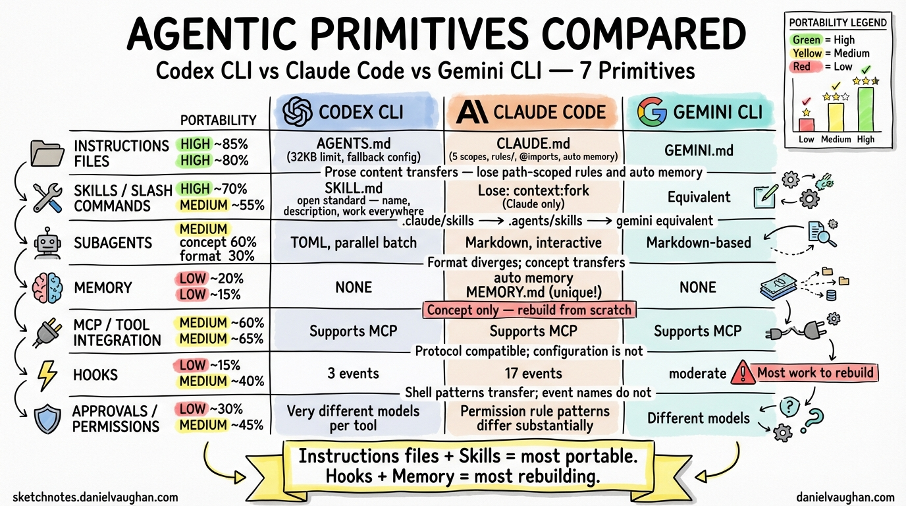

**Date:** 2026-03-26
**Tags:** comparison, hooks, skills, subagents, memory, mcp, permissions, primitives, claude-code, gemini-cli, codex, architecture

---

## Executive Summary

All three tools — OpenAI **Codex** CLI, Anthropic **Claude Code**, and Google **Gemini** CLI — converge on the same set of agentic primitives. They read instructions files, fire lifecycle hooks, run reusable skills, delegate to subagents, persist memory across sessions, integrate external tools via MCP, and enforce human-in-the-loop approval policies. The mental models transfer directly. The depth of implementation does not.

**Transferability at a glance:**

| Primitive | Claude Code → Codex | Claude Code → Gemini | What transfers |
|---|---|---|---|
| Instructions files | High (~85%) | High (~80%) | All prose content; lose path-scoped rules and auto memory |
| Skills (SKILL.md) | High (~70%) | Medium (~55%) | name, description, $ARGUMENTS; lose Claude extensions |
| Memory systems | Low (~20%) | Low (~15%) | Concept only; auto memory has no equivalent |
| MCP / tool integration | Medium (~60%) | Medium (~65%) | Configuration format differs; scoping model differs |
| Context management | Medium (~50%) | Medium (~60%) | @-import syntax transfers to Gemini; not Codex |
| Approval / permissions | Low (~30%) | Medium (~45%) | Permission rule patterns differ substantially |
| Subagents | Medium (concept 60%, format 30%) | Medium (~60%) | Format: Markdown → TOML for Codex; Gemini keeps Markdown |
| Hooks | Low (~15%) | Medium (~40%) | Shell patterns transfer; events do not |

**Rule of thumb:** Instructions files and skills are your most portable assets. Hooks and memory systems require the most rebuilding.

---

## The Agentic Primitive Set

This article examines seven primitives present across all three tools:

1. **Instructions files** — persistent markdown files the agent reads at session start
2. **Memory systems** — how each tool persists knowledge across sessions
3. **MCP / tool integration** — how agents call external tools and MCP servers
4. **Context management** — how each tool handles context windows, file inclusion, and @-mentions
5. **Approval / permission models** — how humans stay in the loop
6. **Skills / slash commands / subagents** — packaged, reusable units of capability
7. **Hooks** — shell commands or scripts injected at lifecycle events

Sections are ordered from most-transferable to least-transferable.

---

## 1. Instructions Files (AGENTS.md / CLAUDE.md / GEMINI.md)

**Transferability verdict: High**

### Codex CLI — AGENTS.md

**File names:** `AGENTS.md` (standard) or `AGENTS.override.md` (takes unconditional precedence at any level).

**Scope hierarchy (highest to lowest precedence):**

| Scope | Location | Notes |
|---|---|---|
| Global override | `~/.codex/AGENTS.override.md` | Wins over all project files |
| Global | `~/.codex/AGENTS.md` | Applies to all sessions |
| Project (per-directory) | `AGENTS.override.md` or `AGENTS.md` walking from git root → cwd | Closer directories appear later in combined prompt and win |

Codex builds the instruction chain once per run: it walks from the git root down to the current working directory, concatenating matching files with blank-line separators. Files discovered closer to the cwd appear later, which gives them effective override authority (because Codex appends rather than replaces).

**Size limit:** 32 KiB combined (`project_doc_max_bytes`). Discovery halts once this threshold is reached.

**Fallback filenames:** A `project_doc_fallback_filenames` config key lets teams redirect Codex to read a different filename (e.g., `README.md`) if no `AGENTS.md` is present — useful when onboarding repositories that do not have a dedicated instructions file.

**What it can contain:** Anything written in plain markdown: test commands, linting standards, dependency management rules, architectural constraints, repository navigation guides, coding conventions. There is no structured schema; Codex treats the file as unstructured context injected before every task.

**Does Codex read CLAUDE.md?** No. The two tools do not share instructions files. If a repository already has `CLAUDE.md` and you want Codex to benefit from it, you must create `AGENTS.md` separately or configure `project_doc_fallback_filenames`.

---

### Claude Code — CLAUDE.md

**File name:** Always `CLAUDE.md`. Claude Code also reads `.claude/CLAUDE.md` as a project-scope equivalent.[^1]

**Scope hierarchy (highest to lowest precedence):**

| Scope | Location | Notes |
|---|---|---|
| Managed policy | `/Library/Application Support/ClaudeCode/CLAUDE.md` (macOS), `/etc/claude-code/CLAUDE.md` (Linux) | Cannot be excluded; set by IT/DevOps |
| User | `~/.claude/CLAUDE.md` | Personal preferences across all projects |
| Project | `./CLAUDE.md` or `./.claude/CLAUDE.md` | Team-shared, committed to version control |
| Subdirectory | `<subdir>/CLAUDE.md` | Loaded on-demand when Claude reads files in that subdirectory |

Files in the directory hierarchy above the cwd are loaded in full at launch. Subdirectory files load lazily when Claude accesses files in those subtrees.

**Rules system:** Beyond `CLAUDE.md`, Claude Code supports a `.claude/rules/` directory where each `.md` file covers one topic. Rules can include YAML frontmatter with a `paths` field for glob-based scoping, so a rule only loads when Claude is working with matching files.[^1] This enables context-efficient instruction sets in large monorepos.

**Auto memory:** A complementary mechanism where Claude itself writes notes to `~/.claude/projects/<project>/memory/MEMORY.md` (first 200 lines loaded each session). You write CLAUDE.md; Claude writes auto memory. Both are loaded every session.[^1]

**Import syntax:** `@path/to/file` anywhere in a `CLAUDE.md` expands and injects that file's content. Supports relative and absolute paths; maximum five hops.[^1]

**AGENTS.md bridge:** If a repository already has `AGENTS.md` for Codex, create a `CLAUDE.md` that starts with `@AGENTS.md`. Claude Code loads both, and you can append Claude-specific instructions below the import line.[^1]

**Size guidance:** Target under 200 lines per file; longer files reduce adherence and consume context tokens.[^1]

---

### Gemini CLI — GEMINI.md

**File name:** `GEMINI.md` by default. Configurable via `context.fileName` in `settings.json` to use a custom name or a list of names.

**Scope hierarchy:**

| Scope | Location | Notes |
|---|---|---|
| Global | `~/.gemini/GEMINI.md` | Applies to all projects |
| Project | `GEMINI.md` in cwd and ancestor directories up to git root | All discovered files are concatenated |
| Subdirectory | `GEMINI.md` in directories accessed by tools | Loaded when a tool touches a file in that directory |

Unlike Codex (which concatenates from root downward and stops at 32 KiB) and Claude Code (which uses a strict precedence hierarchy), Gemini CLI concatenates all discovered files with origin/path separators, then delivers them as a unified system prompt block. There is no explicit file-level precedence; specificity is purely positional in the concatenated output.

**Import syntax:** `@path/to/another.md` modularizes large instruction sets, identical in spirit to Claude Code's `@` import.

**Inspection commands:** `/memory show` displays the fully-assembled context (all loaded GEMINI.md files joined) so you can verify what the model sees. `/memory refresh` reloads all context files without restarting the session. `/memory add <text>` appends directly to `~/.gemini/GEMINI.md`.

**What it can contain:** Unstructured markdown with project instructions, personas, coding style guides, architectural notes. Same conceptual content as AGENTS.md and CLAUDE.md.

---

### Instructions Files: Comparison Table

| Feature | Codex CLI | Claude Code | Gemini CLI |
|---|---|---|---|
| File name | `AGENTS.md` | `CLAUDE.md` | `GEMINI.md` (configurable) |
| Override file | `AGENTS.override.md` | Managed policy CLAUDE.md (read-only) | None (no override mechanism) |
| Global scope | `~/.codex/AGENTS.md` | `~/.claude/CLAUDE.md` | `~/.gemini/GEMINI.md` |
| Project scope | Git root → cwd walk | `./CLAUDE.md` or `./.claude/CLAUDE.md` | cwd → git root walk |
| Subdirectory lazy load | ❌ (size-capped concat) | ✅ (on file access) | ✅ (on tool access) |
| Sub-file rules system | ❌ | `.claude/rules/*.md` with path globs | ❌ |
| File import syntax | ❌ | `@path/to/file` | `@path/to/file` |
| Size limit | 32 KiB combined | ~200 lines recommended | Not documented |
| Agent-written memory | ❌ | Auto memory (`MEMORY.md`) | ❌ |
| Configurable filename | Via `project_doc_fallback_filenames` | ❌ | Via `context.fileName` |
| Cross-tool bridge | `project_doc_fallback_filenames` redirects to CLAUDE.md | `@AGENTS.md` import | No documented mechanism |
| Inspect loaded context | No dedicated command | `/memory` lists all loaded files | `/memory show` |

**Key differences:**

- Claude Code's `.claude/rules/` system for path-scoped conditional rules has no equivalent in Codex or Gemini.
- Codex's `AGENTS.override.md` provides an explicit override escape hatch that the other tools lack.
- Gemini's concatenation model is the flattest: no strict precedence, everything merged together.
- Claude Code is the only tool with an agent-written memory layer (auto memory) complementing the human-written file.

---

## 2. Memory Systems

**Transferability verdict: Low (concept transfers; implementation does not)**

Memory systems control how each tool accumulates and retrieves knowledge between sessions without requiring the user to repeat themselves.

### Codex CLI — Memory

Codex CLI has **no dedicated memory system** analogous to Claude Code's auto memory. Knowledge persistence in Codex is achieved entirely through `AGENTS.md` and subagent `developer_instructions` fields. There is no mechanism for Codex itself to write notes that persist across sessions.

- **Human-written:** `AGENTS.md` at project or global scope stores explicit, user-authored instructions. These function as long-term memory for project context.
- **Agent-written:** None. Codex does not write to any persistent notes file.
- **Per-subagent memory:** No documented equivalent.

If you want Codex to remember something (a build quirk, a naming decision), you must write it to `AGENTS.md` yourself.

---

### Claude Code — Auto Memory[^1]

Claude Code has a two-layer memory system:

**Layer 1: CLAUDE.md (human-written)**
You write project instructions, coding standards, and workflow guidance. These load at every session start.

**Layer 2: Auto memory (agent-written)**
Claude writes its own notes to `~/.claude/projects/<project>/memory/MEMORY.md`. The first 200 lines of `MEMORY.md` load automatically at every session start. Additional topic files (`debugging.md`, `api-conventions.md`, etc.) are created by Claude and read on demand.

**Storage:** `~/.claude/projects/<project>/memory/` — scoped per git repository. All worktrees and subdirectories within the same repo share one directory. Auto memory is machine-local (not cloud-synced).

**How Claude decides what to write:** When you correct Claude, express preferences, or Claude discovers something useful (build commands, test patterns, debugging insights), it decides autonomously whether the information is worth saving for future sessions. You see "Writing memory" or "Recalled memory" in the interface.

**Per-subagent memory:** Subagents can maintain their own auto memory directories, controlled by the `memory:` frontmatter field (`user`, `project`, or `local` scope).

**Management:** `/memory` command lists all loaded CLAUDE.md and memory files, toggles auto memory on/off, and opens the memory folder for editing. To add something manually: "remember that the API tests require a local Redis instance" and Claude writes it to auto memory.

**Inspection:** Run `/memory` to see what auto memory has accumulated. Everything is plain markdown you can edit or delete.

---

### Gemini CLI — Memory

Gemini CLI has a single-layer memory system that is entirely human-managed:

- **GEMINI.md files** (global, project, subdirectory) function as the only persistent memory layer.
- `/memory add <text>` appends text directly to `~/.gemini/GEMINI.md` — a quick way to inject a note that persists to future sessions.
- `/memory show` displays the full assembled context.
- `/memory refresh` reloads context files mid-session.
- **No agent-written memory:** Gemini does not autonomously write notes to a persistent file.

The `/memory` command family gives Gemini good tooling for inspecting what is in context, but all additions require human action.

---

### Memory Systems: Comparison Table

| Feature | Codex CLI | Claude Code | Gemini CLI |
|---|---|---|---|
| Human-written persistent instructions | `AGENTS.md` | `CLAUDE.md` | `GEMINI.md` |
| Agent-written memory | None | ✅ (`MEMORY.md` + topic files) | None |
| Memory storage location | N/A | `~/.claude/projects/<project>/memory/` | N/A |
| Memory auto-loaded per session | N/A | First 200 lines of `MEMORY.md` | N/A |
| Per-subagent memory | ❌ | ✅ (`memory:` frontmatter field) | ❌ |
| Memory management command | ❌ | `/memory` (list, toggle, open folder) | `/memory show`, `/memory add`, `/memory refresh` |
| Manual memory injection | Write to `AGENTS.md` | Ask Claude or edit `MEMORY.md` | `/memory add <text>` |
| Memory scope | Project (via AGENTS.md) | Per git repo (machine-local) | Global user, project |
| Memory inspection | No dedicated command | `/memory` lists all files | `/memory show` displays assembled context |

**Key differences:**

- Claude Code's agent-written auto memory is genuinely unique: the agent accumulates its own notes without user effort.
- Gemini's `/memory` command family provides better tooling for inspecting and modifying context than either competitor, but requires human initiative.
- Codex has the weakest memory story: all persistence is manual, via AGENTS.md.

---

## 3. MCP / Tool Integration

**Transferability verdict: Medium (all three support MCP; configuration format and scoping model differ)**

All three tools implement the Model Context Protocol (MCP) to connect agents to external tools, APIs, and data sources. MCP is an open standard; the implementations differ in transport support, scoping, authentication, and how tools can be filtered per-subagent.

### Codex CLI — MCP

Codex CLI supports MCP servers configured in `config.toml` or via the `/permissions` slash command during a session. Configuration reference from the official documentation:

```toml
[mcp_servers]
# Each server is a named entry
[mcp_servers.github]
command = "npx"
args = ["-y", "@modelcontextprotocol/server-github"]
env = { GITHUB_TOKEN = "ghp_..." }
```

**Key features:**

- MCP servers can be scoped to individual subagents via the `mcp_servers` TOML field in subagent definitions.
- Codex itself can **run as an MCP server** (exposing itself as a tool to other agents or orchestrators) — a unique capability among the three tools.
- The `$skill-installer` system can install skills that bundle MCP server definitions.
- Skill-scoped managed network domain overrides apply to MCP calls made within a skill's execution context.

---

### Claude Code — MCP[^2]

Claude Code has the most mature MCP integration of the three, with three transport types, three configuration scopes, OAuth 2.0 support, and dynamic tool updates.

**Transport types:**

- `stdio` — local subprocess (for tools needing direct system access)
- `http` — remote HTTP server (recommended for cloud services; supports OAuth 2.0)
- `sse` — Server-Sent Events (deprecated; use HTTP instead)

**Adding servers:**

```bash
# HTTP server (recommended)
claude mcp add --transport http notion https://mcp.notion.com/mcp

# Stdio server (local)
claude mcp add --transport stdio airtable --env AIRTABLE_API_KEY=YOUR_KEY \
  -- npx -y airtable-mcp-server
```

**Configuration scopes:**[^2]

| Scope | Storage | Visibility |
|---|---|---|
| `local` (default) | `~/.claude.json` | You, current project only |
| `project` | `.mcp.json` in project root (check into git) | All team members |
| `user` | `~/.claude.json` | You, all projects |
| Managed | `managed-mcp.json` in system directories | All users (IT-enforced) |

**Subagent scoping:** MCP servers can be scoped to individual subagents via the `mcpServers:` frontmatter field. The hooks system includes `Elicitation` and `ElicitationResult` events for intercepting and auto-responding to MCP form prompts.

**Dynamic tool updates:** Claude Code supports `list_changed` notifications, allowing MCP servers to add or remove tools during a session without reconnecting.[^2]

**OAuth 2.0 support:** Remote HTTP servers can authenticate via OAuth 2.0 using `/mcp` in-session. Authentication tokens are stored in the system keychain and refreshed automatically.[^2]

**Channels:** An MCP server can declare the `claude/channel` capability to push messages directly into a Claude Code session, enabling Claude to react to external events (CI results, monitoring alerts, Telegram messages) in real time.[^2]

**Tool permission rules:** MCP tools follow the same allow/deny/ask permission rule syntax: `mcp__server-name__tool-name` pattern, e.g. `mcp__puppeteer__puppeteer_navigate`.[^3]

---

### Gemini CLI — MCP

Gemini CLI configures MCP servers in `~/.gemini/settings.json` or `.gemini/settings.json`:

```json
{
  "mcpServers": {
    "github": {
      "command": "npx",
      "args": ["-y", "@modelcontextprotocol/server-github"],
      "env": { "GITHUB_TOKEN": "$GITHUB_TOKEN" },
      "trust": true,
      "includeTools": ["list_pull_requests", "create_issue"],
      "excludeTools": ["delete_repo"]
    }
  }
}
```

**Transport types supported:**

- `command` — local stdio subprocess
- `url` — Server-Sent Events (SSE)
- `httpUrl` — Streamable HTTP

**Key configuration fields:**

- `trust: true` — bypass tool confirmation dialogs for all tools from this server
- `includeTools` — allowlist of specific tools to enable
- `excludeTools` — denylist (takes precedence over `includeTools`)
- `headers` — HTTP authentication headers
- `timeout` — per-request timeout in milliseconds

**Security note:** Avoid underscores in server aliases; use hyphens. The Gemini policy engine parses fully qualified names using the first underscore, and underscores in server names can cause policy rules to fail silently.

**Subagent scoping:** MCP tools can be restricted to specific subagents via `mcp_*` wildcard patterns in the `tools` frontmatter field: `mcp_*` grants all MCP tools, `mcp_github_*` grants all tools from the `github` server.

**Resources:** Discovered MCP resources can be referenced with `@server://resource/path` syntax, similar to local file references.

---

### MCP / Tool Integration: Comparison Table

| Feature | Codex CLI | Claude Code | Gemini CLI |
|---|---|---|---|
| MCP support | ✅ | ✅ | ✅ |
| Transport: stdio | ✅ | ✅ | ✅ |
| Transport: SSE | ⚠️ Not documented | ✅ (deprecated) | ✅ |
| Transport: HTTP/Streamable HTTP | ⚠️ Not documented | ✅ (recommended) | ✅ |
| OAuth 2.0 authentication | ❌ | ✅ | ❌ |
| Dynamic tool updates (`list_changed`) | ❌ | ✅ | ⚠️ Not documented |
| Configuration scopes | `config.toml` (project/global) | local, project, user, managed | `settings.json` (user/project) |
| Team-shared MCP config file | ⚠️ Not documented | `.mcp.json` (check into git) | `.gemini/settings.json` (project scope) |
| MCP scoped to subagent | ✅ (TOML `mcp_servers` field) | ✅ (`mcpServers:` frontmatter) | ✅ (via `mcp_*` tool wildcards) |
| Per-tool allow/exclude filter | ❌ | Via permission rules | ✅ (`includeTools`/`excludeTools`) |
| Tool trust bypass per server | ❌ | Via `permissions.allow` | `trust: true` field |
| Codex itself as MCP server | ✅ | ❌ | ❌ |
| MCP event hooks | ❌ | ✅ (`Elicitation`, `ElicitationResult`) | ❌ |
| Real-time push events (channels) | ❌ | ✅ (`claude/channel` capability) | ❌ |
| In-session MCP management | `/permissions` | `/mcp` command | `/mcp` command |

**Key differences:**

- Claude Code has the most complete MCP integration: OAuth 2.0, dynamic tool updates, event hooks for elicitation, real-time push channels, and the most flexible scoping model.
- Gemini CLI's `includeTools`/`excludeTools` per-server filtering is a useful capability that Claude Code only achieves via permission rules.
- Codex's ability to expose itself as an MCP server is unique and powerful for orchestration scenarios where Codex should be callable by other agents.

---

## 4. Context Management

**Transferability verdict: Medium (@ syntax transfers to Gemini; not Codex)**

Context management covers how each tool handles the context window: what gets loaded automatically, how you inject additional files mid-session, and how context is preserved or trimmed across long sessions.

### Codex CLI — Context Management

- **Automatic loading:** `AGENTS.md` files concatenated at session start, up to the 32 KiB limit.
- **Mid-session injection:** No documented `@file` syntax or `/add` command for injecting arbitrary files during a session. Files are accessed by tool calls.
- **Context compression:** Codex compresses long sessions automatically; no user-facing compaction command documented.
- **Progressive skill loading:** Skills load metadata only initially; full SKILL.md loads when relevant — reducing context pressure for large skill libraries.
- **Subagent isolation:** Each subagent has its own context window. The `max_depth` setting (default: 1) prevents runaway context fan-out.

### Claude Code — Context Management

- **Automatic loading:** All CLAUDE.md files in the directory hierarchy, plus first 200 lines of auto memory MEMORY.md, load at session start.
- **`@file` imports:** CLAUDE.md files can reference other files with `@path/to/file`, which are expanded into context at load time. This is a static import for instructions; runtime file access uses tool calls.
- **`/add-dir` command:** Add additional working directories mid-session, with optional CLAUDE.md loading for those directories.
- **`--add-dir` flag:** Same as `/add-dir` at launch.
- **`claudeMdExcludes` setting:** Exclude specific CLAUDE.md files by path glob — essential for monorepo environments where you want to ignore other teams' files.
- **`/compact` command:** Manually compact the context window when it grows large. CLAUDE.md files survive compaction (re-read from disk).
- **`/clear` command:** Reset the context window entirely, clearing conversation history.
- **`PreCompact`/`PostCompact` hooks:** Allow custom logic before/after compaction (e.g., save context summaries).

### Gemini CLI — Context Management

- **Automatic loading:** GEMINI.md files from global, project, and subdirectory scopes, concatenated into a single system context block.
- **`@file` imports:** GEMINI.md files can import other files with `@path/to/file`.
- **`/memory show`:** Display the full assembled context (all GEMINI.md files joined). Unique in giving a unified view of exactly what the model sees.
- **`/memory refresh`:** Reload all context files mid-session without restarting.
- **`/memory add <text>`:** Append text to `~/.gemini/GEMINI.md`, immediately available in the current and future sessions.
- **`PreCompress` hook:** Run logic before context compression.
- **Up to 200 subdirectories scanned** for GEMINI.md files by default; configurable.
- **Checkpoint/rewind:** Gemini CLI supports session checkpointing and rewinding to earlier states — a context management feature with no direct equivalent in Claude Code or Codex.

### Context Management: Comparison Table

| Feature | Codex CLI | Claude Code | Gemini CLI |
|---|---|---|---|
| Static file import in instructions | ❌ | `@path/to/file` in CLAUDE.md | `@path/to/file` in GEMINI.md |
| Mid-session file injection | No direct command | `/add-dir` (add working directory) | `/memory add` (add to GEMINI.md) |
| Inspect loaded context | ❌ | `/memory` lists loaded files | `/memory show` (full assembled text) |
| Reload context mid-session | ❌ | Rerun `/init` or restart | `/memory refresh` |
| Exclude specific context files | ❌ | `claudeMdExcludes` glob patterns | ⚠️ Not documented |
| Manual context compaction | No documented command | `/compact` | Not documented |
| Clear context | ❌ | `/clear` | `/clear` |
| Compaction hooks | ❌ | `PreCompact`, `PostCompact` | `PreCompress` |
| Session checkpoint/rewind | ❌ | ❌ | ✅ |
| Subagent context isolation | ✅ (per TOML definition) | ✅ (per Markdown definition) | ✅ (per Markdown definition) |
| Progressive skill loading (metadata only) | ✅ | ❌ (loads on demand) | ⚠️ Not documented |

---

## 5. Approval / Permission Models

**Transferability verdict: Low to Medium (concepts transfer; rule syntax does not)**

All three tools require human approval before performing potentially dangerous operations. The mechanisms differ substantially.

### Codex CLI — Sandbox and Approval Policy

Codex combines a sandbox model (what the agent can *access*) with an approval policy (when the agent *asks*):

**Sandbox modes:**

| Mode | What's allowed |
|---|---|
| `read-only` | Inspection only; file edits and command execution require approval |
| `workspace-write` | Default; file edits and routine commands within workspace boundary |
| `danger-full-access` | No filesystem or network restrictions |

**Approval policies:**

| Policy | Behavior |
|---|---|
| `untrusted` | Prompts before running non-trusted commands |
| `on-request` | Works autonomously inside sandbox; asks when exceeding sandbox boundaries |
| `never` | No approval prompts |

**Rules:** The `rules` config section allows allow/prompt/forbid patterns for specific command prefixes — targeted exceptions to the sandbox policy. This allows policies like "always allow `npm test`" or "always forbid `git push --force`".

**Per-subagent:** The `sandbox_mode` field in a subagent TOML definition sets the sandbox level for that specific agent, independent of the session default.

**In-session changes:** `/permissions` slash command switches modes during a live session.

---

### Claude Code — Permission System[^3]

Claude Code has the most detailed permission system of the three:

**Permission modes:**

| Mode | Description |
|---|---|
| `default` | Prompts on first use of each tool |
| `acceptEdits` | Auto-accepts all file edit permissions for the session |
| `plan` | Read-only; Claude can analyze but not modify files or run commands |
| `dontAsk` | Auto-denies tools unless pre-approved via allow rules |
| `bypassPermissions` | Skips all prompts (dangerous; for isolated environments only) |
| `auto` | Research preview; AI classifier evaluates whether each action is safe |

**Allow / deny / ask rules:** Permission rules follow `Tool` or `Tool(specifier)` syntax:

- `Bash(npm run *)` — allow all `npm run` commands
- `Bash(git push *)` in deny — block all `git push`
- `WebFetch(domain:example.com)` — allow fetch to example.com
- `mcp__github__list_repos` — allow specific MCP tool
- `Agent(Explore)` — deny a specific subagent

**Rule evaluation order:** `deny → ask → allow`. The first matching rule wins, so deny rules always take precedence.

**Managed settings:** Organizations can deploy `managed-mcp.json`, managed CLAUDE.md, and managed settings files that individual developers cannot override. `allowManagedPermissionRulesOnly: true` prevents developers from adding their own allow/deny rules.

**`auto` mode classifier:** The `autoMode` config block lets organizations define trusted infrastructure (source control orgs, cloud buckets, internal domains) in prose. The classifier uses these descriptions to distinguish routine internal operations from potential data exfiltration.

**Per-subagent:** The `permissionMode:` frontmatter field sets the permission mode for a specific subagent (`default`, `acceptEdits`, `dontAsk`, `bypassPermissions`, `plan`).

---

### Gemini CLI — Policy Engine and Trust Model

Gemini CLI uses a policy engine with approval modes and folder trust:

**Approval modes** (`general.defaultApprovalMode`):[^4]

| Mode | Behavior |
|---|---|
| `default` | Prompts for approval before tool execution |
| `auto_edit` | Auto-approves file edit tools |
| `plan` | Read-only mode |
| `yolo` (CLI flag only) | Auto-approves all actions (cannot be set as default in settings) |

**Policy engine:** A rule-based system with three outcomes for each tool call:

- `allow` — execute automatically
- `deny` — block entirely
- `ask_user` — prompt for confirmation

Rules can target specific tools, match argument patterns, and restrict by CLI mode. **Admin policies** (in protected system directories) override user policies, which override workspace and default policies.

**Folder trust:** `security.folderTrust.enabled` tracks whether a folder has been granted trust status. In trusted folders, low-risk tools can be auto-approved.

**Permanent tool approval:** `security.enablePermanentToolApproval: true` adds an "Allow for all future sessions" option to confirmation dialogs. `security.disableAlwaysAllow: true` removes this option (useful for enterprise enforcement).

**MCP server trust:** Individual MCP servers can be granted blanket trust with `trust: true` in their configuration, bypassing all confirmation dialogs for that server's tools.

**Hook fingerprinting:** Project-level hooks are fingerprinted. Changed hooks require explicit user approval before running. This is Gemini's unique security mechanism with no equivalent in Claude Code or Codex.

---

### Approval / Permission Models: Comparison Table

| Feature | Codex CLI | Claude Code | Gemini CLI |
|---|---|---|---|
| Default approval model | `on-request` within sandbox | Prompt on first use | Prompt for each tool |
| Read-only / plan mode | `read-only` sandbox | `plan` mode | `plan` mode |
| Full auto mode | `never` approval policy | `bypassPermissions` mode | `yolo` flag (CLI only, not settable as default) |
| Rule-based allow/deny/ask | ✅ (`rules` config) | ✅ (rich `Tool(specifier)` syntax) | ✅ (policy engine) |
| Per-subagent permission override | ✅ (`sandbox_mode` in TOML) | ✅ (`permissionMode:` frontmatter) | ⚠️ Not documented |
| Organization-wide managed policy | ⚠️ Not documented | ✅ (managed settings, `allowManagedPermissionRulesOnly`) | ✅ (admin policies in protected directories) |
| AI-assisted safety classification | ❌ | ✅ (`auto` mode with classifier) | ❌ |
| Hook security fingerprinting | ❌ | ❌ | ✅ |
| Session-level permission changes | `/permissions` command | `/permissions` UI | No dedicated command |
| Permanent approval storage | `rules` config | "Yes, don't ask again" (stored per-project) | `security.enablePermanentToolApproval` |
| Sandboxing (OS-level) | ✅ (macOS, Linux, WSL, Windows) | ✅ (opt-in) | ✅ (opt-in) |
| Trust by domain (network) | ✅ (sandbox network rules) | `WebFetch(domain:...)` rules | ⚠️ Not fully documented |

**Key differences:**

- Claude Code's permission system is the most expressive: fine-grained `Tool(specifier)` rules with wildcard support, 6 permission modes, subagent-level overrides, and an AI safety classifier for `auto` mode.
- Gemini's policy engine and hook fingerprinting provide the strongest enterprise governance: admin policies cannot be overridden, and changed hooks require re-approval.
- Codex's sandbox-first model is the most ergonomic for developers: the default `workspace-write` + `on-request` combination is autonomy-friendly without being dangerous.

---

## 6. Skills / Slash Commands / Custom Commands

**Transferability verdict: High to Codex (~70%), Medium to Gemini (~55%)**

### Codex CLI — Agent Skills

Skills in Codex follow the open [Agent Skills](https://agentskills.io) standard — the same standard that Claude Code's skills system also implements.[^5]

**File:** `SKILL.md` with YAML frontmatter (`name`, `description` required).

**Directory structure:**

```
my-skill/
├── SKILL.md             # Required: instructions + metadata
├── scripts/             # Optional: executable code
├── references/          # Optional: documentation
├── assets/              # Optional: templates
└── agents/openai.yaml   # Optional: UI config, model hints, dependencies
```

**Storage locations (scanned in order):**

| Scope | Path |
|---|---|
| REPO (folder-specific) | `.agents/skills` (current directory, walking up to repo root) |
| USER | `$HOME/.agents/skills` |
| SYSTEM | Bundled with Codex (e.g., `$skill-creator`, `$skill-installer`) |

Note: Codex uses `.agents/skills`, not `.codex/skills`. This follows the cross-tool Agent Skills standard.

**Invocation:**

- **Explicit:** `/skills` command or `$skill-name` mention in the CLI or IDE
- **Implicit:** Codex selects the skill when the user's request matches the skill's description

**Progressive disclosure:** Codex loads only skill metadata (name, description, file path) initially. The full `SKILL.md` content is loaded only when Codex decides the skill is relevant. This limits context consumption for repositories with many skills.

**`agents/openai.yaml`:** An optional metadata file for UI configuration and dependency declarations. This is a Codex-specific extension to the Agent Skills standard.

**Skill installer:** The built-in `$skill-installer` skill can download skills from external repositories (e.g., `$skill-installer linear` to install the Linear integration skill). Claude Code has no equivalent built-in skill marketplace mechanism.

**Network domain overrides:** Codex supports skill-scoped managed network domain overrides in skill config — hooks and tools invoked within a skill can be given different network access rules than the default session policy.

---

### Claude Code — Skills

Claude Code's skills implement the same Agent Skills standard as Codex CLI,[^5] with significant additional features layered on top.

**File:** `SKILL.md` with YAML frontmatter.

**Storage locations:**

| Scope | Path |
|---|---|
| Enterprise | Managed settings (system-wide) |
| Personal | `~/.claude/skills/<skill-name>/SKILL.md` |
| Project | `.claude/skills/<skill-name>/SKILL.md` |
| Plugin | `<plugin>/skills/<skill-name>/SKILL.md` |

**Legacy compatibility:** `.claude/commands/<name>.md` files continue to work identically to skills. Skills take precedence if both exist with the same name.

**Key frontmatter fields (Claude Code extensions beyond the base standard):**

| Field | Effect |
|---|---|
| `disable-model-invocation: true` | Only user can invoke (removes from Claude's context entirely) |
| `user-invocable: false` | Only Claude can invoke (hidden from `/` menu) |
| `context: fork` | Runs skill in an isolated subagent context |
| `agent: <name>` | Which subagent type to use when forked |
| `allowed-tools: Read, Grep` | Tools permitted without per-use approval while skill is active |
| `hooks: ...` | Lifecycle hooks scoped to the skill's execution |
| `model: <alias>` | Override model for this skill |
| `effort: low\|medium\|high\|max` | Effort level override |
| `shell: bash\|powershell` | Shell for `!`command`` blocks |

**Dynamic context injection:** `` !`<command>` `` syntax runs shell commands at skill load time and injects their output into the skill content before Claude sees it. This allows skills to include live data (git diffs, environment variables, API responses) without tool calls.

**Argument handling:** `$ARGUMENTS`, `$ARGUMENTS[N]`, and `$N` shorthands for positional argument access. Appends as `ARGUMENTS: <value>` if `$ARGUMENTS` is not present.

**Bundled skills:** Claude Code ships bundled skills including `/batch` (parallel codebase transformation), `/simplify` (parallel code quality review), `/loop` (polling), `/claude-api` (Anthropic SDK reference), and `/debug`.

**Nested skill discovery:** `.claude/skills/` directories in subdirectories are auto-discovered for monorepo support.

---

### Gemini CLI — Custom Commands + Agent Skills

Gemini CLI has two overlapping mechanisms:

**Custom commands (TOML format):**

- Location: `~/.gemini/commands/` (global) or `<project>/.gemini/commands/` (project)
- Format: `.toml` files, not Markdown
- Required field: `prompt` (string sent to the model)
- Optional: `description` for `/help` menu
- Naming: file path under commands directory becomes the slash command name; subdirectories create namespaced commands (e.g., `git/commit.toml` → `/git:commit`)
- Dynamic content: `{{args}}` for argument injection, `!{...}` for shell execution (requires user confirmation), `@{...}` for file/directory content embedding

**Agent Skills (Markdown format, aligned with agentskills.io standard):[^5]**

- Location: `.agents/skills/` (project) or `~/.agents/skills/` (personal), same paths as Codex CLI
- Format: `SKILL.md` with YAML frontmatter
- Enabled via `skills.enabled` in `settings.json`
- Controlled via `experimental.enableAgents: true` for full agent-skill integration

**Extensions:** Gemini CLI extensions package skills, commands, hooks, MCP servers, themes, and subagents together for distribution. Installable via `gemini extensions install <github-url-or-local-path>`.

---

### Skills / Commands: Comparison Table

| Feature | Codex CLI | Claude Code | Gemini CLI |
|---|---|---|---|
| Skill file format | Markdown (`SKILL.md`) | Markdown (`SKILL.md`) | Markdown (`SKILL.md`) for skills; TOML for custom commands |
| Standard followed | agentskills.io | agentskills.io (+ extensions) | agentskills.io (skills) |
| Skills directory | `.agents/skills/` | `.claude/skills/` | `.agents/skills/` |
| Invocation prefix | `$skill-name` or `/skills` | `/skill-name` | `@[agent-name]` or `/command-name` |
| Model override per skill | `agents/openai.yaml` (⚠️ partially documented) | `model:` frontmatter | `model:` subagent frontmatter |
| Invocation control | ❌ (implicit/explicit only) | `disable-model-invocation`, `user-invocable` | ⚠️ Not documented |
| Dynamic shell injection at load time | ❌ | `` !`command` `` syntax | `!{...}` in TOML commands |
| Fork to subagent | No direct equivalent | `context: fork` + `agent:` | Implicit (skills map to subagents) |
| Hooks in skill definition | ❌ | ✅ (`hooks:` frontmatter) | ⚠️ Not documented |
| Skill marketplace / installer | `$skill-installer` (built-in) | No built-in installer | `gemini extensions install` |
| Bundled skills | `$skill-creator`, `$skill-installer` | `/batch`, `/simplify`, `/loop`, `/claude-api`, `/debug` | ⚠️ Not fully documented |
| Legacy command format | ❌ | `.claude/commands/*.md` (backward compat) | TOML commands (separate system) |
| Argument access | Standard (`$ARGUMENTS`) | `$ARGUMENTS`, `$ARGUMENTS[N]`, `$N` shorthands | `{{args}}` |
| Nested discovery (monorepo) | ❌ | ✅ (subdirectory `.claude/skills/`) | ⚠️ Not documented |

---

## 7. Subagents and Parallel Execution

**Transferability verdict: ~60% concept transfer Claude Code → Gemini; ~30% to Codex (format change required)**

### Codex CLI — Subagents

**Spawning:** Codex spawns subagents only when explicitly requested. The tools `spawn_agent`, `wait_agent`, and `send_input` orchestrate multi-agent workflows programmatically.

**Definition format:** TOML files (`.toml`), not Markdown. Each file defines one agent.

**Required fields in TOML:** `name`, `description`, `developer_instructions`.

**Optional fields:** `nickname_candidates`, `model`, `model_reasoning_effort`, `sandbox_mode`, `mcp_servers`, `skills.config`.

**Storage:**

| Scope | Path |
|---|---|
| Personal | `~/.codex/agents/` |
| Project | `.codex/agents/` |

**Parallelism settings (global `[agents]` config):**

| Setting | Default | Effect |
|---|---|---|
| `max_threads` | 6 | Maximum concurrent open agent threads |
| `max_depth` | 1 | Maximum nesting depth (prevents recursive fan-out) |
| `job_max_runtime_seconds` | 1800 | Per-worker timeout for CSV batch jobs |

**Built-in agents:** `default` (general-purpose), `worker` (execution-focused), `explorer` (read-heavy exploration).

**CSV batch processing:** The experimental `spawn_agents_on_csv` tool processes structured data by spawning one worker agent per CSV row. Workers must call `report_agent_job_result` exactly once. This is a unique data-processing pattern with no direct equivalent in Claude Code or Gemini CLI.

**Context inheritance:** Spawned agents inherit the parent session's sandbox policy, approval choices, and configuration modifications including project-profile layering and symlinked writable roots.

**Communication:** Codex handles orchestration including spawning, routing follow-up instructions, waiting for all results, and consolidating responses. The `send_input` tool routes follow-up instructions to a specific agent.

---

### Claude Code — Subagents

**Definition format:** Markdown files (`.md`) with YAML frontmatter. The file body is the system prompt.

**Storage:**

| Scope | Path | Priority |
|---|---|---|
| CLI flag | `--agents '{...}'` JSON | Highest (session only) |
| Project | `.claude/agents/` | 2 |
| Personal | `~/.claude/agents/` | 3 |
| Plugin | `<plugin>/agents/` | Lowest |

**Key frontmatter fields:**

| Field | Effect |
|---|---|
| `name` | Unique identifier |
| `description` | Claude uses this to decide when to delegate |
| `tools` | Allowlist (with `Agent(worker, researcher)` syntax to restrict sub-spawning) |
| `disallowedTools` | Denylist |
| `model` | `sonnet`, `opus`, `haiku`, or full model ID |
| `permissionMode` | `default`, `acceptEdits`, `dontAsk`, `bypassPermissions`, `plan` |
| `maxTurns` | Max agentic turns |
| `skills` | Skills preloaded into context at subagent startup (full content, not just metadata) |
| `mcpServers` | MCP servers scoped to this subagent (inline or by reference) |
| `hooks` | Hooks scoped to this subagent's lifecycle |
| `memory` | `user`, `project`, or `local` — persistent cross-session memory directory |
| `background` | `true` to always run as background (concurrent) task |
| `effort` | Effort level override |
| `isolation` | `worktree` to run in a temporary git worktree (auto-cleaned if no changes) |

**Built-in subagents:** `Explore` (Haiku, read-only, for fast codebase search), `Plan` (read-only research for plan mode), `general-purpose` (all tools, complex tasks), `Bash`, `statusline-setup`, `Claude Code Guide`.

**Parallelism:** Subagents run foreground (blocking) or background (concurrent). `Ctrl+B` backgrounds a running task. Background subagents pre-approve tool permissions before launch. `CLAUDE_CODE_DISABLE_BACKGROUND_TASKS=1` disables background mode entirely.

**Context isolation:** Each subagent has its own context window. Main conversation compaction does not affect subagent transcripts. Subagents can be resumed via `SendMessage` with the agent ID.

**Restriction:** Subagents cannot spawn other subagents. For nested delegation, use the main conversation to chain subagents sequentially.

**Agent teams:** Separate from in-session subagents, [agent teams](/en/agent-teams) coordinate multiple independent Claude Code sessions across separate processes with their own full context windows.

**Worktree isolation:** Setting `isolation: worktree` in frontmatter runs the subagent in a temporary git worktree (an isolated copy of the repository). The worktree is auto-cleaned if the subagent makes no changes. This enables safe parallel experimentation.

---

### Gemini CLI — Subagents (Experimental)

**Status:** Experimental. Requires `experimental.enableAgents: true` in `settings.json`.

**Definition format:** Markdown files (`.md`) with YAML frontmatter. Same pattern as Claude Code.

**Storage:**

| Scope | Path |
|---|---|
| Project | `.gemini/agents/*.md` |
| Personal | `~/.gemini/agents/*.md` |

**YAML frontmatter fields:**

| Field | Type | Notes |
|---|---|---|
| `name` | string | Required; lowercase, hyphens/underscores |
| `description` | string | Required; used by main agent for routing |
| `kind` | string | `local` (default) or `remote` |
| `tools` | array | `*` for all, `mcp_*` for all MCP tools, `mcp_<server>_*` for server-specific |
| `model` | string | Override model |
| `temperature` | number | 0.0–2.0; defaults to 1.0 |
| `max_turns` | number | Defaults to 30 |
| `timeout_mins` | number | Defaults to 10 |

**Critical limitations:**

- Subagents **cannot spawn other subagents**, even with `tools: ["*"]` (the `*` wildcard explicitly excludes other agents)
- Parallelism details are not documented; sequential delegation appears to be the default model
- No `hooks`, `skills`, `memory`, `isolation`, or `permissionMode` frontmatter fields

**Invocation:**

- Automatic: main agent delegates based on description matching
- Explicit: `@[agent-name]` prefix in a prompt

**Context:** Each subagent runs in an isolated context loop. Its conversation history is separate from the main agent's context, preserving tokens.

**Temperature control:** Gemini CLI exposes `temperature` per subagent, which Claude Code and Codex CLI do not offer at the subagent definition level.

---

### Subagents: Comparison Table

| Feature | Codex CLI | Claude Code | Gemini CLI |
|---|---|---|---|
| Definition format | TOML | Markdown + YAML frontmatter | Markdown + YAML frontmatter |
| Definition location | `.codex/agents/` or `~/.codex/agents/` | `.claude/agents/` or `~/.claude/agents/` | `.gemini/agents/` or `~/.gemini/agents/` |
| Status | Production | Production | Experimental |
| Explicit invocation syntax | `spawn_agent` tool | `@agent-name` or `--agent` flag | `@[agent-name]` |
| Automatic delegation | ✅ (based on description) | ✅ (based on description) | ✅ (based on description) |
| Model override per agent | ✅ (`model` field) | ✅ (`model` field) | ✅ (`model` field) |
| Temperature per agent | ❌ | ❌ | ✅ (unique) |
| Max concurrent threads | 6 (configurable) | Not directly capped | Not documented |
| Max depth/nesting | 1 (configurable) | 1 (subagents cannot spawn subagents) | 1 (same restriction) |
| Background/parallel execution | ✅ (`max_threads: 6`) | ✅ (background mode) | ⚠️ Not documented |
| Worktree isolation | ❌ | ✅ (`isolation: worktree`) | ❌ |
| Persistent cross-session memory | ❌ | ✅ (`memory: user/project/local`) | ❌ |
| Skills preloaded into subagent | Via `skills.config` in TOML | ✅ (`skills:` frontmatter field) | ❌ |
| Hooks in subagent definition | ❌ | ✅ (`hooks:` frontmatter field) | ⚠️ Not documented |
| MCP servers scoped to subagent | ✅ (`mcp_servers` TOML field) | ✅ (`mcpServers:` frontmatter) | ✅ (via `mcp_*` tool wildcards) |
| Permission mode override | ✅ (`sandbox_mode`) | ✅ (`permissionMode:` field) | ❌ |
| CSV batch processing | ✅ (`spawn_agents_on_csv`) | ❌ | ❌ |
| Resume stopped subagent | Via `send_input` | ✅ (via `SendMessage` with agent ID) | Not documented |
| Built-in named subagents | `default`, `worker`, `explorer` | `Explore`, `Plan`, `general-purpose`, `Bash` | Browser agent (via `agents.browser` config) |
| Agent teams (multi-session) | ❌ (single-session only) | ✅ (`/en/agent-teams`) | ⚠️ Not documented |

---

## 8. Hooks

**Transferability verdict: Low (~15% to Codex; ~40% to Gemini)**

### Codex CLI — Experimental Hooks Engine

Codex's hooks system is the least mature of the three and is marked **experimental** as of early 2026.

**Hook events (confirmed in changelog):[^6]**

| Event | Version introduced | Capability |
|---|---|---|
| `SessionStart` | v0.114.0 | Inject context at session start |
| `Stop` | v0.114.0 | Run logic when agent finishes |
| `userpromptsubmit` | v0.115.0 | Block or augment prompts before execution |

This is a total of **three documented native hook events**.[^6] The official changelog (v0.114.0–0.115.0) describes the system as experimental.

**Configuration format:** ⚠️ Not fully documented in public-facing developer docs as of this writing. The changelog confirms the feature exists; detailed schema is not yet published on `developers.openai.com/codex`.

**Community extension:** The `codex-hooks` project (github.com/hatayama/codex-hooks) extends Codex's hooks by normalizing events to `TaskStarted`, `TaskComplete`, and `TurnAborted`, and passing Claude-compatible JSON on stdin (`hook_event_name`, `transcript_path`, `cwd`, `session_id`, `raw_event`). However, `codex-hooks` does not implement Claude's full control protocol — returning `{"decision":"block","reason":"..."}` from a hook command is ignored; Codex does not act on stdout decisions the way Claude Code does.

**What hooks cannot do in Codex (compared to Claude Code):** Pre-tool validation with blocking, permission modification, post-file-edit linting, worktree lifecycle management, config change auditing, subagent start/stop interception, MCP elicitation handling.

---

### Claude Code — Hooks

Claude Code's hooks system is the most mature of the three, with **24 distinct hook events** as of the current documentation.[^7]

**All 24 hook events:[^7]**

| Event | Blockable | Primary use case |
|---|---|---|
| `SessionStart` | ❌ | Load context, inject env vars |
| `UserPromptSubmit` | ✅ | Validate/filter prompts before processing |
| `PreToolUse` | ✅ | Validate tool calls, modify input, block dangerous commands |
| `PermissionRequest` | ✅ | Auto-approve/deny permission dialogs |
| `PostToolUse` | ❌ | Logging, linting, validation after tool succeeds |
| `PostToolUseFailure` | ❌ | Error handling, recovery context injection |
| `Notification` | ❌ | Custom alerting, log forwarding |
| `SubagentStart` | ❌ | Inject context into spawned subagents |
| `SubagentStop` | ✅ | Quality gates before subagent finishes |
| `Stop` | ✅ | Force continuation, final validation |
| `StopFailure` | ❌ | API error logging, recovery workflows |
| `TeammateIdle` | ✅ | Quality gates for agent teams |
| `TaskCompleted` | ✅ | Verify task completion criteria |
| `InstructionsLoaded` | ❌ | Audit which CLAUDE.md files loaded and why |
| `ConfigChange` | ✅ | Audit/block configuration changes |
| `CwdChanged` | ❌ | Reload env, activate toolchains on directory switch |
| `FileChanged` | ❌ | Reload config, update env on watched file change |
| `WorktreeCreate` | ✅ | Replace git worktree with alternative VCS (SVN, Perforce) |
| `WorktreeRemove` | ❌ | Cleanup after worktree removal |
| `PreCompact` | ❌ | Pre-compaction logging |
| `PostCompact` | ❌ | Post-compaction tasks |
| `Elicitation` | ✅ | Auto-respond to MCP forms |
| `ElicitationResult` | ✅ | Validate/modify MCP form responses |
| `SessionEnd` | ❌ | Session cleanup |

**Four handler types:[^7]**

| Type | Description |
|---|---|
| `command` | Shell script; receives JSON on stdin; exit code + stdout control behavior |
| `http` | POST to a URL; same JSON protocol; supports env var interpolation in headers |
| `prompt` | Single-turn Claude evaluation; returns yes/no decision as JSON |
| `agent` | Full subagent spawned to evaluate conditions before returning a decision |

**Matcher system:** Regex patterns filter when a hook fires. For `PreToolUse`/`PostToolUse`, the matcher runs against the tool name (e.g., `Bash`, `Edit|Write`, `mcp__.*`). For `FileChanged`, it matches the filename basename. This allows hooks to be scoped precisely (e.g., only fire on MCP write tools: `mcp__.*__write.*`).

**JSON control protocol:** Hooks returning exit code 0 with JSON stdout can exercise fine-grained control:

- `continue: false` halts Claude entirely
- `decision: "block"` blocks the specific tool call/operation
- `decision: "allow"` bypasses permission prompts
- `updatedInput: {...}` rewrites tool arguments before execution
- `additionalContext: "..."` injects context into Claude's reasoning
- `systemMessage: "..."` surfaces a warning to the user

**Configuration locations (priority order):** Managed policy → `.claude/settings.json` (project) → `.claude/settings.local.json` (local) → `~/.claude/settings.json` (user) → plugin hooks → skill/agent frontmatter hooks.

**Hooks in subagent frontmatter:** Subagent `.md` files can define hooks in their YAML frontmatter. These hooks run only while that subagent is active. A `Stop` hook in frontmatter automatically converts to `SubagentStop` at runtime.

**Default timeouts:** Command: 600s; Prompt: 30s; Agent: 60s; HTTP: 30s.

---

### Gemini CLI — Hooks

Gemini CLI introduced hooks in v0.26.0. The system covers **10–11 events** (one source lists 11 when counting `Notification`).[^8]

**Hook events:**

| Event | Trigger point | Can block? |
|---|---|---|
| `SessionStart` | Session begins | ❌ (inject context) |
| `SessionEnd` | Session ends | ❌ (advisory) |
| `BeforeAgent` | Before agent planning loop | ✅ (block turn) |
| `AfterAgent` | After agent loop completes | ✅ (retry or halt) |
| `BeforeModel` | Before LLM API request | ✅ (block/mock response) |
| `AfterModel` | After LLM response received | ✅ (filter/redact) |
| `BeforeToolSelection` | Before tool selection | ✅ (filter available tools) |
| `BeforeTool` | Before tool execution | ✅ (validate/block) |
| `AfterTool` | After tool execution | ✅ (process/hide results) |
| `PreCompress` | Before context compression | ❌ (save state) |
| `Notification` | System notifications | ❌ (log/forward) |

**Handler type:** Only `"command"` is supported. There is no HTTP, prompt, or agent handler type as in Claude Code.

**Configuration format:**

```json
{
  "hooks": {
    "BeforeTool": [
      {
        "matcher": "write_file|replace",
        "hooks": [
          {
            "name": "security-check",
            "type": "command",
            "command": "$GEMINI_PROJECT_DIR/.gemini/hooks/security.sh",
            "timeout": 5000
          }
        ]
      }
    ]
  }
}
```

**Communication protocol:**

- Hooks receive JSON via stdin (similar to Claude Code's protocol)
- Hooks must output JSON to stdout (plain text output is not allowed, unlike Claude Code which tolerates non-JSON)
- Debugging must use stderr
- Exit code 0: success, parse stdout JSON
- Exit code 2: critical block, stderr contains reason (same convention as Claude Code)
- Other exit codes: warning, proceed with original parameters

**Block/modify capabilities:** Return `{"decision": "deny"}` to block; rewrite tool arguments; redact or filter model responses; mock LLM responses entirely (unique to `BeforeModel`/`AfterModel` — Claude Code has no mock-response capability).

**Security fingerprinting:** Project-level hooks are fingerprinted. If a hook's name or command changes, it is treated as untrusted and requires explicit user approval before running. Claude Code does not have an analogous security model for project hooks.

**Management command:** `/hooks` lists all registered hooks with their status and supports disabling individual hooks by name without editing settings.json.

**Environment variables available:** `GEMINI_PROJECT_DIR`, `GEMINI_SESSION_ID`, `GEMINI_CWD`, and `CLAUDE_PROJECT_DIR` (an alias for compatibility with scripts written for Claude Code).

---

### Hooks: Comparison Table

| Feature | Codex CLI | Claude Code | Gemini CLI |
|---|---|---|---|
| Hook events | ~3 (experimental)[^6] | 24[^7] | ~11[^8] |
| Maturity | Experimental | Production | Production (v0.26.0+) |
| Handler types | command only (⚠️ schema not fully published) | command, http, prompt, agent[^7] | command only |
| JSON stdin protocol | Partial (via community `codex-hooks`) | Full, documented schema | Full, documented schema |
| Decision/block via stdout | ❌ (codex-hooks does not implement this) | ✅ (extensive) | ✅ |
| Input modification (rewrite args) | ❌ | ✅ (`updatedInput`) | ✅ |
| LLM response mocking | ❌ | ❌ | ✅ (`BeforeModel`/`AfterModel`) |
| Matcher/filter support | ❌ | Regex on tool name, filename, session source | Regex on tool name |
| Hooks in subagent definitions | ❌ | ✅ (frontmatter hooks) | ✅ (⚠️ not fully documented) |
| Hooks in skill definitions | ❌ | ✅ (frontmatter hooks) | ⚠️ Not documented |
| Project hook security model | ❌ | ❌ (trust by location) | Fingerprinting with approval |
| Management slash command | ❌ | `/hooks` (read-only browser) | `/hooks` (enable/disable) |
| Total blockable events | ~1 (`userpromptsubmit`) | 11 | ~8 |
| HTTP hook support | ❌ | ✅ | ❌ |
| Prompt/agent hook support | ❌ | ✅ | ❌ |

**Key differences:**

- Claude Code's hook system is the most powerful: 24 events, 4 handler types, rich JSON control protocol, hooks in subagent and skill frontmatter.
- Gemini CLI has comparable depth for the events it covers (11 events), adds LLM response mocking, and enforces a security fingerprinting model. Its single command handler type is a meaningful limitation.
- Codex CLI's hooks are nascent: 3 events, experimental status, no published blocking protocol. Community tools extend it, but the control surface is a fraction of Claude Code's.

---

## 9. Knowledge Transferability Summary

### CLAUDE.md → AGENTS.md (High transferability)

The content you write in CLAUDE.md transfers almost verbatim to AGENTS.md. Both files accept unstructured markdown with project instructions, coding standards, test commands, and architectural notes. The differences are:

- **Rename the file.** `CLAUDE.md` → `AGENTS.md` (Codex), `GEMINI.md` (Gemini).
- **Drop `.claude/rules/` path-scoped rules.** Neither Codex nor Gemini has this feature. You must inline those rules into the main instructions file or accept they will always be in context.
- **Drop auto memory.** Claude Code's agent-written `MEMORY.md` has no equivalent. Project learnings must be written manually.
- **Lose import syntax.** Codex does not support `@file` imports. Gemini does.
- **Path hierarchy is similar but not identical.** The concept (global → project → subdirectory) is the same across all three. The precedence rules differ in detail.

**Verdict:** ~85% of CLAUDE.md content transfers unchanged. The structural features (rules/, auto memory, imports) need manual adaptation.

### SKILL.md → SKILL.md (High transferability to Codex, medium to Gemini)

All three tools implement or align with the agentskills.io standard[^5] for `SKILL.md` files. A skill written for Claude Code will load in Codex CLI with minimal changes:

- Codex uses `.agents/skills/` (not `.claude/skills/`); move the file.
- Claude-specific frontmatter (`context: fork`, `hooks:`, `disable-model-invocation`, `allowed-tools`) is not understood by Codex; remove it.
- Dynamic shell injection (`` !`command` ``) is a Claude Code extension; remove it for Codex.
- `$ARGUMENTS` syntax is standard and works in both.

For Gemini CLI: skills must be placed in `.agents/skills/` (same as Codex). The `agents/openai.yaml` Codex metadata file is irrelevant. Claude Code's `context: fork` (fork to subagent) has no Gemini skill equivalent; restructure as a Gemini subagent definition.

**Verdict:** ~70% of a SKILL.md transfers to Codex (remove Claude extensions); ~55% to Gemini (skills and custom commands are two separate systems).

### Hooks (Low transferability — rebuild required)

Claude Code hooks do not transfer to Codex CLI or Gemini CLI because:

1. **Codex CLI has ~3 hook events; Claude Code has 24.**[^6][^7] Every hook that relies on `PreToolUse`, `PostToolUse`, `WorktreeCreate`, `SubagentStart`, `InstructionsLoaded`, `PermissionRequest`, or any of the other 18 Claude-only events must be redesigned or dropped.
2. **Codex does not implement the JSON control protocol.** Your hooks that return `{"decision":"block","updatedInput":{...}}` will be ignored; the blocking behavior will not work.
3. **Gemini CLI supports a similar JSON control protocol** (exit 0 + `{"decision":"deny"}` is understood) and covers `BeforeTool`/`AfterTool`, but the events do not map 1:1 to Claude Code's `PreToolUse`/`PostToolUse`. Gemini adds `BeforeModel`/`AfterModel` (no Claude equivalent) but lacks `PermissionRequest`, `WorktreeCreate`, `SubagentStart/Stop`, `ConfigChange`, and others.

**What does transfer to Gemini:** Shell scripts that use exit code 0/2 semantics and write JSON to stdout will work with minimal changes. Environment variable names differ (`GEMINI_PROJECT_DIR` vs `CLAUDE_PROJECT_DIR`, though Gemini adds the alias). The basic pattern — hook script receives JSON stdin, evaluates, exits with code 2 to block — is identical.

**What does transfer to Codex:** Only `SessionStart` and `Stop` logic. Any `userpromptsubmit` pattern (augmenting prompts before they enter history) maps cleanly.

**Verdict:** ~15% of hooks transfer to Codex; ~40% transfer to Gemini (for `BeforeTool`/`AfterTool` equivalent logic).

### Subagent definitions (Medium transferability)

Claude Code subagents use Markdown + YAML frontmatter. Gemini CLI subagents use the same format. Codex subagents use TOML. Cross-tool transferability:

- **Claude Code → Gemini:** Move the file from `.claude/agents/` to `.gemini/agents/`. Remove `hooks:`, `skills:`, `memory:`, `isolation:`, `permissionMode:`, `background:`. Add `temperature:` if desired. Keep `name`, `description`, `tools`, `model`, `maxTurns`. About 60% of a typical Claude Code subagent definition transfers directly to Gemini.
- **Claude Code → Codex:** Rewrite entirely in TOML. Map `description` → `description`, system prompt (markdown body) → `developer_instructions`, `model` → `model`. Drop all Claude-specific fields. The conceptual content (what the agent does) transfers; the file format does not.

**Verdict:** ~60% concept transfer Claude Code → Gemini; ~30% to Codex (format change required).

### Mental model (High transferability)

The deepest form of knowledge transfer is the underlying mental model, and here all three tools are strongly aligned:

- **Agents read an instructions file before starting.** This is universal.
- **Hooks intercept lifecycle events.** The pattern is the same; only the event vocabulary differs.
- **Skills package reusable workflows invoked by name.** All three tools understand this primitive.
- **Subagents run in isolated context windows.** The architecture is consistent.
- **Configuration is layered: global → project → local.** All three use this hierarchy.
- **MCP connects agents to external tools.** All three support MCP; the configuration syntax differs.

An expert Claude Code user will be immediately productive with Gemini CLI and will understand Codex CLI's architecture on first read. The ramp-up is in learning the shallower feature set (hooks especially) and the different file locations and naming.

---

## 10. Maturity Assessment

| Primitive | Most Mature | Middle | Least Mature |
|---|---|---|---|
| Instructions file | Claude Code (rules/, imports, auto memory, managed policy) | Gemini CLI (imports, configurable name, `/memory show`) | Codex CLI (flat concat, size limit, no imports) |
| Memory systems | Claude Code (auto memory, per-subagent memory, topic files) | Gemini CLI (`/memory add`, `/memory show`, `/memory refresh`) | Codex CLI (manual only, no agent-written layer) |
| MCP / tool integration | Claude Code (OAuth 2.0, dynamic updates, channels, managed scope) | Gemini CLI (per-server trust, includeTools/excludeTools, SSE+HTTP) | Codex CLI (basic TOML config, unique MCP-server mode) |
| Context management | Gemini CLI (`/memory show`, `/memory refresh`, checkpoint/rewind) | Claude Code (`/compact`, `/add-dir`, `claudeMdExcludes`, `@imports`) | Codex CLI (no mid-session injection or inspect commands) |
| Approval / permissions | Claude Code (6 modes, rule syntax, AI classifier, managed policy) | Gemini CLI (policy engine, admin overrides, hook fingerprinting) | Codex CLI (3 sandbox modes, 3 approval policies, basic rules) |
| Hooks | Claude Code (24 events, 4 handler types, full control protocol) | Gemini CLI (~11 events, 1 handler type, JSON protocol, fingerprinting) | Codex CLI (~3 events, experimental) |
| Skills | Claude Code (fork, hooks, invocation control, bundled skills) | Codex CLI (agentskills.io standard, progressive disclosure, network overrides) | Gemini CLI (two parallel systems: TOML commands + SKILL.md) |
| Subagents | Claude Code (worktree isolation, memory, teams, rich frontmatter) | Codex CLI (TOML config, CSV batch, 6 threads, `send_input`) | Gemini CLI (experimental, limited frontmatter, no parallelism docs) |

### Unique capabilities per tool

**Claude Code only:**

- `.claude/rules/` with path-glob-scoped rules
- Auto memory (agent-written cross-session notes with topic files)
- 24-event hooks with 4 handler types (HTTP, prompt, agent hooks)
- `WorktreeCreate` hook for VCS replacement
- Managed policy CLAUDE.md (IT-enforced, cannot be excluded)
- `isolation: worktree` in subagent definitions
- Persistent subagent memory (`memory: user/project/local`)
- Agent teams across separate sessions
- `context: fork` in skills (run skill as subagent)
- Hooks in skill and subagent frontmatter
- OAuth 2.0 for MCP server authentication
- `claude/channel` for real-time push events via MCP
- AI safety classifier (`auto` permission mode)

**Codex CLI only:**

- `AGENTS.override.md` unconditional override file
- `spawn_agents_on_csv` for structured batch data processing
- `project_doc_fallback_filenames` (redirect to any instructions filename)
- `$skill-installer` built-in skill marketplace
- `agents/openai.yaml` skill metadata for UI configuration
- Skill-scoped managed network domain overrides
- Codex running as an MCP server itself

**Gemini CLI only:**

- `temperature` per subagent definition
- `BeforeModel`/`AfterModel` hooks (intercept and mock LLM responses)
- Project hook fingerprinting (security approval for changed hooks)
- `context.fileName` to rename the instructions file
- Extensions as a distribution mechanism (bundles hooks + skills + commands + MCP + themes)
- `CLAUDE_PROJECT_DIR` env var alias (Gemini provides this for Claude Code compatibility)
- Session checkpoint and rewind capability
- `/memory show` for full assembled context inspection

---

## 11. Feature Matrix

| Feature | Codex CLI | Claude Code | Gemini CLI |
|---|---|---|---|
| **Instructions file** | AGENTS.md | CLAUDE.md | GEMINI.md |
| Instructions file global scope | `~/.codex/AGENTS.md` | `~/.claude/CLAUDE.md` | `~/.gemini/GEMINI.md` |
| Instructions file project scope | Git root → cwd walk | `./CLAUDE.md` | cwd → git root walk |
| Instructions file override mechanism | `AGENTS.override.md` | Managed policy file | None |
| Sub-file rules with path scoping | ❌ | `.claude/rules/*.md` | ❌ |
| Instructions file import syntax | ❌ | `@path` | `@path` |
| Agent-written memory | ❌ | ✅ (auto memory)[^1] | ❌ |
| Configurable filename | ✅ (`fallback_filenames`) | ❌ | ✅ (`context.fileName`) |
| **Memory** | | | |
| Auto memory (agent-written) | ❌ | ✅ (MEMORY.md + topic files)[^1] | ❌ |
| Per-subagent memory | ❌ | ✅ | ❌ |
| Memory management command | ❌ | `/memory` | `/memory show/add/refresh` |
| **MCP Integration** | | | |
| MCP server support | ✅ | ✅ | ✅ |
| Transport types | stdio (others ⚠️) | stdio, http, sse[^2] | stdio, SSE, HTTP |
| MCP scoped to subagent | ✅ | ✅ | ✅ (via tool wildcards) |
| OAuth 2.0 for MCP auth | ❌ | Yes[^2] | ❌ |
| Dynamic tool updates | ❌ | ✅ (`list_changed`)[^2] | ❌ |
| Real-time push channels | ❌ | ✅ | ❌ |
| Per-tool include/exclude filter | ❌ | Via permission rules | ✅ (`includeTools`/`excludeTools`) |
| Run tool as MCP server | ✅ (Codex as MCP server) | ⚠️ Not documented | ❌ |
| **Context Management** | | | |
| Static file import | ❌ | `@path` in CLAUDE.md | `@path` in GEMINI.md |
| Mid-session context injection | ❌ | `/add-dir` | `/memory add` |
| Inspect loaded context | ❌ | `/memory` | `/memory show` |
| Reload context mid-session | ❌ | Restart session | `/memory refresh` |
| Session checkpoint/rewind | ❌ | ❌ | ✅ |
| **Approval / Permissions** | | | |
| Default approval mode | `on-request` | Prompt on first use | Prompt for each tool |
| Permission modes | 3 sandbox + 3 approval policies | 6 modes[^3] | 4 modes[^4] |
| Rule-based allow/deny/ask | ✅ (basic) | ✅ (rich syntax)[^3] | ✅ (policy engine)[^4] |
| AI safety classifier | ❌ | ✅ (`auto` mode)[^3] | ❌ |
| Hook fingerprinting security | ❌ | ❌ | ✅ |
| Organization managed policy | ⚠️ Not documented | ✅ (managed settings)[^3] | ✅ (admin policies)[^4] |
| **Hooks** | | | |
| Number of hook events | ~3 (experimental)[^6] | 24[^7] | ~11[^8] |
| Blockable events | ~1 | 11 | ~8 |
| Handler types | command | command, http, prompt, agent[^7] | command |
| JSON control protocol (block/modify) | ❌ (community only) | ✅ | ✅ |
| LLM response interception | ❌ | ❌ | ✅ |
| Hooks in subagent definitions | ❌ | ✅ | ⚠️ Unverified |
| Hooks in skill definitions | ❌ | ✅ | ❌ |
| Hook security fingerprinting | ❌ | ❌ | ✅ |
| **Skills** | | | |
| Skill file format | SKILL.md (agentskills.io)[^5] | SKILL.md (agentskills.io + extensions)[^5] | SKILL.md + TOML commands |
| Skills directory | `.agents/skills/` | `.claude/skills/` | `.agents/skills/` |
| Progressive disclosure | ✅ | ❌ (loads on demand) | ⚠️ Not documented |
| Fork skill to subagent | ❌ | ✅ (`context: fork`) | ❌ |
| Dynamic shell injection at load time | ❌ | ✅ (`` !`cmd` ``) | ✅ (`!{...}` in TOML) |
| Invocation control flags | ❌ | ✅ (`disable-model-invocation`) | ❌ |
| Skill marketplace/installer | ✅ (`$skill-installer`) | ❌ | ✅ (extensions) |
| Bundled production skills | Limited | ✅ (5+) | ⚠️ Not documented |
| **Subagents** | | | |
| Definition format | TOML | Markdown + YAML | Markdown + YAML |
| Production/experimental status | Production | Production | Experimental |
| Max concurrent agents | 6 (configurable) | Not capped | Not documented |
| Max nesting depth | 1 (configurable) | 1 (hard limit) | 1 (hard limit) |
| Temperature per subagent | ❌ | ❌ | ✅ |
| Worktree isolation | ❌ | ✅ | ❌ |
| Persistent memory per subagent | ❌ | ✅ | ❌ |
| Skills preloaded into subagent | ✅ (TOML config) | ✅ (frontmatter) | ❌ |
| Hooks per subagent | ❌ | ✅ (frontmatter) | ⚠️ Not documented |
| CSV batch job spawning | ✅ | ❌ | ❌ |
| Agent teams (multi-session) | ❌ | ✅ | ❌ |
| **Platform** | | | |
| Open source | ✅ (Apache 2.0) | ❌ | ✅ (Apache 2.0) |
| Primary language | Rust | ⚠️ Not public | TypeScript |
| IDE integration | VS Code, Cursor, Windsurf | VS Code, Cursor, JetBrains | VS Code |
| Free tier | ✅ (ChatGPT login) | ❌ (requires subscription) | ✅ (Google OAuth) |

---

## 12. For Claude Code Experts Moving to Codex CLI

This section is a practical guide for Claude Code power users starting with Codex CLI.

### Phase 1: What transfers directly — do these first (Week 1)

**1. Migrate CLAUDE.md content to AGENTS.md**

Copy the content almost verbatim. Make these adjustments:

- Remove `.claude/rules/` path-scoped rule blocks (inline them or accept they are always in context)
- Drop `@file` imports (no Codex equivalent)
- Keep everything else: coding standards, test commands, architectural notes, workflow guidance

Time investment: 1–2 hours per repository.

**2. Reuse SKILL.md files**

Copy skill files from `.claude/skills/<name>/SKILL.md` to `.agents/skills/<name>/SKILL.md`. Remove Claude-specific frontmatter:

```yaml
# Remove these for Codex:
context: fork
hooks: ...
disable-model-invocation: true
allowed-tools: [Read, Grep]

# Keep these (they work in Codex):
name: my-skill
description: What this skill does
```

Test that implicit invocation works via description matching. Time investment: 30 minutes per skill.

**3. Use the same mental model for subagents, rewrite the format**

Define Codex subagents in `.codex/agents/<name>.toml`. Take your Claude Code subagent Markdown body and move it into `developer_instructions`:

```toml
# Codex equivalent of a Claude Code subagent:
name = "code-reviewer"
description = "Reviews code for security issues and style violations"
developer_instructions = """
You are a code reviewer focused on security and style.
When reviewing code:
1. Check for common security vulnerabilities...
[paste your Claude subagent system prompt here]
"""
model = "o3"
sandbox_mode = "workspace-write"
```

Time investment: 1 hour per subagent.

**4. Replace auto memory with a manual AGENTS.md workflow**

Codex has no auto memory. For each thing Claude Code's auto memory was storing, add it explicitly to `AGENTS.md`. Review `~/.claude/projects/<project>/memory/MEMORY.md` before migrating — it contains learnings Claude accumulated that you may not have written down elsewhere.

---

### Phase 2: What requires genuine new learning (Week 2–3)

**1. Codex's TOML subagent format**

TOML is more restrictive than Markdown + YAML: no free-form markdown body; everything goes in string fields. Key differences from Claude Code subagent definitions:

| Claude Code (Markdown + YAML) | Codex CLI (TOML) |
|---|---|
| System prompt = file body | `developer_instructions = "..."` |
| `tools: [Read, Bash]` | `skills.config` for tool scoping |
| `permissionMode: dontAsk` | `sandbox_mode = "workspace-write"` |
| `mcpServers: [...]` | `mcp_servers = [...]` |
| No equivalent | `nickname_candidates` for multi-model routing |

**2. `spawn_agent` / `wait_agent` / `send_input` orchestration**

Codex's multi-agent coordination uses explicit tool calls rather than Claude Code's description-matching delegation. If your agentic pods require precise control:

```
# Claude Code: delegation is implicit
"Use the code-reviewer subagent to check this file"

# Codex: delegation is explicit tool calls
spawn_agent(agent="code-reviewer", task="Review src/auth.rs for security issues")
wait_agent(agent_id=<id>)
send_input(agent_id=<id>, input="Also check the error handling patterns")
```

**3. MCP server configuration format**

Move from Claude Code's `claude mcp add --transport http ...` CLI commands to Codex's `config.toml` syntax. The scoping model is different — Codex has less granular scope management than Claude Code's local/project/user/managed hierarchy.

**4. Permission model translation**

| Claude Code concept | Codex equivalent |
|---|---|
| `permissions.allow: [Bash(npm run *)]` | `rules = [{ prefix = "npm run", policy = "allow" }]` |
| `permissions.deny: [Bash(git push *)]` | `rules = [{ prefix = "git push", policy = "deny" }]` |
| `permissionMode: dontAsk` | `approval_policy = "never"` (use carefully) |
| `bypassPermissions` | `sandbox_mode = "danger-full-access"` (use in containers only) |

---

### Phase 3: What to skip or defer

**1. Complex Claude Code hook logic on Codex**

With only 3 hook events and an experimental implementation, trying to replicate your Claude Code `PreToolUse` guards, `PostToolUse` linters, or `WorktreeCreate` VCS integrations on Codex will be frustrating. Accept the smaller surface area and plan to revisit as the Codex hooks engine matures.

**2. Gemini CLI as a primary tool** (if building a Codex + Claude Code pod)

Gemini's subagents are experimental, its hooks are more limited than Claude Code, and its parallel execution model is underdocumented. It is worth monitoring, but investing heavily in Gemini CLI automation today risks building on unstable ground.

---

### Priority investment summary

| Priority | Action | Effort | Value |
|---|---|---|---|
| High | Migrate CLAUDE.md → AGENTS.md | Low | Immediate consistency |
| High | Port SKILL.md files | Low | Reuse existing work |
| High | Learn TOML subagent format | Medium | Required for Codex agentic pods |
| High | Audit MEMORY.md before migrating | Low | Capture implicit knowledge |
| Medium | Learn `spawn_agent`/`wait_agent` | Medium | Precise parallel control |
| Medium | Migrate MCP server configurations | Low–Medium | Tool access in new environment |
| Medium | Explore `spawn_agents_on_csv` | Medium | Unique Codex batch capability |
| Low | Port hooks to Codex | High (wasted on thin surface) | Wait for hooks maturity |
| Low | Deep Gemini CLI investment | Medium | Premature (experimental subagents) |

---

## Sources

Research for this article was drawn from the following sources:

- [Custom instructions with AGENTS.md – Codex | OpenAI Developers](https://developers.openai.com/codex/guides/agents-md)
- [Agent Skills – Codex | OpenAI Developers](https://developers.openai.com/codex/skills)
- [Subagents – Codex | OpenAI Developers](https://developers.openai.com/codex/subagents)
- [CLI Features – Codex | OpenAI Developers](https://developers.openai.com/codex/cli/features)
- [Changelog – Codex | OpenAI Developers](https://developers.openai.com/codex/changelog)
- [Sandboxing – Codex | OpenAI Developers](https://developers.openai.com/codex/concepts/sandboxing)
- [openai/codex GitHub repository](https://github.com/openai/codex)
- [Claude Code Memory – code.claude.com](https://code.claude.com/docs/en/memory)
- [Claude Code Hooks – code.claude.com](https://code.claude.com/docs/en/hooks)
- [Connect Claude Code to tools via MCP – code.claude.com](https://code.claude.com/docs/en/mcp)
- [Configure permissions – code.claude.com](https://code.claude.com/docs/en/permissions)
- [Claude Code Skills – code.claude.com](https://code.claude.com/docs/en/skills)
- [Claude Code Subagents – code.claude.com](https://code.claude.com/docs/en/sub-agents)
- [Claude Code Overview – code.claude.com](https://code.claude.com/docs/en/overview)
- [Agent Skills open standard – agentskills.io](https://agentskills.io)
- [Gemini CLI GitHub repository – google-gemini/gemini-cli](https://github.com/google-gemini/gemini-cli)
- [Gemini CLI Hooks – geminicli.com](https://geminicli.com/docs/hooks/)
- [Gemini CLI Subagents – geminicli.com](https://geminicli.com/docs/core/subagents/)
- [Gemini CLI Custom Commands – geminicli.com](https://geminicli.com/docs/cli/custom-commands/)
- [Gemini CLI Extensions – geminicli.com](https://geminicli.com/docs/extensions/)
- [Gemini CLI Configuration Reference – geminicli.com](https://geminicli.com/docs/reference/configuration/)
- [Gemini CLI MCP Servers – google-gemini/gemini-cli (GitHub)](https://raw.githubusercontent.com/google-gemini/gemini-cli/main/docs/tools/mcp-server.md)
- [Gemini CLI Settings – google-gemini/gemini-cli (GitHub)](https://raw.githubusercontent.com/google-gemini/gemini-cli/main/docs/cli/settings.md)
- [Gemini CLI Policy Engine – google-gemini/gemini-cli (GitHub)](https://raw.githubusercontent.com/google-gemini/gemini-cli/main/docs/reference/policy-engine.md)
- [Provide context with GEMINI.md files – geminicli.com](https://geminicli.com/docs/cli/gemini-md/)
- [Tailor Gemini CLI to your workflow with hooks – Google Developers Blog](https://developers.googleblog.com/tailor-gemini-cli-to-your-workflow-with-hooks/)
- [hatayama/codex-hooks – GitHub](https://github.com/hatayama/codex-hooks) (community hooks runner for Codex CLI)

---

## Citations

[^1]: [How Claude remembers your project – Claude Code documentation](https://code.claude.com/docs/en/memory) — Covers CLAUDE.md files, .claude/rules/ path-scoped rules, auto memory storage at `~/.claude/projects/<project>/memory/`, the 200-line MEMORY.md limit, @-import syntax, and the /memory command.

[^2]: [Connect Claude Code to tools via MCP – Claude Code documentation](https://code.claude.com/docs/en/mcp) — Covers the three transport types (stdio, http, sse), three configuration scopes (local, project, user), OAuth 2.0 support, dynamic list_changed notifications, channels for real-time push events, and the /mcp command.

[^3]: [Configure permissions – Claude Code documentation](https://code.claude.com/docs/en/permissions) — Covers the six permission modes (default, acceptEdits, plan, auto, dontAsk, bypassPermissions), the Tool(specifier) rule syntax, deny→ask→allow evaluation order, managed settings, and the auto mode AI classifier.

[^4]: [Gemini CLI Settings – google-gemini/gemini-cli](https://raw.githubusercontent.com/google-gemini/gemini-cli/main/docs/cli/settings.md) and [Policy Engine documentation](https://raw.githubusercontent.com/google-gemini/gemini-cli/main/docs/reference/policy-engine.md) — Covers the four approval modes (default, auto_edit, plan, yolo), policy engine rule outcomes, admin vs user vs workspace policy tiers, and hook fingerprinting.

[^5]: [Agent Skills open standard – agentskills.io](https://agentskills.io) — Confirms that OpenAI Codex, Claude Code, and Gemini CLI are all listed as compatible implementations of the Agent Skills standard. The standard was originally developed by Anthropic and is open to contributions.

[^6]: [Changelog – Codex | OpenAI Developers](https://developers.openai.com/codex/changelog) — Confirms that Codex CLI v0.114.0 introduced SessionStart and Stop as part of the "experimental hooks engine," and v0.115.0 introduced userpromptsubmit. Total of three documented native hook events.

[^7]: [Claude Code Hooks – code.claude.com](https://code.claude.com/docs/en/hooks) — Confirms 24 distinct hook events and the four handler types: command, http, prompt, and agent.

[^8]: [Gemini CLI Hooks – geminicli.com](https://geminicli.com/docs/hooks/) — Confirms approximately 10–11 hook events (10 core events plus Notification) and command as the only supported handler type.

---

*Fact-checked by Andy · 2026-03-26*
*⚠️ = claim could not be independently verified*
