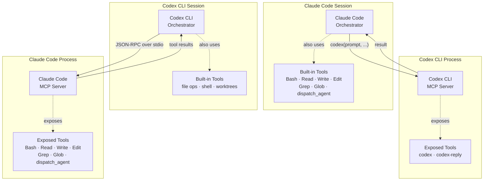

# Claude Code ↔ Codex CLI: Bidirectional MCP Integration


---

The Model Context Protocol (MCP) was designed as a universal interface between AI agents and external tools. Both Claude Code and Codex CLI have adopted it — not just as clients that consume tool servers, but as servers that expose their own capabilities to other agents. This creates a practical basis for cross-tool orchestration: a Claude Code session can delegate execution to Codex CLI, and vice versa, with both communicating over the same JSON-RPC 2.0 / stdio channel.

This article documents how to configure each tool in both roles, what tools each exposes, and three concrete orchestration patterns that emerge from connecting them.

---

## Why Run Both Tools?

Claude Code and Codex CLI are complementary in character. Running them in isolation leaves value on the table.

**Claude Code** is optimised for exploratory, reasoning-heavy work. It maintains long conversational context, reasons about multi-file architectures, produces detailed plans, and is strong at tasks where the right answer isn't obvious before you start. Its built-in tools (Bash, Read, Write, Edit, Grep, Glob, dispatch\_agent) cover the full development lifecycle but are oriented toward single-session depth.

**Codex CLI** is optimised for deterministic execution. It can fan out across multiple worktrees simultaneously, apply well-specified changes to files rapidly, and is designed for "given this spec, do this work" tasks where the instruction is clear and the output is verifiable. Its MCP server mode exposes a stateful conversation API (`codex()` and `codex-reply()`) that clients can drive programmatically.

The practical division of labour that emerges: Claude Code handles planning, decomposition, and reasoning about ambiguity; Codex CLI handles parallel execution of well-defined sub-tasks. MCP is the channel between them.

---

## Architecture Overview



Two independent integration directions are possible:

- **Claude Code as client, Codex CLI as server** — Claude Code adds Codex CLI as an MCP server in `.mcp.json` or via `claude mcp add`. Codex CLI is launched as a subprocess and communicates over stdio.
- **Codex CLI as client, Claude Code as server** — Codex CLI adds Claude Code as an MCP server in `~/.codex/config.toml`. Claude Code runs via `claude mcp serve` and receives calls from Codex.

Both directions are valid. Which you use depends on which tool should own the orchestration loop.

---

## Setting Up Codex CLI as an MCP Server

### How Codex Exposes Itself

Codex CLI starts in MCP server mode with a single command:

```bash
codex mcp-server
```

Or, when invoked as a subprocess by an MCP client:

```bash
npx -y codex mcp-server
```

The server communicates over stdio using JSON-RPC 2.0. It exposes exactly two tools:

| Tool | Purpose |
|------|---------|
| `codex(prompt, ...)` | Start a new Codex conversation |
| `codex-reply(conversation_id, prompt, ...)` | Continue an existing Codex conversation |

Both tools accept parameters that control Codex's execution behaviour:

- `approval-policy`: Set to `"never"` to allow Codex to apply file changes without interactive confirmation. Useful in automated pipelines.
- `sandbox`: Set to `"workspace-write"` to confine Codex to the current workspace directory.

A full invocation with those options looks like:

```json
{
  "tool": "codex",
  "arguments": {
    "prompt": "Refactor auth.ts to use the repository pattern",
    "approval-policy": "never",
    "sandbox": "workspace-write"
  }
}
```

### Connecting Claude Code to Codex CLI

Add Codex CLI as an MCP server in your project's `.mcp.json` (placed in the project root):

```json
{
  "mcpServers": {
    "codex": {
      "type": "stdio",
      "command": "npx",
      "args": ["-y", "codex", "mcp-server"]
    }
  }
}
```

Or register it at user scope (available across all projects) via the CLI:

```bash
claude mcp add codex --scope user -- npx -y codex mcp-server
```

Verify the connection is live from inside a Claude Code session:

```
/mcp
```

You should see `codex` listed with its two available tools.

### Environment Variables for the Codex Subprocess

If Codex needs an API key or a specific model, pass it through the MCP server config:

```json
{
  "mcpServers": {
    "codex": {
      "type": "stdio",
      "command": "npx",
      "args": ["-y", "codex", "mcp-server"],
      "env": {
        "OPENAI_API_KEY": "sk-...",
        "CODEX_MODEL": "o4-mini"
      }
    }
  }
}
```

The `env` block is passed directly to the subprocess environment. Do not commit API keys in `.mcp.json`; use shell environment variable interpolation or a secrets manager instead.

---

## Setting Up Claude Code as an MCP Server

### How Claude Code Exposes Itself

Claude Code runs in MCP server mode with:

```bash
claude mcp serve
```

This launches a headless Claude Code process that listens for client connections on stdio. It exposes the following tools to connecting clients:

| Tool | Purpose |
|------|---------|
| `Bash` | Execute shell commands in the project environment |
| `Read` | Read file contents |
| `Write` | Write new file contents |
| `Edit` | Apply targeted edits to existing files |
| `LS` | List directory contents |
| `GrepTool` | Search file contents by regex |
| `GlobTool` | Find files by pattern |
| `Replace` | Find and replace across files |
| `dispatch_agent` | Delegate to a Claude sub-agent |

**Important constraint:** MCP servers that Claude Code itself has configured are not forwarded to clients. Each MCP layer is independent — there is no passthrough. If Claude Code connects to a GitHub MCP server, a client connecting to Claude Code cannot use GitHub tools directly through that path.

### First-Run Permission Grant

Before Claude Code can operate headlessly, it needs a one-time permission grant. Run this once in the target project:

```bash
claude --dangerously-skip-permissions
```

Accept the permissions prompt, then exit. This records the grant so subsequent `claude mcp serve` invocations can run without interactive approval.

### Connecting Codex CLI to Claude Code

Add Claude Code as an MCP server in `~/.codex/config.toml` (global) or `.codex/config.toml` (project-scoped, requires trust):

```toml
[mcp_servers.claude-code]
command = "claude"
args = ["mcp", "serve"]
startup_timeout_sec = 30
tool_timeout_sec = 120
```

Increase `tool_timeout_sec` if Claude Code tasks involve long-running Bash commands or multi-file rewrites.

To restrict which Claude Code tools Codex can call:

```toml
[mcp_servers.claude-code]
command = "claude"
args = ["mcp", "serve"]
enabled_tools = ["Read", "GrepTool", "GlobTool"]
```

To disable the server without removing its config:

```toml
[mcp_servers.claude-code]
command = "claude"
args = ["mcp", "serve"]
enabled = false
```

---

## Practical Orchestration Patterns

### Pattern 1: Claude Code Plans, Codex Executes in Parallel

Claude Code decomposes a large refactoring task into discrete, well-specified sub-tasks. For each sub-task, it calls `codex()` with `approval-policy: never`. Multiple Codex calls can be issued sequentially (or, if the orchestrator supports it, in parallel across worktrees).

Example flow inside a Claude Code session:

```
User: "Migrate all Express route handlers in /src/routes to use the new error middleware pattern."

Claude Code:
1. Uses GlobTool to enumerate all files in /src/routes
2. Uses Read to understand the current pattern in each file
3. For each file, calls codex() with:
   - prompt: "Refactor [filename] to use the new error middleware. Wrap all async handlers in asyncHandler(). Import it from '../middleware/async'."
   - approval-policy: "never"
   - sandbox: "workspace-write"
4. Verifies each result with Read before proceeding
```

This keeps Claude Code in a supervisory role — it reasons about the migration strategy and validates results — while Codex handles the mechanical application of changes.

### Pattern 2: Codex Orchestrates, Claude Code Reasons

Invert the direction: Codex CLI runs as the outer loop, delegating reasoning-heavy tasks to Claude Code's `dispatch_agent` or file analysis tools.

A `~/.codex/config.toml` configuration for this pattern:

```toml
[mcp_servers.claude-code]
command = "claude"
args = ["mcp", "serve"]
startup_timeout_sec = 30
tool_timeout_sec = 300
enabled_tools = ["Read", "GrepTool", "GlobTool", "Bash", "dispatch_agent"]
```

Example use case: Codex is running a test suite in a CI-like loop. When a test fails, it calls Claude Code's `dispatch_agent` to reason about the failure, identify the root cause across multiple files, and return a structured diagnosis. Codex then applies the fix.

### Pattern 3: Multi-Agent Pipeline with Gated Handoffs

This pattern mirrors the architecture documented in the OpenAI Agents SDK cookbook. A Project Manager agent (running in Claude Code) decomposes work and gates handoffs between specialised agents:

```
Project Manager (Claude Code)
  ├── calls codex("Design the data model for X") → Designer artifact
  ├── [gate: verify artifact exists]
  ├── calls codex("Implement the backend based on the design") → Backend artifact
  ├── [gate: verify artifact exists]
  ├── calls codex("Implement the frontend") → Frontend artifact
  ├── [gate: verify artifact exists]
  └── calls codex("Write and run tests for all components") → Test results
```

Each Codex call is stateful via `codex-reply()` if a conversation needs to continue. The gate checks (using Claude Code's `Read` or `Bash` tools) verify that each phase produced the expected output before the next phase begins. This prevents cascading failures where a broken backend silently propagates into a frontend implementation.

---

## Configuration Reference

### Claude Code Side: `.mcp.json`

Place in the project root. Used to register Codex CLI as a server that Claude Code calls.

```json
{
  "mcpServers": {
    "codex": {
      "type": "stdio",
      "command": "npx",
      "args": ["-y", "codex", "mcp-server"],
      "env": {
        "OPENAI_API_KEY": "${OPENAI_API_KEY}",
        "CODEX_QUIET_MODE": "1"
      }
    }
  }
}
```

Config scopes available via `claude mcp add`:

| Scope | Flag | Storage location | Visibility |
|-------|------|-----------------|------------|
| `local` (default) | `--scope local` | `~/.claude.json` (project entry) | Current user, current project |
| `project` | `--scope project` | `.mcp.json` in project root | All users of the project |
| `user` | `--scope user` | `~/.claude.json` (global entry) | Current user, all projects |

### Codex Side: `~/.codex/config.toml`

Used to register Claude Code as a server that Codex calls.

```toml
# Global Codex configuration
# ~/.codex/config.toml

[mcp_servers.claude-code]
command = "claude"
args = ["mcp", "serve"]
startup_timeout_sec = 30
tool_timeout_sec = 120
# enabled_tools = ["Read", "GrepTool", "GlobTool"]   # optional allowlist
# disabled_tools = ["Bash"]                           # optional denylist
# required = true                                     # fail startup if server unavailable

[mcp_servers.claude-code.env]
# Pass any env vars needed by the Claude Code subprocess
# ANTHROPIC_API_KEY = "sk-ant-..."  # usually inherited from environment
```

Full `mcp_servers` field reference:

| Field | Type | Default | Description |
|-------|------|---------|-------------|
| `command` | string | — | Launcher command (stdio servers) |
| `args` | array\<string\> | `[]` | Arguments passed to command |
| `cwd` | string | — | Working directory for subprocess |
| `env` | map\<string,string\> | — | Environment variables forwarded to subprocess |
| `url` | string | — | Endpoint URL (HTTP servers only) |
| `bearer_token_env_var` | string | — | Env var name holding bearer token (HTTP) |
| `enabled_tools` | array\<string\> | all | Allowlist of tool names |
| `disabled_tools` | array\<string\> | none | Denylist applied after allowlist |
| `enabled` | boolean | `true` | Disable without removing config |
| `required` | boolean | `false` | Abort startup if server fails to init |
| `startup_timeout_sec` | number | 10 | Seconds to wait for server process to start |
| `tool_timeout_sec` | number | 60 | Seconds to wait for a single tool call |

---

## Limitations and Gotchas

**No MCP passthrough in Claude Code.** When Claude Code runs as an MCP server, it exposes only its own built-in tools. Any MCP servers that Claude Code itself is configured to use (GitHub, Postgres, etc.) are not accessible to the connecting client. Each layer of the stack is isolated.

**One process per client connection.** Each time an MCP client connects to `claude mcp serve`, a new Claude Code process is spawned. There is no shared state between connections. This is correct for stateless tool calls but means you cannot maintain a single Claude Code "session" across multiple calls from an external orchestrator.

**Codex MCP server conversation state.** Codex's `codex()` tool returns a `conversation_id`. Pass this to subsequent `codex-reply()` calls to continue the same conversation. If you lose the ID, the conversation is inaccessible — there is no way to list or resume previous sessions.

**Timeout tuning is critical.** The default `tool_timeout_sec` in Codex config is 60 seconds. Claude Code tasks involving compilation, test runs, or multi-file rewrites routinely exceed this. The OpenAI cookbook examples use `client_session_timeout_seconds=360000`. For production use, set `tool_timeout_sec` to at least 300 in your `config.toml`. Similarly, when calling `codex()` from Claude Code, Claude Code's own timeout settings apply to the MCP call.

**TOML syntax errors affect both CLI and IDE.** Codex CLI and the VS Code Codex extension share `~/.codex/config.toml`. A syntax error breaks both simultaneously. Validate your TOML before saving (e.g., `python3 -c "import tomllib; tomllib.load(open('config.toml','rb'))"`).

**`approval-policy: never` removes human oversight.** When calling `codex()` with `"approval-policy": "never"`, Codex applies all file changes without confirmation. This is necessary for automated pipelines but eliminates the safety net that interactive approval provides. Pair it with `"sandbox": "workspace-write"` to at minimum confine writes to the workspace directory.

**Claude Code's `--dangerously-skip-permissions` is required for headless operation.** This flag is a one-time grant, not a persistent mode. However, its name signals real risk: granting it means the process can execute arbitrary Bash commands without per-call approval. Use it only in trusted, sandboxed environments.

**Version requirements.** Codex MCP server mode (`codex mcp-server`) was introduced in the Rust rewrite of Codex CLI. The legacy TypeScript implementation does not include it. Ensure you are running the current Rust-based Codex CLI. Check with `codex --version`. WebSocket transport for the Codex app server (relevant for remote connections) arrived in v0.117.0.

**Project-scoped Codex config requires trust.** `.codex/config.toml` at the project level is only loaded for projects that Codex has explicitly marked as trusted. Global config (`~/.codex/config.toml`) is always loaded.

---

## Citations

- Anthropic. "Connect Claude Code to tools via MCP." Claude Code Documentation. [https://code.claude.com/docs/en/mcp](https://code.claude.com/docs/en/mcp)
- OpenAI. "Model Context Protocol — Codex." OpenAI Developer Documentation. [https://developers.openai.com/codex/mcp](https://developers.openai.com/codex/mcp)
- OpenAI. "Configuration Reference — Codex." OpenAI Developer Documentation. [https://developers.openai.com/codex/config-reference](https://developers.openai.com/codex/config-reference)
- OpenAI. "Building Consistent Workflows with Codex CLI and the Agents SDK." OpenAI Cookbook. [https://developers.openai.com/cookbook/examples/codex/codex_mcp_agents_sdk/building_consistent_workflows_codex_cli_agents_sdk](https://developers.openai.com/cookbook/examples/codex/codex_mcp_agents_sdk/building_consistent_workflows_codex_cli_agents_sdk)
- OpenAI. "codex/docs/config.md." GitHub. [https://github.com/openai/codex/blob/main/docs/config.md](https://github.com/openai/codex/blob/main/docs/config.md)
- ksred.com. "Claude Code as an MCP Server: An Interesting Capability Worth Understanding." [https://www.ksred.com/claude-code-as-an-mcp-server-an-interesting-capability-worth-understanding/](https://www.ksred.com/claude-code-as-an-mcp-server-an-interesting-capability-worth-understanding/)
- AgentPatch. "Codex CLI MCP Setup: How to Configure MCP Servers." [https://agentpatch.ai/blog/codex-cli-mcp-setup/](https://agentpatch.ai/blog/codex-cli-mcp-setup/)
- Siedykh, Vladimir. "Codex MCP config: shared TOML setup for CLI and VSCode." [https://vladimirsiedykh.com/blog/codex-mcp-config-toml-shared-configuration-cli-vscode-setup-2025](https://vladimirsiedykh.com/blog/codex-mcp-config-toml-shared-configuration-cli-vscode-setup-2025)
- GitHub. "MCP servers in .claude/.mcp.json not loading properly — Issue #5037." anthropics/claude-code. [https://github.com/anthropics/claude-code/issues/5037](https://github.com/anthropics/claude-code/issues/5037)
- GitHub. "Is `claude mcp serve` meant to also serve its own configured MCP tools? — Issue #631." anthropics/claude-code. [https://github.com/anthropics/claude-code/issues/631](https://github.com/anthropics/claude-code/issues/631)
