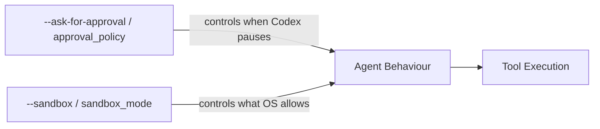
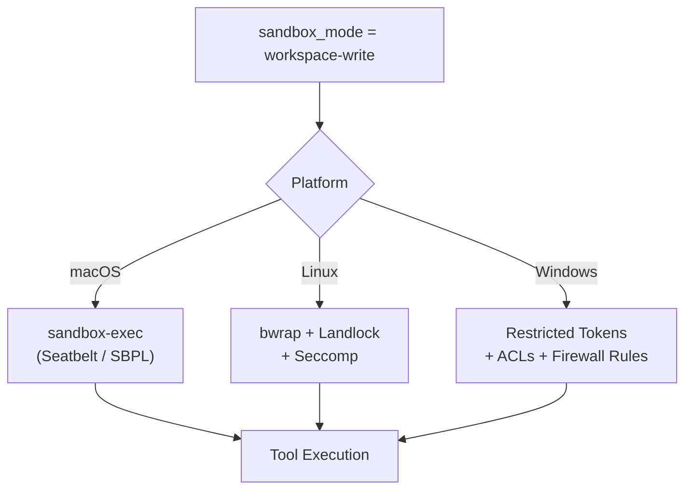
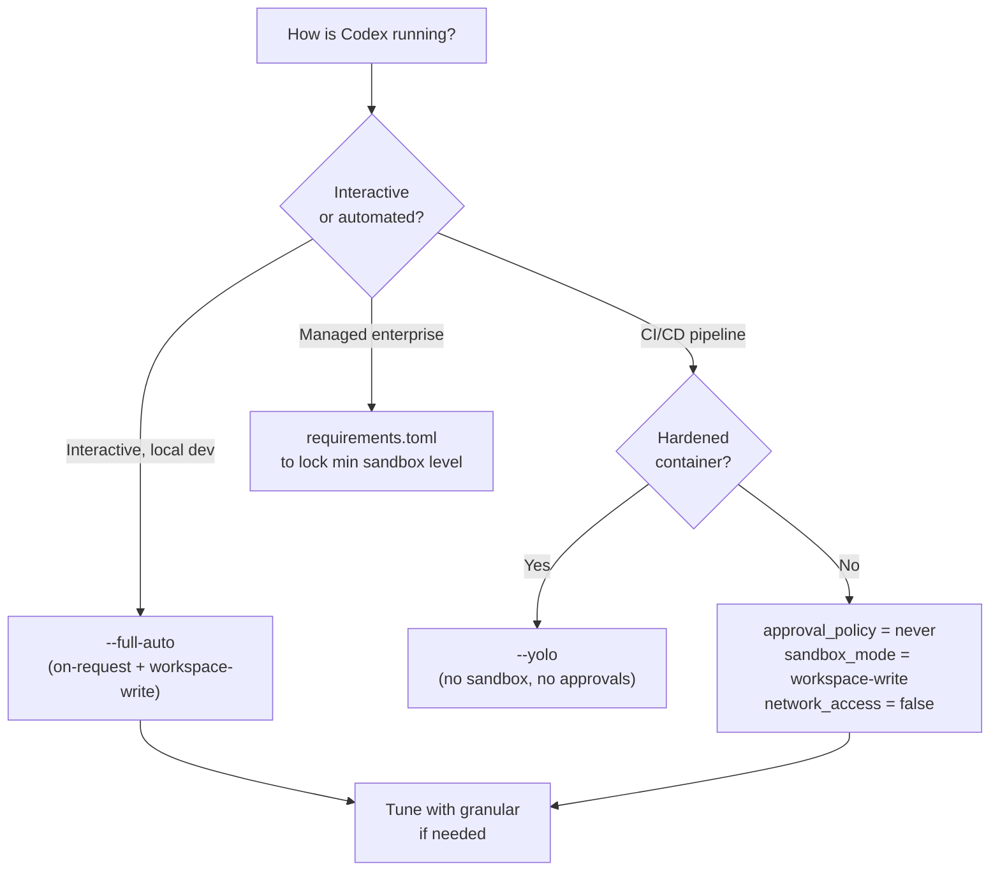

# Codex CLI Approval Modes and Sandbox Security Model


Codex CLI's safety model is built on two orthogonal controls: an **approval policy** (when the agent must pause and ask before acting) and a **sandbox mode** (what the OS actually permits). Understanding the difference — and how the two axes compose — is essential for deploying Codex in anything beyond casual local use. This article covers the current dual-axis model, platform-specific sandboxing implementations, granular configuration, and the experimental Smart Approvals feature introduced in v0.115.0.[^1]

---

## The Two-Axis Model

Earlier Codex versions exposed three named presets (`suggest`, `auto-edit`, `full-auto`) as a single dial. Current releases separate this into two independent flags, giving you finer control with clearer semantics.[^2]



### `--ask-for-approval` (short: `-a`)

Sets the *procedural* boundary — when Codex must request human confirmation before proceeding.[^3]

| Value | Behaviour |
|---|---|
| `untrusted` | Strictest. Only known-safe read operations run automatically; every state-mutating or execution step requires approval. |
| `on-request` | Default for `--full-auto`. Codex runs freely within sandbox boundaries and pauses only when it needs to exceed them. |
| `never` | No approval prompts. Still subject to sandbox enforcement unless that is also disabled. |

> ⚠️ `on-failure` was accepted in earlier versions but is **deprecated** and should not appear in new configurations.[^3]

### `--sandbox` (short: `-s`)

Sets the *technical* boundary — what the operating system actually permits Codex to do.[^4]

| Value | Behaviour |
|---|---|
| `read-only` | Inspection only; no file writes or command execution without explicit approval. |
| `workspace-write` | Read and write within the working directory; **network access is off by default**. |
| `danger-full-access` | No filesystem or network restrictions. |

### Composite Shortcut Flags

Two composite flags encode the most common combinations:[^3]

```bash
# Low-friction local development
codex --full-auto

# CI/CD pipelines inside a hardened container
codex --dangerously-bypass-approvals-and-sandbox   # alias: --yolo
```

`--full-auto` maps to `-a on-request -s workspace-write`. The `--yolo` flag bypasses both controls entirely and should only appear in environments where the container itself provides isolation.

### Mapping the Old Three-Mode Model

For reference, the legacy preset names correspond to:

| Old Preset | Equivalent Flags |
|---|---|
| `suggest` | `-a untrusted -s read-only` |
| `auto-edit` | `-a on-request -s workspace-write` |
| `full-auto` | `-a never -s workspace-write` (or `--full-auto`) |

Community documentation written before mid-2025 often refers to these preset names; translate them to the two-axis flags for current configurations.[^2]

---

## Platform-Specific Sandbox Implementations

The `sandbox_mode` value is enforced at the OS level via different mechanisms on each platform. The abstraction is consistent; the implementation is not.[^4]



### macOS — Seatbelt

Codex generates a Sandbox Profile Language (SBPL) script at runtime and passes it to `sandbox-exec`.[^4] Two base policies are composed: one covering filesystem denials/allows (`seatbelt_base_policy.sbpl`) and one covering network access (`seatbelt_network_policy.sbpl`). When the local network proxy is active, loopback traffic to its ports is explicitly permitted.

### Linux — Bubblewrap + Landlock + Seccomp

A two-stage process:[^4]

1. **Outer stage**: `bwrap` namespaces the filesystem. Standard system paths (`/usr`, `/bin`, `/lib`) are bind-mounted read-only so command execution still works.
2. **Inner stage**: The `codex-linux-sandbox` binary applies `PR_SET_NO_NEW_PRIVS` and Seccomp syscall filters.

As of v0.116.0 (March 2026), the system-installed `bwrap` is preferred over the bundled binary, and startup is more robust for symlinked checkouts and missing writable roots.[^1]

### Windows — Restricted Tokens + ACLs + Firewall Rules

Windows sandboxing uses dedicated low-privilege user accounts and Win32 security primitives.[^5] Two sub-modes are available via `config.toml`:

```toml
[windows]
sandbox = "elevated"    # preferred: dedicated sandbox users, firewall rules
# sandbox = "unelevated"  # fallback: restricted tokens from current user
```

`elevated` mode provisions two dedicated accounts (`CodexSandboxOffline`, `CodexSandboxOnline`), applies filesystem ACLs, and adds firewall rules. It requires one-time admin setup. A notable limitation: directories where the `Everyone` SID has write permissions cannot be protected — a pre-flight audit (`audit_everyone_writable`) scans for this condition.[^5]

---

## Configuration Reference

### Core Keys (`~/.codex/config.toml`)

```toml
approval_policy = "on-request"    # "untrusted" | "on-request" | "never" | { granular = {...} }
sandbox_mode    = "workspace-write"  # "read-only" | "workspace-write" | "danger-full-access"
```

### Sandbox Workspace Write Options

```toml
[sandbox_workspace_write]
writable_roots         = []     # Additional directories with write access beyond cwd
network_access         = false  # Outbound network; off by default
exclude_slash_tmp      = false  # Exclude /tmp from writable roots
exclude_tmpdir_env_var = false  # Exclude $TMPDIR from writable roots
```

The `--add-dir <path>` CLI flag is the per-invocation equivalent of `writable_roots`; it can be repeated to grant multiple additional directories.[^3]

### Granular Approval Policy

For pipelines that want fine-grained per-category control rather than a blanket `never`, use the `granular` variant:[^6]

```toml
approval_policy = { granular = {
  sandbox_approval    = true,   # Prompt when sandbox escalation is needed
  rules               = true,   # Prompt for execpolicy rule matches
  mcp_elicitations    = false,  # Auto-reject MCP elicitation requests
  request_permissions = false,  # Auto-reject request_permissions tool calls
  skill_approval      = true    # Prompt before running skill scripts
} }
```

This is particularly useful in automated environments where you want skills and rules to prompt (so they can be audited), but you want MCP elicitations silently rejected to avoid blocking pipelines.

### Named Permission Profiles

The `permissions.<name>` table defines reusable security profiles:[^6]

```toml
[permissions.strict]
# filesystem scopes, network: allowed_domains / denied_domains
# mode: "limited" | "full"

[permissions.ci]
network_access = false

default_permissions = "strict"   # Active profile for sandboxed tool calls
```

### Project-Level Configuration

`.codex/config.toml` in a project directory overrides the user-level config, but only for projects marked as trusted:[^6]

```toml
# In ~/.codex/config.toml
[projects."/abs/path/to/project"]
trust_level = "trusted"
```

This prevents untrusted project configs from silently downgrading security settings.

---

## Admin Enforcement with `requirements.toml`

Enterprise and managed deployments can lock down which values developers are permitted to set.[^6] A `requirements.toml` file constrains `approval_policy`, `sandbox_mode`, and `web_search`:

```toml
# requirements.toml — distributed via MDM or central config management
[required]
sandbox_mode    = { min = "workspace-write" }   # Prevent danger-full-access
approval_policy = { disallowed = ["never"] }    # Prevent disabling approvals
```

ChatGPT Business and Enterprise deployments can apply cloud-fetched requirements, ensuring policies are enforced even if a developer modifies their local config.[^6]

---

## Smart Approvals (Experimental, v0.115.0+)

v0.115.0 (March 2026) introduced **Smart Approvals** as an opt-in experimental feature.[^1] When enabled, approval review requests are routed through a "guardian subagent" that evaluates context from previous approvals in the session, reducing repetitive prompts for logically equivalent follow-up actions.

```toml
[features]
smart_approvals = true   # Default: false
```

The guardian subagent is aware of which sandbox escalations have already been approved in the current session, persists host approvals, and handles project-profile layering for spawned subagents. It is still marked experimental and off by default — enable with caution in production pipelines until it stabilises.[^1]

---

## Network Sandboxing and Web Search

Network access deserves special attention: it is **disabled by default** even in `workspace-write` mode.[^4] This is a common source of confusion when migrating workflows that expect HTTP access.

When network access is enabled, Codex routes outgoing traffic through a local proxy. As of v0.115.0, this proxy serves CONNECT traffic as explicit HTTP/1 for broader compatibility.[^1]

Web search is handled separately from general network access:

```toml
web_search = "cached"   # "cached" (default) | "live" | "disabled"
```

`cached` uses a pre-indexed OpenAI-maintained index, reducing prompt-injection exposure from live web content. `live` enables real-time search but increases surface area.[^6]

---

## Sandbox Violation Handling

When a tool call is blocked by the sandbox, the `ToolOrchestrator` catches the denial and can offer the user an escalation prompt rather than silently failing.[^4] Denial patterns by platform:

| Platform | Signal |
|---|---|
| macOS | `sandbox-exec: Operation not permitted` |
| Linux | `bwrap: Permission denied` |
| Windows | Win32 Error 5 `Access is denied` |

Mid-session mode switching is supported: the `/permissions` slash command surfaces available modes, and pressing `v` in a command approval dialog opens an inline mode switcher.[^7]

---

## Choosing the Right Configuration



For local development, `--full-auto` is the pragmatic default. For CI, a hardened container plus `--yolo` is cleaner than trying to handle approval prompts in a pipeline. For managed teams, the combination of `requirements.toml` and project trust levels gives you defence-in-depth without burdening individual developers.

---

## Citations

[^1]: Codex CLI Changelog — v0.115.0 and v0.116.0 release notes, March 2026. <https://developers.openai.com/codex/changelog>
[^2]: Codex CLI Features Overview — approval modes and sandbox controls. <https://developers.openai.com/codex/cli/features>
[^3]: Codex CLI Command-Line Reference — `--ask-for-approval`, `--sandbox`, `--full-auto`, `--add-dir` flags. <https://developers.openai.com/codex/cli/reference>
[^4]: Codex CLI Sandboxing Concepts — platform implementations (macOS, Linux, Windows). <https://developers.openai.com/codex/concepts/sandboxing>; DeepWiki sandboxing implementation analysis. <https://deepwiki.com/openai/codex/5.6-sandboxing-implementation>
[^5]: Windows Sandbox Guide — elevated vs unelevated modes, audit_everyone_writable. <https://developers.openai.com/codex/windows>; GitHub Discussion #6065. <https://github.com/openai/codex/discussions/6065>
[^6]: Codex CLI Configuration Reference — approval_policy, sandbox_workspace_write, permissions, requirements.toml, web_search. <https://developers.openai.com/codex/config-reference>; Advanced Configuration. <https://developers.openai.com/codex/config-advanced>
[^7]: Mid-session approval mode switching — GitHub Issue #392. <https://github.com/openai/codex/issues/392>
