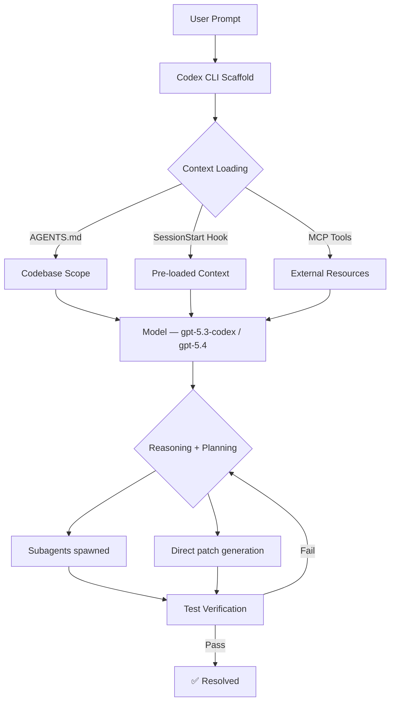
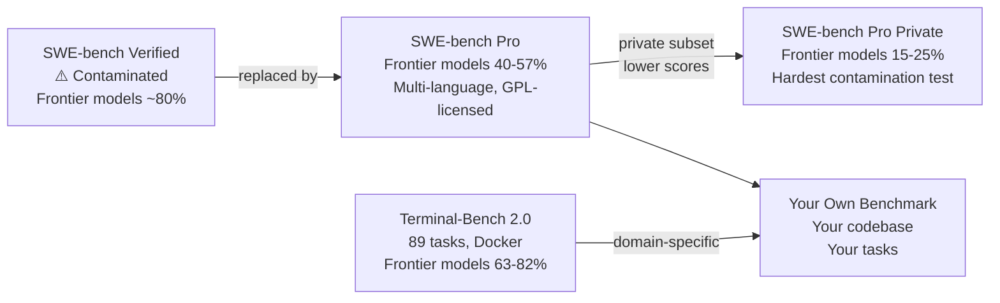

# Codex CLI in Practice: Real-World Benchmarks and What They Mean


---

Benchmark numbers dominate marketing copy, but most developers lack the context to interpret them critically. A model claiming "80% on SWE-bench" means something very different from "56% on SWE-bench Pro", and neither number directly answers "will this make me more productive?" This article unpacks the benchmark landscape as it stands in early 2026, explains the methodology behind each evaluation, and gives you a practical framework for translating scores into tooling decisions.

---

## The Benchmark Landscape

Three evaluations dominate discourse around AI coding agents in 2026:

| Benchmark | Tasks | Scope | Contamination resistance |
|---|---|---|---|
| **SWE-bench Verified** | 500 Python tasks | Bug-fix patches | Low — OpenAI confirmed contamination[^1] |
| **SWE-bench Pro** | 1,865 multi-language tasks | Multi-file changes | High — GPL + proprietary codebases[^2] |
| **Terminal-Bench 2.0** | 89 end-to-end tasks | Full terminal workflows | High — Docker environments, crowdsourced[^3] |

Each measures a different capability slice, and the choice of benchmark often reflects whose model performs best on it.

---

## SWE-bench: The Origin and Its Variants

### What SWE-bench Measures

SWE-bench, from Princeton, evaluates LLMs on real GitHub issues drawn from 12 popular Python repositories.[^4] The agent receives the issue description, the repository at that commit, and must generate a patch. Success is binary: apply the patch, run the existing test suite — pass or fail, no partial credit.[^5]

This makes it meaningfully harder than code-generation benchmarks (HumanEval, MBPP): the model must navigate an unfamiliar codebase, understand cross-file interactions, and produce a patch that satisfies existing tests written by a different engineer.

### SWE-bench Verified

In August 2024, OpenAI released **SWE-bench Verified** — 500 human-validated tasks from the original 2,294.[^6] It became the de-facto standard for comparing agents.

The problem: by 2026, OpenAI's own audit confirmed every frontier model (GPT-5.2, Claude Opus 4.5, Gemini 3 Flash) can reproduce verbatim gold patches for a subset of tasks.[^1] 59.4% of hard tasks have flawed tests. OpenAI has since stopped self-reporting Verified scores.

SWE-bench Verified still differentiates weaker models, but treat any score above ~60% from a frontier model with scepticism.

### SWE-bench Pro

**SWE-bench Pro** addresses Verified's limitations directly:[^2]

- 1,865 tasks vs. 500
- Multi-language (not Python-only)
- Average patch: 107 lines across 4.1 files (vs. Verified's median of 4 lines)
- Sourced from GPL-licensed and proprietary codebases to create legal barriers to training-data inclusion
- Includes a **private held-out subset** visible only on the Scale Labs leaderboard

The resulting scores are humbling. Claude Opus 4.5 scores 80.9% on Verified but 45.9% on Pro — same model, roughly half the score.[^2] On the private subset, the gap widens further: Claude Opus 4.1 drops from 22.7% to 17.8%, GPT-5 from 23.1% to 14.9%.[^2] These drops are the clearest signal that Verified scores partially reflect memorisation.

For **Codex CLI with GPT-5.3-Codex**, OpenAI reports 56.8% on SWE-bench Pro (Public).[^7] That number uses OpenAI's own agent scaffolding. On the Scale AI SEAL leaderboard with standardised scaffolding, GPT-5 (High) scores 41.8% and GPT-5.2 Codex 41.0%.[^2] Custom harnesses add 4–12 points.

---

## Terminal-Bench 2.0: The CLI-Native Benchmark

### Structure

Terminal-Bench 2.0, from the Laude Institute, consists of 89 curated tasks that run inside Docker containers.[^3] Each task has:

- A natural-language instruction
- A sandboxed environment
- A test script that verifies the outcome automatically

Task categories span software engineering, machine learning model training, system administration, security, data science, and cybersecurity.[^3] Tasks were crowd-sourced from 93 contributors, with 229 submissions narrowed to 89 based on quality and difficulty.[^3]

This is the benchmark where Codex CLI's terminal-native strengths are most visible.

### Running Terminal-Bench Yourself

The benchmark runs via the **Harbor** framework:[^3]

```bash
# Install Harbor
pip install harbor-framework

# Run Terminal-Bench 2.0 against Codex CLI
harbor run -d terminal-bench@2.0 --agent codex-cli --model gpt-5.3-codex
```

Costs range from roughly **$1 to $100 per full run** depending on model pricing.[^3]

### Current Scores (March 2026)

| Agent + Model | Score |
|---|---|
| ForgeCode + Claude Opus 4.6 | 81.8% |
| ForgeCode + GPT-5.4 | 81.8% |
| TongAgents + Gemini 3.1 Pro | 80.2% |
| ForgeCode + Gemini 3.1 Pro | 78.4% |
| **SageAgent + GPT-5.3-Codex** | **78.4%** |
| Codex CLI + GPT-5.2 | 63% |

The frontier is clustered between 78–82%; no model dominates.[^8]

A notable finding: Codex CLI's resolution rate **increases by 52%** when using GPT-5.2 instead of GPT-5-Nano.[^9] Model capability matters more than scaffold choice when optimising for Terminal-Bench performance.

---

## The Scaffolding Effect

Agent scaffolding — the orchestration layer, memory management, tool-use protocol, retry logic — can matter as much as the underlying model. The Confucius Code Agent (CCA), using **Claude 4 Sonnet**, achieves 74.6% on SWE-bench, outperforming a mini-SWE-Agent variant using the more capable **Claude 4.5 Sonnet**.[^10] Better orchestration closed — and surpassed — a one-generation model gap.

This is relevant for Codex CLI users: the CLI's native subagent support, AGENTS.md context loading, and hook system compose the scaffolding layer. A well-written `AGENTS.md` that accurately scopes the codebase and a `SessionStart` hook that pre-loads relevant context will measurably improve outcomes on tasks equivalent to benchmark scenarios.



---

## Goodhart's Law and the Contamination Problem

> *When a measure becomes a target, it ceases to be a good measure.* — Goodhart's Law

This is playing out in AI coding benchmarks right now.[^11] Once SWE-bench Verified became the primary ranking mechanism, model developers optimised for it — through fine-tuning, scaffolding tuning, and, critically, training data inclusion. The result is Verified scores that no longer meaningfully discriminate between frontier models.

SWE-bench Pro's response is structural: GPL and proprietary codebases create legal barriers to inclusion in training data, and the multi-file, multi-language task format resists the 4-line Python patch memorisation pattern that inflated Verified scores.[^2]

A starker illustration: on SWE-EVO (a benchmark testing sustained evolution of existing systems), GPT-5 with OpenHands scores **21%** — compared to 65% on SWE-bench Verified.[^12] On commercial/enterprise codebases, the best models score **under 20%**.[^12] Real codebases are harder than benchmarks suggest.

---

## What the Numbers Actually Mean for You

Translating benchmark scores into tooling decisions requires a few calibrations:

### 1. Match the benchmark to your workload

| Your primary use case | Most predictive benchmark |
|---|---|
| Bug fixing in Python repos | SWE-bench Pro (not Verified) |
| Terminal automation, devops, ML pipelines | Terminal-Bench 2.0 |
| Multi-language, multi-file features | SWE-bench Pro private subset |
| Greenfield development | ⚠️ No benchmark captures this well |

### 2. Subtract the scaffold inflation

Any score citing a vendor's own scaffolding inflates by 4–12 points versus standardised evaluation.[^2] For apples-to-apples comparison, prefer SEAL leaderboard numbers or Terminal-Bench (which specifies the agent framework explicitly).

### 3. Model selection within Codex CLI

Given current benchmarks, the practical hierarchy for Codex CLI is:

```toml
# config.toml — model selection by task type
[model]
# Highest reasoning quality — complex multi-file tasks
default = "gpt-5.4"

# Specialist coding tasks, benchmarks on SWE-bench Pro
# 56.8% SWE-bench Pro (OpenAI scaffold), 78.4% Terminal-Bench 2.0
coding = "gpt-5.3-codex"

# Subagent tasks, exploration, large-file review
subagent = "gpt-5.4-mini"
```

For tasks analogous to SWE-bench scenarios (isolated bug fix, single PR scope), `gpt-5.3-codex` is the purpose-built choice. For broader agentic tasks with planning and computer use, `gpt-5.4` leads.[^7]

### 4. Run your own micro-benchmark

The only benchmark that truly matters is performance on your codebase. Terminal-Bench 2.0 offers a useful template: 5–10 representative tasks from your actual workflows, each with a Docker environment and a deterministic test. Run them against each model and scaffold configuration you're considering. Costs are low enough ($1–10 for a small suite) that this is practical.[^3]

---

## The Benchmark Hierarchy in 2026



---

## Summary

- **SWE-bench Verified** is contaminated at the frontier. Stop citing it as the gold standard — it isn't.
- **SWE-bench Pro** is the honest measure. Scores are 30–40 points lower than Verified; that's the reality.
- **Terminal-Bench 2.0** is the most relevant benchmark for Codex CLI users — it tests the kind of end-to-end terminal workflows the tool is built for.
- **Scaffolding adds 4–12 points** over standardised baselines. Don't compare vendor-reported scores against SEAL scores directly.
- **Model selection matters more than scaffold** when optimising for Terminal-Bench (52% improvement from GPT-5-Nano to GPT-5.2).[^9]
- **The best benchmark is your own codebase.** Use Terminal-Bench's task format as a template.

---

## Citations

[^1]: OpenAI audit confirming contamination on SWE-bench Verified: [SWE-Bench Pro Leaderboard (2026): Why 46% Beats 81%](https://www.morphllm.com/swe-bench-pro)
[^2]: SWE-bench Pro methodology and score comparisons: [Scale Labs Leaderboard: SWE-Bench Pro (Public Dataset)](https://labs.scale.com/leaderboard/swe_bench_pro_public)
[^3]: Terminal-Bench 2.0 structure, tasks, costs, and Harbor framework: [Terminal-Bench 2.0](https://www.tbench.ai/) and [Terminal-Bench 2.0 launches alongside Harbor — VentureBeat](https://venturebeat.com/ai/terminal-bench-2-0-launches-alongside-harbor-a-new-framework-for-testing)
[^4]: SWE-bench origin, methodology (Princeton, 12 repos, 2,294 tasks): [GitHub — SWE-bench/SWE-bench](https://github.com/SWE-bench/SWE-bench)
[^5]: SWE-bench pass/fail evaluation and patch-application methodology: [Introducing SWE-bench Verified — OpenAI](https://openai.com/index/introducing-swe-bench-verified/)
[^6]: SWE-bench Verified: 500 human-validated tasks released August 2024: [Introducing SWE-bench Verified — OpenAI](https://openai.com/index/introducing-swe-bench-verified/)
[^7]: GPT-5.3-Codex benchmark scores (SWE-bench Pro 56.8%, Terminal-Bench 2.0 77.3%): [OpenAI debuts GPT-5.3-Codex — Neowin](https://www.neowin.net/news/openai-debuts-gpt-53-codex-25-faster-and-setting-new-coding-benchmark-records/)
[^8]: Terminal-Bench 2.0 leaderboard top scores (March 2026): [Terminal-Bench 2.0 — tbench.ai](https://www.tbench.ai/)
[^9]: Codex CLI resolution rate increase (52%) from model upgrade on Terminal-Bench: [Terminal-Bench: Benchmarking Agents on Hard, Realistic Tasks in CLI](https://arxiv.org/abs/2601.11868)
[^10]: Confucius Code Agent outperforming higher-capability model via scaffold: [Confucius Code Agent — arXiv](https://arxiv.org/html/2512.10398v3)
[^11]: Goodhart's Law in AI agent benchmarks: [Goodhart's Law Is Now an AI Agent Problem — DEV Community](https://dev.to/askpatrick/goodharts-law-is-now-an-ai-agent-problem-4k77)
[^12]: SWE-EVO benchmark showing 21% vs 65% gap, enterprise codebase performance: [SWE-EVO: Benchmarking Coding Agents — arXiv](https://arxiv.org/html/2512.18470v1)
