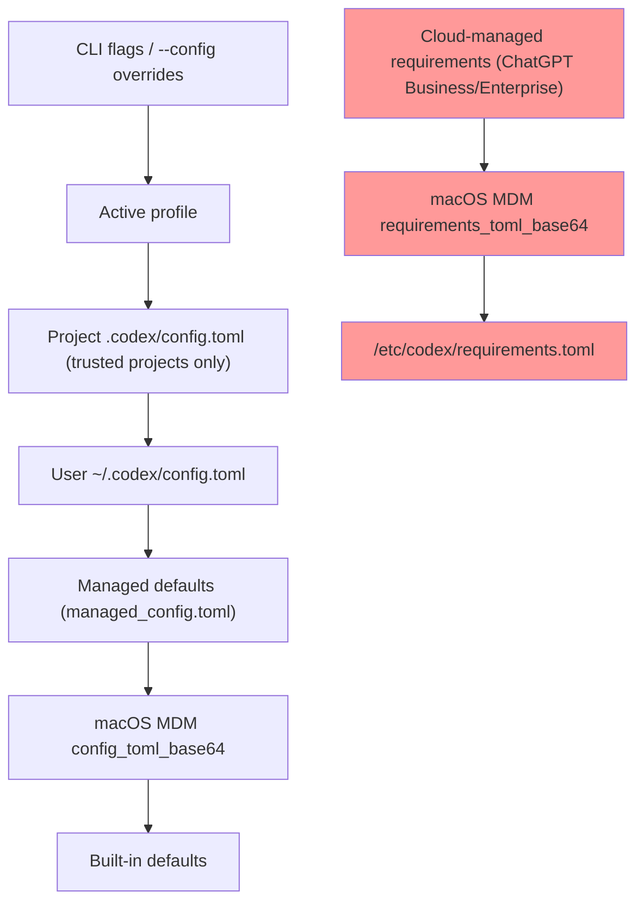
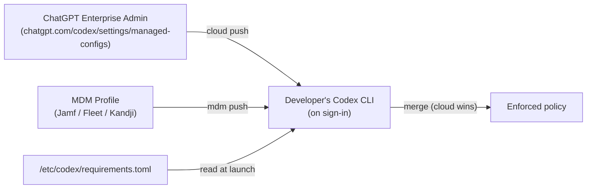
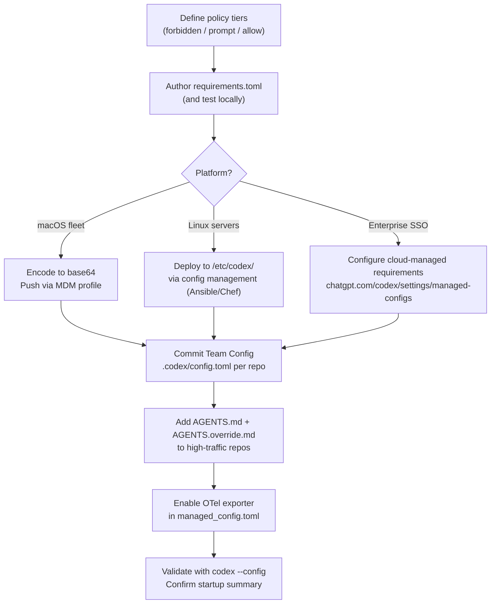

# Codex CLI Enterprise Deployment: Managed Policies and Team Configuration


Rolling Codex CLI out to a team of ten is a different proposition from running it on your own laptop. At scale you need guardrails that users cannot accidentally override, sensible defaults that land on every machine without a ticket to IT, and a paper trail that satisfies compliance reviewers. Codex CLI v0.116.0 ships a layered configuration system — spanning cloud-enforced requirements, MDM profiles, system-level TOML files, and per-repository Team Config — that addresses all of this.[^1] This article maps out the full stack and shows how each layer composes.

---

## The Configuration Hierarchy

Codex CLI resolves settings by merging multiple sources in a well-defined precedence order. There are two parallel hierarchies — one for *defaults* (which users can override) and one for *requirements* (which users cannot override). Understanding the distinction is the starting point for any enterprise deployment.



The left-hand chain resolves *what* Codex does by default. The right-hand chain establishes *hard limits* that no user-side setting can breach.[^2] Requirements are evaluated after the defaults chain is fully resolved; if a resolved value would violate a requirement, Codex refuses to start or surfaces an error at the point the policy is triggered.

---

## Defaults vs. Requirements: Why the Distinction Matters

**Managed defaults** (`managed_config.toml`) set a starting value users can still override per-session. They are appropriate for opinionated baselines — a preferred model, a default reasoning effort level, an OpenTelemetry sink — where you want consistency without blocking individual experimentation.

**Requirements** (`requirements.toml`) express hard constraints. An engineer cannot set `approval_policy = "never"` if your requirements file disallows it. That makes requirements the right tool for security policy — not nudging defaults.[^2]

A common mistake is encoding security intent in `managed_config.toml` and wondering why developers override it. Use `requirements.toml` for anything you actually need to enforce.

---

## System-Level Configuration Files

On Unix systems (Linux and macOS), Codex CLI reads from two system-level paths:[^2]

| File | Purpose |
|------|---------|
| `/etc/codex/config.toml` | System-wide user defaults |
| `/etc/codex/managed_config.toml` | IT-managed defaults (higher precedence than user config) |
| `/etc/codex/requirements.toml` | Hard policy constraints |

On Windows (or where `/etc` is unavailable), managed defaults fall back to `~/.codex/managed_config.toml`.

A typical `managed_config.toml` for a team standardising on workspace-write sandboxing with network isolation:

```toml
approval_policy = "on-request"
sandbox_mode    = "workspace-write"

[sandbox_workspace_write]
network_access = false

[otel]
environment = "prod"
exporter    = "otlp-http"
log_user_prompt = false
```

And a corresponding `requirements.toml` to prevent privilege escalation:

```toml
allowed_approval_policies = ["untrusted", "on-request"]
allowed_sandbox_modes     = ["read-only", "workspace-write"]
allowed_web_search_modes  = ["cached", "disabled"]

[rules]
prefix_rules = [
  { pattern = [{ token = "rm" }, { any_of = ["-rf", "-fr"] }], decision = "forbidden" },
  { pattern = [{ token = "git" }, { any_of = ["push", "force-push"] }], decision = "prompt" }
]
```

The `prefix_rules` array is evaluated against the tokenised command before execution. A `decision` of `"forbidden"` stops the command entirely; `"prompt"` surfaces it for explicit user approval regardless of the active `approval_policy`.[^2]

---

## MCP Server Allowlisting

Organisations can restrict which MCP servers Codex CLI may connect to. The `[mcp_servers]` table in `requirements.toml` works as an allowlist, matching servers by either command identity (for local stdio servers) or URL (for remote HTTP servers):[^2]

```toml
[mcp_servers.internal-docs]
identity = { command = "codex-mcp" }

[mcp_servers.remote-api]
identity = { url = "https://tools.internal.example.com/mcp" }
```

Any server not listed is refused at connection time. This matters in regulated environments where you need certainty about what external surfaces an AI agent can reach.

---

## macOS MDM Deployment

For macOS fleets managed via Jamf Pro, Fleet, or Kandji, Codex CLI honours the `com.openai.codex` preference domain.[^1][^2] Both managed defaults and requirements can be pushed as MDM payloads. The values must be base64-encoded TOML without line wrapping.

Generate the encoded string:

```bash
base64 -i /path/to/managed_config.toml | tr -d '\n'
```

Set it in your MDM payload:

```xml
<key>com.openai.codex</key>
<dict>
  <key>config_toml_base64</key>
  <string><!-- base64-encoded managed_config.toml --></string>
  <key>requirements_toml_base64</key>
  <string><!-- base64-encoded requirements.toml --></string>
</dict>
```

MDM-pushed values sit above the system TOML files in the requirements chain — meaning MDM wins over `/etc/codex/requirements.toml` if both are present. This lets you distribute policy updates without SSH access to individual machines.[^2]

---

## Cloud-Managed Requirements (ChatGPT Business/Enterprise)

When a developer authenticates with Codex CLI using a ChatGPT Business or Enterprise account (device-code sign-in, introduced in v0.116.0[^1]), Codex fetches admin-enforced requirements from the Codex service. These cloud-managed requirements occupy the highest position in the requirements chain — they override both MDM and system-level TOML.[^3]

Workspace admins configure these at `https://chatgpt.com/codex/settings/managed-configs`. Changes apply to all matching users immediately on their next Codex session, without any machine-level intervention.



This is the right delivery mechanism for policy changes that need to land across a distributed team immediately — you change the cloud config and developers pick it up on their next session without touching anyone's machine.

---

## Team Config: Per-Repository Defaults

Below the system and MDM layers, Codex supports *Team Config*: a `.codex/config.toml` checked in to the repository root. When a developer opens a project, Codex loads this file as a project-level default (below user config in precedence, but above built-in defaults for trusted projects).[^4]

Team Config is the right place for:

- Repository-specific model choices (e.g. a data-science repo that benefits from higher reasoning effort)
- Project-specific MCP server registrations
- `web_search` settings appropriate to the codebase

Example `.codex/config.toml` in a monorepo:

```toml
model                   = "gpt-5.4"
model_reasoning_effort  = "medium"
web_search              = "cached"

[features]
multi_agent = true
```

Team Config loads only for *trusted* projects — Codex prompts the first time a new project config is encountered, avoiding supply-chain attacks from malicious repos.[^4]

### project_doc_fallback_filenames

Codex CLI searches for agent instruction files in a configurable priority list. The `project_doc_fallback_filenames` key (set in `config.toml` or `managed_config.toml`) lets you tell Codex what filenames to accept in addition to `AGENTS.md`:[^4]

```toml
project_doc_fallback_filenames = ["AGENTS.md", "COPILOT-INSTRUCTIONS.md", "AI.md"]
```

This is useful during migrations — teams transitioning from another agent tool can keep their existing instruction file and point Codex at it without renaming anything.

### AGENTS.override.md

Alongside `AGENTS.md`, Codex also picks up an `AGENTS.override.md` in the same directory. Override files merge on top of the base file, with the override content winning on any field-level collision. This lets platform teams publish a baseline `AGENTS.md` in a shared location (for example, the repo root) whilst individual teams extend it with squad-specific instructions without forking the original.[^4]

A common pattern:

```
/                          ← repo root
  AGENTS.md                ← platform team baseline
  AGENTS.override.md       ← empty or repo-wide additions

/services/payments/
  AGENTS.md                ← payments squad additions
  AGENTS.override.md       ← temporary overrides, PR-specific notes
```

---

## OpenTelemetry Integration

For teams that need audit trails or usage visibility, Codex CLI ships an OpenTelemetry exporter. Configure it in `managed_config.toml` to push spans to your existing observability stack:[^2]

```toml
[otel]
environment     = "production"
exporter        = "otlp-http"
endpoint        = "https://otel.internal.example.com:4318"
log_user_prompt = false   # omit prompt text from spans (GDPR / legal hold)
```

`log_user_prompt = false` is the recommended default in regulated environments. With it off, spans record timing, model, approval events, and command outcomes without capturing the content of developer prompts.

---

## Enterprise Analytics and Compliance APIs

For organisations on ChatGPT Business or Enterprise, OpenAI provides two programmatic APIs beyond the standard Codex surface:[^3]

**Analytics API** — usage statistics, code-review counts, and review-response data. Requires a dedicated API key scoped via OpenAI support.

**Compliance API** — audit log endpoints, log file exports, and Codex task tracking. Designed for ingestion into SIEM tooling (Splunk, Elastic, etc.) or for responding to compliance audits (SOC 2, HIPAA, CMMC ⚠️ — verify current certification scope with OpenAI directly).

---

## Deployment Checklist



---

## Summary

Codex CLI's enterprise configuration model separates *defaults* from *requirements*, distributes policy through three independent channels (cloud, MDM, filesystem), and provides per-repository Team Config for squad-level customisation. The key points to internalise:

- Use `requirements.toml` — not `managed_config.toml` — for anything you actually need to enforce.
- Cloud-managed requirements (ChatGPT Business/Enterprise) sit highest in the chain and are the best delivery mechanism for fleet-wide policy changes.
- MDM profiles are the right channel for macOS-managed machines where cloud sign-in is not universal.
- Team Config (`.codex/config.toml`) belongs in source control; use `AGENTS.override.md` to allow localised additions without forking shared baselines.
- Enable OTel with `log_user_prompt = false` from day one in regulated environments.

## Citations

[^1]: OpenAI. "Codex Changelog." developers.openai.com. 2026-03-19. <https://developers.openai.com/codex/changelog>
[^2]: OpenAI. "Managed Configuration – Codex." developers.openai.com. <https://developers.openai.com/codex/enterprise/managed-configuration>
[^3]: OpenAI. "Admin Setup – Codex." developers.openai.com. <https://developers.openai.com/codex/enterprise/admin-setup>
[^4]: OpenAI. "Config Basics – Codex." developers.openai.com. <https://developers.openai.com/codex/config-basic>
