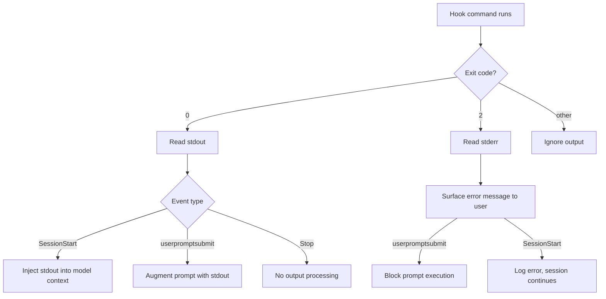
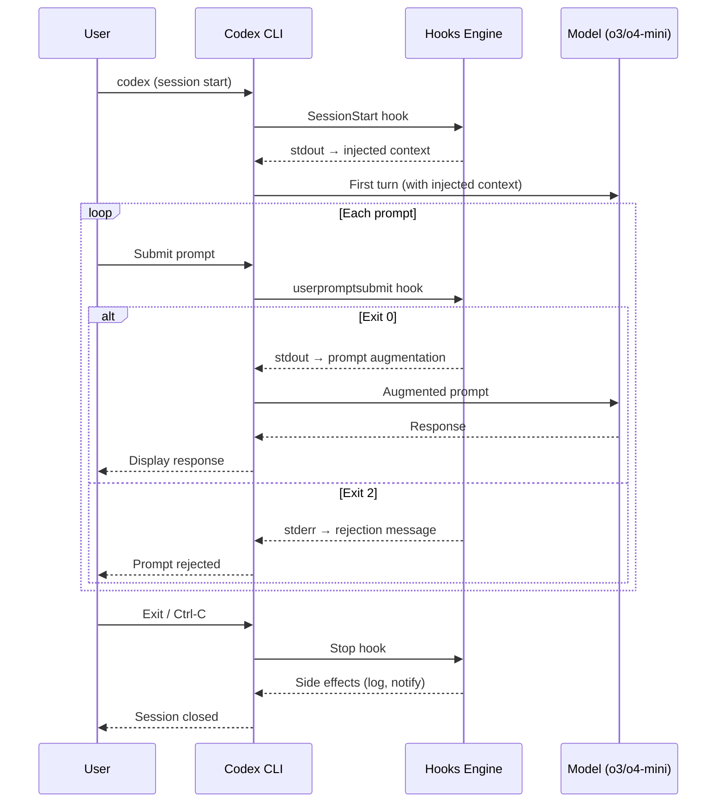

# Codex CLI Hooks Deep Dive: SessionStart, Stop and userpromptsubmit


---

Codex CLI gained an experimental hooks engine in v0.114.0 (March 2026), introducing shell-command callbacks at key session lifecycle points.[^1] Three hook events are currently available: `SessionStart`, `Stop`, and `userpromptsubmit`. They allow you to inject dynamic context, react to session boundaries, and intercept or block user prompts — all without modifying AGENTS.md or relying on the model to take initiative.

This article documents the configuration format, exit-code protocol, and practical patterns for each event. All three hooks remain experimental; the interface may change between minor releases.

---

## Enabling the Hooks Engine

Hooks are gated behind a feature flag. Pass it on the command line or set it in `.codex/config.toml`:[^2]

```bash
# ad-hoc
codex -c features.codex_hooks=true

# persistent (add to .codex/config.toml)
[features]
codex_hooks = true
```

Once enabled, Codex reads `.codex/hooks.json` from the project root (or the global config directory). The file is hot-read on session start; you do not need to restart after editing it.

---

## Configuration Format

Hooks are defined in `.codex/hooks.json`. The top-level structure is a `hooks` object keyed by event name. Each event maps to an array of hook groups; each group contains a `hooks` array of individual hook objects:[^3]

```json
{
  "hooks": {
    "SessionStart": [
      {
        "hooks": [
          {
            "type": "command",
            "command": "bash ~/.codex/scripts/inject-context.sh",
            "statusMessage": "Loading project context…",
            "timeout": 15
          }
        ]
      }
    ],
    "Stop": [
      {
        "hooks": [
          {
            "type": "command",
            "command": "echo 'Session complete' >> /tmp/codex-audit.log",
            "statusMessage": "Finalising session…",
            "timeout": 5
          }
        ]
      }
    ]
  }
}
```

### Hook Object Fields

| Field | Type | Description |
|---|---|---|
| `type` | string | Currently only `"command"` is supported |
| `command` | string | Shell command string executed by `/bin/sh -c` |
| `statusMessage` | string | User-facing text shown in the TUI during execution |
| `timeout` | integer | Maximum wall-clock seconds before the hook is killed |

Hooks run **synchronously** by default; the session does not proceed until the hook command exits.[^3] There is no native async mode as of v0.116.0 — a requested community feature.[^4]

---

## Exit Code Protocol

Codex interprets hook exit codes as follows:

| Exit code | Meaning |
|---|---|
| `0` | Success — stdout is processed per-event rules |
| `2` | Blocking error — stderr is surfaced as an error message; behaviour varies by event |
| Other | Treated as non-blocking; hook output is ignored |

For `SessionStart`, stdout written by the command is injected verbatim into the model's context before the first turn. For `userpromptsubmit`, exit code `2` causes the prompt to be rejected and the user to be shown the hook's stderr output.[^5]



---

## SessionStart

### When It Fires

`SessionStart` executes **once**, before the model processes any user input. It is ideal for injecting dynamic context that would otherwise be stale if baked into AGENTS.md — git branch, open issue count, last deployment time, environment variables, or the output of any script.[^1]

### Stdout Injection

Anything the hook writes to stdout is added to the model's context as if it had been prepended to the conversation. Keep this output structured and concise; large injections slow time-to-first-token and consume context window.[^5]

### Practical Example: Inject Branch and Ticket Context

```bash
#!/usr/bin/env bash
# ~/.codex/scripts/inject-context.sh
BRANCH=$(git rev-parse --abbrev-ref HEAD 2>/dev/null || echo "unknown")
TICKET=$(echo "$BRANCH" | grep -oE '[A-Z]+-[0-9]+' | head -1)
DIRTY=$(git status --porcelain 2>/dev/null | wc -l | tr -d ' ')

echo "## Session Context"
echo "- Branch: $BRANCH"
echo "- Jira ticket: ${TICKET:-none detected}"
echo "- Uncommitted files: $DIRTY"
if [ -f ".codex/project-notes.md" ]; then
  echo ""
  cat .codex/project-notes.md
fi
```

Wire it in `hooks.json`:

```json
{
  "hooks": {
    "SessionStart": [
      {
        "hooks": [
          {
            "type": "command",
            "command": "bash ~/.codex/scripts/inject-context.sh",
            "statusMessage": "Loading branch context…",
            "timeout": 10
          }
        ]
      }
    ]
  }
}
```

### Compact / Resume Behaviour

⚠️ As of v0.116.0, Codex CLI does not expose the `source` field (seen in Claude Code's `SessionStart`) that distinguishes `startup` from `resume` or `compact` triggers. Whether `SessionStart` re-fires after `/clear` or context compaction is not clearly documented in the official changelog. Treat this behaviour as unverified and test in your environment before relying on it.[^1][^4]

---

## Stop

### When It Fires

`Stop` fires when a session ends — the user exits the TUI or the process terminates. v0.115.0 refined `stop_hook_active` mechanics, adding internal state tracking to prevent the hook from running when a session is already in teardown.[^6]

`Stop` is suited for:

- Logging session completion to an audit trail
- Playing a sound notification (a popular community use case)
- Posting a webhook notification to a Slack channel or CI system

### Notification Example (macOS)

```json
{
  "hooks": {
    "Stop": [
      {
        "hooks": [
          {
            "type": "command",
            "command": "afplay /System/Library/Sounds/Glass.aiff",
            "statusMessage": "Session ended",
            "timeout": 5
          }
        ]
      }
    ]
  }
}
```

### Notification Example (Linux — notify-send)

```json
{
  "hooks": {
    "Stop": [
      {
        "hooks": [
          {
            "type": "command",
            "command": "notify-send 'Codex' 'Session complete'",
            "statusMessage": "Notifying…",
            "timeout": 5
          }
        ]
      }
    ]
  }
}
```

`Stop` hook stdout is **not** injected into the model context — the session is ending so there is nothing to inject into. Exit code `2` logs an error but does not block teardown.[^3]

---

## userpromptsubmit

### When It Fires

`userpromptsubmit` fires **after the user submits a prompt but before the model processes it**, and crucially before the prompt enters the session history.[^7] This makes it the right place for:

- Blocking prompts that violate a policy (e.g., requests to commit directly to `main`)
- Augmenting prompts with boilerplate the user should not have to type every time
- Logging prompts to a compliance audit log

### Augmenting Prompts (Exit 0 + Stdout)

When the hook exits `0`, any text written to stdout is appended to the user's prompt as additional context:[^5]

```bash
#!/usr/bin/env bash
# Append current test suite status to every prompt
FAILING=$(python -m pytest --tb=no -q 2>&1 | tail -3)
if [ -n "$FAILING" ]; then
  echo ""
  echo "### Current test status"
  echo "$FAILING"
fi
```

```json
{
  "hooks": {
    "userpromptsubmit": [
      {
        "hooks": [
          {
            "type": "command",
            "command": "bash ~/.codex/scripts/append-test-status.sh",
            "statusMessage": "Checking test status…",
            "timeout": 30
          }
        ]
      }
    ]
  }
}
```

### Blocking Prompts (Exit 2 + Stderr)

Exit code `2` rejects the prompt entirely. Write your rejection message to stderr; Codex surfaces it to the user:[^5]

```bash
#!/usr/bin/env bash
# Block prompts that mention pushing to main
if echo "$CODEX_PROMPT" 2>/dev/null | grep -qi 'push.*main\|force.push\|--force'; then
  echo "Prompt blocked: direct push to main is prohibited. Open a PR instead." >&2
  exit 2
fi
```

⚠️ Whether the user's original prompt text is available as an environment variable (e.g. `$CODEX_PROMPT`) is not confirmed in the official documentation as of v0.116.0. The mechanism for passing prompt content to the hook command is not explicitly documented.[^7] Community implementations have used stdin or temp-file approaches — test against your installed version.

---

## Combining All Three Hooks

A production-ready `hooks.json` combining all three events:

```json
{
  "hooks": {
    "SessionStart": [
      {
        "hooks": [
          {
            "type": "command",
            "command": "bash ~/.codex/scripts/inject-context.sh",
            "statusMessage": "Loading context…",
            "timeout": 15
          }
        ]
      }
    ],
    "Stop": [
      {
        "hooks": [
          {
            "type": "command",
            "command": "bash ~/.codex/scripts/on-stop.sh",
            "statusMessage": "Wrapping up…",
            "timeout": 10
          }
        ]
      }
    ],
    "userpromptsubmit": [
      {
        "hooks": [
          {
            "type": "command",
            "command": "bash ~/.codex/scripts/prompt-policy.sh",
            "statusMessage": "Checking policy…",
            "timeout": 5
          }
        ]
      }
    ]
  }
}
```

### Session Lifecycle with All Hooks Active



---

## What Hooks Cannot Yet Do (as of v0.116.0)

The current hooks engine deliberately covers lifecycle boundaries only. Notably absent compared to Claude Code's hook model:

- **No `PreToolUse` / `PostToolUse`** — you cannot inspect or block individual file writes or shell commands at the hook layer. Use sandbox approval modes instead.[^4]
- **No async hooks** — all hooks block the session until they complete; long-running scripts will delay the user experience.[^4]
- **No matcher expressions** — every registered hook fires for every matching event; there is no pattern-based filtering per hook entry.[^3]

Community discussion around expanding the hook surface (pre-tool blocking, async execution) is active in the GitHub Discussions.[^4]

> **Update — v0.117.0 alpha (March 2026):** Two new hook events are landing: `AfterToolUse` (fires after each individual tool call) and `AfterAgent` (fires after the agent completes a turn). These address the most-requested gap: `AfterToolUse` in particular enables "test on every save" patterns where the agent auto-runs the test suite after each file write. The hook configuration format changes slightly in v0.117.0 — hooks are defined as `[[hooks]]` TOML array entries with an `event` field, rather than the JSON format shown above. Watch the changelog for stable release details before migrating.[^7]

---

## Summary

| Event | Stable? | Fires when | Stdout effect | Exit 2 effect |
|---|---|---|---|---|
| `SessionStart` | Experimental | Session opens | Injected into model context | Error logged; session continues |
| `Stop` | Experimental | Session closes | None | Error logged; teardown continues |
| `userpromptsubmit` | Experimental | Before prompt is processed | Appended to prompt | Prompt rejected; user shown stderr |

Hooks are a lightweight, shell-native extension point that rewards existing automation skills. They complement AGENTS.md (declarative context) and sandbox modes (execution control) rather than replacing them — think of them as the event loop your Codex setup was previously missing.

---

## Citations

[^1]: OpenAI Codex CLI v0.114.0 release — "Added an experimental hooks engine with `SessionStart` and `Stop` hook events." (PR #13276, 2026-03-13). [https://developers.openai.com/codex/changelog](https://developers.openai.com/codex/changelog)

[^2]: Codex CLI feature flags via `-c key=value`. Demonstrated in `codex-cli-hooks` community repository. [https://github.com/shanraisshan/codex-cli-hooks](https://github.com/shanraisshan/codex-cli-hooks)

[^3]: `hooks.json` configuration format, hook object fields, and synchronous execution behaviour. From community discussion and the `codex-cli-hooks` repository. [https://github.com/openai/codex/discussions/2150](https://github.com/openai/codex/discussions/2150)

[^4]: Community discussion on async hooks, expanded hook events, and missing `PreToolUse` / `PostToolUse`. [https://github.com/openai/codex/discussions/2150](https://github.com/openai/codex/discussions/2150)

[^5]: Exit-code protocol and stdout injection behaviour for `SessionStart` and `userpromptsubmit`. Documented in Codex CLI Definitive Technical Reference. [https://blakecrosley.com/guides/codex](https://blakecrosley.com/guides/codex)

[^6]: OpenAI Codex CLI v0.115.0 — "Stop continuation & stop_hook_active mechanics" (PR #14532, 2026-03-16). [https://releasebot.io/updates/openai/codex](https://releasebot.io/updates/openai/codex)

[^7]: OpenAI Codex CLI v0.116.0 — "Added a `userpromptsubmit` hook so prompts can be blocked or augmented before execution and before they enter history." (PR #14626, 2026-03-19). [https://developers.openai.com/codex/changelog](https://developers.openai.com/codex/changelog)
