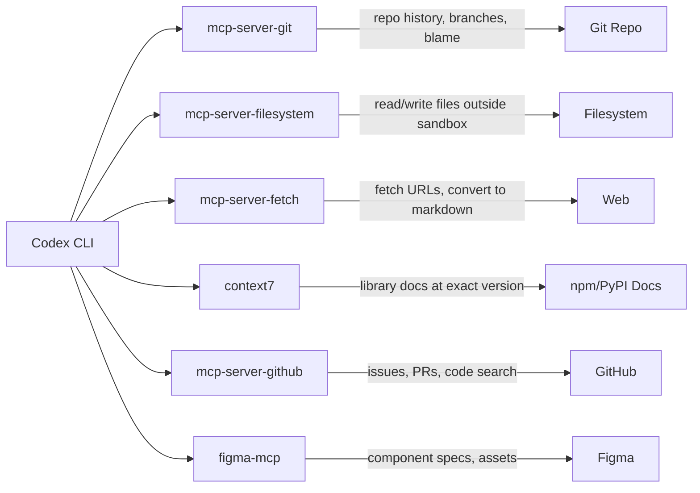

# Codex CLI MCP Integration: Connecting Agents to External Tools


---

There is a pattern I have noticed across thirty years of software infrastructure decisions. A powerful tool ships with a clean interface. Then someone asks: can it talk to the thing over there? And then someone else asks about the thing over there after that. Before long, you have a proliferation of point-to-point integrations, each bespoke, each brittle, each someone's weekend to maintain.

Model Context Protocol is the answer to that question for AI agents — not a new integration, but a shared language for integrations. Codex CLI adopted it early, and the mechanism has matured enough now to be worth understanding properly.

---

## What MCP Is, and Why It Matters Here

MCP is an open protocol that lets AI agents communicate with external tools and data sources through a standardised interface. Think of it as USB-C for agent capabilities — instead of each tool requiring its own bespoke wiring, an MCP server exposes tools, resources, and prompts through a common protocol, and any compliant client (Codex, Claude Code, Cursor, and a growing list of others) can consume them without custom code.[^1]

For Codex CLI, this means one thing practically: you can give your agent access to your Jira board, your GitHub repositories, your internal documentation, your Figma designs, or any other system — without hacking the agent itself. The capability lives in the MCP server; the agent's job is to decide when to call it.

---

## Configuring MCP Servers in Codex

All MCP configuration lives in `config.toml`. The file exists at three levels, following the standard Codex precedence chain:

```
/etc/codex/config.toml        # system-wide (enterprise policy)
~/.codex/config.toml          # user-global
.codex/config.toml            # project-level
```

Each level overrides the one above it. Project-level config is the right place for servers that only apply to one codebase; user-global is right for servers you want everywhere.

### Stdio Transport (Most Common)

Stdio is the default transport — the MCP server runs as a child process, communicating via stdin/stdout. This covers most community MCP servers:

```toml
[mcp_servers.context7]
enabled = true
required = true
command = "npx"
args = ["-y", "@upstash/context7-mcp"]

[mcp_servers.filesystem]
enabled = true
command = "npx"
args = ["-y", "@modelcontextprotocol/server-filesystem", "/Users/daniel/projects"]
```

The `required = true` field causes Codex to fail at startup if the server cannot be contacted. Use this for servers your workflow genuinely cannot function without.

### HTTP Transport (Remote Servers)

For remote MCP servers — internal services, third-party APIs — use the `url` field:

```toml
[mcp_servers.figma]
enabled = true
url = "https://mcp.figma.com/mcp"
bearer_token_env_var = "FIGMA_OAUTH_TOKEN"
```

The `bearer_token_env_var` field tells Codex which environment variable holds the OAuth token. The value is never written to config — it stays in your environment.[^2]

### Restricting Tool Exposure

You do not have to expose every tool a server provides. The `enabled_tools` field narrows what the agent can see:

```toml
[mcp_servers.github]
enabled = true
command = "npx"
args = ["-y", "@modelcontextprotocol/server-github"]
env = { "GITHUB_PERSONAL_ACCESS_TOKEN" = "${GITHUB_TOKEN}" }
enabled_tools = ["create_issue", "list_issues", "get_file_contents"]
```

This matters for two reasons. First, it limits blast radius — an agent that cannot call `delete_repository` cannot delete your repository. Second, it reduces cognitive load on the model; a shorter tool list means better tool selection.[^3]

---

## CLI Management

The `codex mcp` subcommand handles server lifecycle without touching the config file directly:

```bash
# Add a server (writes to user config)
codex mcp add context7 -- npx -y @upstash/context7-mcp

# List configured servers and their status
codex mcp list

# OAuth login flow for HTTP servers
codex mcp login figma

# Remove a server
codex mcp remove context7
```

The `codex mcp list` command is particularly useful when debugging — it shows which servers are enabled, which are connected, and which failed to start. Always run it before blaming the agent for not using a tool.

---

## Useful Servers for Engineering Workflows

A few servers worth knowing:



| Server | Install | Best for |
|--------|---------|----------|
| `@modelcontextprotocol/server-git` | `npx -y` | Repo history, blame, branch diffs |
| `@modelcontextprotocol/server-filesystem` | `npx -y` | Reading/writing files outside sandbox path |
| `@modelcontextprotocol/server-fetch` | `npx -y` | Fetching URLs, reading documentation pages |
| `@upstash/context7-mcp` | `npx -y` | Library docs at the *exact* installed version |
| `@modelcontextprotocol/server-github` | `npx -y` | Issues, PRs, code search, file contents |
| Figma MCP | `https://mcp.figma.com/mcp` | Component specs, design tokens, assets |

Context7 deserves particular attention: it resolves documentation against your actual installed version of a library rather than returning whatever the model was trained on. For any project that pins dependencies tightly, this closes a common source of hallucinated API calls.[^4]

---

## Scoping Servers to Projects

One pattern that scales well in teams: commit project-specific MCP config to the repository alongside `AGENTS.md`. When a new engineer clones the repo and runs Codex, the right servers are already configured:

```
my-project/
├── AGENTS.md
└── .codex/
    ├── config.toml      # project MCP servers
    └── hooks.json       # project hooks
```

`.codex/config.toml` at project level is merged on top of the user's global config. Servers defined here are additive — they do not replace global servers. This means each developer can have their own global tools (a personal notes server, say) without those appearing in the project's CI runs, which only see what is committed.[^2]

---

## MCP in CI/CD

In non-interactive mode (`codex exec`), MCP servers start and stop alongside the agent session. Your CI pipeline gets the same tool access as interactive development:

```yaml
# .github/workflows/codex-review.yml
- name: Run Codex code review
  uses: openai/codex-action@v1
  with:
    openai-api-key: ${{ secrets.OPENAI_API_KEY }}
    prompt: "Review the changes in this PR against our coding standards"
    sandbox: workspace-write
  env:
    GITHUB_TOKEN: ${{ secrets.GITHUB_TOKEN }}
```

The GitHub MCP server, if configured in `.codex/config.toml`, will be available to the agent running inside the action. This lets the agent fetch PR context, check open issues, or update comments — without any special integration beyond the MCP config that is already committed to the repository.[^5]

---

## Enterprise: Restricting and Whitelisting Servers

In regulated environments, the system-level `/etc/codex/requirements.toml` can specify which MCP servers are permitted:

```toml
# /etc/codex/requirements.toml — enforced after all other config
[mcp]
allowed_servers = ["internal-jira", "internal-confluence"]
block_external_http = true
```

With `block_external_http = true`, HTTP MCP servers pointing to external URLs will be disabled regardless of what users configure. Stdio servers using locally installed binaries are still permitted. This is the right boundary for a team that wants to allow agent tooling without allowing arbitrary outbound connections.[^2]

---

## Improved MCP Tool Elicitation in v0.117.0

The v0.117.0 alpha series (in active development as of March 2026) includes improved MCP tool elicitation — better UX for cases where the agent needs to select between many available tools, and cleaner prompting when a tool requires user input.[^6] This addresses a common frustration where agents with large MCP tool sets would make poor selection decisions or stall on ambiguous tool signatures.

Also landing in v0.117.0: **MCP tool call span instrumentation** — distributed tracing for MCP calls. Each tool invocation gets a span ID, making it possible to trace agent decisions through your observability stack alongside application telemetry.[^6]

---

## What to Actually Start With

The longer I work in software, the more I notice that the tools people reach for when starting are not the tools they end up relying on. The temptation with MCP is to add everything at once — connect all the things, give the agent maximum context, and see what happens.

The agents that work well in practice are the ones with tight tool sets. Start with one server that removes a bottleneck you actually feel. For most codebases that is either `context7` (documentation) or the GitHub MCP server (PR context). Add the next one when you notice the agent reaching for something it cannot find.

The protocol is not the hard part. Deciding what the agent should be able to touch — that is the design problem worth thinking about.

---

## Citations

[^1]: Model Context Protocol overview. [https://modelcontextprotocol.io](https://modelcontextprotocol.io)

[^2]: Codex CLI MCP configuration reference — `config.toml` format, precedence, `enabled_tools`, HTTP transport, enterprise `requirements.toml`. [https://blakecrosley.com/guides/codex](https://blakecrosley.com/guides/codex)

[^3]: MCP tool restriction patterns and cognitive load considerations. Community discussion. [https://github.com/openai/codex/discussions](https://github.com/openai/codex/discussions)

[^4]: Context7 MCP server — library docs at installed version. [https://github.com/upstash/context7](https://github.com/upstash/context7)

[^5]: `openai/codex-action` GitHub Action — official action for CI/CD integration. [https://github.com/openai/codex-action](https://github.com/openai/codex-action)

[^6]: Codex CLI v0.117.0-alpha changelog — MCP tool elicitation improvements and span instrumentation. [https://github.com/openai/codex/releases](https://github.com/openai/codex/releases)
