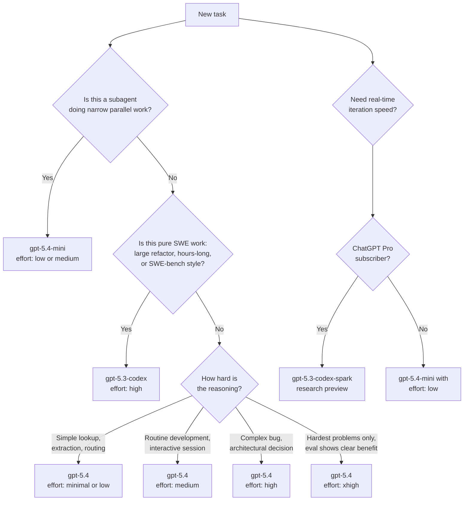

# Model Selection in Codex CLI: Current Models and When to Use Each

**Research date:** 2026-03-26

---

## Overview

Codex CLI exposes model selection as a first-class concern. You can specify a model on the command line for a single invocation, set a persistent default in `config.toml`, define named profiles for different workflows, and configure subagents to use different (usually cheaper) models than the orchestrating session. This article documents the current model roster, how each is configured, and how to match models and reasoning effort levels to task types.

---

## The Model Roster (March 2026)

Four models are currently available in Codex CLI. They are documented at [developers.openai.com/codex/models](https://developers.openai.com/codex/models).

| Model ID | Role | Max effort | Quota cost |
|---|---|---|---|
| `gpt-5.4` | Flagship: coding + reasoning + agentic workflows | `xhigh` | 100% (baseline) |
| `gpt-5.4-mini` | Fast, efficient: subagents and lighter tasks | `high` | ~30% of `gpt-5.4` |
| `gpt-5.3-codex` | Specialist: deep software engineering only | `xhigh` | — |
| `gpt-5.3-codex-spark` | Real-time iteration (research preview, Pro only) | — | — |

**Default model:** If you do not specify a model in config or on the command line, Codex defaults to a recommended model — currently `gpt-5.4`.

**Quota note:** `gpt-5.4-mini` uses approximately 30% as much of your included limits as `gpt-5.4`. Equivalent work lasts roughly 3.3× longer before you exhaust subscription quotas. Source: [developers.openai.com/codex/models](https://developers.openai.com/codex/models).

---

## How to Set the Model

### CLI Flag: `--model` / `-m`

Pass the model ID as a flag to override whatever is set in your configuration for one invocation:

```bash
codex --model gpt-5.4-mini "search this codebase for all usages of the deprecated API"
codex -m gpt-5.3-codex "refactor the authentication module to use OAuth2"
```

The flag is documented in the [CLI reference](https://developers.openai.com/codex/cli/reference) as:

> `--model, -m <string>` — Override the model set in configuration (for example `gpt-5-codex`)

### Config Override: `--config` / `-c`

The `--config` flag accepts arbitrary `key=value` pairs that override `config.toml` settings for one session:

```bash
codex -c model_reasoning_effort="high" "find and fix the memory leak in the worker pool"
```

This is equivalent to temporarily editing `model_reasoning_effort` in your config file without actually changing it.

### In-Session: `/model` Slash Command

During an interactive Codex session, switch models without restarting:

```
/model gpt-5.4-mini
```

The `/model` and `/reasoning` slash commands were added in the March 18, 2026 changelog entry. Source: [developers.openai.com/codex/changelog](https://developers.openai.com/codex/changelog).

### Persistent Default: `config.toml`

Set your model preference permanently in `~/.codex/config.toml`:

```toml
model = "gpt-5.4"
model_reasoning_effort = "medium"
```

Codex resolves configuration in this priority order (highest first):

1. CLI flags and `--config` overrides
2. Active profile values (`--profile <name>`)
3. Project config (`.codex/config.toml` in the current or parent directory)
4. User config (`~/.codex/config.toml`)
5. System config (`/etc/codex/config.toml` on Unix)
6. Built-in defaults

Source: [developers.openai.com/codex/config-basic](https://developers.openai.com/codex/config-basic).

---

## Model Reference

### `gpt-5.4` — The Recommended Default

`gpt-5.4` is OpenAI's flagship model for Codex. It combines the coding capability of `gpt-5.3-codex` with stronger general reasoning, native computer use, and broader agentic workflow support. It is the recommended starting point for any task you have not specifically profiled.

**Supported effort levels:** `minimal`, `low`, `medium`, `high`, `xhigh`
**Default effort level:** `none` (the model defaults to no extended reasoning unless you specify otherwise)

Key characteristics:

- Handles planning, coordination, and final judgment in multi-agent workflows
- Supports function calling, structured outputs, streaming, and prompt caching via the Responses API
- The only model that supports `xhigh` reasoning effort among the current lineup (apart from `gpt-5.3-codex`)
- Well-suited as the orchestrator in an orchestrator/worker subagent pattern

**When to use `gpt-5.4`:**

- Interactive development sessions (your daily driver)
- Tasks requiring both coding depth and reasoning (e.g., debugging with unknown root cause)
- Orchestrating subagent workflows where final judgment matters
- Any task that does not fit a more specialised model

### `gpt-5.4-mini` — The Subagent Workhorse

`gpt-5.4-mini` was introduced in Codex v0.115.0 (released March 17, 2026). It is purpose-built for parallelisable, lower-complexity work where speed and quota efficiency are the priority. Source: [developers.openai.com/codex/changelog](https://developers.openai.com/codex/changelog).

**Supported effort levels:** `minimal`, `low`, `medium`, `high`
**Maximum effort level:** `high` — `xhigh` is not supported
**Quota cost:** ~30% of `gpt-5.4`
**Speed:** More than 2× faster than `gpt-5.4` for comparable tasks

Key characteristics:

- Outperforms `gpt-5-mini` across coding, reasoning, image understanding, and tool use
- Does not support `xhigh` reasoning effort
- Accessible via the Codex app, CLI, IDE extension, web interface, and the API

**Recommended use cases (from official documentation):**

- Codebase exploration and search
- Large-file review
- Processing supporting documents
- Parallel subagent work where each subagent handles a narrow, bounded subtask

**Economics insight:** Five parallel `gpt-5.4-mini` subagents consume approximately the same quota as 1.5 `gpt-5.4` queries. This makes wide fan-out agentic patterns practical at normal subscription tiers.

**When to use `gpt-5.4-mini`:**

- As a subagent worker under a `gpt-5.4` orchestrator
- Exploratory sessions where you want fast iteration without burning quota
- Any task where the subtask is bounded and does not require deep architectural reasoning

### `gpt-5.3-codex` — The Software Engineering Specialist

`gpt-5.3-codex` is OpenAI's specialist coding model. It was the industry-leading coding model before `gpt-5.4` incorporated its capabilities, and remains available for workloads that specifically need maximum coding depth.

**Supported effort levels:** `low`, `medium`, `high`, `xhigh`
**API:** Responses API only (Chat Completions API support is deprecated for new Codex releases)

Key characteristics:

- Supports the full effort range including `xhigh`
- Supports function calling, structured outputs, streaming, and prompt caching
- Designed specifically for complex software engineering — not general-purpose tasks

**When to use `gpt-5.3-codex` over `gpt-5.4`:**

- Extended autonomous engineering runs (hours-long, SWE-bench–style tasks)
- Large-scale refactors spanning many files
- Tasks where coding depth is the single bottleneck and broader reasoning is not needed

**Known issue:** A reported desktop app bug (v0.112.0) causes the model selector to revert to `gpt-5.3-codex` within approximately one second of selecting any other model. The CLI is unaffected — it reads directly from `config.toml`. Source: [github.com/openai/codex/issues/14008](https://github.com/openai/codex/issues/14008).

### `gpt-5.3-codex-spark` — Research Preview

`gpt-5.3-codex-spark` is a text-only model optimised for near-instant, real-time coding iteration. It is **currently restricted to ChatGPT Pro subscribers** and is not generally available to all Codex CLI users as of March 2026.

**Availability:** Research preview, Pro only
**Optimised for:** Speed — the lowest-latency coding iteration in the current lineup

When it reaches general availability, it will enable a qualitatively different interaction pattern for fast iteration loops. Track the changelog at [developers.openai.com/codex/changelog](https://developers.openai.com/codex/changelog) for its GA announcement.

---

## Reasoning Effort Levels

The `model_reasoning_effort` configuration key (and `reasoning.effort` in the API) controls how many tokens the model spends reasoning before generating a response. Lower effort reduces latency and cost; higher effort increases thoroughness at the cost of speed.

### Valid Values

According to the [configuration reference](https://developers.openai.com/codex/config-reference) and [reasoning guide](https://developers.openai.com/api/docs/guides/reasoning):

```
minimal | low | medium | high | xhigh
```

There is also a model-specific `none` value (supported by some newer models, primarily relevant to `plan_mode_reasoning_effort`). Not all values are supported by every model — check the model-specific documentation.

**Model support matrix:**

| Effort level | `gpt-5.4` | `gpt-5.4-mini` | `gpt-5.3-codex` |
|---|---|---|---|
| `minimal` | Yes | Yes | — |
| `low` | Yes | Yes | Yes |
| `medium` | Yes | Yes | Yes |
| `high` | Yes | Yes | Yes |
| `xhigh` | Yes | **No** | Yes |

### What Each Level Does

The effort parameter controls how extensively the model reasons before responding. The official guidance (source: [developers.openai.com/api/docs/guides/reasoning](https://developers.openai.com/api/docs/guides/reasoning)) characterises each level as follows:

**`minimal`**
The fastest setting, consuming the fewest reasoning tokens. Use for tasks where reasoning depth does not affect quality: extraction, routing, simple transforms, and lookups.

**`low`**
A small amount of additional thinking. Appropriate for simple tasks where modest reasoning can improve reliability without material latency increases.

**`medium`** (recommended default)
The general-purpose level. OpenAI recommends `medium` as the balanced setting for interactive coding work. Good for most routine development tasks.

**`high`**
More thorough reasoning. Suitable for complex bug investigation, architectural decisions, code review requiring synthesised judgment, or planning a multi-step refactor.

**`xhigh`**
Maximum reasoning depth. The model thinks extensively before responding. Noticeably slower and more expensive. The official recommendation is to use `xhigh` only when evaluation data shows a clear benefit that justifies the extra latency and cost. Not supported by `gpt-5.4-mini`.

### Setting Reasoning Effort

In `config.toml` (persistent default):

```toml
model = "gpt-5.4"
model_reasoning_effort = "medium"
```

Per-session override via `--config`:

```bash
codex -c model_reasoning_effort="xhigh" "trace the root cause of this deadlock"
```

Plan-mode-specific override (does not affect regular sessions):

```toml
plan_mode_reasoning_effort = "high"
```

The `plan_mode_reasoning_effort` key overrides the effort level used specifically during Plan mode. When unset, Plan mode uses its built-in default (`medium`). Setting it to `none` means "no reasoning in plan mode", not "inherit the global setting".

### The Automations Caveat

A known issue ([github.com/openai/codex/issues/13536](https://github.com/openai/codex/issues/13536)) reports that Codex automation runs (scheduled tasks) use `medium` reasoning effort even when the global `model_reasoning_effort` is set to `xhigh`. Automation definition files currently support `schedule`, `prompt`, and `cwd` fields but not a `reasoning` field. If you depend on higher effort for automated workflows, verify that your automation output meets quality expectations under `medium` effort or monitor this issue for a fix.

---

## Persistent Configuration: `config.toml`

### File Locations

| Scope | Path | Notes |
|---|---|---|
| User (global) | `~/.codex/config.toml` | Personal defaults, applies to all sessions |
| Project | `.codex/config.toml` | Per-repo overrides, only loaded in trusted projects |
| System | `/etc/codex/config.toml` | Unix only, lowest priority above built-in defaults |

Project config files are only loaded in **trusted projects** for security. Untrusted projects fall back to user, system, and built-in defaults.

### Minimal Model Configuration

```toml
# ~/.codex/config.toml

# Primary model
model = "gpt-5.4"

# Reasoning effort: minimal | low | medium | high | xhigh
model_reasoning_effort = "medium"
```

### Full Model Configuration Block

```toml
# ~/.codex/config.toml

# Core model selection
model = "gpt-5.4"
model_provider = "openai"                   # provider ID

# Reasoning
model_reasoning_effort = "medium"           # minimal | low | medium | high | xhigh
plan_mode_reasoning_effort = "high"         # plan-mode override
model_reasoning_summary = "concise"         # auto | concise | detailed | none

# Verbosity (GPT-5 Responses API)
model_verbosity = "medium"                  # low | medium | high

# Context limits
model_context_window = 200000               # token count for active model
model_auto_compact_token_limit = 160000     # auto-compact history above this threshold

# Subagent limits
[agents]
max_threads = 6                             # max concurrent subagent threads
max_depth = 1                               # max nested spawn depth (0 = root)
```

---

## Named Profiles

Profiles let you define named configuration presets and switch between them with `--profile <name>`. They are documented in [Advanced Configuration](https://developers.openai.com/codex/config-advanced).

**Note:** Profiles are currently experimental and may change or be removed in future releases. They are not currently supported in the Codex IDE extension.

### Example Profile Configuration

```toml
# ~/.codex/config.toml

# Active profile (optional — omit to use top-level settings as default)
profile = "daily"

[profiles.daily]
model = "gpt-5.4"
model_reasoning_effort = "medium"
approval_policy = "on-request"
sandbox_mode = "workspace-write"

[profiles.deep]
model = "gpt-5.4"
model_reasoning_effort = "xhigh"
approval_policy = "on-request"
sandbox_mode = "workspace-write"

[profiles.quick]
model = "gpt-5.4-mini"
model_reasoning_effort = "low"
approval_policy = "never"
sandbox_mode = "read-only"

[profiles.swe-bench]
model = "gpt-5.3-codex"
model_reasoning_effort = "high"
approval_policy = "never"
sandbox_mode = "danger-full-access"
```

Switch profiles on invocation:

```bash
codex --profile deep "find and fix all uses of deprecated APIs across the codebase"
codex --profile quick "what does this function return?"
codex --profile swe-bench "implement the RFC-defined behaviour for this edge case"
```

---

## Subagent Model Configuration

### Architecture: Orchestrator / Worker Pattern

The recommended pattern for multi-agent Codex workflows is:

- **Orchestrator** runs on `gpt-5.4` — handles planning, coordination, and final judgment
- **Workers** run on `gpt-5.4-mini` — handle narrow, parallelisable subtasks

This matches the quota economics: five parallel `gpt-5.4-mini` workers use roughly the same quota as 1.5 `gpt-5.4` queries, making wide fan-out practical.

### Defining Custom Agents

Custom agents are defined as individual TOML files. Place them in:

- `~/.codex/agents/` for personal agents (available in all sessions)
- `.codex/agents/` for project-scoped agents (available in that project)

Each file defines one agent. A minimal example:

```toml
# ~/.codex/agents/file-reviewer.toml

name = "file-reviewer"
description = "Reviews individual files for code quality, deprecated patterns, and obvious bugs. Works best on files under 1000 lines."
developer_instructions = """
You are a focused code reviewer. When given a file path, read the file, identify issues, and return a structured report. Do not edit files. Do not spawn additional agents.
"""

# Override the model for this agent — inherit from parent session if omitted
model = "gpt-5.4-mini"
model_reasoning_effort = "low"
sandbox_mode = "read-only"
```

**Fields that inherit from the parent session if omitted:**

- `model`
- `model_reasoning_effort`
- `sandbox_mode`
- `mcp_servers`
- `skills.config`

Source: [developers.openai.com/codex/subagents](https://developers.openai.com/codex/subagents).

### Built-in Agents

Codex ships with three built-in agents:

| Agent | Purpose |
|---|---|
| `default` | General-purpose fallback |
| `worker` | Execution-focused, for implementation tasks |
| `explorer` | Read-heavy, for codebase analysis |

Custom agents with the same name as a built-in agent take precedence.

### Global Subagent Settings

```toml
[agents]
max_threads = 6                     # max concurrent open agent threads (default: 6)
max_depth = 1                       # max nested spawn depth (default: 1)
job_max_runtime_seconds = 1800      # per-worker timeout for CSV batch jobs
```

**`max_depth` caution:** The default of `1` allows direct child agents to spawn but prevents deeper nesting. Increase this only if you specifically need recursive delegation — unbounded nesting depth can result in runaway token consumption.

---

## Decision Guide

The following flowchart covers the most common model selection decisions.



### Decision Table: Effort Level by Task Type

| Task type | Recommended model | Recommended effort |
|---|---|---|
| Quick lookup, grep, extraction | `gpt-5.4` | `minimal` |
| File search, codebase exploration (subagent) | `gpt-5.4-mini` | `low` |
| Routine feature implementation | `gpt-5.4` | `medium` |
| Code review of a PR | `gpt-5.4` | `medium` |
| Complex bug investigation | `gpt-5.4` | `high` |
| Architectural design or refactor planning | `gpt-5.4` | `high` |
| Large-scale multi-file refactor | `gpt-5.3-codex` | `high` |
| Hours-long autonomous engineering run | `gpt-5.3-codex` | `high` |
| Hardest problem where evals show `xhigh` benefit | `gpt-5.4` or `gpt-5.3-codex` | `xhigh` |

---

## Real-World Recommendations

### Interactive Daily Development

```toml
model = "gpt-5.4"
model_reasoning_effort = "medium"
```

This is the baseline for most developers. `medium` effort on `gpt-5.4` provides the best balance of response quality and latency for routine coding work. Override to `high` when you hit a genuinely difficult problem.

### Quota-Conscious Teams

If you are working within a shared subscription or want to extend your monthly quota, use `gpt-5.4-mini` for exploratory work:

```bash
# Explore the codebase, understand structure
codex --model gpt-5.4-mini "give me an overview of the authentication flow in this codebase"

# Switch to gpt-5.4 for the actual implementation decision
codex --model gpt-5.4 "now implement the session expiry feature we just mapped out"
```

### Long-Running Automated Tasks

For automation runs (scheduled tasks), be aware of the known issue where `model_reasoning_effort = "xhigh"` in the global config does not propagate to automation sessions (they run at `medium`). Either design your automation prompts to work well at `medium` effort, or track [github.com/openai/codex/issues/13536](https://github.com/openai/codex/issues/13536) for when per-automation reasoning config is available.

For autonomous software engineering tasks that run for extended periods, prefer `gpt-5.3-codex` with `high` effort in a dedicated profile:

```bash
codex --profile swe-bench "implement all failing tests in the test suite"
```

### Multi-File Refactors

For large refactors, the orchestrator/worker pattern reduces quota consumption and speeds up the work:

1. Orchestrator (`gpt-5.4`, `medium` effort): Plans the refactor, identifies files, coordinates workers
2. Workers (`gpt-5.4-mini`, `low` effort): Each processes one file or one module independently
3. Orchestrator again: Reviews, resolves conflicts, handles edge cases

Define the worker agent once and reuse it:

```toml
# .codex/agents/refactor-worker.toml
name = "refactor-worker"
description = "Applies a single, well-defined refactor to one file. Takes exact instructions. Does not make judgment calls."
developer_instructions = "Apply the specified transformation to the specified file. Make only the changes described. Return a summary of what was changed."
model = "gpt-5.4-mini"
model_reasoning_effort = "low"
sandbox_mode = "workspace-write"
```

### Per-Project Configuration

For projects with different requirements, use project-scoped config:

```toml
# /path/to/project/.codex/config.toml
# Security-sensitive project: require approval for all commands
model = "gpt-5.4"
model_reasoning_effort = "high"
approval_policy = "untrusted"
sandbox_mode = "read-only"
```

```toml
# /path/to/prototype/.codex/config.toml
# Prototype project: move fast
model = "gpt-5.4-mini"
model_reasoning_effort = "low"
approval_policy = "never"
sandbox_mode = "workspace-write"
```

---

## Summary Reference

### CLI Flags

| Flag | Short | Purpose |
|---|---|---|
| `--model <id>` | `-m` | Override model for this invocation |
| `--config key=value` | `-c` | Override any config key for this invocation |
| `--profile <name>` | `-p` | Activate a named profile |

### Config Keys (model-related)

| Key | Type | Valid values | Default |
|---|---|---|---|
| `model` | string | Any valid model ID | `gpt-5.4` |
| `model_provider` | string | Provider ID | `openai` |
| `model_reasoning_effort` | string | `minimal \| low \| medium \| high \| xhigh` | `medium` |
| `plan_mode_reasoning_effort` | string | `none \| minimal \| low \| medium \| high \| xhigh` | unset (uses Plan preset) |
| `model_reasoning_summary` | string | `auto \| concise \| detailed \| none` | `auto` |
| `model_verbosity` | string | `low \| medium \| high` | `medium` |

### Model Quick Reference

| Model ID | Quota | Max effort | Best for |
|---|---|---|---|
| `gpt-5.4` | 100% | `xhigh` | Daily driver, orchestration, complex tasks |
| `gpt-5.4-mini` | ~30% | `high` | Subagents, exploration, quota-sensitive work |
| `gpt-5.3-codex` | — | `xhigh` | SWE-heavy tasks, long autonomous runs |
| `gpt-5.3-codex-spark` | — | — | Real-time iteration (Pro, research preview) |

---

## Sources

- [Models — Codex Developer Docs](https://developers.openai.com/codex/models)
- [Configuration Reference — Codex Developer Docs](https://developers.openai.com/codex/config-reference)
- [Config Basics — Codex Developer Docs](https://developers.openai.com/codex/config-basic)
- [Advanced Configuration — Codex Developer Docs](https://developers.openai.com/codex/config-advanced)
- [Sample Configuration — Codex Developer Docs](https://developers.openai.com/codex/config-sample)
- [CLI Reference: Command Line Options — Codex Developer Docs](https://developers.openai.com/codex/cli/reference)
- [Features — Codex CLI Developer Docs](https://developers.openai.com/codex/cli/features)
- [Subagents — Codex Developer Docs](https://developers.openai.com/codex/subagents)
- [Reasoning Models Guide — OpenAI API Docs](https://developers.openai.com/api/docs/guides/reasoning)
- [Changelog — Codex Developer Docs](https://developers.openai.com/codex/changelog)
- [Issue #13536: Automations run at medium reasoning even when global effort is xhigh](https://github.com/openai/codex/issues/13536)
- [Issue #14008: Model selection reverts to gpt-5.3-codex in desktop app](https://github.com/openai/codex/issues/14008)
