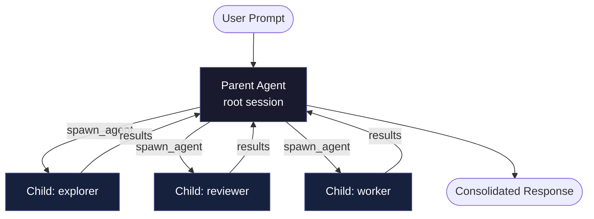
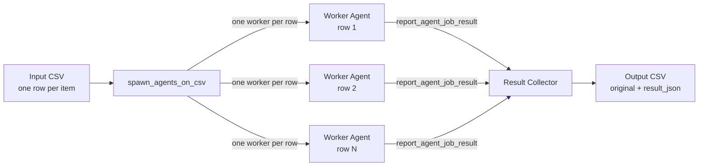

# Codex CLI Subagents: TOML Format, Parallelism and spawn_agents_on_csv


> Codex CLI's multi-agent system lets a single session delegate specialised work to parallel child agents. This article covers the TOML agent definition schema, the global concurrency knobs in `config.toml`, the `spawn_agents_on_csv` batch tool, and the practical constraints you need to understand before reaching for subagents in production.

---

## Why Subagents?

Large software tasks — exhaustive code review, batch refactoring across dozens of files, parallel exploration of competing implementation paths — hit a natural ceiling in single-agent mode. Context windows fill up, sequentialised tool calls stack latency, and a single reasoning chain struggles to hold diverse concerns simultaneously.

Codex CLI addresses this with a first-class multi-agent system that lets a parent session spawn child agents, route work to them, wait for results, and synthesise a consolidated response.[^1] The model drives the orchestration; the CLI runtime handles thread scheduling, approval forwarding, and result collection.

**Important caveat:** subagents are still marked experimental and consume tokens across every spawned thread. Each child performs its own model inference and tool invocations — there is no free parallelism here.[^2] Reach for them when the latency or context benefits outweigh the cost, not as a default.

---

## Enabling Multi-Agent Mode

Multi-agent support is off by default. Enable it either interactively — run `/experimental` inside a session and toggle **Enable Multi-agents** — or permanently via `config.toml`:[^3]

```toml
# ~/.codex/config.toml

[features]
multi_agent = true

[agents]
max_threads = 4        # concurrent open agent threads (default: 6)
max_depth   = 1        # nesting depth; 0 = root session only (default: 1)
job_max_runtime_seconds = 900  # per-worker timeout for CSV batch jobs (default: 1800)
```

`max_depth = 1` — the default — allows the root session to spawn direct children but prevents those children from spawning grandchildren. This is almost always the right setting for deterministic, auditable workflows. Increase it cautiously: deeper trees multiply token consumption and make approval chains harder to reason about.

---

## Architecture of a Multi-Agent Session



The parent issues `spawn_agent`, `send_input`, `resume_agent`, `wait`, and `close_agent` events over the live event stream. These are model-mediated behaviours — they appear as tool calls in the parent's reasoning trace, not as a programmable host-side API.[^4] You direct them through prompting, not code.

---

## Defining Custom Agents: TOML Schema

Codex ships three built-in agent types — `default`, `worker`, and `explorer`.[^5] You can define custom agents as TOML files in `~/.codex/agents/` (global) or `.codex/agents/` (project-scoped):

```toml
# .codex/agents/security-reviewer.toml

name        = "security-reviewer"
description = "Audits code for injection, auth, and dependency vulnerabilities. Use when reviewing PRs or new API endpoints."
developer_instructions = """
You are a security-focused code reviewer.
Focus exclusively on: SQL/NoSQL injection, authentication bypasses,
insecure deserialisation, supply-chain risks in new dependencies,
and OWASP Top 10 patterns.
Do NOT implement fixes — only report findings with file paths and line numbers.
Call report_agent_job_result with a JSON object containing:
  { "findings": [...], "severity_summary": {...} }
"""

# Optional overrides — inherits from parent session if omitted
model                  = "o4-mini"
model_reasoning_effort = "high"
sandbox_mode           = "workspace-write"
```

### Required Fields

| Field | Purpose |
|---|---|
| `name` | Identifier used by the parent when invoking the agent. The filename conventionally matches this value, but `name` is the authoritative key.[^6] |
| `description` | Helps the parent model decide when to invoke this agent. Write it as a capability statement. |
| `developer_instructions` | Core system-level instructions. Equivalent to the `developer` role in the Responses API. |

### Optional Fields

| Field | Notes |
|---|---|
| `model` | Override model. Useful for assigning a cheaper/faster model to read-heavy explorers. |
| `model_reasoning_effort` | `"low"`, `"medium"`, or `"high"` |
| `sandbox_mode` | Inherits from parent if omitted. |
| `mcp_servers` | Attach MCP tools specific to this agent. |
| `skills.config` | Inject a skills configuration. |
| `nickname_candidates` | Pool of display names shown in the CLI's thread list. |

Custom agents override built-ins if their `name` field matches a built-in name.

---

## Invoking Subagents Through Prompting

There is no host-side `spawn_agent()` function you call programmatically.[^4] The parent model decides to spawn based on your prompt. Effective patterns:

```
Review this branch for production readiness. Spawn three specialist agents:
  1. security-reviewer — audit for vulnerabilities
  2. test-auditor — identify missing test coverage
  3. perf-profiler — flag N+1 queries and slow paths

Wait for all three. Produce a single report grouped by category with file
references. Do not spawn additional agents beyond these three.
```

The explicit enumeration and the "do not spawn additional agents" constraint are load-bearing: without bounding the depth and breadth, the model may choose to spawn further sub-children, increasing cost unpredictably.

---

## Batch Processing with `spawn_agents_on_csv`

For tasks that decompose cleanly into rows — reviewing every microservice, migrating every component, auditing every endpoint — `spawn_agents_on_csv` fan-out is more efficient than manually enumerating work items in a prompt.[^7]

### How It Works



### Invocation Parameters

| Parameter | Required | Notes |
|---|---|---|
| `csv_path` | Yes | Source CSV. |
| `instruction` | Yes | Template with `{column_name}` placeholders resolved per row. |
| `id_column` | No | Stable item identifier for output correlation. |
| `output_schema` | No | Expected JSON structure per worker result. |
| `output_csv_path` | Yes | Destination for merged results. |
| `max_concurrency` | No | Per-call concurrency cap; cannot exceed `agents.max_threads`. |
| `max_runtime_seconds` | No | Per-call timeout. Falls back to `agents.job_max_runtime_seconds` (default 1800s).[^8] |

### Example: Component Risk Review

```bash
# components.csv
path,owner,last_modified
src/auth/token.ts,platform-team,2026-01-15
src/payments/checkout.ts,payments-team,2026-02-03
src/api/graphql.ts,api-team,2026-03-01
```

Prompt Codex:

```
Use spawn_agents_on_csv with:
  csv_path: components.csv
  id_column: path
  output_csv_path: review-results.csv
  instruction: |
    Review {path} owned by {owner} (last modified {last_modified}).
    Identify security risks and maintainability concerns.
    Call report_agent_job_result exactly once with JSON:
    { "path": "{path}", "risk": "low|medium|high", "summary": "...", "follow_up": [...] }
```

The output CSV will contain the original columns plus `job_id`, `item_id`, `status`, `last_error`, and `result_json`.[^9]

### Critical Rule: `report_agent_job_result`

Every CSV worker **must** call `report_agent_job_result` exactly once before exiting. A worker that completes without this call is marked as an error in the output — its row receives `status: error` and `last_error` is populated.[^7] Include this requirement explicitly in your instruction template.

---

## Approval Forwarding in Interactive Mode

In the interactive CLI, approval requests from child agents surface in the parent's terminal with a thread label so you can see which agent is asking. Press `o` to inspect the active threads before approving. Approval modes set via `/approvals` or `--yolo` propagate to all child agents unless a custom agent TOML specifies different defaults.[^1]

In non-interactive mode (`codex exec`), any action requiring new approval causes an error that surfaces back to the parent. Design non-interactive subagent workflows so workers operate within their inherited sandbox without requiring fresh approvals.

---

## Known Limitations

**No programmatic spawning by agent name.** The `spawn_agent` interface accepts `agent_type` plus model/prompt overrides, but there is currently no parameter to say "spawn the agent defined in `.codex/agents/security-reviewer.toml`".[^4] The workaround is to read the TOML's `developer_instructions` and inject them as prompt overrides when spawning a generic worker — functional but verbose.

**IDE and app integration is absent.** Multi-agent activity is currently CLI-only; the Codex web app and IDE plugins do not surface child thread activity.[^3]

**SQLite-backed state.** Agent job state and CSV results are persisted to a SQLite database. The `sqlite_home` config key controls its location.[^8] Be aware of this if running Codex CLI in ephemeral CI environments.

**Cost scales linearly.** Each spawned child consumes model tokens independently. A fan-out to eight workers at `o4-mini` is meaningfully cheaper than the same fan-out at `o3`, but the cost is not negligible at scale. Profile before committing to large CSV batch jobs.

---

## Summary

Codex CLI's subagent system is genuinely useful for parallelisable workloads, but it requires deliberate configuration. Key takeaways:

- Define custom agents as TOML files in `.codex/agents/`; `name`, `description`, and `developer_instructions` are required.
- Set `max_threads` and `max_depth` in `config.toml` to bound concurrency and prevent runaway nesting.
- Use `spawn_agents_on_csv` for structured batch work; always mandate `report_agent_job_result` in your instruction template.
- Orchestration is prompt-driven, not code-driven — invest in precise, bounded prompts.
- The feature is still experimental; follow the [official changelog](https://github.com/openai/codex/releases) for breaking changes.

---

## Citations

[^1]: OpenAI. *Subagents – Codex*. OpenAI Developers. <https://developers.openai.com/codex/subagents>
[^2]: OpenAI. *Features – Codex CLI*. OpenAI Developers. <https://developers.openai.com/codex/cli/features>
[^3]: FlowDevs. *Boost Your Workflow with Codex CLI Multi-Agent Capabilities*. 2026. <https://www.flowdevs.io/blog/post/boost-your-workflow-with-codex-cli-multi-agent-capabilities>
[^4]: GitHub. *Subagent configuration and orchestration · Issue #11701 · openai/codex*. <https://github.com/openai/codex/issues/11701>
[^5]: Simon Willison. *Use subagents and custom agents in Codex*. 16 March 2026. <https://simonwillison.net/2026/Mar/16/codex-subagents/>
[^6]: GitHub. *Custom subagents in .codex/agents are not accessible from tool-backed Codex sessions as docs imply · Issue #15250 · openai/codex*. <https://github.com/openai/codex/issues/15250>
[^7]: OpenAI. *Subagents – Codex* (spawn_agents_on_csv section). <https://developers.openai.com/codex/subagents>
[^8]: OpenAI. *Subagents – Codex* (job_max_runtime_seconds and sqlite_home). <https://developers.openai.com/codex/subagents>
[^9]: FlowDevs. *Boost Your Workflow with Codex CLI Multi-Agent Capabilities* (CSV output format). <https://www.flowdevs.io/blog/post/boost-your-workflow-with-codex-cli-multi-agent-capabilities>
