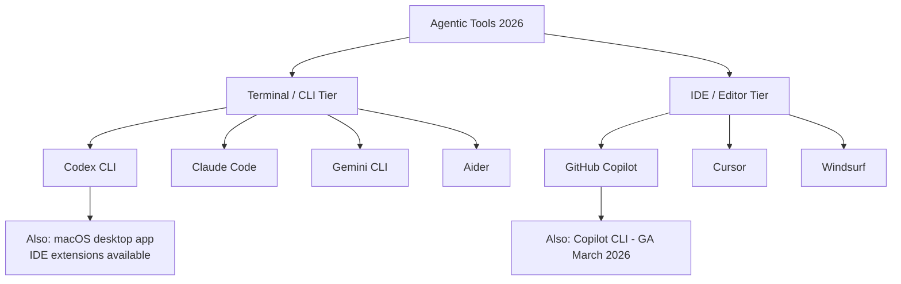
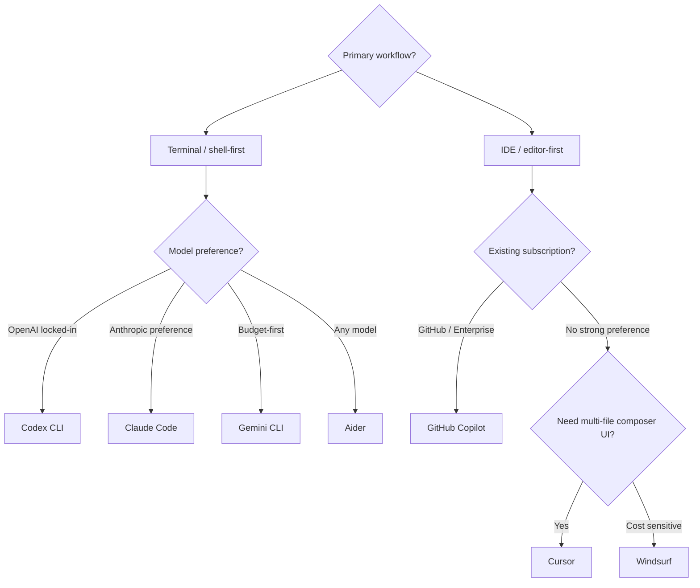

# Codex CLI vs Competing Agentic Tools: Choosing the Right Tool

---

The agentic coding tool landscape reached an inflection point in early 2026. What was once a market dominated by GitHub Copilot autocomplete has fractured into at least seven serious contenders across two distinct tiers: terminal-native CLI agents and IDE-integrated agents.[^1] Choosing poorly wastes money; choosing well can meaningfully compress your delivery cycle. This article gives you the architectural grounding to make that decision deliberately rather than based on marketing copy.

---

## The Two Tiers

The first split worth making is between **terminal agents** (tools you invoke from your shell, that operate on your filesystem and run commands) and **IDE agents** (tools embedded inside an editor, offering completions, multi-file edits, and agent sessions). Some tools straddle both, but their primary design philosophy usually reveals which tier they belong to.

---

## Terminal Tier: The CLI Agents

### Codex CLI

Codex CLI is OpenAI's open-source terminal agent, built around a deliberate design constraint: stay lightweight rather than replicate an IDE.[^2] It runs locally, authenticates through a ChatGPT subscription (Plus at £20/mo, Pro at £200/mo),[^9] and supports three approval modes that map to distinct autonomy levels:[^9]

- **Suggest** — reads files freely, requires explicit approval before any write or command
- **Auto Edit** — applies file changes automatically, still prompts before executing shell commands
- **Full Auto** — runs without interruption; intended for CI pipelines and trusted environments

Sandboxing is enforced at the kernel layer via Apple Seatbelt on macOS and Linux Landlock/seccomp — the OS enforces boundaries regardless of what the agent believes it has permission to do.[^3][^10] This is a fundamentally different trust model from tools that rely on application-layer policy.

Configuration lives in `~/.codex/config.toml`, with named profiles allowing you to switch between a "careful" preset (aggressive sandboxing, `approval_policy = "untrusted"`) and a "deep-review" preset (higher capability model, looser constraints) without editing files manually.

**Token efficiency** is a practical differentiator: independent testing on a Figma plugin task measured Codex at 1.5M tokens versus Claude Code's 6.2M — a 4× difference.[^3] Per-token prices differ between providers, so this doesn't translate directly to cost savings, but it matters at scale.

### Claude Code

Claude Code is Anthropic's terminal agent and Codex CLI's closest peer. Its safety model is the inverse of Codex's: rather than kernel-level hard stops, it exposes 17 programmable hook events (`PreToolUse`, `PostToolUse`, `SessionStart`, `Stop`, `userpromptsubmit`, and others) that let you encode arbitrarily complex policy logic in shell scripts or any executable.[^3][^11] You can block dangerous `rm -rf` patterns, enforce naming conventions, run linters before any commit, or fire audit webhooks — hooks are programs, not config.

Context window is 200K tokens versus Codex's 1M, a meaningful difference for monorepo-scale tasks.[^3][^11] On the SWE-bench Verified leaderboard, Claude Opus 4.6 leads at 80.8%.[^4]

The Max plan (£100/mo individual, £200/mo teams) offers predictable spend; API pay-as-you-go suits lower-volume users.

### Gemini CLI

Google's entry offers the most generous free tier — 60 requests per minute — and a 1M token context window shared with Claude's ceiling.[^2][^12] It is the logical choice when budget is the binding constraint and you're not deep in either the OpenAI or Anthropic ecosystem.

### Aider

Aider is the model-agnostic option, supporting 500+ LLM providers including every major hosted API and local models via Ollama.[^2][^13] If your organisation mandates a specific model for data residency reasons, or you want to experiment across providers without switching tools, Aider removes that constraint entirely. The trade-off is that it lacks the opinionated configuration system (AGENTS.md, profiles, hooks) that makes Codex and Claude Code ergonomic at team scale.

---

## IDE Tier: The Editor Agents

### GitHub Copilot

Copilot has undergone the most significant architectural evolution of any tool in this list. What began as autocomplete is now a multi-component platform:[^5]

- **Agent Mode** (VS Code, JetBrains GA — March 2026[^6]): the AI autonomously edits multi-file changes, runs terminal commands, and iterates on failures within the IDE session
- **Copilot Coding Agent** (GA September 2025[^5]): assigns GitHub issues directly to Copilot, which spins up a GitHub Actions sandbox, pushes commits to a draft PR, and requests review when done — fully asynchronous
- **Copilot CLI** (GA March 2026[^7]): agentic terminal mode with Plan mode (overseen) and Autopilot mode (autonomous end-to-end)

Multi-model support is the headline enterprise feature: you can select GPT-4o, GPT-5.1-Codex-Max, Claude Opus 4.5, or Gemini 2.0 Flash per task, or enable Auto for the model picker to choose based on real-time performance.[^5] For organisations already paying for GitHub Enterprise, the incremental cost to add agentic Copilot is low.

Individual plan pricing of £10/mo makes Copilot the cheapest capable option.[^1]

### Cursor

Cursor is the dominant IDE agent in 2026 by revenue — reportedly $2B ARR with a $50B valuation.[^8] It is a VS Code fork with AI woven into every surface: Composer for multi-file edits, Background Agents for parallel autonomous tasks, and deep codebase indexing that gives the model richer context than any external tool injecting snippets into a prompt.

The developer experience is optimised for those who want to remain in the editor: visual diffs, inline editing, and the familiar VS Code extension ecosystem intact.[^8] Independent testing found Claude Code uses 5.5× fewer tokens than Cursor for identical tasks (33K vs 188K), but Cursor's visual feedback loop is more comfortable for developers who prefer to see exactly what the agent is doing before it lands.[^3]

### Windsurf

Windsurf (formerly Codeium) ships Cascade, a fully agentic flow within the IDE. Its primary differentiator is deep context awareness across the repository at lower cost than Cursor's Pro tier. Worth evaluating if Cursor's credit-based pricing creates unpredictability during intensive refactoring sprints. ⚠️ [unverified]

---

## Decision Framework

The honest answer in 2026 is that experienced practitioners typically use more than one tool. The question is which combination makes sense for your workflow.

A more specific set of criteria:

| Decision point | Tool wins |
|---|---|
| Kernel-level sandbox, hard boundaries | **Codex CLI** |
| Programmable hooks, complex policy logic | **Claude Code** |
| Async PR generation from a GitHub Issue | **GitHub Copilot Coding Agent** |
| Multi-file edits with visual diffs | **Cursor** |
| Multi-model flexibility in IDE | **GitHub Copilot** or **Cursor** |
| Model-agnostic, 500+ providers | **Aider** |
| Largest free tier | **Gemini CLI** |
| Terminal-Bench 2.0 best score (77.3%) | **Codex / GPT-5.3-Codex**[^4] |
| SWE-bench Verified leader (80.8%) | **Claude Code / Opus 4.6**[^4] |

---

## The Multi-Tool Pattern

The false premise in most comparison articles is the assumption you must pick one. The pattern that emerges from practitioners in 2026 is layered:[^1]

1. **Cursor** for daily coding — tab completions, inline edits, quick multi-file changes where visual feedback matters
2. **Codex CLI** for CI/CD, terminal-heavy tasks, and security-sensitive work where kernel sandboxing is non-negotiable
3. **Claude Code** for complex orchestration, multi-agent flows, and tasks requiring programmable hook logic
4. **GitHub Copilot Coding Agent** for asynchronous issue resolution — delegate, walk away, review the PR

Whether your stack spans two of these tools or all four depends on context, compliance requirements, and how much you want to invest in configuration. The key insight is that these tools are not substitutes — they occupy different parts of the developer workflow.

---

## Citations

[^1]: [AI Coding Agents 2026: Claude Code vs Antigravity vs Codex vs Cursor vs Kiro vs Copilot vs Windsurf — Lushbinary](https://lushbinary.com/blog/ai-coding-agents-comparison-cursor-windsurf-claude-copilot-kiro-2026/)
[^2]: [The 2026 Guide to Coding CLI Tools: 15 AI Agents Compared — Tembo](https://www.tembo.io/blog/coding-cli-tools-comparison)
[^3]: [Codex vs Claude Code 2026: Benchmarks, Agent Teams & Limits Compared — MorphLLM](https://www.morphllm.com/comparisons/codex-vs-claude-code)
[^4]: [Codex CLI vs Claude Code 2026: Opus 4.6 vs GPT-5.3-Codex Compared — SmartScope](https://smartscope.blog/en/generative-ai/chatgpt/codex-vs-claude-code-2026-benchmark/)
[^5]: [About GitHub Copilot coding agent — GitHub Docs](https://docs.github.com/en/copilot/concepts/agents/coding-agent/about-coding-agent)
[^6]: [Major agentic capabilities improvements in GitHub Copilot for JetBrains IDEs — GitHub Changelog, March 2026](https://github.blog/changelog/2026-03-11-major-agentic-capabilities-improvements-in-github-copilot-for-jetbrains-ides/)
[^7]: [GitHub Copilot CLI Reaches General Availability — Visual Studio Magazine, March 2026](https://visualstudiomagazine.com/articles/2026/03/02/github-copilot-cli-reaches-general-availability-bringing-agentic-coding-to-the-terminal.aspx)
[^8]: [Claude Code vs Cursor vs GitHub Copilot: Honest Comparison 2026 — DEV Community](https://dev.to/_d7eb1c1703182e3ce1782/claude-code-vs-cursor-vs-github-copilot-honest-comparison-2026-1ah6)
[^9]: [Using Codex with your ChatGPT plan — OpenAI Help Center](https://help.openai.com/en/articles/11369540-using-codex-with-your-chatgpt-plan)
[^10]: [Agent approvals & security — Codex CLI, OpenAI Developers](https://developers.openai.com/codex/agent-approvals-security)
[^11]: [Hooks reference — Claude Code Docs](https://code.claude.com/docs/en/hooks)
[^12]: [Gemini CLI — Google Gemini CLI Docs](https://google-gemini.github.io/gemini-cli/)
[^13]: [Connecting to LLMs — Aider Docs](https://aider.chat/docs/llms.html)
