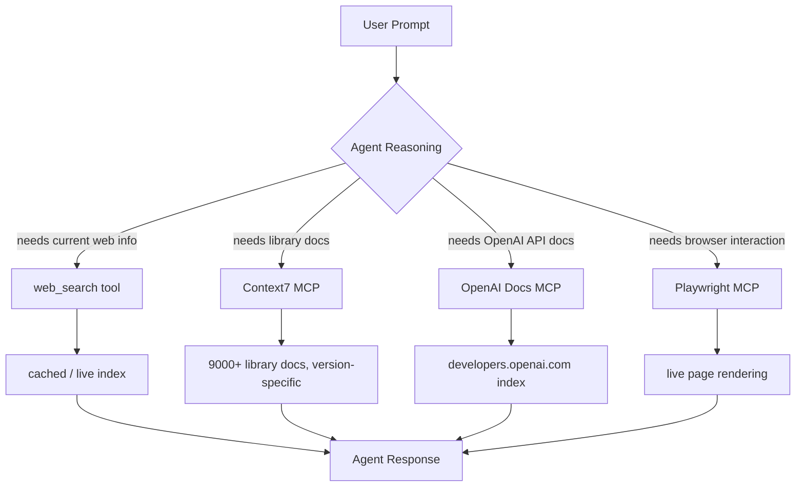

# Codex CLI Web Search Integration and Knowledge-Augmented Agents


---

Most agentic coding failures are not reasoning failures. They are knowledge failures. The agent confidently generates code against an API that changed six months ago, or advises you to set a configuration key that was renamed in the last minor release. The model's training data is a snapshot; your codebase and its dependencies are not.

Codex CLI addresses this with two overlapping mechanisms: a first-party web search tool built into the agent, and MCP knowledge servers that inject authoritative, current documentation directly into context. Understanding both — and knowing when to use which — is the difference between an agent that helps and one that confidently misleads.

---

## The Built-In Web Search Tool

Codex CLI ships with a first-party web search capability enabled by default.[^1] Unlike a browser tool that fetches and renders arbitrary pages, the default mode uses an OpenAI-maintained index of web results — a curated cache that trades immediacy for predictability and reduced prompt injection surface.

### Three Modes

The `web_search` key in `config.toml` accepts three values:[^2]

```toml
# ~/.codex/config.toml  or  .codex/config.toml

# Default — pre-indexed results from OpenAI's maintained web cache
web_search = "cached"

# Live fetch — most current data, same as passing --search at runtime
web_search = "live"

# Disabled — remove the tool entirely
web_search = "disabled"
```

**Cached mode** is the sensible default for most development work. It reduces latency, avoids the nondeterminism of live fetching, and limits the prompt injection risk that comes from sending arbitrary live web content into your agent's context.[^1] The tradeoff is obvious: index freshness is OpenAI-controlled, not real-time.

**Live mode** reaches out to the current web. Use it when you know the topic is moving quickly — a recently-released framework, a CVE that landed last week, an API that changed in the latest patch. You incur the injection risk; treat all web results as untrusted inputs regardless of mode.

**Disabled** removes the tool entirely from the agent's available capabilities. Useful when you want deterministic, offline-only behaviour — for example, in air-gapped environments or when working with highly sensitive codebases where outbound network access is restricted.

### Runtime Override

To enable live search for a single session without changing your config:

```bash
codex --search "what changed in Astro 5.3?"
```

The `--search` flag is equivalent to `web_search = "live"` for that invocation only.[^2]

### Sandbox Mode Interaction

There is one implicit override worth knowing: when you launch Codex with `--yolo` (or any equivalent full-access sandbox setting), web search automatically upgrades to live mode.[^1] The assumption is that if you have waived all approval guardrails, you also want the most current information. You can override this explicitly in your config if that assumption does not hold for your workflow.

### Per-Profile Configuration

If you use Codex profiles — for example, a `research` profile separate from your day-to-day `default` — web search mode can be scoped per profile:[^3]

```toml
[profiles.research]
web_search = "live"
model = "gpt-5.4"

[profiles.default]
web_search = "cached"
model = "gpt-5.4-mini"
```

This gives you live search on explicit research tasks without changing the behaviour of routine coding sessions.

---

## Observing Web Search in Output

Web search activity is surfaced in two places. In interactive sessions, the transcript shows `web_search` events as they occur. In non-interactive runs, `codex exec --json` output includes `web_search` items in the event stream, making it straightforward to audit exactly what your agent looked up.[^1]

This is worth noting for compliance and reproducibility: you get a full record of what external knowledge the agent consumed when producing a given output.

---

## Enterprise Controls

For regulated environments or enterprise deployments, Codex exposes a `requirements.toml` mechanism that sets hard limits on which web search modes can be used — separate from, and overriding, anything in a user's own config.[^5]

Place a `requirements.toml` at `/etc/codex/requirements.toml` on the developer's machine (or distribute it via MDM):

```toml
# /etc/codex/requirements.toml
# Prevents live web access even in --yolo sessions
allowed_web_search_modes = ["cached"]
```

An empty array disallows everything except `disabled`:

```toml
allowed_web_search_modes = []
```

The `"disabled"` mode is always implicitly permitted as a fallback — administrators can restrict live access without inadvertently breaking configurations that explicitly opt out of web search.[^6]

---

## Known Limitation: Minimal Reasoning Effort

There is a current bug worth being aware of: when `reasoning_effort = "minimal"` is set, the `web_search` tool will return a `400 Bad Request` error — `"The following tools cannot be used with reasoning.effort 'minimal': web_search"` — even if web search has been explicitly disabled in config.[^7] If you are using minimal effort for speed or cost reasons, be aware that web search integration is unavailable in that mode until the issue is resolved upstream.

---

## MCP Knowledge Servers: Augmenting Beyond Web Search

Web search covers the open web. But much of the knowledge an agent needs for high-quality coding assistance lives in structured, authoritative sources: official library documentation, internal wikis, API references, design systems. This is where MCP knowledge servers come in.

The architecture looks like this:



### Context7: Version-Specific Library Documentation

Context7 is an MCP server maintained by Upstash that resolves library names to version-specific documentation.[^8] It indexes over 9,000 libraries and frameworks — React, Next.js, FastAPI, SQLAlchemy, and so on — and injects relevant, current snippets into context rather than relying on the model's potentially stale training data.

Add it to your global config:

```toml
# ~/.codex/config.toml
[mcp_servers.context7]
enabled = true
command = "npx"
args = ["-y", "@upstash/context7-mcp"]
```

Or via the CLI:

```bash
codex mcp add context7 -- npx -y @upstash/context7-mcp
```

With Context7 active, the agent can resolve `resolve-library-id` and then call `query-docs` to pull the correct documentation for whichever version of a library you are actually using.[^8] The practical effect: `"use the latest stable Prisma v6 query API"` returns the actual v6 API, not a hallucinated blend of v4 and v5 patterns.

To steer the agent towards using it automatically, add an instruction to your `AGENTS.md`:

```markdown
## External Documentation

When generating code against any third-party library, use Context7 to retrieve
the version-specific API documentation before writing implementation code.
```

### OpenAI Docs MCP

For work involving the OpenAI API itself — Responses API, Assistants, fine-tuning, the Codex API — the official OpenAI Docs MCP server provides direct access to `developers.openai.com`.[^9] This is particularly useful when you are building agents that themselves call OpenAI APIs, where model names, parameter names, and capabilities change frequently.

```toml
[mcp_servers.openai-docs]
enabled = true
command = "npx"
args = ["-y", "@openai/mcp-server-docs"]
```

### Playwright: When You Need the Live Page

For cases where you need the agent to interact with or extract content from a live web page — documentation that is not indexed, a web app under development, or a login-gated reference site — Microsoft's Playwright MCP server gives the agent full browser access:

```toml
[mcp_servers.playwright]
enabled = false   # enable explicitly per session
command = "npx"
args = ["-y", "@playwright/mcp"]
```

Leave this disabled by default and enable it at project level when a task genuinely requires it. The capability is powerful enough that you want it to be an explicit opt-in, not a standing permission.

---

## Research Patterns in Practice

**Research-then-implement**: For tasks that touch external APIs or recently-updated libraries, prompt the agent to do a research pass before writing code:

```
Before implementing the authentication flow:
1. Use Context7 to retrieve the current @supabase/auth-js v2 API reference
2. Check the web for any breaking changes in the last 90 days
3. Then write the implementation

Use live web search for step 2.
```

**Scope-restricted research**: For pure codebase work where you want no external network access, set `web_search = "disabled"` and configure no external MCP servers at project level. This is a useful default for large, self-contained codebases where outbound access is noise rather than signal.

**Profile-based switching**: Keep a `research` profile with `web_search = "live"` and Context7 enabled, and a `coding` profile with `web_search = "cached"` and only local MCP servers. Invoke with `codex --profile research` when you need current information, `codex --profile coding` for standard development sessions.

---

## Citations

[^1]: [Features – Codex CLI | OpenAI Developers](https://developers.openai.com/codex/cli/features) — web search modes, --search flag, yolo mode behaviour, transcript output

[^2]: [Config basics – Codex | OpenAI Developers](https://developers.openai.com/codex/config-basic) — web_search TOML key, valid values, configuration file locations

[^3]: [Configuration Reference – Codex | OpenAI Developers](https://developers.openai.com/codex/config-reference) — per-profile web_search override, full config schema

[^5]: [feat: allowed_web_search_modes in requirements.toml · PR #10964 · openai/codex](https://github.com/openai/codex/pull/10964) — enterprise allowed_web_search_modes implementation

[^6]: [Managed configuration – Codex | OpenAI Developers](https://developers.openai.com/codex/enterprise/managed-configuration) — enterprise requirements.toml, MDM distribution, admin configuration

[^7]: [tools.web_search cannot be disabled when using reasoning_effort=minimal · Issue #5002 · openai/codex](https://github.com/openai/codex/issues/5002) — known bug: web_search + minimal reasoning effort incompatibility

[^8]: [Context7 MCP by Upstash | Smithery](https://smithery.ai/server/@upstash/context7-mcp) — Context7 MCP server, capabilities, 9000+ library index, resolve-library-id and query-docs tools

[^9]: [Model Context Protocol – Codex | OpenAI Developers](https://developers.openai.com/codex/mcp) — MCP configuration, OpenAI Docs MCP, Codex MCP integration overview
