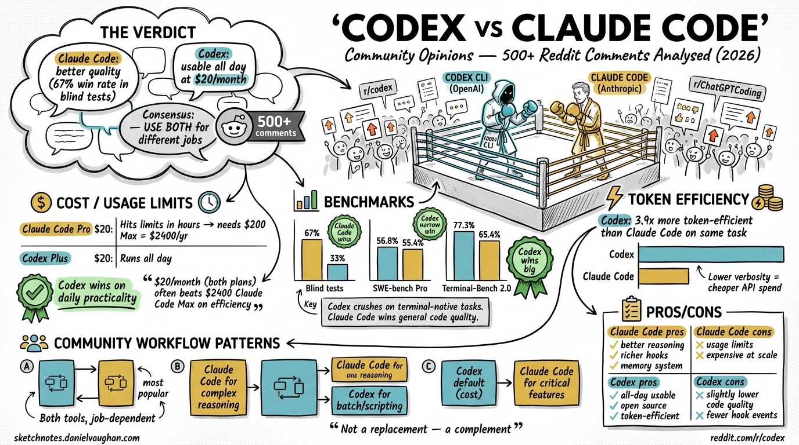

**Source:** https://www.reddit.com/r/codex/comments/1rzp24f/is_it_just_me_or_is_claude_pretty_disappointing/
**Additional sources:**

- https://dev.to/_46ea277e677b888e0cd13/claude-code-vs-codex-2026-what-500-reddit-developers-really-think-31pb
- https://www.builder.io/blog/codex-vs-claude-code
- https://agentnativedev.medium.com/why-codex-became-my-default-over-claude-code-for-now-8f938812ef09
- https://smartscope.blog/en/generative-ai/chatgpt/codex-vs-claude-code-2026-benchmark/

**Date saved:** 2026-03-26
**Tags:** comparison, claude-code, community, reddit, benchmarks, usage-limits, workflow

---

## Summary

500+ Reddit comments analysed across r/codex, r/ClaudeCode, and r/ChatGPTCoding.
**TL;DR:** Claude Code has better code quality (67% win rate in blind tests)[^1] but hits usage limits too quickly to be a daily driver at $20/month. Codex is slightly lower quality but genuinely usable all day. The emerging consensus is to use **both** for different job types.

---

## Usage Limits & Cost

The same $20/month buys very different experiences:

| Plan | Daily usability | Effective cost for heavy use |
|------|----------------|------------------------------|
| Claude Code Pro ($20)[^3] | Hits limits in hours | Requires $100 Max tier = $1,200/yr |
| Codex Plus ($20) | Runs all day | Stays at $20/month |

> *"$40/month (both plans) often beats Claude Code Max $100/month on efficiency"*

⚠️ Average Claude Code API spend: ~$6/day for serious development work.[^4]

---

## Benchmarks

| Benchmark | Claude Code | Codex | Winner |
|-----------|------------|-------|--------|
| Blind tests (36 trials)[^1] | 67% | 33% | Claude Code |
| SWE-bench Pro[^2] | 55.4% | 56.8% | Codex (narrow) |
| **Terminal-Bench 2.0**[^5] | 65.4% | **77.3%** | **Codex** |

> Note: The article originally stated "SWE-bench: Claude Code 59%, Codex 56.8%" attributing a win to Claude Code. On SWE-bench Pro (the relevant head-to-head variant), Codex leads 56.8% vs Claude Code 55.4%.[^2] Claude Code scores 59% on a separate benchmark variant but those scores are not directly comparable across variants.

**Key insight:** Codex crushes Claude Code on terminal-native tasks (DevOps, scripts, CLI tooling). Claude Code wins on general code quality.

---

## Token Efficiency

Real-world Composio test (Figma cloning task):[^6]

| Tool | Tokens used |
|------|------------|
| Claude Code | 6,232,242 |
| Codex | 1,499,455 |

**Codex uses 2–3× fewer tokens for comparable results.**

---

## Code Quality Feel

**Codex:**

- Moves fast, completes code immediately
- Great for quick prototypes
- Variability — same command can give different outputs; review carefully
- Better at catching logical errors, race conditions, edge cases on terminal tasks

**Claude Code:**

- Treats every request as a collaboration
- Asks clarifying questions before executing
- More consistent output
- Better reasoning on complex, ambiguous tasks

---

## Security & Sandboxing

| Tool | Approach |
|------|----------|
| Codex | OS kernel-level (Seatbelt, Landlock, seccomp)[^7] — coarse-grained |
| Claude Code | Application-layer with ~~17~~ 24 programmable hook events[^8] — fine-grained |

---

## Context Window

| Tool | Context window |
|------|---------------|
| Codex (GPT-5.4)[^9] | **1M tokens** (experimental/opt-in; default is 272K) |
| ~~Claude Code (Opus 4.6) \| 200K tokens~~ | **1M tokens**[^10] (200K was a display bug in the `/context` command; 1M is now GA for Max, Team, and Enterprise) |

5× larger window matters for large monorepos where the model must reason across many files in a single pass.

---

## The Emerging Power Stack — Use Both

Many experienced developers use both tools for different job types:

| Job type | Use |
|----------|-----|
| Architecture decisions | Claude Code |
| Complex refactoring | Claude Code |
| Understanding unfamiliar codebases | Claude Code |
| Writing tests for complex logic | Claude Code |
| Boilerplate generation | Codex |
| Batch / repetitive file transforms | Codex |
| CLI scripting | Codex |
| DevOps / terminal-native tasks | Codex |

> *"Use Claude Code for thinking tasks. Use Codex for execution tasks."*

---

## Personal Notes

Daniel is learning Codex CLI specifically to complement his existing Claude Code expertise. The community consensus strongly validates this dual-tool approach — they are genuinely complementary, not competing. The sketchnote-artist project (ADK + Gemini) already demonstrates the multi-agent pattern; the same thinking applies here: right tool for right task.

---

## Citations

[^1]: [Claude Code vs Codex 2026 — What 500+ Reddit Developers Really Think](https://dev.to/_46ea277e677b888e0cd13/claude-code-vs-codex-2026-what-500-reddit-developers-really-think-31pb) — Reports 67% Claude Code win rate across 36 blind trials, sourced from Quantum Jump Club analysis of 500+ Reddit comments

[^2]: [Codex vs Claude Code (2026): Benchmarks, Agent Teams & Limits Compared — MorphLLM](https://www.morphllm.com/comparisons/codex-vs-claude-code) — SWE-bench Pro: Codex 56.8% vs Claude Code 55.4% (with custom scaffolding). Note: the article's original "59% Claude Code" figure refers to a different benchmark variant and the two are not directly comparable

[^3]: [Claude Code Pricing in 2026: Every Plan Explained — SSD Nodes](https://www.ssdnodes.com/blog/claude-code-pricing-in-2026-every-plan-explained-pro-max-api-teams/) — Pro plan $20/month confirmed; Max plan has two tiers: $100/month (5× Pro) and $200/month (20× Pro)

[^4]: [Claude Code Pricing: Every Plan, API Cost, and Way to Save Money — Spark Agents](https://www.sparkagents.com/blog/claude-code-pricing) — Anthropic's own docs cited as source for ~$6/day average API spend; 90% of users stay under $12/day. Independently unverifiable without direct Anthropic documentation link

[^5]: [Minutes After Claude Opus 4.6 Created A New High Of 65.8% On Terminal Bench 2.0, GPT-5.3-Codex Beat It With 77.3% — OfficeChai](https://officechai.com/ai/minutes-after-claude-opus-4-6-created-a-new-high-of-65-8-on-terminal-bench-2-0-gpt-5-3-codex-beat-it-with-77-3/) — Confirms Codex 77.3% and Claude Opus 4.6 65.4% on Terminal-Bench 2.0 (headline says 65.8% but article body says 65.4%; leaderboard at tbench.ai confirms 77.3% for Codex)

[^6]: [Claude Code vs. OpenAI Codex — Composio](https://composio.dev/content/claude-code-vs-openai-codex) — Confirms Figma cloning token counts: Claude Code 6,232,242 vs Codex 1,499,455

[^7]: [Security – Codex — OpenAI Developers](https://developers.openai.com/codex/security) and [Linux Landlock and seccomp — openai/codex](https://zread.ai/openai/codex/14-linux-landlock-and-seccomp) — Confirms Seatbelt (macOS), Landlock + seccomp (Linux) OS kernel-level sandboxing

[^8]: [Hooks reference — Claude Code Docs](https://code.claude.com/docs/en/hooks) — Official docs list **24** hook events (not 17 as stated in the article). The 17 figure appears in some third-party blog posts but is contradicted by the official reference

[^9]: [Introducing GPT-5.4 — OpenAI](https://openai.com/index/introducing-gpt-5-4/) and [GPT-5.4: Native Computer Use, 1M Context Window — DataCamp](https://www.datacamp.com/blog/gpt-5-4) — GPT-5.4 supports 1M context window as an experimental/opt-in feature; the standard default context window is 272K tokens

[^10]: [1M context is now generally available for Opus 4.6 and Sonnet 4.6 — Anthropic](https://claude.com/blog/1m-context-ga) — Claude Opus 4.6 context window is **1M tokens**, now GA for Claude Code Max, Team, and Enterprise users. The 200K figure was a known display bug in the `/context` slash command and does not reflect the model's true limit

---

*Fact-checked by Andy · 2026-03-26*
*⚠️ = claim could not be independently verified*
