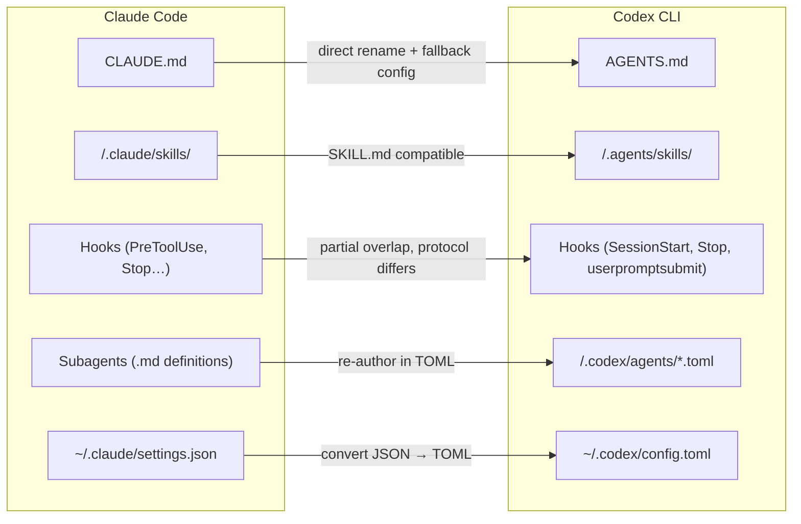
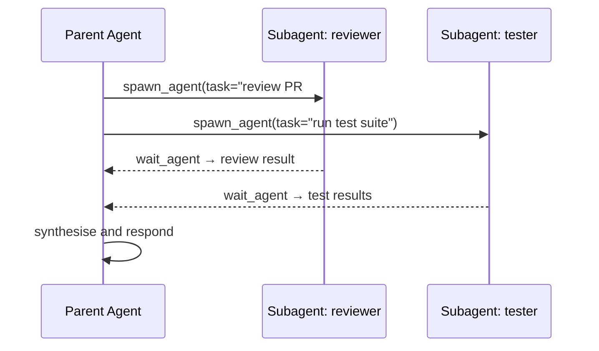
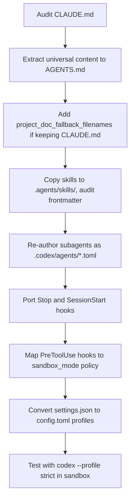

# Migrating a Workflow from Claude Code to Codex CLI


> Full replacement is rarely the right call. This guide covers what maps cleanly between Claude Code and Codex CLI, what requires re-engineering, and what simply has no equivalent — so you can migrate deliberately rather than in a rush.

---

## Why Teams Migrate (and Why Most Shouldn't Fully)

Claude Code and Codex CLI are not substitutes for each other — they have distinct architectural philosophies. Claude Code applies governance at the application layer via its 17 lifecycle hook events, layered `CLAUDE.md` hierarchies, and tightly integrated subagent system[^1]. Codex CLI enforces restrictions at the kernel level (macOS Seatbelt, Linux Landlock + seccomp), operates entirely via named profiles, and is open-source under Apache 2.0[^2].

The prevailing 2026 consensus: run both. Use Codex for sandboxed code review, batch cloud tasks, and untrusted repositories. Use Claude Code for programmable governance, multi-file refactoring, and security-sensitive workflows[^3]. What follows assumes you need Codex CLI to handle work currently done by Claude Code, while preserving as much investment as possible.

---

## The Migration Map



---

## Step 1: CLAUDE.md → AGENTS.md

`AGENTS.md` is an open standard now stewarded by the Linux Foundation's Agentic AI Foundation and read natively by Codex CLI, Cursor, Copilot, Windsurf, Amp, and Gemini CLI[^4]. `CLAUDE.md` is Claude Code-specific.

The recommended migration strategy is not to delete `CLAUDE.md` but to restructure:

1. Move universal conventions — code style, build commands, test runner invocations, architecture notes — into `AGENTS.md`.
2. Keep `CLAUDE.md` for Claude-specific directives (hook references, subagent definitions, memory configuration).
3. In `CLAUDE.md`, add a reference so Claude Code reads the shared file: `See @AGENTS.md for build commands, architecture, and conventions.`

For repos where you cannot maintain two files, configure Codex to treat `CLAUDE.md` as a fallback:

```toml
# ~/.codex/config.toml
project_doc_fallback_filenames = ["CLAUDE.md", "COPILOT.md"]
project_doc_max_bytes = 65536
```

Codex checks directories in this order: `AGENTS.override.md` → `AGENTS.md` → any names in `project_doc_fallback_filenames`[^5]. The 32 KiB default byte limit applies across the entire concatenated chain — raise it to `65536` for large monorepos.

### Discovery Hierarchy Side-by-Side

| Scope | Claude Code | Codex CLI |
|---|---|---|
| Global | `~/.claude/CLAUDE.md` | `~/.codex/AGENTS.md` |
| Project root | `CLAUDE.md` | `AGENTS.md` (or fallback) |
| Subdirectory | `CLAUDE.md` (narrowest wins) | `AGENTS.md` (narrowest wins) |
| Local override | `CLAUDE.local.md` | `AGENTS.override.md` |
| Config format | JSON (`~/.claude/settings.json`) | TOML (`~/.codex/config.toml`) |

---

## Step 2: Skills

Skills are the area of closest parity. The `SKILL.md` format follows the Agent Skills open standard — the same files work across Claude Code, Codex CLI, Cursor, and Gemini CLI[^6].

Claude Code stores skills under `.claude/skills/<name>/SKILL.md`. Codex CLI loads skills from `.agents/skills/`. The directory name differs; the file format does not.

A skill that deploys to staging looks identical in both tools:

```markdown
---
name: deploy-staging
description: Run the staging deployment pipeline
allowed-tools:
  - Bash
disable-model-invocation: true
---

Run `./scripts/deploy.sh --env staging` and tail the log until deployment completes or fails.
Report the final status and any error lines.
```

**What to watch for:**

- The `context: fork` frontmatter key (runs the skill in an isolated subagent) is a Claude Code extension — ⚠️ verify current Codex CLI support before relying on it.
- `user-invocable: false` (autonomous-only invocation) is similarly Claude Code-specific[^7].
- Skills that use `$ARGUMENTS` interpolation work in both tools.
- Skills invoking other skills via Claude Code's subagent system need re-authoring for Codex (see Step 3).

**Migration action:** Copy `.claude/skills/` to `.agents/skills/`. Skills using only `name`, `description`, `allowed-tools`, and `disable-model-invocation` will work without changes. Audit frontmatter keys individually for any others.

---

## Step 3: Subagents

This is the biggest architectural divergence.

Claude Code subagents are defined as Markdown files and support interactive orchestration: the parent agent sees the reasoning, can intervene, and synthesises results in real time[^8]. Codex CLI subagents are defined in TOML and are better suited to parallel batch workloads where you fire tasks and collect results.

### Claude Code subagent (Markdown)

```markdown
---
name: code-reviewer
description: Reviews pull request diffs for security issues
model: claude-opus-4-5
allowed-tools: [Read, Bash]
---

Review the diff at $ARGUMENTS. Flag any use of eval(), unsanitised user input,
hardcoded credentials, or missing authentication checks.
```

### Equivalent Codex CLI subagent (TOML)

```toml
# .codex/agents/code-reviewer.toml
nickname_candidates = ["code-reviewer"]
model = "gpt-5-codex"
model_reasoning_effort = "high"
sandbox_mode = "workspace-write"

[instructions]
text = """
Review the diff provided. Flag any use of eval(), unsanitised user input,
hardcoded credentials, or missing authentication checks.
"""
```

Key differences:

- Codex subagents are spawned via `spawn_agent` / `wait_agent` tools in a TOML workflow, not via natural language[^9].
- `agents.max_depth` defaults to `1` — a subagent cannot spawn further subagents without explicit config[^9].
- Enable experimental multi-agent workflows with `features.multi_agent = true` in `.codex/config.toml`.
- Codex subagents consume more tokens per run than equivalent single-agent runs; factor this into cost comparisons[^10].



---

## Step 4: Hooks

Claude Code provides 17 lifecycle hook event types (e.g. `PreToolUse`, `PostToolUse`, `Stop`, `UserPromptSubmit`) via a JSON protocol over stdin/stdout[^11]. You write a bash or Python script; Claude Code calls it at the appropriate event.

Codex CLI hooks cover a narrower surface: `SessionStart`, `Stop`, and `userpromptsubmit`[^12]. The configuration format is similar — a command string in `config.toml`:

```toml
# ~/.codex/config.toml
[hooks]
session_start = "~/.codex/hooks/on-session-start.sh"
stop = "~/.codex/hooks/on-stop.sh"
userpromptsubmit = "~/.codex/hooks/on-prompt.sh"
```

**What doesn't transfer:**

- `PreToolUse` / `PostToolUse` hooks — Codex enforces restrictions at the kernel/sandbox level, not via application-layer hooks. Move any pre-execution validation logic into `AGENTS.md` instructions or sandbox policy instead.
- `SubagentStop` — no equivalent in Codex.
- Hooks that validate commands before execution rely on Claude Code's application-layer interception model. In Codex, equivalent safety is enforced by `sandbox_mode`, not by hooks.

If your Claude Code hooks perform side-effects (logging, Slack notifications, audit trails), port the `Stop` and `SessionStart` equivalents directly. Validation hooks need to be reimagined as sandbox configuration.

---

## Step 5: Configuration (JSON → TOML)

Claude Code organises configuration as a five-layer cascade: managed settings → command line → local project → shared project → user defaults[^1]. The active layer is implicit — it depends on which directory you're in and which flags you passed.

Codex CLI uses explicitly named **profiles**. You always know which configuration is active because you selected it:

```toml
# ~/.codex/config.toml

model = "gpt-5-codex"
model_reasoning_effort = "medium"
approval_policy = "unless-allow-listed"

[profiles.strict]
model_reasoning_effort = "high"
approval_policy = "on-failure"
sandbox_mode = "workspace-write"

[profiles.fast]
model = "gpt-5-codex"
model_reasoning_effort = "low"
approval_policy = "never"
sandbox_mode = "read-only"
```

Switch profiles at the CLI: `codex --profile strict "review the auth module"`.

**Model naming:** Claude Code models use Anthropic names (`claude-opus-4-5`, `claude-sonnet-4-5`). Codex CLI uses OpenAI model names. Current defaults as of March 2026: `gpt-5-codex` for most tasks, `gpt-5-codex-mini` for fast/cheap runs[^13]. ⚠️ Verify current model names against the OpenAI changelog before hardcoding them in CI pipelines.

---

## What Doesn't Transfer

Some Claude Code capabilities have no direct Codex equivalent:

| Claude Code feature | Codex CLI equivalent | Notes |
|---|---|---|
| 17 lifecycle hook events | 3 hooks only | Move validation to sandbox config |
| `CLAUDE.local.md` (gitignored) | `AGENTS.override.md` | Same concept, different filename |
| Layered settings JSON (5 layers) | Named profiles | Explicit rather than implicit |
| Claude memory (`/memory`) | None | No built-in memory system |
| `context: fork` in skills | ⚠️ Verify support | May not be supported |
| Custom `/slash-commands` in UI | Skills via `.agents/skills/` | Works via `/name` invocation |
| MCP elicitation (v0.117.0+) | Full MCP support | Both tools support MCP; protocol compatible |

---

## Recommended Project Layout Post-Migration

```
your-project/
├── AGENTS.md                    ← Universal instructions (Codex, Cursor, Copilot, etc.)
├── CLAUDE.md                    ← Claude-specific additions (reference @AGENTS.md)
├── .codex/
│   ├── config.toml              ← Codex profiles and settings
│   └── agents/
│       ├── reviewer.toml        ← Subagent definitions
│       └── tester.toml
└── .agents/
    └── skills/
        ├── deploy/SKILL.md      ← Shared with Claude Code
        └── review/SKILL.md
```

The `.agents/skills/` directory is the critical shared layer — skills authored to the Agent Skills open standard require no duplication between tools[^6].

---

## Migration Checklist



---

## Citations

[^1]: [Codex CLI vs Claude Code in 2026: Architecture Deep Dive](https://blakecrosley.com/blog/codex-vs-claude-code-2026) — Blake Crosley, 2026
[^2]: [Codex CLI Features](https://developers.openai.com/codex/cli/features) — OpenAI Developer Documentation
[^3]: [Claude Code CLI Migration Guide](https://jangwook.net/en/blog/en/claude-code-cli-migration-guide/) — Jangwook, 2026
[^4]: [CLAUDE.md, AGENTS.md, and Every AI Config File Explained](https://www.deployhq.com/blog/ai-coding-config-files-guide) — DeployHQ Blog, 2026
[^5]: [Custom instructions with AGENTS.md – Codex](https://developers.openai.com/codex/guides/agents-md) — OpenAI Developer Documentation
[^6]: [Extend Claude with skills – Claude Code Docs](https://code.claude.com/docs/en/skills) — Anthropic, 2026
[^7]: [Essential Claude Code Skills and Commands](https://batsov.com/articles/2026/03/11/essential-claude-code-skills-and-commands/) — Bozhidar Batsov, March 2026
[^8]: [Create custom subagents – Claude Code Docs](https://code.claude.com/docs/en/sub-agents) — Anthropic, 2026
[^9]: [Subagents – Codex](https://developers.openai.com/codex/subagents) — OpenAI Developer Documentation
[^10]: [Codex CLI Cheatsheet: config, commands, AGENTS.md, + best practices](https://shipyard.build/blog/codex-cli-cheat-sheet/) — Shipyard, 2026
[^11]: [Codex CLI Hooks Deep Dive](https://danielvaughan.github.io/codex-resources/articles/2026-03-26-codex-cli-hooks-deep-dive/) — Daniel Vaughan's Codex KB, 2026-03-26
[^12]: [Configuration Reference – Codex](https://developers.openai.com/codex/config-reference) — OpenAI Developer Documentation
[^13]: [Introducing upgrades to Codex](https://openai.com/index/introducing-upgrades-to-codex/) — OpenAI Blog, 2026
