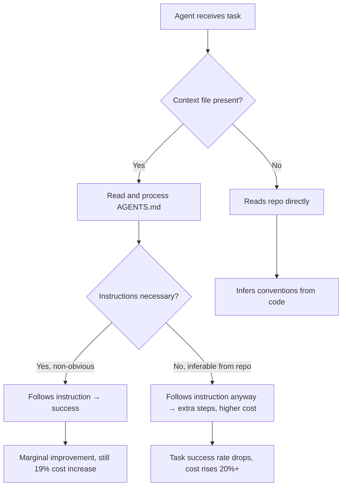
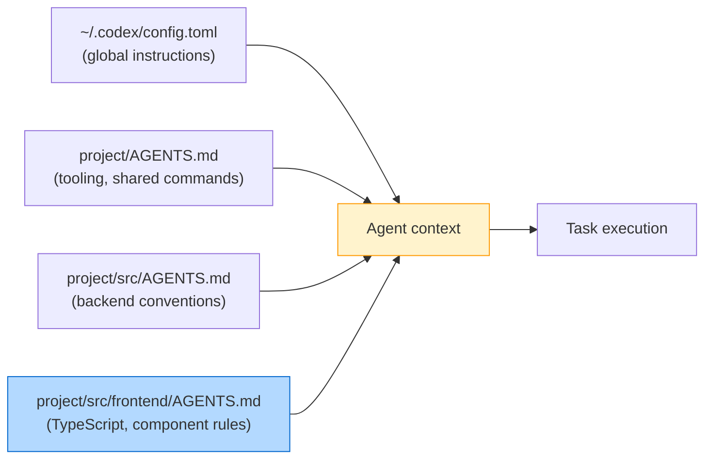
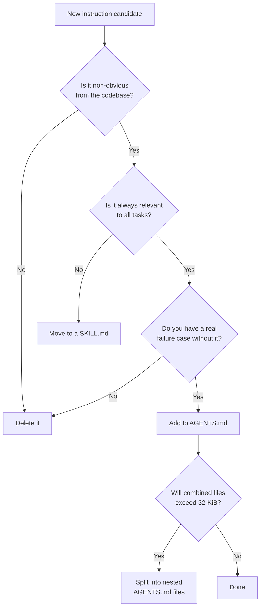

# The AGENTS.md Bloat Problem: When More Context Makes Agents Worse


> A rigorous 2026 study from ETH Zurich found that LLM-generated context files actively *reduce* agent task success rates, while human-written files offer a marginal 4% gain at a 19% cost premium. Meanwhile, Codex CLI silently truncates any AGENTS.md over 32 KiB without warning. The received wisdom — "write more in your AGENTS.md" — deserves serious scrutiny.

---

## The Received Wisdom

Since AGENTS.md became a standard feature of Codex CLI and spread across the agent ecosystem[^1], the standard advice has been simple: document everything in your context file. Cover your build commands, your testing framework, your folder conventions, your deploy steps, your style rules. The more specific and complete, the better.

That advice is wrong — or at least, it is far more nuanced than the community has treated it.

A February 2026 paper from ETH Zurich's SRI Lab performed the first rigorous empirical evaluation of whether repository-level context files actually improve coding agent performance[^2]. The results should change how every team approaches AGENTS.md.

---

## What the Research Found

The ETH Zurich team — Thibaud Gloaguen, Niels Mündler, Mark Müller, Veselin Raychev, and Martin Vechev — built **AGENTbench**: 138 real-world Python tasks drawn from niche public repositories specifically to avoid the contamination problems that plague SWE-bench[^3]. They tested four agents (Claude 3.5 Sonnet, GPT-5.2, GPT-5.1 mini, and Qwen Code) across three conditions:

- No context file
- LLM-generated context file
- Human-written context file

The findings:

**LLM-generated files made things worse.** Compared to no context file at all, auto-generated AGENTS.md files reduced task success rates by an average of 3% while increasing inference costs by over 20%[^2]. The agents dutifully followed the instructions, which is precisely the problem — the instructions added noise, redundant steps, and unnecessary constraints.

**Human-written files barely helped.** Human-authored context files improved success rates by only 4% on AGENTbench, and they still drove costs up by up to 19%[^2]. That is a poor cost-benefit ratio for something teams invest significant effort in maintaining.

**Stronger models did not fix the problem.** Using GPT-5.2 to generate context files did not produce better outcomes. Models with strong parametric knowledge of common frameworks and libraries treated the context as redundant noise, not useful signal[^2].

**Navigation information was useless.** Repository structure overviews and architectural explanations had essentially no effect on the time agents spent locating relevant files. The agent would read the codebase itself anyway[^2].

### The Obedience Trap

The most important behavioural insight from the paper: coding agents are *too obedient*. When a context file contains an instruction — even an unnecessary one — agents follow it. This leads to longer task trajectories, more file traversals, additional test invocations, and ballooning inference costs[^2].

An instruction that says "run the full test suite before each commit" is followed religiously, even on a task where running tests is entirely irrelevant. Each line of your AGENTS.md is a commitment to extra agent steps.

### The Redundancy Problem

Strip all documentation from a repository — READMEs, docs folders, markdown files — and then test with LLM-generated context files. Those same files that hurt performance in a fully documented repo suddenly *improve* performance by 2.7%[^2]. The context was not useless, it was redundant. The agent could read the same information from the repo itself.

If your AGENTS.md restates what is already obvious from the codebase structure, it is active noise, not signal.



---

## The Silent Truncation Problem

Beyond the over-specification anti-pattern, there is a concrete technical issue that affects many Codex CLI users without their knowledge: silent truncation.

Codex CLI enforces a hard limit on the combined size of all loaded context files. The default, defined in the source as `PROJECT_DOC_MAX_BYTES`, is **32 KiB** (`32 * 1024` bytes)[^4]. Files are read in order from root to leaf, joined with blank lines, and truncated once the combined size reaches this limit.

There is no warning. No log output. No indication in the TUI that your instructions have been cut off. Users experiencing unreliable agent behaviour often blame the model, the prompt, or Codex itself — when the actual cause is that the second half of their AGENTS.md is simply not being read[^5].

Community reports confirm the pattern[^6]:

> "The TUI should warn users within `/stats` next to the AGENTS.md — silently truncating the text is considered bad UX."

Claude Code, by contrast, prominently warns when a `CLAUDE.md` file exceeds its size threshold. That UX difference matters.

### Diagnosing Truncation

If you suspect truncation, check whether your AGENTS.md content is reaching the agent by asking it directly in a session:

```bash
# Ask the agent to confirm what instructions it has received
codex "What AGENTS.md instructions are you working with? List the key rules."
```

Or measure the combined byte size of all context files manually:

```bash
# Find all AGENTS.md files in the project, measure total size
find . -name "AGENTS.md" -o -name "agents.md" | xargs wc -c | tail -1
```

### Configuring the Limit

You can raise or lower the limit in `~/.codex/config.toml`[^7]:

```toml
[settings]
project_doc_max_bytes = 65536   # 64 KiB — double the default
```

However, raising the limit treats the symptom, not the cause. If you need more than 32 KiB of AGENTS.md to make your agent behave correctly, the architecture is probably wrong.

---

## What Actually Belongs in AGENTS.md

The ETH Zurich paper found one clear win: non-obvious tooling instructions[^2]. When a context file specified `uv` instead of `pip`, agents used `uv` **160 times more frequently** (1.6 invocations per task vs 0.01 without the instruction). The tool was mentioned, the tool was used — reliably.

This points to the correct mental model for what belongs in a context file:

**Include:**

- Non-standard or non-default tooling: `uv` not `pip`, `bun` not `npm`, `just` not `make`
- Build and test commands that cannot be inferred: non-standard scripts, unusual paths
- Deployment or release steps the agent could not discover from the codebase
- Team decisions encoded nowhere in the code: "We use kebab-case for file names", "Always add a JIRA ticket reference to commits"
- Known footguns: "Do not run migrations in dev — always use `--dry-run` first"

**Omit:**

- Architectural overviews (the agent reads the code)
- Folder structure explanations (visible from `ls`)
- Framework conventions (baked into the model's training)
- Generic best practices ("write clean, readable code")
- Anything auto-generated by `/init` or similar tooling without human review

A useful pruning heuristic, attributed to Jan-Niklas Wortmann[^8]: keep a line only if it is *failure-backed* (you have seen an agent fail without it), *tool-enforceable*, *decision-encoding* (a deliberate team choice), or *triggerable* by a real scenario. Everything else is premium context real estate being occupied for no return.

---

## Right-Sizing with Nested AGENTS.md

Rather than one monolithic root-level file, distribute context to where it is relevant. Codex CLI loads context files from root to leaf, with deeper files overriding shallower ones[^9].

```
project/
├── AGENTS.md              # Global: tooling, shared commands
├── src/
│   ├── AGENTS.md          # Backend: Python conventions, DB migration rules
│   └── frontend/
│       └── AGENTS.md      # Frontend only: TypeScript paths, component patterns
└── scripts/
    └── AGENTS.md          # DevOps only: deploy flags, environment notes
```

This architecture keeps each context file small and relevant. An agent working in `src/frontend/` loads the global rules, the backend rules, and the frontend rules — but only the frontend AGENTS.md needs to discuss TypeScript. The combined file size for any given task is lower, and every loaded instruction is relevant to the actual working directory.



---

## Skills as an Escape Hatch

The underlying issue with a monolithic AGENTS.md is that it is always-on context: every instruction is loaded regardless of task relevance. Skills, by contrast, implement progressive disclosure[^10] — the agent loads only the skills it needs for the current task, triggered by keyword matching or explicit invocation.

If you find yourself writing a large section in AGENTS.md about Playwright automation, Docker deployment, or database schema migrations, that content almost certainly belongs in a `SKILL.md` instead. The skill is loaded when the agent decides it is relevant; otherwise it is invisible.

```toml
# ~/.codex/config.toml — skills declared, not always loaded
[skills]
playwright = "~/.codex/skills/playwright.md"
db-migrate = "~/.codex/skills/db-migrate.md"
deploy      = "~/.codex/skills/deploy.md"
```

This keeps the baseline context file lean while preserving the ability to invoke specialised behaviours on demand.

---

## The Config File Proliferation Problem

There is a second AGENTS.md bloat problem that has nothing to do with content length: proliferation. A project that has seen several months of AI-assisted development often contains[^11]:

- `AGENTS.md` (Codex, Amp, Jules)
- `CLAUDE.md` (Claude Code)
- `.cursorrules` (Cursor)
- `copilot-instructions.md` (GitHub Copilot)
- `gemini.md` (Gemini CLI)

Each file starts as a copy of another, drifts independently, and soon contains subtly different — occasionally contradictory — instructions. The cognitive overhead of maintaining five semantically equivalent files is substantial, and the risk of a rule existing in one file but not another is constant.

The AGENTS.md standard, now stewarded by the Agentic AI Foundation under the Linux Foundation[^1], explicitly aims to address this by providing a single cross-tool format. Most major tools now read AGENTS.md natively. The pragmatic response is to consolidate: write once in AGENTS.md, delete the tool-specific duplicates, and validate that each tool reads the canonical file correctly before removing the legacy version.

---

## Summary: Rules for a Lean AGENTS.md



1. **Default to omission.** Every line added increases agent steps and inference cost.
2. **Include only non-inferable information.** If the agent can discover it by reading the code, leave it out.
3. **Prefer non-obvious tooling over conventions.** Tooling instructions have the highest proven ROI.
4. **Never use `/init` output without thorough review.** LLM-generated context files demonstrably harm performance[^2].
5. **Distribute context with nested files** to keep any individual file small and scope-relevant.
6. **Move specialised workflows to Skills** and load them on demand.
7. **Monitor your file size.** The 32 KiB default is easy to exceed; silent truncation means the instructions you care most about — typically at the end of the file — are the ones dropped.

---

## Citations

[^1]: [AGENTS.md — the open format for coding agent instructions](https://agents.md/) — Agentic AI Foundation / Linux Foundation
[^2]: [Evaluating AGENTS.md: Are Repository-Level Context Files Helpful for Coding Agents?](https://arxiv.org/abs/2602.11988) — Gloaguen et al., ETH Zurich SRI Lab, arXiv:2602.11988, 2026
[^3]: [ETH Zurich Study Proves Your AI Coding Agents are Failing Because Your AGENTS.md Files are too Detailed](https://www.marktechpost.com/2026/02/25/new-eth-zurich-study-proves-your-ai-coding-agents-are-failing-because-your-agents-md-files-are-too-detailed/) — MarkTechPost
[^4]: [AGENTS.md is silently truncated without any warning within the TUI · Issue #7138 · openai/codex](https://github.com/openai/codex/issues/7138) — GitHub
[^5]: [AGENTS.md is silently truncated and instructions near the end ignored · Issue #13386 · openai/codex](https://github.com/openai/codex/issues/13386) — GitHub
[^6]: [Configuration Reference – Codex | OpenAI Developers](https://developers.openai.com/codex/config-reference) — OpenAI
[^7]: [Advanced Configuration – Codex | OpenAI Developers](https://developers.openai.com/codex/config-advanced) — OpenAI
[^8]: [Your agent's context is a junk drawer](https://www.augmentcode.com/blog/your-agents-context-is-a-junk-drawer) — Augment Code blog
[^9]: [Custom instructions with AGENTS.md – Codex | OpenAI Developers](https://developers.openai.com/codex/guides/agents-md) — OpenAI
[^10]: [Best practices – Codex | OpenAI Developers](https://developers.openai.com/codex/learn/best-practices) — OpenAI
[^11]: [CLAUDE.md, AGENTS.md, and Every AI Config File Explained](https://www.deployhq.com/blog/ai-coding-config-files-guide) — DeployHQ
