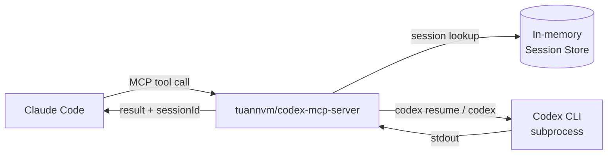
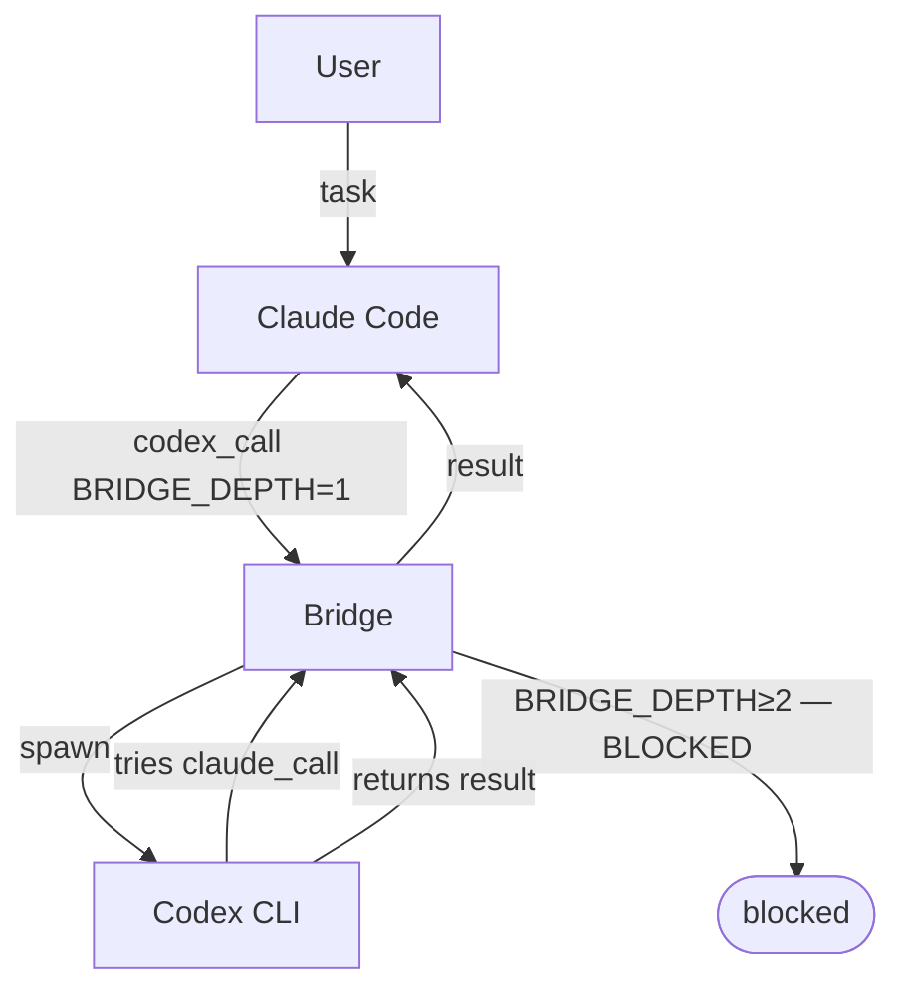
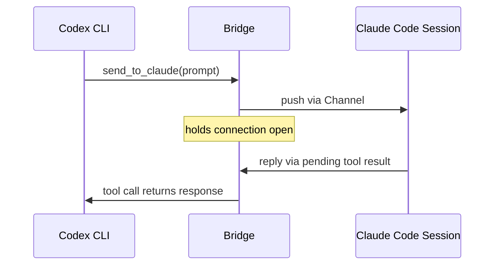
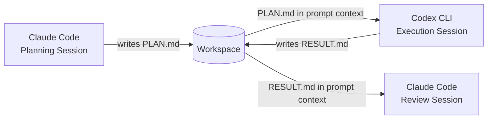
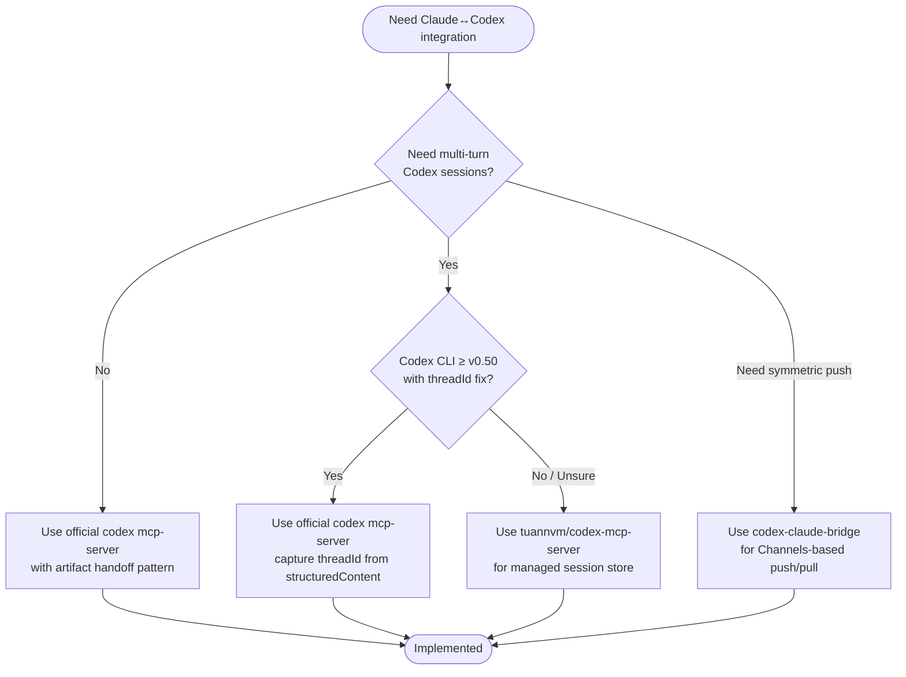

# Claude Code ↔ Codex CLI in Practice: Session Handoffs, Community Bridges and Known Gotchas


---

The theory of bidirectional MCP integration between Claude Code and Codex CLI is compelling: each tool acts as both client and server, delegating to the other based on their complementary strengths. The practice is messier. The official `codex mcp-server` has had a persistent conversation-tracking bug that makes multi-turn sessions non-functional out of the box; the Claude Code Channels push mechanism changed how "bidirectional" can be implemented; and a community of third-party bridges has grown up to paper over the gaps.

This article is the practical companion to the architecture overview. It covers the `conversationId` issue in detail, documents the workarounds, surveys the major community bridge projects, and gives you concrete session-handoff patterns that actually work in 2026.

---

## The `conversationId` Problem

When Codex CLI runs as an MCP server, it exposes two tools: `codex()` to start a new conversation, and `codex-reply()` to continue one. `codex-reply()` requires a `conversationId` parameter. The problem: `codex()` does not return this ID in its response.[^1]

This bug was reported across at least five separate GitHub issues spanning September 2025 through December 2025:[^2]

| Issue | Title | Reported |
|-------|-------|----------|
| #3712 | Missing conversationId of Codex MCP Server | Sep 2025 |
| #4651 | codex mcp no return conversationId | Oct 2025 |
| #5660 | Codex MCP tool responses omit conversation metadata | Oct 2025 |
| #8388 | `codex-reply` tool cannot work: no conversationId returned | Dec 2025 |
| #8580 | MCP Server: codex-reply tool missing conversationId | Dec 2025 |

The practical effect: `codex-reply()` is documented but effectively unusable unless you retrieve the session ID by parsing filenames in `~/.codex/sessions/YYYY/MM/DD/rollout-{timestamp}-{SESSION_ID}.jsonl`.[^3] This is fragile and relies on filesystem side-effects, not the MCP protocol.

### The Official Fix: `structuredContent.threadId`

OpenAI's response, documented in the current Codex MCP developer docs, is to return the thread ID in `structuredContent` rather than the top-level `content` field:[^4]

```json
{
  "id": 1,
  "jsonrpc": "2.0",
  "result": {
    "content": [{"text": "Done.", "type": "text"}],
    "structuredContent": {
      "threadId": "019b4087-c66f-7f93-8e19-f26a7b79cd90",
      "model": "gpt-5.1-codex",
      "reasoningEffort": "medium"
    }
  }
}
```

Modern MCP clients that support `structuredContent` can extract `threadId` from there. Older clients continue to receive only `content` — a backward-compatible fallback.[^4] The proposed code-level fix in `codex-rs/mcp-server/src/codex_tool_runner.rs` captures the `SessionConfiguredEvent` when starting a conversation and threads `conversationId` through to `TaskComplete` handling.[^3]

If you are running a recent version of Codex CLI (post-v0.50.0), check whether `structuredContent.threadId` is present in the tool call response before assuming the old workarounds are necessary.[^1]

### Extracting the Thread ID from Claude Code

When calling `codex()` from a Claude Code session, you need to capture the structured content. In practice, Claude Code receives the full tool result including `structuredContent`. Instruct Claude Code explicitly:

```
After calling codex(), extract the threadId from the structuredContent field of the
tool result. Use it in all subsequent codex-reply() calls for this task.
```

This is a prompt-level instruction, not a config-level fix. The reliability of `structuredContent` propagation depends on your Codex CLI version.

---

## Community Workarounds and Bridges

Because the official `codex-reply` multi-turn path has been unreliable, several community projects have built their own session management layers on top.

### `tuannvm/codex-mcp-server`: Session Management Wrapper

This MCP server wraps the official Codex CLI but replaces the native conversation-ID mechanism with its own in-process session store.[^5][^6]

**Architecture:**



**Session store characteristics:**

- UUID-based session IDs (client-supplied or generated)
- 24-hour TTL with automatic expiry
- Maximum 100 concurrent sessions
- Uses native `codex resume <conversation-id>` when available; falls back to context-building when not[^6]

**Installation and Claude Code `.mcp.json`:**

```json
{
  "mcpServers": {
    "codex": {
      "type": "stdio",
      "command": "npx",
      "args": ["-y", "codex-mcp-server"],
      "env": {
        "OPENAI_API_KEY": "${OPENAI_API_KEY}"
      }
    }
  }
}
```

**Tool call with session continuity:**

```json
{
  "tool": "codex",
  "arguments": {
    "prompt": "Add error handling to the auth service",
    "sessionId": "auth-refactor-sprint-42",
    "model": "gpt-5.1-codex",
    "reasoningEffort": "high"
  }
}
```

Passing the same `sessionId` on subsequent calls continues the conversation. Setting `resetSession: true` clears the history and starts fresh within the same session identifier.[^5]

**When to use this over the official server:** Use `tuannvm/codex-mcp-server` when you need reliable multi-turn Codex sessions from Claude Code and are not confident your Codex CLI version has the `structuredContent.threadId` fix. The session TTL and 100-session cap are intentional resource limits; for production pipeline use, ensure you are not accidentally accumulating stale sessions.

### `claude-codex-bridge`: Symmetric Bridge with Loop Prevention

`claude-codex-bridge` is an npm package that installs itself as an MCP server for both tools simultaneously, creating a symmetric arrangement where each can call the other.[^7]

**Installation:**

```bash
npm install -g claude-codex-bridge
```

**The loop-prevention mechanism — `BRIDGE_DEPTH`:**

When Claude calls Codex via the bridge, the bridge sets `BRIDGE_DEPTH=1` in the subprocess environment. If Codex subsequently tries to call back through the bridge to Claude, the bridge inspects the environment variable and blocks the call when `BRIDGE_DEPTH >= 2`.[^7] This prevents unbounded recursive delegations.



**Configuration in `.mcp.json` (Claude Code side):**

```json
{
  "mcpServers": {
    "claude-codex-bridge": {
      "type": "stdio",
      "command": "claude-codex-bridge",
      "args": ["--claude"]
    }
  }
}
```

**Configuration in `~/.codex/config.toml` (Codex side):**

```toml
[mcp_servers.claude-codex-bridge]
command = "claude-codex-bridge"
args = ["--codex"]
startup_timeout_sec = 20
tool_timeout_sec = 180
```

**Limitation:** The loop-prevention depth of 2 means you cannot have Claude→Codex→Claude chains. If your workflow genuinely requires three-hop delegation, you need to restructure it so intermediate results are passed as tool arguments rather than as live calls.

### `codex-claude-bridge`: Channels-Based Push/Pull

This project takes a different architectural approach, exploiting Claude Code's Channels feature — a mechanism that lets MCP servers push messages into a running Claude Code session without the session having made a tool call.[^8]



From Codex's perspective this is a standard blocking MCP tool call. From Claude's perspective it is a channel notification that arrives mid-session. The bridge handles the routing and exposes a real-time web UI showing the full conversation between both agents.[^8]

**Key limitation:** The symmetry is partial. Claude can respond immediately to a pending Codex request (because the connection is held open), but Claude-initiated messages to Codex still follow the standard poll/request model. True bidirectional push exists only when Codex initiates.[^8]

### `ai-cli-mcp`: Multi-Model Parallel Execution

Rather than focusing on Claude↔Codex specifically, `ai-cli-mcp` exposes all three major CLI agents (Claude Code, Codex CLI, Gemini CLI) as tools within a single MCP server.[^9]

```toml
# ~/.codex/config.toml — using ai-cli-mcp to reach both Claude and Gemini
[mcp_servers.ai-agents]
command = "npx"
args = ["-y", "ai-cli-mcp"]
startup_timeout_sec = 30
tool_timeout_sec = 300

[mcp_servers.ai-agents.env]
ANTHROPIC_API_KEY = "${ANTHROPIC_API_KEY}"
OPENAI_API_KEY    = "${OPENAI_API_KEY}"
GEMINI_API_KEY    = "${GEMINI_API_KEY}"
```

All three agents run **asynchronously**: when Codex (or Claude, or Gemini) calls a sub-agent, execution happens in a background process and control returns immediately. The calling agent can issue another sub-agent invocation in parallel without waiting.[^9]

This is useful for "heterogeneous review" workflows — running the same code change through Claude (for architectural reasoning), Codex (for implementation correctness), and Gemini (for a third perspective) in parallel, then synthesising results.

---

## Session Handoff Patterns

Session handoff is the challenge of preserving relevant context when transferring a task between tools mid-stream. The MCP channel passes a single string prompt; it does not carry session memory, open files, or tool history.

### Pattern 1: Explicit Artifact Handoff

The most reliable pattern treats each tool invocation as stateless and uses filesystem artifacts as the shared state.[^10]



Claude Code writes its analysis or plan to a file. The `codex()` call includes that file path in the prompt so Codex reads it into context. Codex writes its output to a result file. Claude Code reads that file to proceed. No MCP session IDs are required — the handoff medium is the filesystem.

**Prompt template for the Codex call:**

```
Read PLAN.md in the current directory.
It contains the refactoring strategy for the auth module.
Implement the changes exactly as specified.
Write a brief RESULT.md summarising what was changed and any deviations.
```

### Pattern 2: Session ID Relay via Tool Result

When you need Codex to maintain conversational context across multiple sub-tasks within a single Claude Code session, use the `threadId`/`conversationId` returned in the first `codex()` call to chain subsequent `codex-reply()` calls.[^4]

```
Claude Code session:
  1. calls codex("Set up the migration scaffold") → captures threadId=abc123
  2. calls codex-reply(abc123, "Now write migration 001_add_users_table")
  3. calls codex-reply(abc123, "Write migration 002_add_posts_table")
  4. calls codex-reply(abc123, "Write the rollback procedures for both migrations")
```

Codex carries full conversation history across steps 2–4, so it can reference the scaffold from step 1 without re-reading files. This only works reliably on Codex CLI versions that include `structuredContent.threadId` in tool responses.

**Instruction to Claude Code (in AGENTS.md or in-session):**

```markdown
When calling the codex MCP tool:
1. Always capture threadId from structuredContent in the first codex() result
2. Use codex-reply(threadId, ...) for all follow-up calls within the same task
3. Start a new codex() call for unrelated tasks
```

### Pattern 3: Summarised Context Injection

When crossing from a long Claude Code session to a fresh Codex invocation, compress context into a structured summary rather than including full transcript history.

```python
# Pseudocode for a Claude Code hook or pre-codex step
summary = claude_code.summarise("""
  Current task: Migrating the billing module to Stripe v5
  Files modified so far: billing/stripe_client.py, billing/webhooks.py
  Open issue: webhook signature validation fails for test events
  Next step: Fix the test event handling in stripe_client.py
""")
codex_prompt = f"""
CONTEXT:
{summary}

TASK:
Fix the webhook signature validation for Stripe test events in billing/stripe_client.py.
The issue is in the verify_signature() function — test events use a different header format.
Write the fix and update the test in tests/test_stripe_client.py.
"""
```

Codex receives a compact, structured context block rather than a sprawling transcript. This avoids context window pressure on the Codex side and keeps the prompt focused on the task at hand.

---

## Choosing the Right Integration Approach



| Scenario | Recommended approach |
|----------|---------------------|
| One-shot Codex tasks from Claude Code | Official `codex mcp-server` + artifact handoff |
| Multi-turn Codex sessions, modern CLI | Official server + `structuredContent.threadId` |
| Multi-turn Codex sessions, older CLI | `tuannvm/codex-mcp-server` |
| Codex needs to push tasks to Claude | `codex-claude-bridge` (Channels-based) |
| Symmetric, loop-safe cross-calling | `claude-codex-bridge` (npm) |
| Parallel heterogeneous AI review | `ai-cli-mcp` |

---

## Version and Compatibility Notes

- `codex mcp-server` mode requires the **Rust-based Codex CLI** (post-TypeScript rewrite). The legacy TypeScript implementation does not include it. Verify with `codex --version`.[^11]
- `structuredContent.threadId` support was added after the v0.50.0 release cycle. ⚠️ The exact version is not pinned in the public changelog; test with your installed version.
- `tuannvm/codex-mcp-server` requires Codex CLI v0.50.0+ for native resume functionality; older versions use context-rebuilding fallback.[^5]
- Claude Code's `claude mcp serve` is available from Claude Code v1.0+. The `--dangerously-skip-permissions` flag must be run once interactively to grant headless operation rights before `mcp serve` will work non-interactively.[^12]
- Claude Code Channels (used by `codex-claude-bridge`) is a feature introduced in 2025; verify it is present in your Claude Code version before relying on the push architecture.[^8]

---

## Citations

[^1]: OpenAI. "Model Context Protocol — Codex." OpenAI Developers. <https://developers.openai.com/codex/mcp>
[^2]: GitHub Issues, openai/codex. #3712, #4651, #5660, #8388, #8580 — "conversationId not returned by codex MCP server." <https://github.com/openai/codex/issues/8580> · <https://github.com/openai/codex/issues/8388> · <https://github.com/openai/codex/issues/5660> · <https://github.com/openai/codex/issues/4651> · <https://github.com/openai/codex/issues/3712>
[^3]: GitHub, openai/codex. "MCP Server: codex-reply tool missing conversationId in response — Issue #8580." <https://github.com/openai/codex/issues/8580>
[^4]: OpenAI. "Use Codex with the Agents SDK — Multi-turn MCP sessions." OpenAI Developers. <https://developers.openai.com/codex/guides/agents-sdk>
[^5]: tuannvm. "Session Management Implementation Guide." Codex MCP Server Docs. <https://docs.tuannvm.com/codex-mcp-server/docs/session-management>
[^6]: tuannvm. "API Reference." Codex MCP Server Docs. <https://docs.tuannvm.com/codex-mcp-server/docs/api-reference>
[^7]: LobeHub. "claude-codex-bridge MCP Server listing." <https://lobehub.com/mcp/user-claude-codex-bridge>
[^8]: abhishekgahlot2. "codex-claude-bridge: Bidirectional bridge between Claude Code and OpenAI Codex CLI." GitHub. <https://github.com/abhishekgahlot2/codex-claude-bridge>
[^9]: mkXultra. "ai-cli-mcp: MCP server to run Claude, Codex, and Gemini CLI agents." GitHub. <https://github.com/mkXultra/claude-code-mcp/>
[^10]: OpenAI. "Building Consistent Workflows with Codex CLI and the Agents SDK." OpenAI Cookbook. <https://developers.openai.com/cookbook/examples/codex/codex_mcp_agents_sdk/building_consistent_workflows_codex_cli_agents_sdk>
[^11]: OpenAI. "Codex CLI Configuration Reference." <https://developers.openai.com/codex/config-reference>
[^12]: Anthropic. "Connect Claude Code to tools via MCP." Claude Code Documentation. <https://code.claude.com/docs/en/mcp>

## Citations

- OpenAI. "Model Context Protocol — Codex." <https://developers.openai.com/codex/mcp>
- GitHub, openai/codex. Issue #8580 — conversationId missing. <https://github.com/openai/codex/issues/8580>
- GitHub, openai/codex. Issue #8388 — codex-reply unusable. <https://github.com/openai/codex/issues/8388>
- GitHub, openai/codex. Issue #5660 — conversation metadata omitted. <https://github.com/openai/codex/issues/5660>
- OpenAI. "Use Codex with the Agents SDK." <https://developers.openai.com/codex/guides/agents-sdk>
- tuannvm. "Codex MCP Server — Session Management Docs." <https://docs.tuannvm.com/codex-mcp-server/docs/session-management>
- tuannvm. "Codex MCP Server — API Reference." <https://docs.tuannvm.com/codex-mcp-server/docs/api-reference>
- LobeHub. "claude-codex-bridge MCP Server." <https://lobehub.com/mcp/user-claude-codex-bridge>
- abhishekgahlot2. "codex-claude-bridge on GitHub." <https://github.com/abhishekgahlot2/codex-claude-bridge>
- mkXultra. "ai-cli-mcp on GitHub." <https://github.com/mkXultra/claude-code-mcp/>
- Anthropic. "Connect Claude Code to tools via MCP." <https://code.claude.com/docs/en/mcp>
