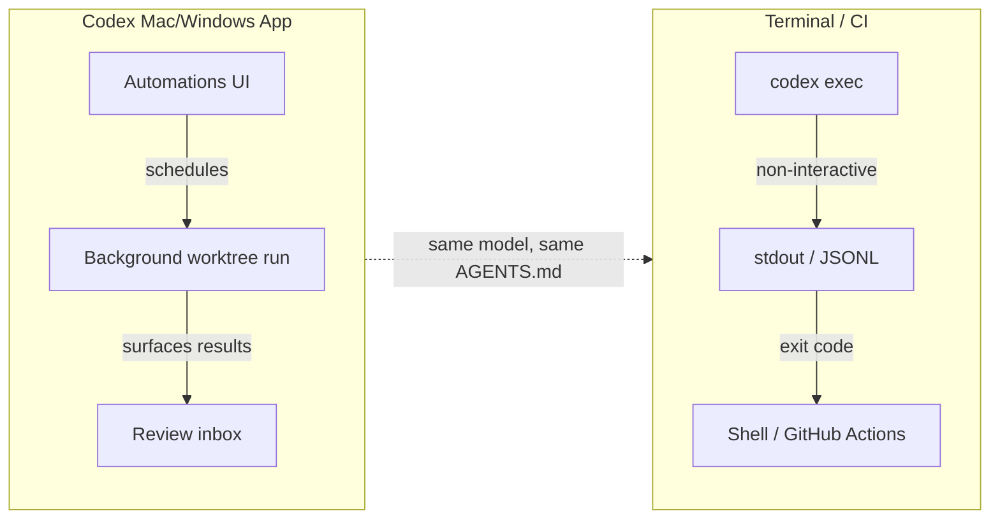
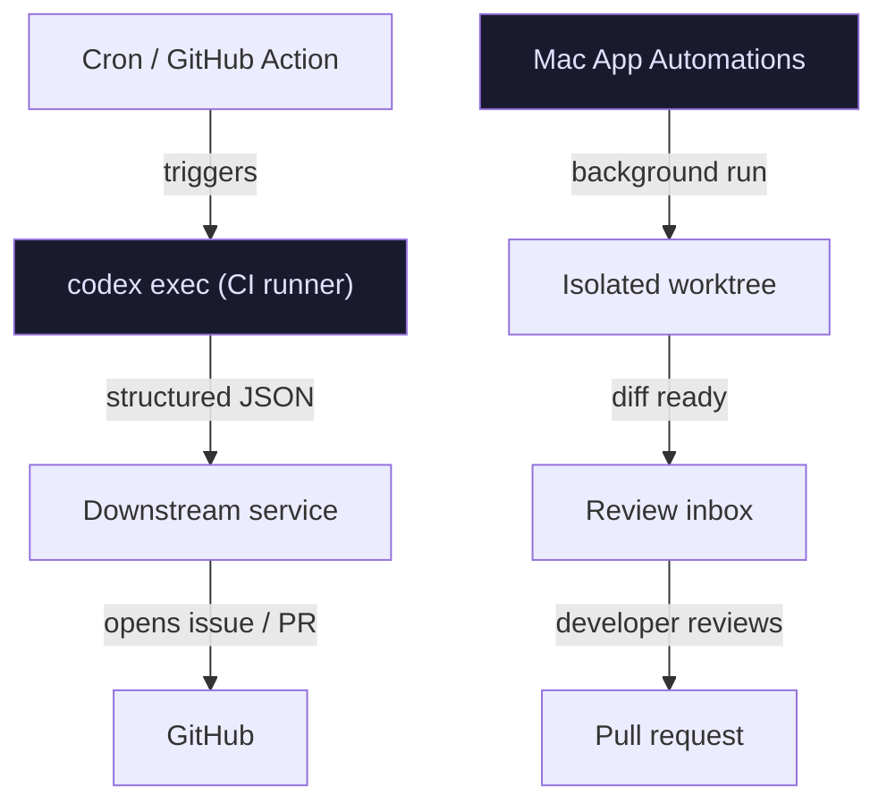

# Codex CLI Automations and Scheduled Tasks: Background Agent Workflows


The first generation of agentic coding tools were interactive by nature: you sat in front of a terminal, issued a prompt, watched the diff land, and approved. The second generation is different. Codex now has two distinct paths for unattended execution — the Mac app's **Automations** feature and the CLI's `codex exec` subcommand — and combining them correctly is what separates occasional AI assistance from a genuine background development pipeline.

This article covers both surfaces: when to use each, how to configure them safely, and the patterns that make background agent runs reliable rather than scary.

---

## Two Surfaces, One Goal



The Mac app launched on **2 February 2026** and Windows followed on **4 March 2026**.[^1] Automations are a first-class feature of the app, designed for recurring tasks that should run while you sleep. `codex exec` is the CLI counterpart: a single-shot, scriptable invocation suitable for cron jobs, GitHub Actions, and anything that needs an exit code.

They share the same model, the same `AGENTS.md` context, and the same sandbox machinery. The choice between them is mostly about where you want results to land — in a review queue or on stdout.

---

## Mac App Automations

### Creating an Automation

Automations live in the app sidebar. Each automation bundles three things:

1. **A prompt** — plain English instruction describing the recurring task
2. **Optional skills** — invoke with `$skill-name` syntax for domain-specific tooling[^2]
3. **A schedule** — hourly, daily, weekly, or custom cadence

Before scheduling, test the prompt in a regular interactive thread first. Confirm the model, reasoning effort, and tools behave as expected and that the resulting diff is something you'd actually want.[^2]

### Worktree vs Local Project

In a Git repository, each automation run can target either your local working directory or a dedicated background worktree.[^2]

| Mode | When to use |
|------|-------------|
| **Local project** | Automations that need to read the current working state (e.g., issue triage that references uncommitted drafts) |
| **Worktree** | Anything that modifies files — keeps automation changes isolated from in-progress work |

Worktrees require periodic cleanup; a daily automation on a two-week schedule will accumulate worktrees fast.[^2]

### The Review Inbox

When an automation finishes, results appear in the app's **Triage** inbox rather than demanding immediate attention.[^2] The inbox supports filtering by unread status and archiving completed runs. Avoid pinning runs unless you intend to keep the associated worktree alive — pinned runs block worktree cleanup.

### Sandbox Configuration for Automations

Automations use `approval_policy = "never"` when your organisation policy permits, meaning Codex acts without confirmation.[^2] That's powerful and dangerous. The recommended baseline:

```toml
# ~/.codex/config.toml
[sandbox]
mode = "workspace-write"
approval_policy = "never"

[[sandbox.rules]]
command = "npm test"
policy = "allow"

[[sandbox.rules]]
command = "git commit"
policy = "allow"
```

If your sandbox mode is `full-access`, background automations carry elevated risk — Codex may modify files, run commands, and access the network without any prompt.[^2] Unless you're running inside a container or ephemeral VM, `workspace-write` is the safer default.

---

## `codex exec`: Scripted Non-Interactive Execution

For CI/CD pipelines, cron jobs, and script-driven automation, `codex exec` is the right primitive.[^3] It runs a single task non-interactively, streams progress to stderr, and prints final agent output to stdout. Exit code semantics are meaningful — automation tools can gate on success or failure.

### Core Flags

```bash
# Basic execution
codex exec "Update CHANGELOG with commits since last tag"

# Allow file writes
codex exec --full-auto "Regenerate API docs from JSDoc comments"

# Broader access (use only in isolated environments)
codex exec --sandbox danger-full-access "Run database migration scripts"

# Prevent writing session files to disk
codex exec --ephemeral "Summarise open GitHub issues"

# Skip Git repo check (useful in non-repo automation contexts)
codex exec --skip-git-repo-check "Audit config files in /etc/app"
```

The `CODEX_API_KEY` environment variable is the recommended authentication approach for non-interactive runs — it is supported exclusively in `codex exec` and avoids reading `~/.codex/auth.json` from a CI runner.[^3]

### JSON Output for Downstream Scripting

When you need machine-readable output, `--json` converts stdout to a JSONL stream.[^3] Every event emits one JSON object per line:

```bash
codex exec --json "Analyse test coverage and report gaps" | jq 'select(.type == "turn.completed")'
```

Event types include `thread.started`, `turn.started`, `turn.completed`, `turn.failed`, and `item.*` events for individual operations (commands executed, files changed, MCP tool calls, web searches).[^3] The `turn.completed` event includes token usage fields (`input_tokens`, `cached_input_tokens`, `output_tokens`) — useful for cost tracking across a pipeline.

For structured data you want to parse reliably, `--output-schema` constrains the final response to a JSON Schema:

```bash
# Define expected output shape
cat > /tmp/coverage-schema.json <<'EOF'
{
  "type": "object",
  "properties": {
    "overall_pct": { "type": "number" },
    "uncovered_files": { "type": "array", "items": { "type": "string" } },
    "recommendation": { "type": "string" }
  },
  "required": ["overall_pct", "uncovered_files"]
}
EOF

codex exec --output-schema /tmp/coverage-schema.json \
  "Analyse test coverage. Return JSON matching the schema." \
  | jq .overall_pct
```

This is the right pattern for automation steps that feed structured data into downstream jobs — release pipelines, Slack notifications, or dashboard updates.[^4]

### Writing Output to a File

```bash
codex exec \
  -o /tmp/release-notes.md \
  "Generate release notes from commits since v2.3.0"
```

`-o` (alias `--output-last-message`) writes the final agent message to a file while still printing to stdout — useful when you need both human-readable output in CI logs and a file for subsequent steps.[^3]

---

## Scheduling Patterns

### GitHub Actions

```yaml
# .github/workflows/daily-triage.yml
name: Daily Issue Triage
on:
  schedule:
    - cron: '0 8 * * 1-5'   # Weekdays at 08:00 UTC

jobs:
  triage:
    runs-on: ubuntu-latest
    steps:
      - uses: actions/checkout@v4
      - uses: actions/setup-node@v4
        with: { node-version: '22' }
      - run: npm i -g @openai/codex
      - name: Triage stale issues
        run: |
          codex exec --full-auto \
            "Review open GitHub issues older than 14 days. \
             Add a 'needs-triage' label to any without labels. \
             Comment with a brief summary if the issue lacks a clear description."
        env:
          CODEX_API_KEY: ${{ secrets.CODEX_API_KEY }}
          GITHUB_TOKEN: ${{ secrets.GITHUB_TOKEN }}
```

### Cron + Shell Script

```bash
#!/usr/bin/env bash
# /usr/local/bin/nightly-health-check.sh
set -euo pipefail

REPO=/home/app/project
LOG=/var/log/codex-health-$(date +%Y%m%d).jsonl

cd "$REPO"

codex exec \
  --json \
  --sandbox workspace-write \
  "Check for dependency vulnerabilities using npm audit. \
   Fix any critical vulnerabilities automatically. \
   Output a JSON summary of what was fixed." \
  >> "$LOG" 2>&1

# Exit code propagates — cron will report failure via mail
```

Add to crontab:

```
0 3 * * * /usr/local/bin/nightly-health-check.sh
```

### Session Resume for Multi-Step Automation

`codex exec resume` preserves the original transcript and plan history:[^4]

```bash
# Run initial analysis
codex exec "Identify all deprecated API usages in src/"

# Next day, continue with context intact
codex exec resume --last "Now generate replacement stubs for everything you flagged yesterday"
```

This is particularly useful when an automation finds problems that need multi-step remediation across runs.

---

## Error Handling and Observability

### Exit Codes

`codex exec` exits with a non-zero code on failure — use this to gate downstream steps:

```bash
if ! codex exec --full-auto "Run migration and verify schema"; then
  echo "Migration failed — rolling back" >&2
  git checkout HEAD -- db/schema.sql
  exit 1
fi
```

### MCP Server Failures Are Fatal

If an MCP server is configured with `required = true` and fails to initialise, `codex exec` exits with an error rather than continuing without that server.[^3] Design your automation's MCP dependencies accordingly — mark servers `required = false` if the task can succeed without them, and `required = true` only when a missing server should be a hard stop.

### Token Budget Monitoring

Parse token usage from JSONL output to catch runaway agents before they exhaust your quota:

```bash
codex exec --json "Refactor the payments module" \
  | tee /tmp/run.jsonl \
  | jq -r 'select(.type=="turn.completed") | "Tokens used: \(.usage.input_tokens + .usage.output_tokens)"'
```

---

## Automation Architecture: A Practical Pattern

For teams running multiple background agents, a common pattern layers the two surfaces:



- **CI runners** get `codex exec` — ephemeral, auditable, structured output
- **Local machine / always-on services** get Mac app Automations — persistent worktrees, review-queue surfacing
- Both feed into GitHub via issues, PRs, or direct commits depending on the task's risk profile

---

## When Not to Schedule an Automation

Background agents are powerful, and that makes them easy to misuse. Some guardrails:

- **Don't automate write operations in `full-access` mode** outside an isolated container. A malformed prompt + unguarded sandbox = unintended file destruction.[^2]
- **Don't schedule high-frequency runs on expensive models.** A 15-minute automation using `xhigh` reasoning on every commit will exhaust your budget quickly. Use `minimal` or `low` effort for triage and labelling tasks; reserve `medium`+ for refactoring or migration work.
- **Don't skip manual testing first.** The review-queue friction in the Mac app exists for a reason — use it while you build confidence in a new automation prompt.[^2]

---

## Summary

| Surface | Best for | Output | Auth |
|---------|----------|--------|------|
| Mac app Automations | Recurring tasks, worktree isolation, review-queue workflow | Review inbox | Logged-in session |
| `codex exec` | CI/CD, cron, scripts, structured pipelines | stdout / JSONL / file | `CODEX_API_KEY` env var |

The Mac app's Automations feature and `codex exec` are complementary, not competing. Use Automations when you want a human to review results before they land; use `codex exec` when you want reliable, machine-readable, exit-code-driven execution in a pipeline. Build both into your workflow and you have the makings of a background development process that keeps shipping while you focus on the work that actually requires your attention.

---

## Citations

[^1]: OpenAI, "Introducing the Codex App", February 2026. Mac app launched 2 February 2026, Windows app 4 March 2026. <https://openai.com/index/introducing-the-codex-app/>
[^2]: OpenAI Developer Docs, "Automations – Codex app". Covers scheduling, worktree modes, sandbox settings, approval policies, and review inbox. <https://developers.openai.com/codex/app/automations>
[^3]: OpenAI Developer Docs, "Non-interactive mode – Codex". Full reference for `codex exec` flags, JSONL output events, `--output-schema`, `CODEX_API_KEY`, and MCP required-server behaviour. <https://developers.openai.com/codex/noninteractive>
[^4]: OpenAI Developer Docs, "Features – Codex CLI". `codex exec resume` and `--attempts` flag for cloud multi-attempt runs. <https://developers.openai.com/codex/cli/features>
