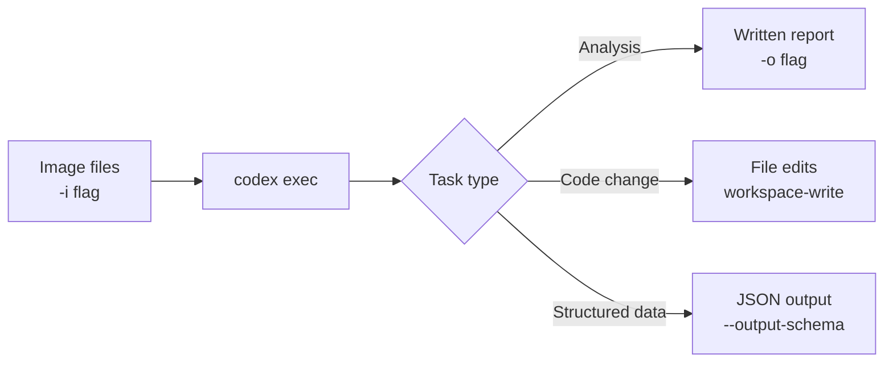

# Beyond Code: Codex CLI for File Automation, Image Processing and Browser Tasks


---

Most teams treat Codex CLI purely as a coding assistant — you give it a ticket, it produces a pull request. That framing undersells it. The same `codex exec` primitive that drives CI/CD pipelines can handle file manipulation, image-aware tasks, scheduled maintenance, and full browser automation via Playwright. This article works through each category with concrete configuration and concrete commands.

## The Automation Primitive: `codex exec`

`codex exec` is the non-interactive twin of the interactive TUI.[^1] It accepts a prompt, executes any necessary shell commands, writes or edits files according to its sandbox policy, and exits with a meaningful exit code. That makes it composable with cron, GitHub Actions, GitLab CI, and plain shell scripts.

```bash
# One-shot task, results written to a file
codex exec "Summarise all TODO comments in this repo and output a markdown report" \
  --approval-policy read-only \
  -o todo-report.md

# Consume JSONL events downstream
codex exec "Identify the three largest source files and suggest refactors" \
  --json | jq 'select(.type == "assistant_message")'
```

Key flags you need to know[^2]:

| Flag | Purpose |
|---|---|
| `--approval-policy` | `read-only`, `workspace-write`, `danger-full-access` |
| `--json` / `--experimental-json` | Emit newline-delimited JSON events for downstream piping |
| `--output-last-message -o` | Write the assistant's final message to a file |
| `--output-schema` | Validate the final response against a JSON Schema |
| `--ephemeral` | No session files written to disk |
| `--skip-git-repo-check` | Allow execution outside a Git repository |

The `--output-schema` flag is particularly useful for file automation: you can request structured JSON output that a downstream script can parse reliably without having to parse prose.[^3]

## File Automation Use Cases

### Changelog and Release Prep

A common pattern is wiring `codex exec` into a `pre-release` CI job:

```bash
codex exec \
  "Read CHANGELOG.md and the git log since the last tag. Produce a concise release summary in Keep a Changelog format and update CHANGELOG.md in place." \
  --approval-policy workspace-write \
  --profile release-prep
```

Profiles (defined in `~/.codex/config.toml`) let you pin a model, reasoning effort, and approval policy for a specific workflow, so the same command is reproducible across machines.[^4]

### Bulk File Manipulation

`codex exec` isn't limited to code files. It can read any text file and execute shell commands. For repetitive file tasks — renaming a directory tree, stripping metadata from a batch of files, converting a folder of CSVs to Parquet — describe the task and set `workspace-write`:

```bash
codex exec \
  "Find every CSV in ./data/raw/, convert each to Parquet using pandas, save to ./data/parquet/, and print a summary of row counts." \
  --approval-policy workspace-write \
  --skip-git-repo-check
```

Codex writes the conversion script, runs it, and reports. You don't author the boilerplate; you review the diff and the summary.

### Structured Output for Downstream Scripts

When you need to feed Codex output into another tool, `--output-schema` enforces a JSON contract:

```bash
# schema.json
{
  "type": "object",
  "properties": {
    "files": { "type": "array", "items": { "type": "string" } },
    "total_issues": { "type": "integer" }
  },
  "required": ["files", "total_issues"]
}

codex exec "Scan for files containing hardcoded secrets" \
  --output-schema schema.json \
  -o findings.json
```

The exit code is non-zero if the schema validation fails or if Codex determines the task could not be completed — so automation scripts can gate on it reliably.[^3]

## Image Inputs: Multimodal Tasks

Codex CLI accepts images attached to the first message via the `-i` / `--image` flag.[^2] You can pass a single path, repeat the flag, or use a comma-separated list:

```bash
codex exec \
  -i mockup.png,current-screenshot.png \
  "Compare these two images. List the UI elements present in mockup.png that are missing or visually different in current-screenshot.png."
```

Practical use cases where image input pays off:

- **Visual regression descriptions** — attach before/after screenshots and get a human-readable diff description for a PR comment.
- **Design-to-code gap analysis** — attach a Figma export and the current rendered component to identify implementation gaps without running a pixel-diff tool.
- **Diagram understanding** — attach an architecture diagram and ask Codex to produce a corresponding Mermaid representation or verify it against the codebase.
- **Error screenshot triage** — attach a screenshot of a failing test report or a UI error state; Codex can propose a fix without you having to transcribe the error text.

Image history survives session resumption as of v0.117.0, meaning resumed `codex exec` runs retain the images from the original session.[^5]



## Browser Automation via Playwright MCP

Codex CLI has no built-in browser. You wire one in via Model Context Protocol. Microsoft's `@playwright/mcp` server is the standard approach.[^6]

### Adding Playwright MCP

Either use the CLI:

```bash
codex mcp add playwright -- npx -y @playwright/mcp@latest
```

Or add it directly to `~/.codex/config.toml`:

```toml
[mcp_servers.playwright]
command = "npx"
args    = ["-y", "@playwright/mcp@latest"]
startup_timeout_sec = 30
tool_timeout_sec    = 60
enabled             = true
```

Once configured, Codex automatically starts the MCP server when a session begins and can invoke browser tools through it.[^7]

### Connecting to an Existing Browser Session

For workflows that require authenticated sessions (internal dashboards, staging environments behind SSO), install the Playwright MCP Bridge extension in Chrome or Edge. The extension issues a token you add to your config:

```toml
[mcp_servers.playwright.env]
PLAYWRIGHT_MCP_EXTENSION_TOKEN = "your-token-here"
```

This connects the MCP server to your existing browser profile, so you don't need to handle login flows in automation.[^8]

### A Practical Browser Task

```bash
codex exec \
  "Navigate to https://my-staging-app.internal/dashboard.
   Log in using the credentials in STAGING_CREDS env vars.
   Extract the top 10 rows from the 'Recent Orders' table.
   Save the result as orders.json." \
  --approval-policy workspace-write \
  --skip-git-repo-check
```

Playwright MCP gives Codex access to the page's accessibility tree rather than raw HTML or screenshots, which is both more reliable for navigation and more token-efficient than passing full DOM content.[^6]

### MCP vs Playwright CLI: Token Economics

A meaningful trade-off exists in 2026: typical browser automation tasks consume approximately **114,000 tokens via MCP** versus **27,000 tokens via the `@playwright/cli` approach** — roughly a 4× difference.[^9]

```mermaid
flowchart TD
    A[Browser task] --> B{Agent has\nfilesystem access?}
    B -->|Yes| C[@playwright/cli\nvia shell + SKILL\n~27k tokens]
    B -->|No| D[Playwright MCP\n~114k tokens]
    C --> E[Lower cost\nFaster runs]
    D --> F[Richer introspection\nStateful loops]
```

The CLI route saves accessibility snapshots and screenshots to disk as files rather than streaming them through the model's context window. If you have filesystem access (which `codex exec` always does), prefer the CLI approach for high-frequency tasks and reserve MCP for exploratory automation where you need Codex to reason over page structure iteratively.[^9]

### Playwright as a Codex SKILL

The Playwright skill on agentskills.io wraps `@playwright/cli` as a SKILL.md, making browser automation available with lazy-loaded metadata.[^10] When installed, Codex loads only the skill's brief description until it needs the full browser automation interface — avoiding the constant token overhead of having MCP tools in every turn's schema.

```toml
# ~/.codex/config.toml — install the playwright skill
[[skills]]
source = "https://agentskills.io/skills/playwright"
```

## Scheduled Maintenance Patterns

Combining `codex exec` with the Mac app's Automations feature (or a simple cron job on Linux) enables genuinely autonomous maintenance:

```bash
# crontab example — nightly dependency audit
0 2 * * * /usr/local/bin/codex exec \
  "Run npm audit. For any high-severity vulnerabilities, open an issue in GitHub using the gh CLI with a summary and proposed fix version." \
  --approval-policy workspace-write \
  --profile nightly-audit
```

For more complex schedules with retries and monitoring, the Automations tab in the Mac desktop app provides a UI wrapper over the same `exec` semantics, with a task history and configurable retry behaviour.[^1]

### Session Resumption for Long Tasks

Long-running file processing tasks can be split across sessions using `codex exec resume`:

```bash
# Start a large migration
codex exec "Migrate all Python 2-style print statements to Python 3 across ./legacy/" \
  --approval-policy workspace-write

# Continue if interrupted
codex exec resume --last "Continue from where you left off"
```

Resumed runs retain the original transcript, plan history, and approvals, so Codex has full context without you having to re-explain the task.[^3]

## When NOT to Use codex exec for These Tasks

`codex exec` is not always the right tool. Avoid it for:

- **Binary file transformations at scale** — e.g., bulk video transcoding. Use dedicated tools and invoke them from a script Codex generates rather than having Codex manage the loop.
- **Real-time event-driven automation** — Codex has no native event loop. Use webhooks into a proper queue system and invoke `codex exec` as a handler.
- **Tasks requiring human sign-off mid-execution** — `exec` is designed for unattended runs. If your workflow needs human checkpoints, use the interactive TUI with hooks instead.

## Summary

Codex CLI's utility extends well beyond code generation. The combination of `codex exec` for unattended file operations, the `-i` flag for image-aware tasks, and Playwright MCP (or the more token-efficient CLI alternative) for browser automation makes it a credible general-purpose automation engine. The key discipline is choosing the right sandbox policy and understanding the token cost trade-offs — particularly the 4× difference between MCP and CLI-based browser control.

## Citations

[^1]: [Non-interactive mode – Codex CLI | OpenAI Developers](https://developers.openai.com/codex/noninteractive)
[^2]: [Command line options – Codex CLI | OpenAI Developers](https://developers.openai.com/codex/cli/reference)
[^3]: [Codex CLI Execution Modes – CodeSignal](https://codesignal.com/learn/courses/codex-sdk-automation/lessons/codex-cli-execution-modes)
[^4]: [Features – Codex CLI | OpenAI Developers](https://developers.openai.com/codex/cli/features)
[^5]: [OpenAI Codex v0.117.0 release notes](https://github.com/openai/codex/releases/tag/v0.117.0)
[^6]: [Playwright MCP – GitHub (microsoft/playwright-mcp)](https://github.com/microsoft/playwright-mcp)
[^7]: [Model Context Protocol – Codex | OpenAI Developers](https://developers.openai.com/codex/mcp)
[^8]: [How do I get Codex to use the browser? – OpenAI Developer Community](https://community.openai.com/t/how-do-i-get-codex-to-use-the-browser/1373178)
[^9]: [Playwright MCP: Setup, Best Practices & Troubleshooting – TestCollab](https://testcollab.com/blog/playwright-mcp)
[^10]: [Playwright skill – agentskills.io via LobeHub](https://lobehub.com/skills/westonwrz-codex-skills-by-codex-playwright)
