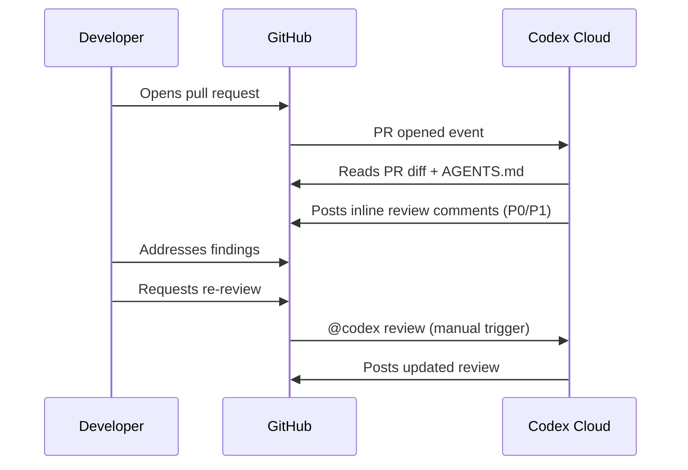
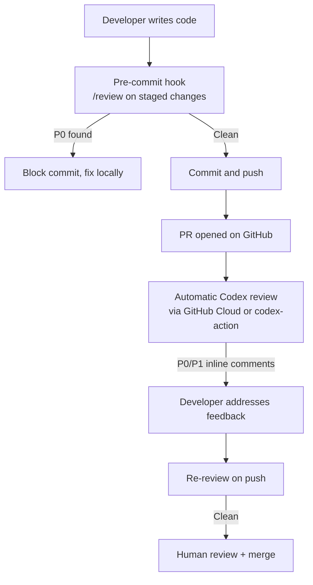

# Codex CLI Automatic Code Review: PR Integration and Pre-Commit Workflows


Code review is where most AI coding tools stop short. Codex CLI closes the loop by providing automated review at every stage of the Git workflow: in the terminal before you commit, on pull requests via the GitHub cloud interface, and inside CI/CD pipelines through `openai/codex-action`. This article covers all three surfaces, the configuration knobs that make each useful, and how `AGENTS.md` ties your team's standards to every review automatically.

---

## The Two Review Surfaces

Codex's review capability lives in two distinct places, and they serve different purposes:

```mermaid
graph LR
    A[Local terminal] -->|/review command| B[Pre-commit / local diff review]
    C[GitHub PR] -->|@codex review comment| D[Cloud-hosted PR review]
    E[CI runner] -->|codex exec + schema| F[Structured pipeline review]
    B --> G[Findings in session transcript]
    D --> H[Inline PR comments]
    F --> I[JSON findings → SCM API]
```

The local `/review` command is read-only and non-destructive — it never touches your working tree.[^1] The GitHub cloud review posts structured inline comments to your pull request the same way a human reviewer would.[^2] The CI path combines `codex exec` with structured JSON output to power programmatic comment publishing across any SCM.

---

## Local Review: The `/review` Command

Within an active Codex CLI session, typing `/review` opens a preset menu offering four review modes:[^1]

| Mode | What it analyses |
|---|---|
| **Branch comparison** | Diff between your current branch and a chosen base; Codex finds the merge base automatically |
| **Uncommitted changes** | Staged, unstaged, and untracked modifications — the "last check before commit" |
| **Commit review** | A specific SHA or recent commit from the log |
| **Custom instructions** | Any of the above with a focused prompt (e.g., "focus on accessibility regressions") |

All modes produce a separate turn in your session transcript, which means you can re-run review as you iterate and compare successive findings side-by-side. Reviews do not modify the working tree.[^1]

### Configuring the Review Model

By default, `/review` uses whatever model the current session is running. You can pin a different model for all reviews by setting `review_model` in `~/.codex/config.toml`:[^1]

```toml
[model]
model = "gpt-5.3-codex"
review_model = "gpt-5.3-codex"   # override for /review sessions
```

This is useful if you run lightweight interactive sessions on a fast model but want the heavier reasoning model for review passes, or vice versa.

---

## Pre-Commit Integration

The "uncommitted changes" mode maps directly to a pre-commit workflow. The recommended pattern is to run a Codex review in `--sandbox=read-only` mode as a git pre-commit hook, blocking the commit if critical findings are reported.[^3]

### Shell Hook Pattern

Create `.git/hooks/pre-commit` (or add to your `pre-commit` config):

```bash
#!/usr/bin/env bash
set -euo pipefail

echo "Running Codex review on staged changes..."

# Run Codex in headless, read-only mode with a focused prompt
codex exec \
  --sandbox=read-only \
  --approval-mode=full-auto \
  "Review only the staged changes in this repository. Report P0 (critical) and P1 (important) issues only. Exit 1 if any P0 issues are found, exit 0 otherwise." \
  2>&1

EXIT_CODE=$?

if [ "$EXIT_CODE" -ne 0 ]; then
  echo "Codex review found critical issues. Commit blocked."
  exit 1
fi
```

For a `pre-commit` framework configuration:

```yaml
# .pre-commit-config.yaml
repos:
  - repo: local
    hooks:
      - id: codex-review
        name: Codex code review
        entry: codex exec --sandbox=read-only --approval-mode=full-auto
        args:
          - "Review staged changes. Report P0 security and correctness issues only. Fail if any found."
        language: system
        pass_filenames: false
        stages: [pre-commit]
```

### Structuring Review Output for Automation

For hooks that need to parse Codex findings programmatically, use `--output-schema` to force structured JSON output:[^4]

```bash
# Generate the schema file once
cat > codex-review-schema.json << 'EOF'
{
  "type": "object",
  "properties": {
    "findings": {
      "type": "array",
      "items": {
        "type": "object",
        "properties": {
          "title":            { "type": "string", "maxLength": 80 },
          "body":             { "type": "string" },
          "confidence_score": { "type": "number", "minimum": 0, "maximum": 1 },
          "priority":         { "type": "integer", "minimum": 0, "maximum": 3 },
          "code_location": {
            "type": "object",
            "properties": {
              "filepath":   { "type": "string" },
              "line_range": {
                "type": "object",
                "properties": {
                  "start": { "type": "integer" },
                  "end":   { "type": "integer" }
                }
              }
            }
          }
        }
      }
    },
    "verdict": { "type": "string" }
  }
}
EOF

# Use in a hook or pipeline
codex exec \
  "Review staged changes for correctness and security." \
  --output-schema codex-review-schema.json \
  | jq '.findings[] | select(.priority == 0)'
```

Priority values run 0–3, where 0 is critical (P0) and 3 is a suggestion.[^4] A hook that blocks on any `priority == 0` finding gives you a reliable CI-style gate locally.

---

## AGENTS.md Review Guidelines

Codex automatically searches your repository for `AGENTS.md` files and applies any `## Review guidelines` section it finds.[^2] The closest `AGENTS.md` to each changed file wins, so you can layer guidance from repository root down to individual packages:

```markdown
## Review guidelines

- Do not log PII or user-identifiable data at any log level.
- Every new HTTP route must be wrapped in the authentication middleware.
- Treat typos in public-facing documentation as P1.
- Flag any use of `eval()` or `exec()` as P0.
- Reject direct SQL string concatenation; require parameterised queries.
```

On GitHub, Codex displays only P0 and P1 findings by default.[^2] If you want lower-severity items surfaced — code style, documentation gaps — explicitly escalate them in your `AGENTS.md` ("Treat inconsistent naming as P1"). This keeps the signal-to-noise ratio under your control rather than accepting the platform default.

Place package-specific rules deeper in the tree. A `payments/AGENTS.md` with PCI-DSS-specific review rules overrides the root for all files under `payments/`, without affecting other directories.

---

## GitHub PR Integration

### Manual Reviews

On any pull request, comment `@codex review` to trigger a review. Codex reacts with 👀, reads the entire PR including dependencies and tests, and posts inline comments.[^2] For one-off focus without changing your permanent configuration:

```
@codex review for security regressions
@codex review for performance bottlenecks in the data layer
```

The focus instruction scopes that single review without modifying `AGENTS.md` or any persistent settings.[^2]

### Automatic Reviews

Enable **Automatic reviews** in [Codex settings](https://chatgpt.com/codex/settings/code-review) to have Codex review every PR automatically on open, without requiring a comment.[^2] This is the right default for teams that want coverage on every merge attempt.



---

## CI/CD: openai/codex-action

For repositories not using GitHub's cloud Codex integration — GitLab, Jenkins, self-hosted GitHub Enterprise, or teams wanting explicit control over the runner environment — `openai/codex-action` provides the same capability inside your own CI pipeline.[^5]

### GitHub Actions Example

```yaml
name: Codex PR Review

on:
  pull_request:
    types: [opened, synchronize]

permissions:
  contents: read
  pull-requests: write

jobs:
  review:
    runs-on: ubuntu-latest
    steps:
      - uses: actions/checkout@v4
        with:
          fetch-depth: 0       # full history for diff accuracy
          ref: ${{ github.event.pull_request.head.sha }}

      # Fetch base ref for diff comparison
      - run: git fetch origin ${{ github.base_ref }}

      - name: Generate review schema
        run: |
          cat > review-schema.json << 'EOF'
          {
            "type": "object",
            "properties": {
              "findings": {
                "type": "array",
                "items": {
                  "type": "object",
                  "properties": {
                    "title":            { "type": "string" },
                    "body":             { "type": "string" },
                    "priority":         { "type": "integer" },
                    "confidence_score": { "type": "number" },
                    "code_location":    { "type": "object" }
                  }
                }
              },
              "verdict": { "type": "string" }
            }
          }
          EOF

      - name: Run Codex review
        id: codex
        uses: openai/codex-action@v1
        with:
          openai-api-key: ${{ secrets.OPENAI_API_KEY }}
          sandbox: workspace-write
          safety-strategy: drop-sudo     # revokes sudo before execution
          prompt: |
            Review the diff between origin/${{ github.base_ref }} and HEAD.
            Focus on correctness, security, and performance.
            Follow any Review guidelines in AGENTS.md files.
          prompt-file: review-schema.json

      - name: Post review comments
        if: steps.codex.outputs.final-message != ''
        uses: actions/github-script@v7
        with:
          script: |
            const findings = JSON.parse('${{ steps.codex.outputs.final-message }}').findings || [];
            for (const f of findings) {
              if (f.priority > 1) continue;   // P0 + P1 only
              await github.rest.pulls.createReviewComment({
                owner: context.repo.owner,
                repo: context.repo.repo,
                pull_number: context.issue.number,
                body: `**${f.title}** (P${f.priority}, confidence: ${(f.confidence_score * 100).toFixed(0)}%)\n\n${f.body}`,
                path: f.code_location?.filepath || '',
                line: f.code_location?.line_range?.end || 1,
                commit_id: '${{ github.event.pull_request.head.sha }}'
              });
            }
```

### Safety Strategy Options

The `safety-strategy` input controls what privileges Codex has on the runner:[^5]

| Value | Behaviour | When to use |
|---|---|---|
| `drop-sudo` (default) | Revokes `sudo` before execution | Public repos, shared runners |
| `unprivileged-user` | Runs under a non-admin account | Enterprise runners with stricter policies |
| `read-only` | Filesystem viewing only, no mutations | Pure review tasks — ensures no accidental writes |
| `unsafe` | No privilege reduction (Windows only) | Self-hosted Windows runners where isolation is external |

For code review specifically, `read-only` is the safest choice: Codex cannot modify the working tree even if a prompt injection attempts to force it.[^5]

### GitLab CI Example

GitLab has no direct equivalent to `codex-action`, so install the binary in `before_script` and call `codex exec` directly:[^4]

```yaml
codex-review:
  stage: test
  image: ubuntu:22.04
  before_script:
    - apt-get update -qq && apt-get install -y -qq curl jq
    - curl -fsSL https://cli.codex.openai.com/install.sh | sh
    - export PATH="$HOME/.local/bin:$PATH"
  script:
    - |
      codex exec \
        --sandbox=read-only \
        --approval-mode=full-auto \
        --output-schema review-schema.json \
        "Review the diff from $CI_MERGE_REQUEST_DIFF_BASE_SHA to HEAD.
         Report P0 and P1 issues only." \
        > review-output.json
    - |
      # Post findings to GitLab MR via API
      jq -r '.findings[] | select(.priority <= 1) |
        "**\(.title)**\n\n\(.body)"' review-output.json | \
      while IFS= read -r body; do
        curl -s --request POST \
          --header "PRIVATE-TOKEN: $GITLAB_API_TOKEN" \
          --data "body=$body" \
          "$CI_API_V4_URL/projects/$CI_PROJECT_ID/merge_requests/$CI_MERGE_REQUEST_IID/notes"
      done
  rules:
    - if: $CI_MERGE_REQUEST_IID
```

---

## Putting It Together: A Layered Review Strategy

The three surfaces complement each other. A mature setup uses all three:



The pre-commit layer provides fast, local feedback without waiting for CI. The PR layer provides the permanent record and inline line-level comments that become part of the code review history. The CI layer gives you cross-platform coverage and a parseable artefact (the JSON schema output) that feeds into dashboards, quality gates, or downstream automation.

---

## Key Configuration Reference

| Setting | Location | Effect |
|---|---|---|
| `review_model` | `~/.codex/config.toml` | Model used by `/review` command |
| `## Review guidelines` | `AGENTS.md` (any level) | Team-specific rules applied to all reviews |
| `--output-schema <file>` | `codex exec` flag | Forces structured JSON output for parsing |
| `safety-strategy: read-only` | `openai/codex-action` input | Prevents filesystem mutation during CI review |
| Automatic reviews toggle | Codex cloud settings | Reviews every new PR automatically |

---

## Citations

[^1]: [Codex CLI Features — /review command](https://developers.openai.com/codex/cli/features) — Official documentation covering the four review modes, read-only behaviour, and `review_model` configuration key.

[^2]: [Use Codex in GitHub — Code Review](https://developers.openai.com/codex/integrations/github) — Official GitHub integration documentation covering `@codex review`, automatic reviews, AGENTS.md `## Review guidelines`, P0/P1 priority levels, and one-off focus instructions.

[^3]: [How to Use Codex CLI for Code Review](https://inventivehq.com/knowledge-base/openai/how-to-use-codex-for-code-review) — Pre-commit workflow patterns and `--sandbox=read-only` usage for blocking hooks.

[^4]: [Build Code Review with the Codex SDK](https://developers.openai.com/cookbook/examples/codex/build_code_review_with_codex_sdk) — Official OpenAI Cookbook guide covering the `--output-schema` flag, structured JSON findings schema (title, body, confidence_score, priority 0–3, code_location), and GitLab CI/Jenkins patterns.

[^5]: [openai/codex-action — GitHub](https://github.com/openai/codex-action) — Official GitHub Action source with full input reference: `safety-strategy` options (drop-sudo, unprivileged-user, read-only, unsafe), `sandbox` modes, and the `final-message` output.
