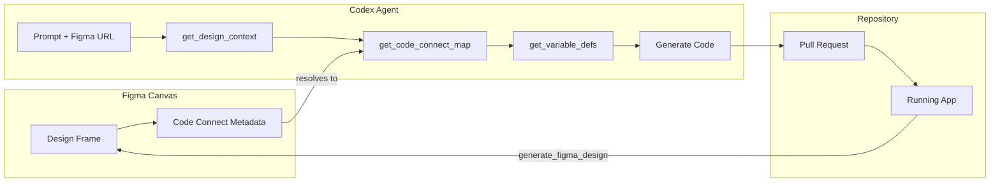

# Codex CLI + Figma MCP: Design-to-Code Workflows


The handoff from designer to developer has always been an expensive boundary. Figma's Model Context Protocol server, launched in partnership with OpenAI in February 2026[^1], collapses that boundary by giving Codex direct, structured access to the Figma canvas — not pixel exports, not PDFs, but live component hierarchies, design tokens, and Code Connect mappings tied to your actual codebase.[^2]

Codex crossed one million weekly active users in March 2026,[^3] and the Figma integration is already one of the most visible examples of what an MCP-first workflow looks like in production. This article covers the setup, the tool surface, the bidirectional workflow, and the practical constraints you will hit in teams.

## Why MCP and Not a Plugin?

Previous Figma-to-code integrations exported static artefacts: Inspect panel JSON, annotated PNGs, or Zeplin specs. An agent consuming those had no way to resolve a component to a real import path, follow a variable reference to a spacing scale, or detect that a Figma node already maps to a `<Button variant="primary">` in your design system.

The Figma MCP server exposes a set of live query tools instead.[^4] Codex calls them on demand, pulling only the context it needs — reducing hallucination risk and avoiding the context-window cost of dumping an entire file's JSON upfront.[^5]

## Deployment Modes

Figma offers two server options.[^6]

**Remote server (recommended):**
Runs on Figma's infrastructure at `https://mcp.figma.com/mcp` via Streamable HTTP transport. No local daemon. Supports write-to-canvas, Code-to-Canvas, FigJam, and Code Connect. Available on all plans — but free and View-seat users are limited to **6 tool calls per month**; Dev and Full seats on paid plans get Tier 1 REST API rate limits.[^6]

**Desktop server:**
Runs locally through the Figma desktop app. Requires a Dev or Full seat on a paid plan. Useful in air-gapped or strict-proxy environments where outbound HTTPS to `mcp.figma.com` is blocked.

## Configuring the Remote Server in Codex CLI

Codex shares a single `~/.codex/config.toml` between the CLI and the VSCode extension.[^7] Add the following block:

```toml
[features]
rmcp_client = true

[mcp_servers.figma]
url = "https://mcp.figma.com/mcp"
bearer_token_env_var = "FIGMA_OAUTH_TOKEN"
```

Set `FIGMA_OAUTH_TOKEN` in your shell environment before launching Codex. The token is obtained by authenticating through the Figma MCP OAuth flow — `codex mcp add` will redirect you.[^8]

For teams that prefer a Personal Access Token over OAuth (simpler for CI), use the STDIO transport with the `figma-developer-mcp` npm package instead:[^9]

```toml
[mcp_servers.figma]
command = "npx"
args = ["-y", "figma-developer-mcp", "--stdio"]
env = { FIGMA_API_KEY = "$FIGMA_TOKEN" }
```

Set `FIGMA_TOKEN` in your shell environment before launching Codex (e.g. `export FIGMA_TOKEN=figd_...`). Generate the token in Figma → **Account Settings → Personal Access Tokens**. The minimum required scopes are: **Current user**, **File content**, **File metadata**, and **Library content**. Add **Library assets** and **Team library content** if your project uses a shared component library.[^9]

> ⚠️ Some users have reported a `"missing field command in mcp_servers.figma"` error when pasting config examples verbatim. Ensure the `[features] rmcp_client = true` block precedes the server block, and restart Codex after editing.[^10]

## The Tool Surface

Once connected, Codex has access to six primary tools from the Figma MCP server:[^11]

| Tool | What it returns |
|---|---|
| `get_design_context` | Structured design data including layout, component hierarchy, and auto-generated React + Tailwind code |
| `get_variable_defs` | Colour, spacing, and typography variables from your Figma library |
| `get_metadata` | Sparse node outline — names, IDs, layer types — without full content (avoids context bloat) |
| `get_screenshot` | PNG capture of a specific node for visual validation |
| `get_code_connect_map` | Mappings of Figma node IDs to existing codebase components (requires Code Connect) |
| `whoami` | Authenticated user identity and seat type — useful for debugging auth issues |

Write-to-canvas operations use two additional tools on the remote server:[^4]

- **`use_figma`** — Create and modify frames, components, variables, and auto-layout programmatically
- **`generate_figma_design`** — Convert a live running web interface into editable Figma frames (Code-to-Canvas)

## Design → Code: The Core Workflow

The fundamental workflow is link-driven.[^2]

1. In Figma, select the frame or component you want to implement.
2. Copy the **Share link** from the browser address bar — this encodes the file key and node ID.
3. Paste the URL into Codex with an instruction:

```
Implement the header navigation from this Figma frame:
https://figma.com/design/kL9xQn2VwM8pYrTb4ZcHjF/DesignSystem?node-id=42-15

Use our existing components from src/components/ui/.
Match spacing tokens from the design variables.
Output TypeScript with Tailwind.
```

Codex calls `get_design_context` to extract the layout and component data, then `get_code_connect_map` to resolve any mapped nodes to existing imports, and finally `get_variable_defs` if spacing or colour tokens are referenced. The agent writes code against your actual component library rather than generic markup — provided Code Connect is configured.

## Code Connect: The Multiplier

`get_design_context` alone returns generic React + Tailwind. Code Connect[^12] is what transforms that into code using your actual components, your import paths, and your prop interfaces.

You set up Code Connect by running the Figma CLI in your repository:

```bash
npx figma connect create --token "$FIGMA_TOKEN"
```

This inspects your component library and publishes connection metadata to Figma. From that point, `get_code_connect_map` returns entries like:

```json
{
  "nodeId": "42:15",
  "component": "Button",
  "importPath": "src/components/ui/Button",
  "props": { "variant": "primary", "size": "md" }
}
```

Without Code Connect, Codex generates structurally correct but codebase-alien output. With it, the generated code reads as though a developer who knows the project wrote it.

## Code → Design: The Roundtrip

The integration is genuinely bidirectional.[^2] When you have a running interface — local dev server, staging, or production — you can ask Codex to push it back into Figma:

```
The local dev server is at http://localhost:3000/dashboard.
Generate a Figma design from the current dashboard view
and place it in the "Reviewed Components" page of our main design file.
```

Codex calls `generate_figma_design`, which uses a headless browser to capture the rendered UI and translates it into native Figma layers.[^1] Designers can then iterate on the canvas and push changes back through the design-to-code path. The loop closes without any manual export step.

## Workflow Architecture



## Project-Scoped MCP Configuration

For monorepos or multi-project setups, scope the Figma MCP to a specific project by placing configuration in `.codex/config.toml` at the repository root (the project must be a trusted project in Codex settings):[^8]

```toml
[mcp_servers.figma]
url = "https://mcp.figma.com/mcp"
bearer_token_env_var = "FIGMA_OAUTH_TOKEN"
```

This is preferable to a global `~/.codex/config.toml` entry when different projects use different Figma organisations or token scopes.

## AGENTS.md Steering

Add a section to your project's `AGENTS.md` to guide how Codex uses the Figma MCP tools, and to enforce design-system consistency:

```markdown
## Figma MCP

When implementing UI from a Figma URL:
1. Call `get_metadata` first to confirm node existence before fetching full context.
2. Always call `get_code_connect_map` — never generate components from scratch
   if a mapped import exists in src/components/ui/.
3. Resolve spacing and colour values via `get_variable_defs`; do not hardcode
   hex or pixel values.
4. Call `get_screenshot` after code generation and compare visually before
   opening a PR.
5. Do not call `use_figma` or `generate_figma_design` without an explicit
   instruction from the user — these write to the shared canvas.
```

The write-to-canvas guard on the last point is important: `use_figma` modifies the shared Figma file, so you do not want it triggered by a misread prompt.

## Practical Constraints

**Rate limits matter at scale.** Six tool calls per month on a Starter plan is trivially exhausted in a single session. Meaningful usage requires a Dev or Full seat on a Professional, Organisation, or Enterprise plan.[^6] Budget accordingly before rolling this out to a team.

**Code Connect setup cost.** Publishing connections requires running the Figma CLI in your repository and maintaining it as the component library evolves. Teams with a mature design system will get immediate value; teams with an ad-hoc component structure will need to invest in design system discipline first.

**Context quality depends on Figma layer hygiene.** `get_design_context` returns what Figma contains — if layers are named "Group 5" and components are detached instances, the output degrades. Semantic layer naming, consistent component usage, and variable application in the design file directly affect code generation quality.[^4]

**Beta pricing horizon.** Write-to-canvas features are currently free during the beta period, but Figma has signalled these will move to a usage-based paid model.[^6] Lock in workflows now but plan for cost.

## Summary

The Figma MCP integration with Codex is the most substantial design-to-code bridge available in 2026. The combination of `get_design_context` for structured layout data, `get_code_connect_map` for component resolution, and `generate_figma_design` for the reverse direction creates a genuinely bidirectional workflow. The friction points are rate limits on lower-tier seats, the upfront investment in Code Connect, and the dependency on good Figma hygiene. For teams that have those foundations, the handoff cost reduction is material.

## Citations

[^1]: OpenAI. "OpenAI Codex and Figma launch seamless code-to-design experience." March 2026. <https://openai.com/index/figma-partnership/>
[^2]: OpenAI Developer Blog. "Building Frontend UIs with Codex and Figma." 2026. <https://developers.openai.com/blog/building-frontend-uis-with-codex-and-figma>
[^3]: Dataconomy. "Figma Integrates OpenAI Codex For Design-to-code Workflow." 26 February 2026. <https://dataconomy.com/2026/02/26/figma-integrates-openai-codex-for-design-to-code-workflow/>
[^4]: Figma Help Center. "Guide to the Figma MCP server." 2026. <https://help.figma.com/hc/en-us/articles/32132100833559-Guide-to-the-Figma-MCP-server>
[^5]: Figma mcp-server-guide. "Figma MCP Server Guide." GitHub. <https://github.com/figma/mcp-server-guide>
[^6]: Figma Developer Docs. "Figma MCP Server — Introduction." 2026. <https://developers.figma.com/docs/figma-mcp-server/>
[^7]: vladimirsiedykh.com. "Codex MCP config: shared TOML setup for CLI and VSCode." 2025. <https://vladimirsiedykh.com/blog/codex-mcp-config-toml-shared-configuration-cli-vscode-setup-2025>
[^8]: OpenAI Developer Docs. "Model Context Protocol — Codex." 2026. <https://developers.openai.com/codex/mcp>
[^9]: betelgeuse.work. "Free Figma MCP Setup Guide — Generate Code with Personal Access Token." 2026. <https://betelgeuse.work/figma-mcp/>
[^10]: GitHub Issues. "Figma MCP server error · Issue #4526 · openai/codex." <https://github.com/openai/codex/issues/4526>
[^11]: DeepWiki. "Figma MCP Server — openai/skills." 2026. <https://deepwiki.com/openai/skills/5.2.1-figma-mcp-server>
[^12]: GitHub Changelog. "Figma MCP server can now generate design layers from VS Code." 6 March 2026. <https://github.blog/changelog/2026-03-06-figma-mcp-server-can-now-generate-design-layers-from-vs-code/>
