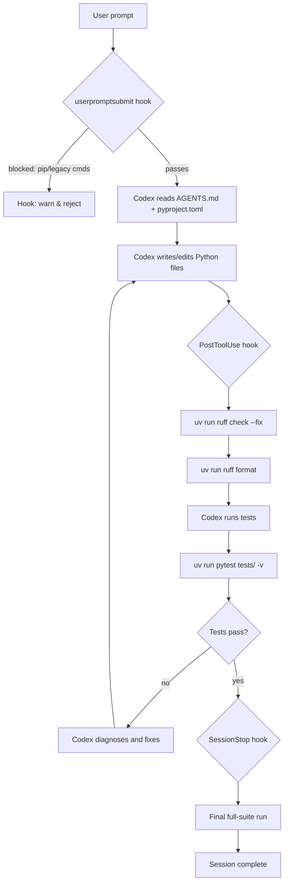

# Codex CLI for Python Teams: Configuration, Conventions and Automation


## Overview

Python teams adopting Codex CLI face a familiar problem: out-of-the-box, the agent will reach for `pip`, `pytest` directly, and whatever Python binary is on the PATH. Left unconfigured, that means inconsistent environments, the wrong package manager, and test commands that diverge from your CI baseline. This article covers the full configuration surface — `AGENTS.md`, `pyproject.toml`, hooks, and CI integration — so Codex operates as a well-behaved member of a modern Python team from the first commit.

There is also a timely piece of context: in March 2026, OpenAI announced it is acquiring Astral, the company behind **uv**, **Ruff**, and **ty**.[^1] The acquisition places the most widely-adopted Python toolchain directly inside the Codex organisation — expect deeper first-class integration over the coming months. For now, the configuration patterns below work today and will only get smoother as that integration matures.

---

## The Modern Python Toolchain

Before looking at Codex-specific configuration, it is worth establishing the canonical toolchain this article targets:

| Tool | Replaces | What it does |
|---|---|---|
| **uv** | pip, venv, pyenv, pipx, poetry | Package manager, resolver, environment manager — written in Rust[^2] |
| **Ruff** | flake8, black, isort, pyupgrade, + 800 others | Linter and formatter, sub-second on large codebases[^3] |
| **ty** | mypy | Static type checker from Astral, also Rust-based |
| **pytest** | — | Test runner; invoked via `uv run pytest` |

The key discipline: **every tool invocation goes through `uv run`**. This guarantees the project's virtual environment is up-to-date before any tool runs, eliminates version drift between developers, and produces a lockfile (`uv.lock`) that CI can pin to.[^4]

---

## Configuring AGENTS.md for Python

Codex reads `AGENTS.md` files up the directory hierarchy, with deeper files taking precedence.[^5] For a Python project, the root `AGENTS.md` should encode the full workflow so that Codex never guesses.

### Minimal starter

```markdown
# AGENTS.md

## Environment
- Python package manager: **uv** — never use `pip` directly
- All tool invocations must go through `uv run` (e.g. `uv run pytest`, `uv run ruff`)
- To add a dependency: `uv add <package>`; for dev deps: `uv add --dev <package>`
- Python version: 3.12 (see `.python-version` or `pyproject.toml`)

## Testing
- Run tests: `uv run pytest tests/ -v`
- Run a single test file: `uv run pytest tests/test_foo.py -v`
- Run with coverage: `uv run pytest --cov=src --cov-report=term-missing`
- All new code must have pytest coverage — no exceptions

## Linting and formatting
- Lint: `uv run ruff check . --fix`
- Format: `uv run ruff format .`
- Type check: `uv run ty check` (or `uv run mypy src/`)
- Run all checks before marking a task done: lint → format → type check → tests

## Commit conventions
- Conventional Commits: `feat:`, `fix:`, `refactor:`, `test:`, `docs:`
- Do not commit `uv.lock` changes unless dependency versions were intentionally updated
```

### Monorepo variant

In a monorepo with multiple services, place a root `AGENTS.md` for shared conventions and per-service `AGENTS.md` files for service-specific overrides. Codex merges them in scope order.[^5]

```markdown
# services/payments/AGENTS.md

## Service-specific overrides
- This service uses FastAPI; models live in `src/payments/models/`
- Integration tests require a running Postgres instance: `docker compose up -d db`
- Run integration tests: `uv run pytest tests/integration/ -m integration`
- Unit tests only: `uv run pytest tests/unit/`
```

---

## pyproject.toml: The Single Source of Truth

All tool configuration should live in `pyproject.toml` — no `.flake8`, no `setup.cfg`, no `mypy.ini`. Ruff reads `[tool.ruff]`, pytest reads `[tool.pytest.ini_options]`, and uv reads `[tool.uv]`.[^6]

```toml
[project]
name = "my-service"
version = "0.1.0"
requires-python = ">=3.12"
dependencies = [
    "fastapi>=0.115",
    "pydantic>=2.9",
]

[tool.uv]
dev-dependencies = [
    "pytest>=8.3",
    "pytest-cov>=6.0",
    "pytest-asyncio>=0.24",
    "ruff>=0.9",
    "mypy>=1.13",
]

[tool.pytest.ini_options]
testpaths = ["tests"]
asyncio_mode = "auto"
addopts = "--tb=short -q"

[tool.ruff]
target-version = "py312"
line-length = 100

[tool.ruff.lint]
select = [
    "E",   # pycodestyle errors
    "F",   # pyflakes
    "I",   # isort
    "UP",  # pyupgrade
    "B",   # flake8-bugbear
    "SIM", # flake8-simplify
]
ignore = ["E501"]

[tool.ruff.lint.isort]
known-first-party = ["my_service"]

[tool.ruff.format]
quote-style = "double"
indent-style = "space"

[tool.mypy]
strict = true
ignore_missing_imports = true
```

With this in place, Codex can discover your complete project conventions from a single file.

---

## Codex Hooks for Python Enforcement

Codex CLI's hooks system[^7] lets you intercept and validate tool use at the session level. For Python teams the most valuable hooks are:

### PostToolUse: auto-lint after writes

Fire Ruff after every file write to keep the working tree clean. Create `.codex/hooks.toml`:

```toml
[[hooks]]
event = "PostToolUse"
tool_names = ["write_file", "edit_file", "patch_file"]
command = "uv run ruff check ${file} --fix --quiet && uv run ruff format ${file} --quiet"
run_in_background = true
```

### SessionStop: run full test suite before exit

```toml
[[hooks]]
event = "SessionStop"
command = "uv run pytest tests/ -q --tb=short"
blocking = true
on_failure = "warn"
```

This makes the test gate explicit — Codex is reminded to leave the suite green before finishing a session.

### userpromptsubmit: enforce uv discipline

```toml
[[hooks]]
event = "userpromptsubmit"
match_text = ["pip install", "pip add", "python -m pytest", "python -m ruff"]
command = """
echo "⚠️  Use uv for all Python operations: 'uv add <pkg>', 'uv run pytest', 'uv run ruff'"
exit 1
"""
```

This blocks prompts that contain legacy invocations before Codex ever processes them.[^8]

---

## Workflow Architecture

A well-configured Python session flows like this:



---

## pytest Patterns Worth Encoding in AGENTS.md

Several pytest conventions are non-obvious to an agent without explicit guidance:

### Fixture discovery

Tell Codex where fixtures live to avoid duplication:

```markdown
## pytest conventions
- Shared fixtures are in `tests/conftest.py` — check there before creating new ones
- Per-service fixtures live in `tests/<service>/conftest.py`
- Use `pytest-asyncio` with `asyncio_mode = "auto"` — no manual `@pytest.mark.asyncio` needed
- HTTP client fixtures use `httpx.AsyncClient` with ASGI transport, not `requests`
```

### Coverage thresholds

```markdown
## Coverage
- Minimum coverage: 90% overall, 100% for `src/payments/`
- Coverage command: `uv run pytest --cov=src --cov-report=term-missing --cov-fail-under=90`
- Do not add `# pragma: no cover` without a comment explaining why
```

### Test categorisation

```markdown
## Test markers
- `@pytest.mark.unit` — no I/O, runs in CI on every push
- `@pytest.mark.integration` — requires Docker services, runs in CI on PR only
- `@pytest.mark.slow` — long-running, skip with `-m "not slow"` locally
- Default local command: `uv run pytest -m "unit" -q`
```

---

## CI/CD Integration

A GitHub Actions workflow that mirrors the AGENTS.md conventions exactly:

```yaml
name: ci

on: [push, pull_request]

jobs:
  quality:
    runs-on: ubuntu-latest
    steps:
      - uses: actions/checkout@v4

      - name: Install uv
        uses: astral-sh/setup-uv@v5
        with:
          version: "latest"
          enable-cache: true

      - name: Set up Python
        run: uv python install

      - name: Install dependencies
        run: uv sync --frozen --all-extras

      - name: Lint
        run: uv run ruff check . --output-format=github

      - name: Format check
        run: uv run ruff format --check .

      - name: Type check
        run: uv run mypy src/

      - name: Test
        run: uv run pytest tests/ -q --cov=src --cov-report=xml --cov-fail-under=90

      - name: Upload coverage
        uses: codecov/codecov-action@v4
```

The key discipline: use `uv sync --frozen` in CI, not `uv sync`. The `--frozen` flag prevents uv from updating `uv.lock` mid-run, ensuring the locked versions in the repository are exactly what runs.[^2]

---

## The Astral Acquisition: What It Means Now

OpenAI's acquisition of Astral (announced 19 March 2026, subject to regulatory approval) brings the uv, Ruff, and ty teams inside the Codex organisation.[^1] The stated goal is to let Codex "interact more directly with the tools developers already use" across the full development lifecycle.[^9]

In practical terms, today the integration is at the configuration level — AGENTS.md, hooks, and pyproject.toml as described above. The roadmap hints at:

- **Ruff as a built-in Codex step** — generated code linted and formatted before it is presented to the user
- **uv-aware dependency resolution** — Codex understanding `uv.lock` constraints when suggesting new packages
- **ty integration** — type errors surfaced as first-class agent feedback rather than a separate tool invocation

None of this changes what you should configure today. The patterns above are stable and will only get deeper toolchain support as the integration progresses.

---

## Quick-Start Checklist

For a team setting up Codex CLI against an existing Python project:

1. **Install uv** — `curl -LsSf https://astral.sh/uv/install.sh | sh`[^2]
2. **Migrate tooling config** into `pyproject.toml` using the template above
3. **Add `AGENTS.md`** at the repo root with environment, testing, and lint conventions
4. **Create `.codex/hooks.toml`** with PostToolUse ruff enforcement and SessionStop test gate
5. **Add per-service `AGENTS.md` files** for any service with non-standard test commands
6. **Update CI** to use `astral-sh/setup-uv` and `uv sync --frozen`
7. **Run `/init` in Codex** to let it audit your existing `AGENTS.md` against the actual project structure

The single most impactful change is step 3: an `AGENTS.md` that clearly states `uv run pytest` and `uv run ruff` eliminates the majority of "wrong tool" mistakes before they happen.

---

## Citations

[^1]: [OpenAI to acquire Astral — openai.com, March 2026](https://openai.com/index/openai-to-acquire-astral/)
[^2]: [uv documentation — astral.sh/uv](https://docs.astral.sh/uv/)
[^3]: [Ruff documentation — astral.sh/ruff](https://docs.astral.sh/ruff/)
[^4]: [Setting up testing with pytest and uv — pydevtools.com](https://pydevtools.com/handbook/tutorial/setting-up-testing-with-pytest-and-uv/)
[^5]: [Custom instructions with AGENTS.md — OpenAI Developers](https://developers.openai.com/codex/guides/agents-md)
[^6]: [Configuring Ruff — Astral Docs](https://docs.astral.sh/ruff/configuration/)
[^7]: [Codex CLI Hooks Deep Dive — codex-resources, 2026-03-26](/codex-resources/articles/2026-03-26-codex-cli-hooks-deep-dive/)
[^8]: [Claude Code Hooks for uv Projects — pydevtools.com](https://pydevtools.com/blog/claude-code-hooks-for-uv/)
[^9]: [Astral to join OpenAI — astral.sh/blog/openai, March 2026](https://astral.sh/blog/openai)
