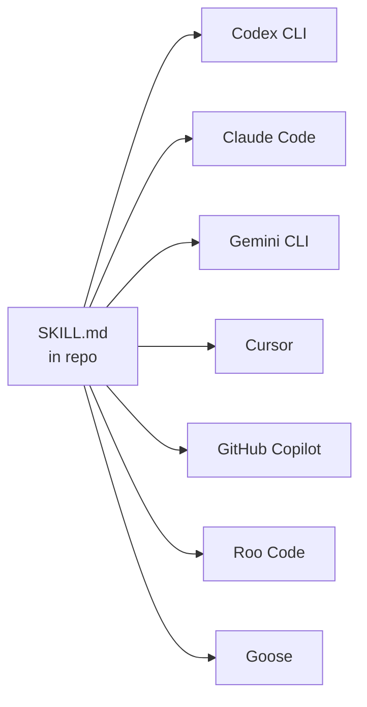
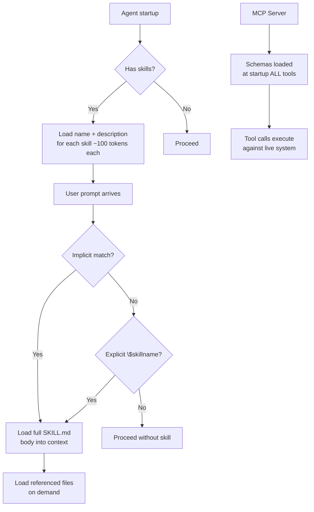

# The Codex CLI Skills Ecosystem: agentskills.io and Community Skills


## Overview

Agent Skills started as an Anthropic internal format and, within months of being released as an open standard in December 2025[^1], became the dominant mechanism for extending AI coding agents across the entire tooling ecosystem. As of early 2026, the format is supported by over 30 platforms including Codex CLI, Claude Code, Gemini CLI, GitHub Copilot, Cursor, VS Code, Roo Code, Goose, and many more[^2]. Understanding the ecosystem — and knowing how to author, discover, and install skills effectively — is increasingly a core competency for teams running agentic workflows at scale.

This article covers the Agent Skills specification, Codex CLI's specific integration, the skills.sh discovery layer, and practical patterns for writing distributable skills.

## What Is the Agent Skills Standard?

The Agent Skills specification, governed at [agentskills.io](https://agentskills.io)[^3], defines a portable, file-based format for packaging agent capabilities. A skill is a directory containing at minimum a `SKILL.md` file. The agent loads the skill's metadata at startup, then loads the full instructions on demand when it decides the skill is relevant.

```
pdf-processing/
├── SKILL.md          # Required: frontmatter + instructions
├── scripts/          # Optional: executable helpers
├── references/       # Optional: long-form reference docs
└── assets/           # Optional: templates, schemas
```

The key design principle is **progressive disclosure**: only the `name` and `description` (~100 tokens each) are loaded at startup across all available skills. The full `SKILL.md` body is loaded only when a skill is activated, and files in `scripts/`, `references/`, and `assets/` are loaded only when explicitly referenced[^3]. This means you can have dozens of skills installed without materially inflating the context at session start.

## The SKILL.md Format

The `SKILL.md` file uses YAML frontmatter followed by freeform Markdown instructions[^3]:

```markdown
---
name: pdf-processing
description: >
  Extracts text and tables from PDF files, fills PDF forms, and merges
  multiple PDFs. Use when working with PDF documents or when the user
  mentions PDFs, forms, or document extraction.
license: Apache-2.0
compatibility: Requires Python 3.14+ and pdfplumber
metadata:
  author: example-org
  version: "1.0"
allowed-tools: Bash(python3:*) Read Write
---

## Extracting text

Use `scripts/extract.py` to extract plain text from a PDF:

```bash
python3 scripts/extract.py input.pdf > output.txt
```

## Merging files

...

```

### Frontmatter fields

| Field | Required | Notes |
|---|---|---|
| `name` | Yes | 1–64 chars, lowercase letters/numbers/hyphens only, matches directory name |
| `description` | Yes | 1–1024 chars; describe *what* and *when* |
| `license` | No | SPDX identifier or path to bundled licence file |
| `compatibility` | No | System requirements, intended platform |
| `metadata` | No | Arbitrary key-value map |
| `allowed-tools` | No | Space-delimited pre-approved tools (experimental) |

The `description` field is load-bearing: it is the signal the agent uses to decide whether to activate the skill implicitly. Write it precisely — describe the task domain and include specific keywords that match likely user prompts.

The `name` field must match the parent directory name exactly and follow strict kebab-case rules: no uppercase, no consecutive hyphens, no leading or trailing hyphens[^3].

## Codex CLI Skills Integration

### Installation scan order

Codex scans the following directories in priority order[^4]:

```

$CWD/.agents/skills          # Project-level (highest priority)
$CWD/../.agents/skills       # Parent directory
$REPO_ROOT/.agents/skills    # Repository root
$HOME/.agents/skills         # User-level
/etc/codex/skills            # System/admin
Built-in system skills       # Lowest priority

```

This layered lookup is intentional: a project-level skill overrides a user-level skill of the same name, which overrides a system-level skill. Teams can standardise workflows by committing skills into `.agents/skills/` in their repository.

### Invocation policy

By default, Codex invokes skills implicitly when the user's prompt matches the skill description. You can disable this on a per-skill basis with an `agents/openai.yaml` file inside the skill directory:

```yaml
policy:
  allow_implicit_invocation: false
```

With implicit invocation disabled, the skill only activates when the user explicitly references it by name using the `$skillname` convention. This is useful for sensitive or expensive skills you want to keep under explicit user control[^4].

### Trust tiers

Codex organises skills into three trust tiers managed by `$skill-installer`[^5]:

- **System** — preinstalled and signed by OpenAI; loaded automatically
- **Curated** — reviewed by OpenAI; installable by name from the official catalogue
- **Experimental** — community-built; require explicit installation by full path or URL

### Built-in skills

Codex ships with two built-in system skills worth knowing[^5]:

- **`$skill-creator`** — scaffold a new skill interactively; describe the capability you want and Codex bootstraps the directory structure
- **`$skill-installer`** — discovery, install, update, and removal lifecycle management

### Curated skills catalogue

As of March 2026, the official curated skills available via `$skill-installer` include[^5]:

| Skill | Purpose |
|---|---|
| `gh-address-comments` | Work through GitHub PR review comments |
| `gh-fix-ci` | Diagnose and repair failing CI runs |
| `notion-knowledge-capture` | Save research and findings to Notion |
| `notion-meeting-intelligence` | Process meeting notes into structured Notion pages |
| `notion-research-documentation` | Document research workflows in Notion |
| `notion-spec-to-implementation` | Drive implementation from a Notion spec |

The experimental folder at `github.com/openai/skills` also contains `create-plan`, which instructs Codex to produce a structured plan before writing any files[^5].

### Installing skills

```bash
# Install a curated skill by name
# (inside a Codex session)
$skill-installer gh-fix-ci

# Install an experimental skill by path
$skill-installer install https://github.com/openai/skills/tree/main/skills/.experimental/create-plan

# Disable a skill without deleting it (config.toml)
```

```toml
# ~/.codex/config.toml
[[skills.config]]
name = "gh-address-comments"
enabled = false
```

Restart Codex after modifying `config.toml`[^5].

## The skills.sh Ecosystem

### Discovery and the leaderboard

Launched by Vercel on 20 January 2026[^6], [skills.sh](https://skills.sh) is the central directory and leaderboard for the cross-platform skills ecosystem. It aggregates published skill packages, ranks them by total installs, and provides category filtering. Top skills in the web-development category (React, Next.js tooling) from `vercel-labs/agent-skills` had already accumulated over 100,000 installs within weeks of launch[^6].

### The `npx skills` CLI

The `skills` package manager is the recommended way to install community skills outside of any single agent's native installer:

```bash
# List skills available in a repository
npx skills add vercel-labs/agent-skills --list

# Install specific skills to specific agents
npx skills add vercel-labs/agent-skills \
  --skill frontend-design \
  --skill skill-creator \
  -a claude-code -a codex

# Install all skills from a repo globally
npx skills add vercel-labs/agent-skills --all -g

# Non-interactive (CI/CD safe)
npx skills add vercel-labs/agent-skills \
  --skill frontend-design -g -a claude-code -y
```

The CLI supports GitHub shorthand, full GitHub URLs, GitLab URLs, arbitrary git URLs, and local paths. The `-a codex` flag installs into Codex's expected skill directory automatically[^6].

### Platform interoperability in practice

Because all 30+ adopting platforms use the same `SKILL.md` format, a skill you write for Codex works identically in Claude Code, Cursor, Gemini CLI, and Roo Code without modification. This means team skills committed to your repository are portable to whichever tool a developer prefers, which substantially reduces the maintenance overhead of managing agent context across a heterogeneous team[^2].



## Writing Distributable Skills

### Structure for progressive disclosure

The 100-token startup budget per skill means your frontmatter description must be dense and precise. The skill body should stay under 500 lines; push detailed reference material into `references/`:

```
my-skill/
├── SKILL.md             # ≤ 500 lines: core workflow
├── references/
│   ├── REFERENCE.md     # Full API reference; loaded on demand
│   └── EDGE_CASES.md    # Troubleshooting; loaded on demand
└── scripts/
    └── run.py           # Invoked by instructions in SKILL.md
```

### Description engineering

The description is simultaneously the skill's activation trigger and its user-facing documentation. A useful mental model: write it as if you were authoring the `match` clause in a routing rule.

```yaml
# Too vague — will trigger on almost anything
description: Helps with code tasks.

# Too narrow — misses legitimate triggers
description: Runs eslint on JavaScript files.

# Well-calibrated
description: >
  Runs ESLint, Prettier, and TypeScript type checking on JavaScript and
  TypeScript projects. Use when fixing lint errors, enforcing code style,
  checking types, or preparing code for review. Supports flat config
  (eslint.config.js) and legacy .eslintrc formats.
```

### Scripts as deterministic anchors

Skills work best when complex, multi-step operations are encoded in scripts rather than natural-language instructions. The agent interprets the Markdown body, but a script runs deterministically:

```python
#!/usr/bin/env python3
# references/run-tests.py
"""Run the full test suite and emit a structured JSON report."""
import subprocess, json, sys

result = subprocess.run(
    ["pytest", "--json-report", "--json-report-file=/tmp/report.json", "-q"],
    capture_output=True, text=True
)
with open("/tmp/report.json") as f:
    report = json.load(f)

print(json.dumps({
    "passed": report["summary"]["passed"],
    "failed": report["summary"]["failed"],
    "errors": [t["nodeid"] for t in report["tests"] if t["outcome"] == "failed"]
}))
```

Point to it from `SKILL.md`:

```markdown
Run the test suite and read the JSON output:
scripts/run-tests.py
```

### Validation before publishing

Use the `skills-ref` reference library before sharing a skill publicly[^3]:

```bash
npx skills-ref validate ./my-skill
```

This checks frontmatter validity, name constraints, and specification compliance.

### Security hygiene

Security researchers have identified malicious skills in the wild that abuse the `scripts/` directory or embed prompt-injection payloads in the `SKILL.md` body[^7]. Treat installed skills like you would third-party code: review `SKILL.md` and any scripts before activation, avoid installing from untrusted sources, prefer skills from the curated tier or well-known community repositories.

## Architectural View: Skills vs MCP

Skills and MCP (Model Context Protocol) solve adjacent but distinct problems:



Skills are **lazy-loaded, text-based context**: the agent reads instructions and executes them using its own capabilities. MCP servers are **live integrations**: the agent calls structured tool endpoints against running processes. Use skills for procedural knowledge and conventions; use MCP for live data access, authenticated APIs, and stateful operations[^8].

## Summary

The Agent Skills ecosystem has consolidated quickly. The format is stable, the cross-platform interoperability is genuine, and the tooling around discovery and installation has matured significantly. For Codex CLI specifically:

- Commit project skills to `.agents/skills/` in your repository — the entire team gets consistent agent behaviour automatically
- Use `$skill-installer` for curated and experimental OpenAI-catalogue skills; use `npx skills` for community skills from skills.sh
- Write descriptions that are activation triggers, not summaries
- Keep `SKILL.md` under 500 lines; delegate reference material to `references/`
- Prefer scripted implementations over prose for deterministic steps
- Review skill content before installing from untrusted sources

## Citations

[^1]: Anthropic released the Agent Skills open standard on 18 December 2025. [Agent Skills – Overview](https://agentskills.io/home)

[^2]: Over 30 agent platforms have adopted the Agent Skills standard as of early 2026. [agentskills.io/home](https://agentskills.io/home)

[^3]: Agent Skills specification, including SKILL.md format, frontmatter fields, progressive disclosure model, and validation tooling. [agentskills.io/specification](https://agentskills.io/specification)

[^4]: Codex CLI skills installation directories, invocation policy, and `agents/openai.yaml` configuration. [Agent Skills – Codex | OpenAI Developers](https://developers.openai.com/codex/skills)

[^5]: Codex CLI `$skill-installer`, trust tiers, curated skills catalogue, and `config.toml` disable pattern. [GitHub – openai/skills](https://github.com/openai/skills)

[^6]: Vercel launched skills.sh and the `npx skills` CLI on 20 January 2026. [Introducing skills, the open agent skills ecosystem – Vercel](https://vercel.com/changelog/introducing-skills-the-open-agent-skills-ecosystem)

[^7]: Security research has identified malicious skills exploiting `scripts/` directories and prompt injection. ⚠️ Specific research report not independently verified — treat as directional guidance from community reports.

[^8]: Skills vs MCP architectural distinction based on the progressive-disclosure design documented in the Agent Skills specification. [agentskills.io/specification](https://agentskills.io/specification)
