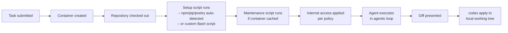
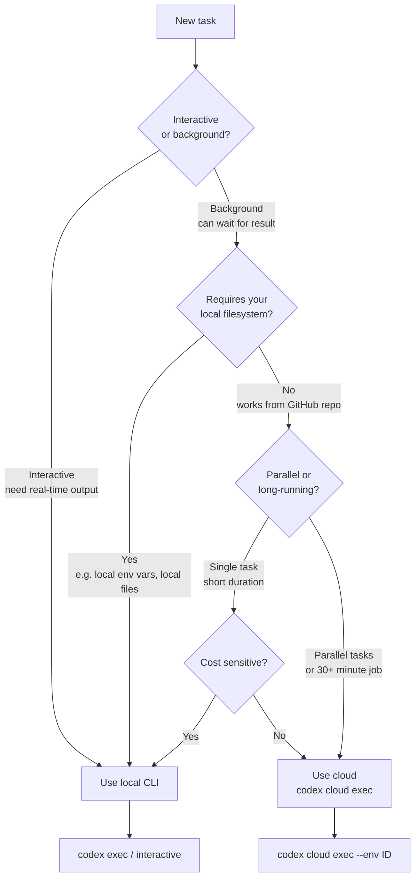

# Codex Cloud vs Codex Local: When to Run in the Cloud

Codex ships as two distinct execution surfaces: a local CLI that runs code on your machine, and a cloud agent that provisions isolated containers in OpenAI's infrastructure. Most teams reach for the CLI by default, but the cloud mode has a fundamentally different execution contract — and understanding when to switch changes how you architect agentic workflows.

This article breaks down the mechanics of each mode, the cost model that governs credit consumption, the `codex cloud exec` command surface, and the decision framework for choosing between them.

---

## The Two Surfaces

### Local (CLI)

The local CLI runs entirely on your machine.[^1] When you invoke `codex` in a terminal, the agent reads your working directory, edits files, and executes commands inside a sandboxed process scoped to that directory. The session is interactive by default — you see output in real time, approve or reject changes, and stay in the loop.

Key characteristics:

- Your local filesystem is the working directory
- OS-level sandboxing (Landlock on Linux, Seatbelt on macOS)
- Approval gates controlled by `--sandbox` policy
- Session state persisted in `~/.codex/sessions/`
- Runs as long as your terminal stays open

### Cloud (Codex Cloud)

Codex Cloud provisions an isolated container in OpenAI's infrastructure for each task.[^2] The agent checks out your GitHub repository, runs dependency setup scripts, and executes code entirely inside that container. You are disconnected from the task by default — you submit it, go do something else, and collect the resulting diff when it's done.

Key characteristics:

- Isolated container with a checkout of your GitHub repository
- 1–30 minute autonomous execution window[^3]
- Internet access disabled by default during agent execution[^4]
- Results delivered as a diff; apply locally with `codex apply`
- Accessible via chatgpt.com/codex, the CLI `codex cloud` subcommand, or Slack/Linear

---

## The Cost Model

Credit consumption differs materially between the two modes. According to the official pricing page, a GPT-5.4 local task costs approximately **7 credits**, while the equivalent cloud task costs approximately **34 credits** — roughly a **5× premium** for cloud execution.[^5]

This makes sense: cloud tasks spin up and warm a container, check out your repo, run setup scripts, and provision the full environment before the agent even starts. That overhead is real work the platform is doing on your behalf.

### Plan-tier summary[^6]

| Plan | Local messages (GPT-5.4) | Cloud tasks (GPT-5.3-Codex) | Window |
|------|--------------------------|------------------------------|--------|
| Plus ($20/mo) | 33–168 | 10–60 | 5 hours |
| Pro ($200/mo) | 223–1,120 | 50–400 | 5 hours |
| Business ($30/user/mo) | 110–560 | Included | 5 hours |

> **Note:** Local and cloud limits share the same 5-hour usage window.[^7] Running cloud tasks during your interactive coding session depletes the same pool as local messages.

### Credit strategy

- Use **GPT-5.4-mini** for local tasks where full reasoning isn't required — it extends local message limits by approximately 2.5–3.3× compared to GPT-5.4.[^8]
- Reserve cloud tasks for work that genuinely warrants an isolated environment.
- Keep MCP server count low; each active MCP server adds context tokens that inflate per-message cost.[^9]

---

## Environment Provisioning

Before the cloud agent runs your task, Codex prepares a container:[^10]



The default container image is `openai/codex-universal` — a pre-built image with Python, Node.js, and common toolchains already installed.[^11] You can pin specific runtime versions via the Codex dashboard.

**Container caching:** Codex caches warmed containers for up to 12 hours.[^12] If you submit a second task to the same environment before the cache expires, setup time is negligible. The cache auto-invalidates when setup scripts or environment variables change.

**Secrets:** Encrypted secrets are available only during the setup phase — not during agent execution — reducing the attack surface for prompt injection.[^13]

**Internet access:** Setup scripts have full internet access for fetching dependencies. The agent execution phase has internet access disabled by default; admins can configure an allowlist of trusted domains (e.g., package registries).[^14]

---

## The `codex cloud` Command Surface

The CLI provides a full `cloud` subcommand hierarchy:

```bash
# Interactive picker — browse active and finished tasks
codex cloud

# Submit a task directly
codex cloud exec --env ENV_ID "Add rate limiting to the payments API"

# Best-of-N: generate 3 candidate solutions, pick the best
codex cloud exec --env ENV_ID --attempts 3 "Refactor auth middleware"

# List recent tasks (scriptable)
codex cloud list --env ENV_ID --limit 20

# List as JSON for piping
codex cloud list --env ENV_ID --json

# Apply a completed cloud task diff to your local tree
codex apply
```

### Finding your environment ID

Press `Ctrl+O` inside the interactive `codex cloud` picker to select an environment, or copy the ID from the Codex web dashboard.[^15]

### Exit codes and CI integration

`codex cloud exec` exits with a non-zero status if task submission fails, making it straightforward to integrate into shell scripts or CI pipelines:[^16]

```bash
#!/usr/bin/env bash
set -euo pipefail

ENV_ID="${CODEX_ENV_ID:?Required}"
codex cloud exec --env "$ENV_ID" \
  "Review all TODOs in src/ and open GitHub issues for each one"

echo "Cloud task submitted. Monitor at https://chatgpt.com/codex"
```

---

## Slack and Linear Triggers

Codex Cloud integrates with two collaboration tools, enabling asynchronous task delegation from where work is already happening.

### @Codex in Slack

Tag `@Codex` in any Slack channel or thread.[^17] Codex reads the thread context, selects the appropriate environment, starts work in its cloud sandbox, and posts a link to the resulting pull request back in the original thread.

```
@Codex the payment service is throwing 503s under load.
Here's the stack trace: [paste]. Fix it and open a PR.
```

Codex picks up the task, accesses the linked GitHub repo, and responds with a PR URL — no dashboard interaction required.[^18]

### @Codex in Linear

Assign a Linear issue to `@Codex` and it will pick up the task, implement a fix or feature based on the issue description, and propose a pull request.[^19] This is particularly useful for triage-style delegation: mark issues with a `codex-ready` label and route them to Codex automatically.

> **Enterprise note:** Slack and GitHub connectors are managed via Admin connector settings. Once configured, ChatGPT and Codex automatically reference indexed content when relevant.[^20]

---

## Decision Framework: Local vs Cloud



### Use **local CLI** when

- You want to stay in the interactive loop — see output as it happens
- The task needs your local environment variables, local databases, or machine-specific tooling
- You're iterating rapidly on a prompt and want fast feedback cycles
- Cost matters and the task doesn't need an isolated cloud container
- You need the agent to run commands against a running local dev server

### Use **Codex Cloud** when

- You want to walk away while the agent works — parallelise across multiple tasks
- The task is self-contained against a GitHub repository
- You're triggering from Slack or Linear and don't want to switch contexts
- You need compliance-tracked execution — cloud tasks are visible in the Compliance API; local execution is not[^21]
- You want best-of-N solutions (use `--attempts 2–4` to generate multiple candidates)
- The task is security-sensitive and you want a fresh, ephemeral container with no access to your local machine

---

## Hybrid Patterns

The two modes compose well. The most productive teams use both:

### Pattern 1: Cloud draft, local refine

Submit a large feature to cloud overnight. In the morning, `codex apply` pulls the diff locally, then you iterate interactively with the CLI:

```bash
# Morning routine
codex cloud list --json | jq '.[0].id'    # find last task
codex apply                                 # pull diff to working tree
codex "Clean up the PR diff — split into atomic commits"
```

### Pattern 2: Local spike, cloud scale-out

Prototype a solution locally with interactive Codex, then use `codex cloud exec` to apply the same pattern across multiple repositories or environments in parallel:

```bash
REPOS=("payments-service" "auth-service" "notification-service")
for repo in "${REPOS[@]}"; do
  ENV_ID=$(codex cloud list --json | jq -r ".[] | select(.repo == \"$repo\") | .envId" | head -1)
  codex cloud exec --env "$ENV_ID" \
    "Apply the rate-limiting pattern from PR #123 to this service"
done
```

### Pattern 3: Slack-triggered, CLI-applied

A teammate tags `@Codex` in Slack with a bug report. Codex generates a PR. You review it on GitHub, request changes via comment, Codex iterates, and you merge. You never leave your normal review workflow.

---

## What Doesn't Transfer to Cloud

Not everything works in the cloud execution environment:

| Capability | Local CLI | Cloud |
|------------|-----------|-------|
| Local filesystem access | ✅ | ❌ (GitHub only) |
| Running local dev servers | ✅ | ❌ |
| Local environment variables | ✅ | Configured in dashboard only |
| Interactive approval gates | ✅ | ❌ (fully autonomous) |
| MCP servers (local) | ✅ | ⚠️ Cloud-compatible MCPs only |
| Compliance API tracking | ❌ | ✅ |
| Container caching (12h) | ❌ | ✅ |
| Best-of-N attempts | ❌ | ✅ (`--attempts`) |
| Slack/Linear triggers | ❌ | ✅ |

---

## Summary

Codex Cloud and the local CLI are complementary execution models, not alternatives. The 5× credit premium for cloud tasks is the cost of fully isolated, autonomous, background execution — a fair trade for long-running or parallelisable work. Use the local CLI for interactive sessions where you want control; use cloud for everything you want to delegate completely.

The `codex cloud exec --attempts N` flag is particularly underused: submitting 3 candidates for a hard problem and choosing the best is a meaningful quality lever with no additional orchestration required.

---

## Citations

[^1]: OpenAI, "CLI – Codex," developers.openai.com/codex/cli, accessed March 2026. https://developers.openai.com/codex/cli

[^2]: OpenAI, "Web – Codex," developers.openai.com/codex/cloud, accessed March 2026. https://developers.openai.com/codex/cloud

[^3]: SmartScope, "OpenAI Codex CLI: Official Description & Setup Guide (Updated 2026-02)," smartscope.blog, February 2026. https://smartscope.blog/en/generative-ai/chatgpt/openai-codex-cli-comprehensive-guide/

[^4]: OpenAI, "Cloud environments – Codex web," developers.openai.com/codex/cloud/environments, accessed March 2026. https://developers.openai.com/codex/cloud/environments

[^5]: OpenAI, "Pricing – Codex," developers.openai.com/codex/pricing, accessed March 2026. https://developers.openai.com/codex/pricing

[^6]: Ibid.

[^7]: OpenAI Help Center, "Using Codex with your ChatGPT plan," help.openai.com, accessed March 2026. https://help.openai.com/en/articles/11369540-using-codex-with-your-chatgpt-plan

[^8]: UI Bakery Blog, "OpenAI Codex Pricing (2026): API Cost, Credits & Usage Limits Explained," uibakery.io, 2026. https://uibakery.io/blog/openai-codex-pricing

[^9]: OpenAI, "Features – Codex CLI," developers.openai.com/codex/cli/features, accessed March 2026. https://developers.openai.com/codex/cli/features

[^10]: OpenAI, "Cloud environments – Codex web," developers.openai.com/codex/cloud/environments, accessed March 2026. https://developers.openai.com/codex/cloud/environments

[^11]: OpenAI, "openai/codex-universal," github.com/openai/codex-universal, accessed March 2026. https://github.com/openai/codex-universal

[^12]: OpenAI, "Cloud environments – Codex web," developers.openai.com/codex/cloud/environments, accessed March 2026. https://developers.openai.com/codex/cloud/environments

[^13]: Ibid.

[^14]: Ibid.

[^15]: OpenAI, "Command line options – Codex CLI," developers.openai.com/codex/cli/reference, accessed March 2026. https://developers.openai.com/codex/cli/reference

[^16]: Ibid.

[^17]: OpenAI, "Codex is now generally available," openai.com/index/codex-now-generally-available/, accessed March 2026. https://openai.com/index/codex-now-generally-available/

[^18]: Ibid.

[^19]: Ibid.

[^20]: OpenAI, "Admin Setup – Codex," developers.openai.com/codex/enterprise/, accessed March 2026. https://developers.openai.com/codex/enterprise/

[^21]: OpenAI, "Pricing – Codex," developers.openai.com/codex/pricing, accessed March 2026. https://developers.openai.com/codex/pricing
