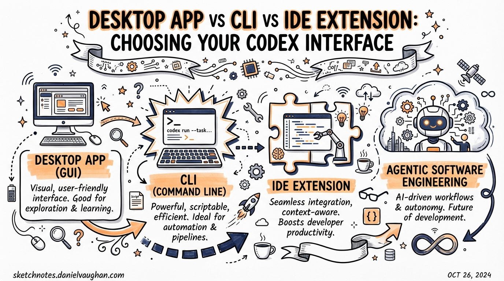
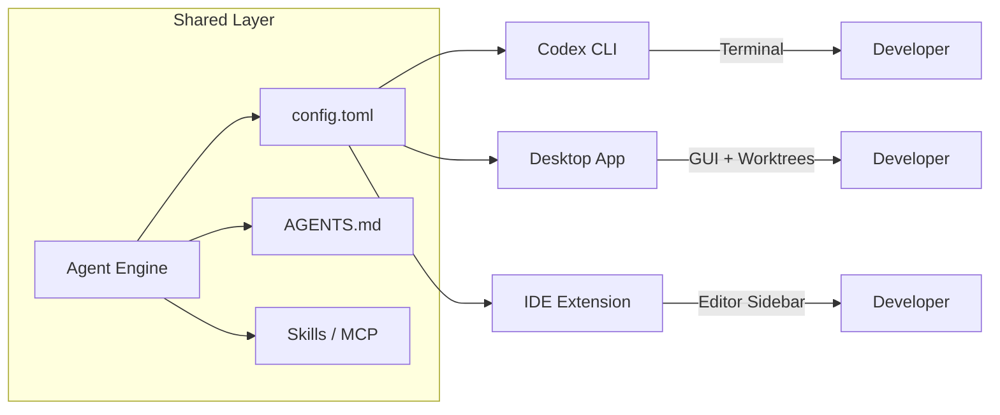
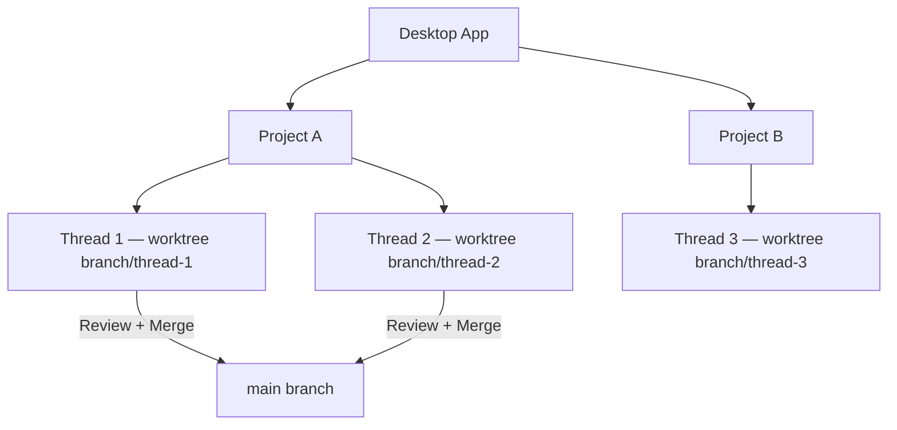
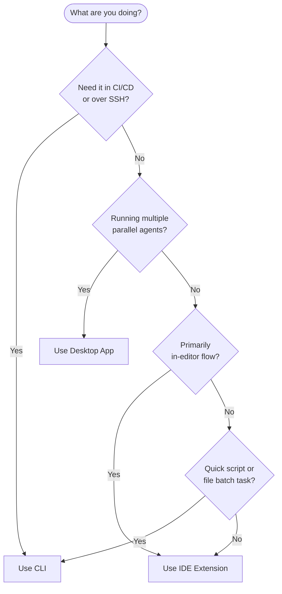

# Desktop App vs CLI vs IDE Extension: Choosing Your Codex Interface

**Date:** 2026-03-27
**Tags:** codex-cli, desktop-app, ide-extension, workflow, tooling, decision-guide

Codex ships as three distinct surfaces backed by the same intelligence: a terminal CLI, a desktop app, and an IDE extension. Each is a legitimate production tool — the question is not which is best in the abstract, but which fits your workflow, machine, and task type. This article works through that decision systematically.

## The Three Surfaces at a Glance

As of March 2026 all three interfaces share the same underlying agent, model stack, configuration format (`~/.codex/config.toml`), and AGENTS.md file resolution — changes made in one context propagate to the others.[^1] The key differences are UI, approval surface, platform support, and the degree of IDE integration.



## Codex CLI

The CLI is the original Codex surface, introduced in April 2025.[^2] It runs as a process in your terminal, accepts prompts interactively or via `codex exec` in non-interactive mode, and exposes the full configuration surface through command flags and `config.toml`.

### When the CLI wins

**CI/CD pipelines.** `codex exec` integrates cleanly into GitHub Actions, Jenkins, and cron jobs. There is no GUI to dismiss and no approvals to click through — use `--approval-mode full-auto` with a sandboxed runner.[^3]

**Remote SSH sessions.** The IDE extension is not available over SSH. The desktop app is a macOS/Windows GUI. The CLI is the only option when you are on a remote host, a headless server, or a production machine mid-incident.

**Shell composability.** Pipe output, chain with `jq`, redirect to files, wrap in scripts. The CLI is a Unix citizen; the other surfaces are not.

**Transparency.** Every tool call, approval prompt, and compaction event is visible in the terminal. For security-sensitive work or regulated environments where audit trails matter, the CLI's verbosity is an asset.

### Key CLI flags

```bash
# Run a task non-interactively, full sandbox, exit on completion
codex exec --approval-mode full-auto --model gpt-5.4 "Add error handling to api/handler.go"

# Force a specific reasoning effort
codex --model gpt-5.4-mini --reasoning-effort low "Rename variable foo to bar in utils.ts"

# Load a named profile from config.toml
codex --profile ci-review "Review PR diff for security issues"
```

### CLI limitations

- No visual diff review — you read raw file output or run `git diff` yourself
- No native worktree management UI — you wire this up yourself with `git worktree` commands
- Interactive multi-session work requires opening multiple terminal panes manually

## Codex Desktop App

The desktop app launched on macOS on 2 February 2026,[^4] with Windows support following on 4 March 2026 with native PowerShell and Windows sandbox.[^5] It is not a code editor — OpenAI explicitly positions it as an orchestration layer, arguing that traditional IDEs are not the right tool for agentic multi-project workflows.[^6]

### Architecture: threads, projects, and worktrees

The app organises work into **projects** (one per codebase) and **threads** (conversation scopes within a project). Each agent thread gets its own isolated Git worktree, preventing merge conflicts when multiple agents modify overlapping files simultaneously.[^7]



### What the app adds over the CLI

**Visual diff review.** Inline diffs with comment threads, no `git diff` invocation needed.

**Native Git operations.** Commit, push, and pull-request creation from within the interface.[^8]

**Automations.** Scheduled tasks run in dedicated background worktrees with isolation unavailable in CLI workflows.[^8]

**IDE sync.** When the Codex IDE Extension is open in the same project, the app auto-syncs and offers an "IDE context" option in the composer — the agent sees your currently viewed file without you explicitly referencing it.[^1]

**Voice input.** Hold `Ctrl+M` in the composer to dictate prompts.[^8]

**Floating window.** Detachable conversation threads that stay on top during active coding.

### When the desktop app wins

- **Parallel feature work:** Managing three or four agent threads simultaneously, each on an isolated branch, and visually reviewing diffs before merging is the app's primary use case
- **Automations:** Scheduled maintenance, daily digest generation, or nightly refactoring passes run cleanly as background worktree tasks
- **Non-technical contributors:** Product managers reviewing agent output or approving diffs benefit from the visual interface

### Desktop app limitations

- **No built-in editor.** Quick code tweaks still require jumping to an IDE.[^4]
- **macOS/Windows only.** Linux is not yet supported (as of March 2026). ⚠️
- **Locked to OpenAI's model stack.** No routing to alternative models.[^4]

## IDE Extension

The IDE extension embeds Codex as a sidebar panel in VS Code and its forks (Cursor, Windsurf, and other VS Code-compatible editors). A separate JetBrains plugin supports IntelliJ, Rider, PyCharm, and WebStorm — it accepts ChatGPT login, API key, or JetBrains AI subscription.[^9]

The VS Code extension is stable on macOS and Linux; Windows support is experimental as of this writing.[^9]

### Approval modes

The extension exposes three approval modes directly from the sidebar:[^9]

| Mode | Behaviour |
|---|---|
| Chat | Conversational, no autonomous edits |
| Agent | Autonomous within working directory; network and external writes require approval |
| Agent (Full Access) | Maximum autonomy, equivalent to `full-auto` in the CLI |

### Context shortcuts

Because the agent is embedded in your editor, file context is implicit. You can reference open files with `@filename` and drag images directly into the prompt (hold Shift in VS Code).[^10]

Cloud delegation — offloading a large task to Codex servers while you continue editing — is built in. The extension tracks progress and surfaces the remote diff for local application, preserving conversation context throughout.[^10]

### When the IDE extension wins

- **Tight edit-compile-test loops.** The agent sees your cursor position and open buffers; prompts are shorter because the context is already there
- **Inline review.** Diffs appear where you are already looking, not in a separate window
- **JetBrains shops.** The only surface with native JetBrains support
- **Transition from Copilot.** Teams migrating from GitHub Copilot get the most familiar UX

### IDE extension limitations

- Not available over SSH
- No worktree management UI — parallel sessions require coordinating manually
- Less suited to scripted, non-interactive batch work

## Decision Framework

The flowchart below maps common decision points to the right surface:



### Quick-reference table

| Scenario | Winner | Runner-up |
|---|---|---|
| CI pipeline / `codex exec` | CLI | — |
| Remote SSH debugging | CLI | — |
| Parallel feature branches | Desktop App | CLI + tmux |
| Scheduled automations | Desktop App | CLI + cron |
| Edit-compile-test loop | IDE Extension | CLI |
| JetBrains shop | IDE Extension | — |
| Visual diff review | Desktop App | IDE Extension |
| Security-sensitive audit | CLI | — |
| Linux host | CLI | IDE Extension |

## Configuration is Shared — Start There

Because `~/.codex/config.toml` and your project-level AGENTS.md files are read by all three surfaces, configure them first. Skills, MCP servers, profiles, and sandbox rules you define once are available everywhere.[^1] The per-surface choice then becomes a question of UX rather than capability.

```toml
# ~/.codex/config.toml — applies to CLI, desktop app, and IDE extension
[agent]
model = "gpt-5.4"
model_reasoning_effort = "medium"
approval_mode = "suggest"

[mcp.servers.github]
command = "npx"
args = ["-y", "@modelcontextprotocol/server-github"]

[profiles.ci]
model = "gpt-5.4-mini"
model_reasoning_effort = "low"
approval_mode = "full-auto"
```

## The Multi-Surface Pattern

Most power users do not pick one interface — they use all three for different phases:[^11]

1. **Exploration and planning** — IDE Extension, where in-editor context makes scoping prompts fast
2. **Parallel execution** — Desktop App, where multiple worktree threads run concurrently while you do other work
3. **CI validation** — CLI via `codex exec`, where the same agent runs headlessly against the merged result

The surfaces are not competing products; they are different views of the same agent, optimised for different workflow stages.

## Citations

[^1]: OpenAI Developers – Codex IDE Extension features (shared config, IDE sync): <https://developers.openai.com/codex/ide/features>
[^2]: OpenAI – Codex CLI original announcement, April 2025: <https://openai.com/index/openai-codex/>
[^3]: Codex CLI – `codex exec` documentation and non-interactive mode: <https://github.com/openai/codex>
[^4]: Verdent AI – Codex App First Impressions 2026: <https://www.verdent.ai/guides/codex-app-first-impressions-2026>
[^5]: devclass.com – Codex Windows app launch, 4 March 2026: <https://www.devclass.com/development/2026/02/05/traditional-ides-not-the-right-tool-for-development-with-agentic-ai-openai-claims/4090132>
[^6]: devclass.com – OpenAI on traditional IDEs and agentic AI: <https://www.devclass.com/development/2026/02/05/traditional-ides-not-the-right-tool-for-development-with-agentic-ai-openai-claims/4090132>
[^7]: Verdent AI – parallel agent worktree isolation: <https://www.verdent.ai/guides/codex-app-first-impressions-2026>
[^8]: OpenAI Developers – Codex app features (Git integration, automations, voice): <https://developers.openai.com/codex/app/features>
[^9]: OpenAI Developers – Codex IDE extension overview and JetBrains support: <https://developers.openai.com/codex/ide>
[^10]: OpenAI Developers – IDE extension features (cloud delegation, @filename, image support): <https://developers.openai.com/codex/ide/features>
[^11]: inventivehq.com – CLI vs IDE Extension vs Cloud comparison: <https://inventivehq.com/blog/cli-vs-ide-vs-cloud-ai-coding>
