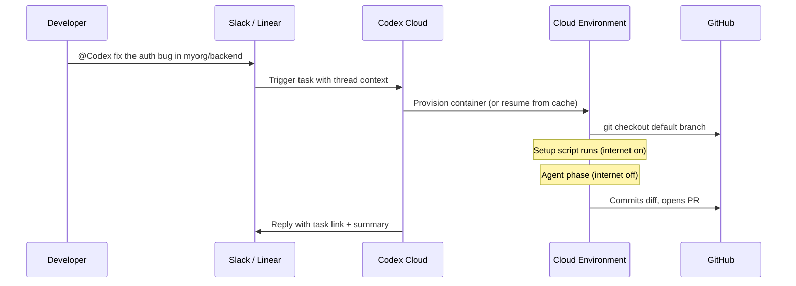
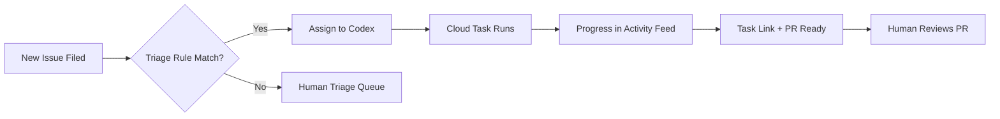

# Codex in Slack and Linear: Triggering Cloud Tasks from Collaboration Tools


When OpenAI shipped Codex to **General Availability** in early 2026[^1], the headline was a shift in *where* developers hand off work. Alongside the CLI and IDE extension, OpenAI launched native integrations with Slack and Linear, letting teams trigger autonomous cloud tasks without opening a terminal. This article covers the mechanics of both integrations, the underlying Cloud Environment model, the `codex cloud` CLI, and the enterprise admin controls you need before rolling this out at scale.

---

## The Cloud Task Model

All three surfaces — Slack, Linear, and `codex cloud` — share the same execution substrate. When you trigger a task, Codex:

1. Provisions (or resumes from cache) an isolated container based on a configured **Cloud Environment**[^2]
2. Checks out the target repository's default branch
3. Runs the agent loop: editing, testing, validating
4. Surfaces a diff and a pull request link for review

Critically, the agent has **no internet access by default** during the execution phase — only during the setup script phase when dependencies are installed[^3]. Traffic that is permitted routes through an HTTP/HTTPS proxy, limiting prompt injection via external content at runtime.



---

## Cloud Environments

Before either integration works, you need at least one **Cloud Environment** — the spec Codex uses to build the container your agent runs in[^2].

An environment contains:

- A **setup script** — runs once on creation; install dependencies here (npm, pip, yarn, etc.)
- An optional **maintenance script** — runs when a cached container is resumed
- **Environment variables** — available for the full task duration
- **Secrets** — encrypted at rest, injected during setup only, then removed before the agent phase[^3]
- A **repo map** — repositories the environment may access

Codex caches container state for up to **12 hours**[^3], invalidating automatically if setup scripts, env vars, or secrets change. The base image is `openai/codex-universal` with common runtimes pre-installed[^4].

---

## Codex in Slack

### Setup

1. Enable **Codex Cloud Tasks** in ChatGPT settings and connect GitHub
2. Create at least one Cloud Environment scoped to your repository
3. Install the **OpenAI Codex Slack app** from Codex settings
4. Invite `@Codex` to target channels (Slack prompts this on first mention)

**Plan requirement:** Plus, Pro, Business, Edu, or Enterprise. Tasks consume usage credits on Business and Enterprise plans[^5].

### Triggering a Task

Mention `@Codex` in any channel or thread:

```
@Codex fix the null pointer in the payment processor — see the stack trace above
```

Codex reads thread history for context, so you rarely need to repeat what's already there. To pin a specific repo:

```
@Codex implement the feature described here in myorg/backend-api
```

Codex reacts with 👀, then posts a task link and — unless an admin has disabled it — a summary of results[^5].

### Environment Selection

Codex automatically picks the best-matching environment and defaults to the most recently used one if ambiguous[^5]. If it picks the wrong repo, reply in-thread specifying the correct one, then re-mention `@Codex`.

### Enterprise Admin Controls

Enterprise admins can disable **"Allow Codex Slack app to post answers on task completion"**[^5]. With this off, Codex replies with a task link only — no generated content appears in the channel. Useful for regulated environments where LLM output must be reviewed before reaching public channels.

---

## Codex in Linear

### Setup

1. Connect GitHub and create a Cloud Environment
2. Install the **Linear connector** from Codex settings
3. Mention `@Codex` in any issue comment to authenticate your Linear account[^6]

Enterprise workspaces require admin approval before the connector is available[^6].

### Triggering Tasks

**Direct assignment:** Assign the issue to Codex like any team member. Progress updates appear in the Activity feed.

**Comment mention:**

```
@Codex implement the changes described in this issue in myorg/backend-api
```

Both methods produce the same outcome: a cloud task runs, updates post to the issue timeline, and a task link appears on completion[^6].

### Automatic Triage Rules

The most operationally powerful feature: automated issue delegation.

1. **Settings → [Team] → Workflow → Triage → Create rule**
2. Set action to **Delegate → Codex**

Any issue matching the rule's criteria that enters triage is automatically assigned to Codex[^6]. Tasks run under the **issue creator's account**.



Good starting rules: issues labelled `good-first-fix`, filed against a sandbox repo, or auto-tagged as regressions with clear reproduction steps.

### Environment Resolution

Codex resolves environments in order[^6]:

1. Explicit repo mention in the comment (`in myorg/backend-api`)
2. Linear's suggestion based on issue context
3. Matching environment from the repo map
4. Most recently used environment as fallback
5. Error if no suitable environment exists

### Local MCP Access

To give a **local** Codex session (CLI, app, IDE extension) access to Linear issues:

```bash
codex mcp add linear --url https://mcp.linear.app/mcp
```

Or add manually to `~/.codex/config.toml`:

```toml
[mcp_servers.linear]
url = "https://mcp.linear.app/mcp"
```

Then authenticate:

```bash
codex mcp login linear
```

This is the local path for reading/writing Linear issues from a CLI session — separate from cloud task delegation[^6].

---

## `codex cloud` CLI

For terminal-native developers, `codex cloud` exposes the same cloud task capability without switching to Slack or Linear[^7]:

```bash
# Interactive TUI: browse and apply recent cloud tasks
codex cloud

# Submit a task to a specific environment
codex cloud exec --env ENV_ID "implement the new settings page"

# Best-of-N: 3 independent attempts, Codex returns the best
codex cloud exec --env ENV_ID --attempts 3 "fix the memory leak"

# List recent tasks (scriptable, exits non-zero on failure)
codex cloud list
```

Running `codex cloud` without arguments opens a picker and **applies the most recent task's diff** to your local tree — useful for pulling cloud work back without leaving the terminal. `--attempts 1–4` runs N independent executions and selects the best result[^7].

---

## Choosing Your Surface

| Scenario | Surface |
|---|---|
| Task arises in Slack conversation | `@Codex` in thread |
| Bug already tracked in Linear | Assign to Codex or comment `@Codex` |
| Want best-of-3 attempts | `codex cloud exec --attempts 3` |
| Overnight task, no terminal | Any cloud surface |
| Team member without dev environment | Slack or Linear |
| Interactive iteration with `/fork` | Local `codex` CLI |
| Embedding in pipeline or internal tool | `codex cloud exec` or TypeScript SDK |

---

## Enterprise Rollout Notes

**Access gating:** Both integrations require workspace admin approval before users can enable them[^5][^6]. Plan this into your rollout — the apps cannot be self-served.

**Secrets hygiene:** Secrets are removed before the agent phase[^3]. Do not store production credentials as environment variables if they shouldn't be accessible during agent execution.

**Triage scope:** Start with a narrow triage rule (sandbox repo, specific label) and widen once you have confidence in output quality. Auto-assigning all inbound issues without filters is inadvisable.

**Cost accounting:** Cloud tasks triggered via Slack and Linear consume usage credits[^5]. Track usage via the Codex analytics dashboard and set team budgets before enabling broad access.

---

## Citations

[^1]: OpenAI. "Codex is now generally available." [openai.com/index/codex-now-generally-available/](https://openai.com/index/codex-now-generally-available/)
[^2]: OpenAI Developers. "Codex Cloud Environments." [developers.openai.com/codex/cloud/environments](https://developers.openai.com/codex/cloud/environments)
[^3]: OpenAI Developers. "Cloud Environments — Container Management and Security." [developers.openai.com/codex/cloud/environments](https://developers.openai.com/codex/cloud/environments)
[^4]: OpenAI. "openai/codex-universal — Universal base image." [github.com/openai/codex-universal](https://github.com/openai/codex-universal)
[^5]: OpenAI Developers. "Use Codex in Slack." [developers.openai.com/codex/integrations/slack](https://developers.openai.com/codex/integrations/slack)
[^6]: OpenAI Developers. "Use Codex in Linear." [developers.openai.com/codex/integrations/linear](https://developers.openai.com/codex/integrations/linear)
[^7]: OpenAI Developers. "Codex CLI Changelog." [developers.openai.com/codex/changelog](https://developers.openai.com/codex/changelog)
