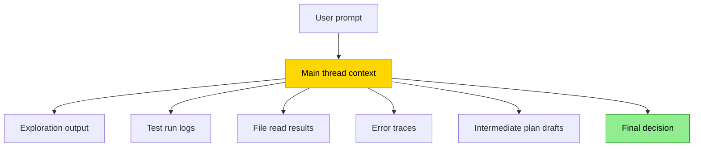
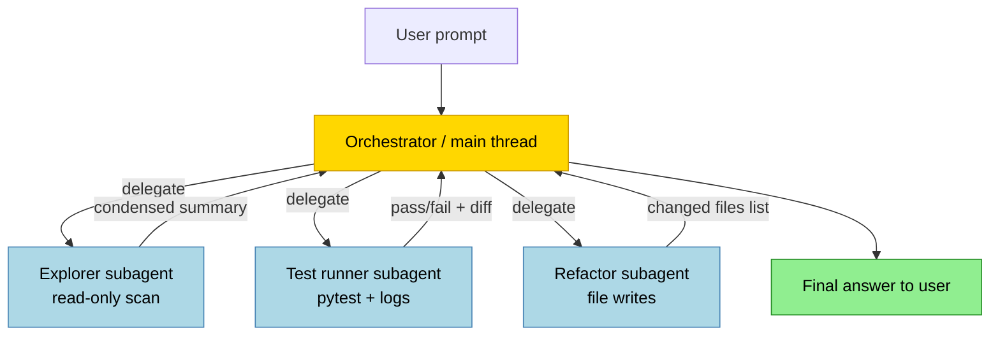

# Context Window Management: Avoiding Compaction with Sub-Agent Delegation


---

## The Problem Nobody Wants to Admit

Long Codex sessions degrade. Not catastrophically — the model does not forget your instructions — but its reliability erodes as the context fills with tool output noise, intermediate stack traces, half-explored dead-ends, and discarded hypotheses. This is **context rot**, and it is one of the primary failure modes for agentic workflows that run more than a few minutes.[^1]

The naive fix is compaction. Codex CLI includes both manual (`/compact`) and automatic compaction, and they work — but they have costs. Every compaction is a lossy operation. The model generates a summary, discards the raw history, and carries forward an `encrypted_content` item that preserves latent state but not the literal record.[^2] Multiple compaction passes in a single session compound the loss. OpenAI's own documentation includes the warning: *"Long conversations and multiple compactions can cause the model to be less accurate."*[^3]

The better strategy is to **prevent the context from filling in the first place** — and that is exactly what strategic subagent delegation achieves.

---

## How Context Fills: The Single-Thread Trap

In a single-thread Codex session, everything accumulates in one place:



Everything the agent does — every `cat`, every `grep`, every failing test run — lands in the same context the model uses to reason about your high-level requirements. Useful signal gets buried. The model starts hedging based on stale intermediate state. Token count climbs toward the compaction threshold.

This is not a theoretical concern. Practitioners building complex multi-agent systems in early 2026 identified context window coordination as the primary bottleneck: *"Agents can't endlessly compact/recycle in the same context window — we need either smarter harnesses or something which provides more delegation."*[^4]

---

## The Delegation Pattern: Keep the Main Thread Clean

The subagent model inverts the structure. The main thread holds the brief, requirements, and final decisions. Child threads do the noisy work and return summaries.



The main context sees three clean summaries, not three context windows' worth of raw output. Its token usage grows slowly. The model retains full fidelity on the high-level task throughout the session.[^5]

---

## What Codex Provides

### Built-In Agent Roles

Codex ships with three built-in agent definitions:[^6]

| Role | Purpose | Context strategy |
|---|---|---|
| **default** | General-purpose orchestration | Holds requirements and decisions |
| **worker** | Execution-heavy implementation and fixes | Isolated write context |
| **explorer** | Read-heavy codebase scanning | Isolated read context; returns condensed results |

Custom agents live in `~/.codex/agents/` (personal) or `.codex/agents/` (project-level).

### Explicit Delegation Only

Codex does not spawn subagents automatically.[^7] You must explicitly trigger delegation:

```
Spawn two agents in parallel:
- one explorer to map all database query callsites in src/
- one worker to stub the new UserRepository interface

Wait for both, then summarise the results before writing any code.
```

The phrasing matters. Signals like "spawn", "delegate", "in parallel", or "one agent per point" reliably trigger the multi-agent path.

### Depth and Concurrency Config

Control the multi-agent topology in `~/.codex/config.toml`:[^8]

```toml
[agents]
max_depth = 1          # default; root = depth 0, direct children = depth 1
max_threads = 6        # default concurrent agent threads
```

`max_depth = 1` allows the orchestrator to spawn direct children but prevents those children from spawning their own children. This is the right default — recursive fan-out with a high depth limit compounds token usage exponentially.

---

## Context Compaction: When You Still Need It

Delegation is not a complete substitute for compaction. Long single-agent tasks — refactors spanning hundreds of files, extended debugging sessions — will still approach the limit. Understanding the compaction mechanics helps you tune correctly.

### Automatic Compaction

The `model_auto_compact_token_limit` threshold triggers automatic history compression:[^9]

```toml
# ~/.codex/config.toml
model_auto_compact_token_limit = 180000   # tokens; unset = model default
```

Default thresholds vary by model (approximately 180k–244k tokens). When the rendered token count crosses the threshold, Codex compacts the conversation and inserts a special `type=compaction` item containing `encrypted_content` — an opaque, machine-optimised representation of the session state.[^10]

Note: since v0.100.0, values above approximately 90% of the context window are silently clamped, even if you specify a higher limit explicitly.[^11] If you need to push sessions long, delegation is more reliable than raising this threshold.

### Manual Compaction

Invoke `/compact` at any time to trigger a compaction pass on demand. The v0.117.0 release improved manual compaction by queuing follow-up messages during the compaction operation, preventing conversation continuity breaks.[^12]

You can also supply a custom compaction prompt:

```toml
# ~/.codex/config.toml
compact_prompt = """
Summarise the session. Preserve:
- all file paths touched
- all decisions taken and their rationale
- the current TODO list
- any open questions

Omit: raw command output, test logs, stack traces.
"""
```

Or load it from a file:

```toml
experimental_compact_prompt_file = ".codex/compact-prompt.md"
```

### Compaction vs. Claude Code

Codex's compaction approach differs meaningfully from Claude Code's. Codex uses an opaque `encrypted_content` item optimised for latent state preservation — you cannot inspect or override it at the message level. Claude Code's compaction block is human-readable, and you can steer it via `CLAUDE.md`.[^13] Neither approach is lossless; the difference is transparency vs. model-side optimisation.

---

## Designing for Context Efficiency

### Task Decomposition Before You Start

The single highest-leverage intervention is **task decomposition at prompt time**. Define the delegation boundaries in your initial message rather than waiting for the context to fill:

```
I need to migrate the auth module from JWT to session cookies.

Before writing any code:
1. Spawn an explorer to catalogue every callsite that reads/writes the JWT (src/, tests/)
2. Spawn a second explorer to find all middleware and route guards that depend on auth state
3. Bring the two summaries back here before we plan the migration
```

This keeps exploration output out of the orchestrator's context entirely.

### Model Selection for Subagents

Match the model to the task to control cost:[^14]

```toml
# .codex/agents/explorer.toml
[agent]
model = "gpt-5.4-mini"
description = "Read-heavy codebase explorer"

[model_settings]
reasoning_effort = "low"
```

```toml
# .codex/agents/architect.toml
[agent]
model = "gpt-5.4"
description = "High-level planning and final decision agent"

[model_settings]
reasoning_effort = "high"
```

`gpt-5.4-mini` is well-suited to exploration, file review, and summarisation — tasks where speed and throughput matter more than deep reasoning.[^15] Use `gpt-5.4` where architectural judgement is required.

### Return Summaries, Not Raw Output

Instruct your subagents explicitly to return condensed results. Raw tool output from an explorer subagent can itself be thousands of tokens — enough to push the orchestrator toward compaction.

```
Summarise your findings in:
- A bullet list of affected files (path only, no content)
- A one-sentence description of each module's dependency on the JWT
- Total callsite count
```

The main thread receives 20 lines, not 2,000.

### AGENTS.md Scope Control

Keep your project-level `AGENTS.md` focused. Over-detailed AGENTS.md files contribute to context inflation on every agent turn — the file is injected at session start and counts against your budget. Delegate deep context to role-specific config files rather than front-loading it all into the root AGENTS.md:

```
# AGENTS.md (root — keep concise)
See .codex/agents/ for role-specific instructions.
Default model: gpt-5.4.
Test command: uv run pytest -q.
```

---

## Monitoring Context Usage

In interactive sessions, the token counter in the CLI footer shows the current context usage. Watch for it approaching your `model_auto_compact_token_limit`. If you see it climbing quickly on a single task, that is a signal to restructure as a delegated workflow.

For multi-agent sessions, use `/agent` to jump between threads and inspect their individual token usage. Approval overlays from child threads surface with a thread label — press `o` to open that thread and review before approving.[^16]

---

## When Not to Delegate

Subagent delegation is not always the right tool:

- **Short tasks**: The overhead of spawning agents, waiting for results, and consolidating them costs more tokens than simply running the task inline.
- **Write-heavy parallel workflows**: Concurrent file writes without explicit coordination introduce merge conflicts. Parallellise reads freely; serialise writes.
- **Deeply dependent tasks**: If step B requires the output of step A in precise detail (not a summary), keeping them in a single thread preserves fidelity.
- **Recursive delegation**: Raising `max_depth` beyond 1 is rarely necessary and can trigger runaway fan-out. Keep the default.[^17]

---

## Summary

Context rot is real and it degrades agent reliability over long sessions. Compaction treats the symptom; delegation prevents it. The pattern is straightforward: define an orchestrator that holds requirements and decisions, delegate bounded noisy work to child agents, and return condensed summaries rather than raw output. Combined with appropriate `max_depth` and `max_threads` configuration, model selection tuned to task type, and lean AGENTS.md files, this keeps the main context clean across sessions that would otherwise require multiple compaction passes.

---

## Citations

[^1]: OpenAI Codex Subagents documentation — context pollution and context rot: [https://developers.openai.com/codex/concepts/subagents](https://developers.openai.com/codex/concepts/subagents)

[^2]: Context compaction `encrypted_content` item: [https://developers.openai.com/api/docs/guides/compaction](https://developers.openai.com/api/docs/guides/compaction)

[^3]: OpenAI warning on long conversations and compaction accuracy: [https://community.openai.com/t/automatically-compacting-context/1376290](https://community.openai.com/t/automatically-compacting-context/1376290)

[^4]: Practitioner assessment of context window coordination as a bottleneck (Feb 2026): [https://calv.info/agents-feb-2026](https://calv.info/agents-feb-2026)

[^5]: Subagent delegation — keeping the main thread clean: [https://pas7.com.ua/blog/en/codex-subagents-explained-2026](https://pas7.com.ua/blog/en/codex-subagents-explained-2026)

[^6]: Built-in agent roles (default, worker, explorer): [https://developers.openai.com/codex/subagents](https://developers.openai.com/codex/subagents)

[^7]: Codex explicit delegation requirement: [https://developers.openai.com/codex/subagents](https://developers.openai.com/codex/subagents)

[^8]: `agents.max_depth` and `agents.max_threads` configuration reference: [https://developers.openai.com/codex/config-reference](https://developers.openai.com/codex/config-reference)

[^9]: `model_auto_compact_token_limit` configuration key: [https://developers.openai.com/codex/config-reference](https://developers.openai.com/codex/config-reference)

[^10]: `encrypted_content` and compaction mechanics: [https://tonylee.im/en/blog/codex-compaction-encrypted-summary-session-handover](https://tonylee.im/en/blog/codex-compaction-encrypted-summary-session-handover)

[^11]: Silent clamping of `model_auto_compact_token_limit` since v0.100.0: [https://github.com/openai/codex/issues/11805](https://github.com/openai/codex/issues/11805)

[^12]: v0.117.0 manual compaction improvements: [https://developers.openai.com/codex/changelog](https://developers.openai.com/codex/changelog)

[^13]: Codex vs Claude Code compaction transparency comparison: [https://gist.github.com/badlogic/cd2ef65b0697c4dbe2d13fbecb0a0a5f](https://gist.github.com/badlogic/cd2ef65b0697c4dbe2d13fbecb0a0a5f)

[^14]: Model selection for subagent roles — Codex documentation: [https://developers.openai.com/codex/concepts/subagents](https://developers.openai.com/codex/concepts/subagents)

[^15]: `gpt-5.4-mini` for exploration and read-heavy subagent tasks: [https://developers.openai.com/codex/cli/features](https://developers.openai.com/codex/cli/features)

[^16]: Approval overlay and `/agent` thread navigation: [https://developers.openai.com/codex/subagents](https://developers.openai.com/codex/subagents)

[^17]: `max_depth` default and recursive fan-out risk: [https://developers.openai.com/codex/config-reference](https://developers.openai.com/codex/config-reference)
