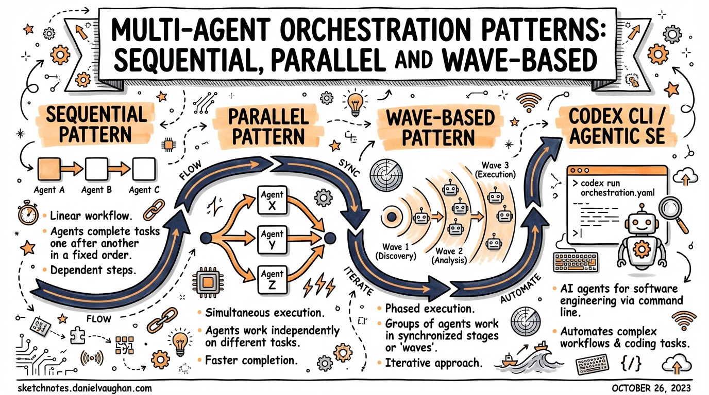

# Multi-Agent Orchestration Patterns: Sequential, Parallel and Wave-Based

**Date:** 2026-03-27
**Tags:** codex-cli, subagents, multi-agent, orchestration, parallel, sequential, wave, agentic

> Codex CLI subagents became GA in March 2026. Now the real design question is: *which pattern to use?* Sequential gating for auditability, parallel swarms for throughput, or wave-based hybrids for complex feature tracks. This article covers all three, when to apply each, and how to configure them.

---

## The Core Question

Subagents are not a "more is better" tool. Spawning parallel agents burns tokens across every thread — there is no free parallelism. Each child runs its own model inference and tool calls. The design decision is: **does the time saved or quality gained justify the token cost?**

The answer depends on *structure*. Three patterns cover almost every real-world case.

---

## Pattern 1: Sequential (Gated Chain)

**Use when:** tasks have hard dependencies — later work requires earlier output. Auditability and correctness matter more than throughput.

### Architecture

```
User Prompt
    ↓
[Manager Agent]
    ↓
[Agent A: Planner] → artefact_a
    ↓ (gate: artefact_a exists and passes validation)
[Agent B: Implementer] → artefact_b
    ↓ (gate: tests pass)
[Agent C: Reviewer] → review_report
    ↓
Consolidated response
```

The manager enforces each gate before handing off to the next agent. A gate might be:
- A file exists (`.ralph/plan.md` written by A)
- A command succeeds (`npm test` returns 0)
- A human approval step

### Config

```toml
# .codex/config.toml

[agents]
max_threads = 3    # at most one active at a time in pure sequential; set to number of chain links
max_depth   = 1    # root spawns children; children don't spawn further

[features]
multi_agent = true
```

### Prompt pattern

```
You are an orchestrator. Complete this task in three sequential phases:

Phase 1: Spawn an explorer agent. Ask it to read all files in src/ and write a migration plan to .codex/plan.md. Wait for it to finish and confirm the file exists.
Phase 2: Only after plan.md exists — spawn an implementer agent with that plan as context. Ask it to apply the migration. Wait for tests to pass before proceeding.
Phase 3: Spawn a reviewer agent. Ask it to review the git diff and write .codex/review.md. Return its findings.
```

### When sequential wins

- Enterprise compliance workflows (audit trail of each step)
- Long refactors where later code depends on earlier changes
- PRD → spec → implementation → review pipelines
- Security sign-off before deployment

---

## Pattern 2: Parallel (Worker Swarm)

**Use when:** tasks are independent. Same work repeated across many items. Throughput matters more than auditability.

### Architecture

```
User Prompt
    ↓
[Manager Agent]
    ├──────────────────────────────────────┐
    ↓                ↓                     ↓
[Worker A]       [Worker B]           [Worker C]
src/auth/        src/api/              src/ui/
    ↓                ↓                     ↓
report_a.json    report_b.json        report_c.json
    └──────────────────────────────────────┘
                       ↓
             [Manager: consolidate]
                       ↓
              Unified results
```

All workers run simultaneously. The manager waits for all to complete, then synthesises.

### `spawn_agents_on_csv` for large batches

For 10+ similar items, the purpose-built `spawn_agents_on_csv` tool is the right approach:

```yaml
# Inside your AGENTS.md or skill instruction block:
spawn_agents_on_csv:
  csv_path: .codex/tasks.csv
  instruction: "Review {file_path} for {issue_type}. Return JSON via report_agent_job_result"
  output_schema:
    file: string
    severity: string
    fix: string
  output_csv_path: .codex/reports/batch-results.csv
  max_concurrency: 6
```

`tasks.csv` example:
```csv
file_path,issue_type
src/auth/login.ts,sql_injection
src/api/user.ts,missing_auth
src/ui/form.tsx,xss_vulnerability
```

Codex spawns up to `max_concurrency` workers at once, tracks progress, provides ETA estimates, and writes all results to `output_csv_path`.

**Timeout:** `agents.job_max_runtime_seconds` governs the per-worker timeout (default: 1800 seconds). For large codebases, increase this.

### Prompt pattern for ad-hoc parallel

```
Spawn 3 worker agents simultaneously:
- Worker 1: analyse src/frontend/** for accessibility issues → write to .codex/a11y-frontend.md
- Worker 2: analyse src/backend/** for missing error handling → write to .codex/errors-backend.md  
- Worker 3: analyse src/shared/** for type safety gaps → write to .codex/types-shared.md

Wait for all three to finish, then summarise findings into .codex/audit-summary.md.
```

### Config

```toml
[agents]
max_threads = 6    # allows up to 6 concurrent workers
max_depth   = 1    # workers don't spawn further workers
job_max_runtime_seconds = 900   # per-worker timeout for CSV jobs
```

### When parallel wins

- Batch code review across many files or modules
- Audit runs (security, accessibility, type safety) across a codebase
- Parallel exploration of competing implementation approaches
- Migration tasks (same transformation across 100+ files)
- Benchmark comparison runs

---

## Pattern 3: Wave-Based (Hybrid)

**Use when:** tasks have *partial* independence. Some work is parallel; other work depends on the parallel results. Think: feature tracks with a shared merge step.

### Architecture

```
                    Wave 1 (parallel)
User Prompt ──→ [Manager]
                    ├─→ [Explorer A: frontend module]  → a.md
                    ├─→ [Explorer B: backend module]   → b.md
                    └─→ [Explorer C: database module]  → c.md
                              ↓ (all complete)
                    Wave 2 (sequential)
                    [Planner: read a.md + b.md + c.md → plan.md]
                              ↓
                    Wave 3 (parallel again)
                    ├─→ [Implementer A: frontend changes]
                    ├─→ [Implementer B: backend changes]
                    └─→ [Implementer C: database migration]
                              ↓ (all complete + tests pass)
                    Wave 4 (sequential)
                    [Reviewer: unified diff → review.md]
```

### Why three waves?

- **Wave 1** (parallel): independent exploration — fastest way to gather context
- **Wave 2** (sequential): planning requires all Wave 1 context — can't parallelise
- **Wave 3** (parallel): implementation tasks are independent once planned
- **Wave 4** (sequential): final review needs the whole picture

### Practical limits

| Resource | Limit |
|----------|-------|
| Concurrent agents on a laptop | 5–7 max before rate limits and review bottlenecks hit |
| Min task size worth parallelising | 15–30 minutes sequential equivalent |
| Max nesting depth (default) | 1 (workers can't spawn workers) |
| Practical max_threads | 6 (default) |

### Example: Feature delivery pipeline

```toml
# .codex/agents/explorer.toml
name = "explorer"
description = "Reads code and writes analysis reports. Does not modify files."
model_reasoning_effort = "low"   # cheap: just reading
sandbox_mode = "network-disabled"

# .codex/agents/implementer.toml
name = "implementer"
description = "Applies code changes based on a written plan. Runs tests after each change."
model_reasoning_effort = "high"
sandbox_mode = "workspace-only"

# .codex/agents/reviewer.toml
name = "reviewer"
description = "Reviews diffs for correctness, security, and style. Writes structured reports."
model_reasoning_effort = "medium"
sandbox_mode = "network-disabled"
```

Orchestrator prompt:

```
You are a software delivery pipeline. Complete in four waves:

WAVE 1 — Parallel exploration (spawn simultaneously):
  - explorer A → analyse src/frontend/ → write .codex/explore/frontend.md
  - explorer B → analyse src/backend/ → write .codex/explore/backend.md
  - explorer C → analyse migrations/ → write .codex/explore/db.md
  Wait for all three.

WAVE 2 — Planning (single agent):
  - planner → read all .codex/explore/*.md → write detailed implementation plan to .codex/plan.md
  Wait for plan.md.

WAVE 3 — Parallel implementation (spawn simultaneously):
  - implementer A → apply frontend changes from plan.md
  - implementer B → apply backend changes from plan.md
  - implementer C → run database migration from plan.md
  Wait for all three AND confirm tests pass.

WAVE 4 — Review (single agent):
  - reviewer → review full git diff → write .codex/review.md
  Return the review summary.
```

---

## Decision Guide

| Question | Sequential | Parallel | Wave |
|----------|-----------|----------|------|
| Tasks depend on each other? | ✅ | ❌ | ✅ (between waves) |
| Same work across many items? | ❌ | ✅ | Sometimes |
| Auditability required? | ✅ | ❌ | Partially |
| Throughput is priority? | ❌ | ✅ | ✅ |
| Complex multi-module feature? | ❌ | ❌ | ✅ |
| Token budget is tight? | ✅ | ❌ | Consider |

---

## Operator Patterns (Path-Based Addressing, v0.117.0+)

From v0.117.0, subagents use readable path-based addresses: `/root/agent_a`, `/root/agent_b`. This makes orchestration configs readable and version-controllable:

```toml
# Reference agents by path in AGENTS.md or skills
# Parent agent lives at: /root
# First child spawned: /root/agent_0
# Named child: /root/security-reviewer
```

Combined with `spawn_agents_on_csv`, path-based addressing makes it possible to route specific results back to specific parent threads without ambiguity.

---

## Common Mistakes

- ❌ **Using parallel for sequential tasks** — if B needs A's output, spawning them simultaneously will fail silently (B works with empty/wrong context)
- ❌ **Over-nesting** — `max_depth > 1` multiplies token cost exponentially and makes approval chains unmanageable
- ❌ **No timeouts** — always set `job_max_runtime_seconds` for CSV batch jobs in CI environments
- ❌ **Not writing intermediate artefacts** — agents must write results to files; they can't pass structured data back purely through text
- ❌ **Parallelising tiny tasks** — context setup overhead exceeds gains for tasks < 10 min sequential equivalent

---

## Sources

- [OpenAI Codex Subagents Docs](https://developers.openai.com/codex/subagents) (2026)
- [Codex Configuration Reference](https://developers.openai.com/codex/config-reference) (2026)
- [Codex Subagents GA Guide — Digital Applied](https://www.digitalapplied.com/blog/codex-subagents-ga-multi-agent-autonomous-coding-guide) (March 2026)
- [AWS: CLI Agent Orchestrator](https://aws.amazon.com/blogs/opensource/introducing-cli-agent-orchestrator-transforming-developer-cli-tools-into-a-multi-agent-powerhouse/) (2026)
- [OpenAI Cookbook: Building Consistent Workflows with Codex CLI & Agents SDK](https://developers.openai.com/cookbook/examples/codex/codex_mcp_agents_sdk/building_consistent_workflows_codex_cli_agents_sdk) (2026)
