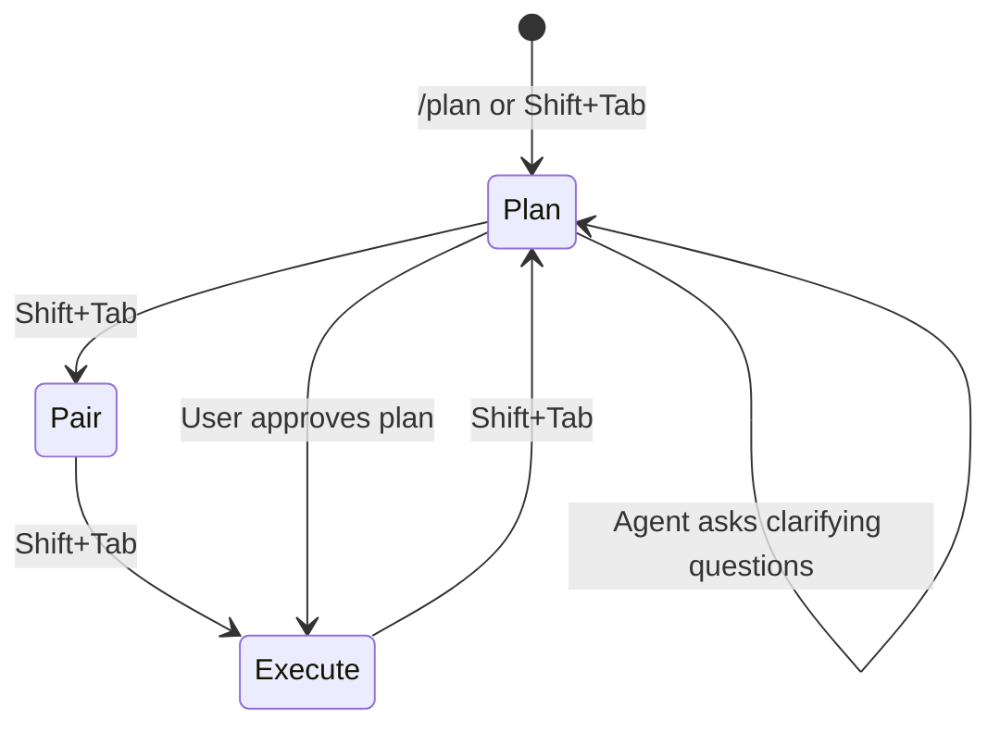
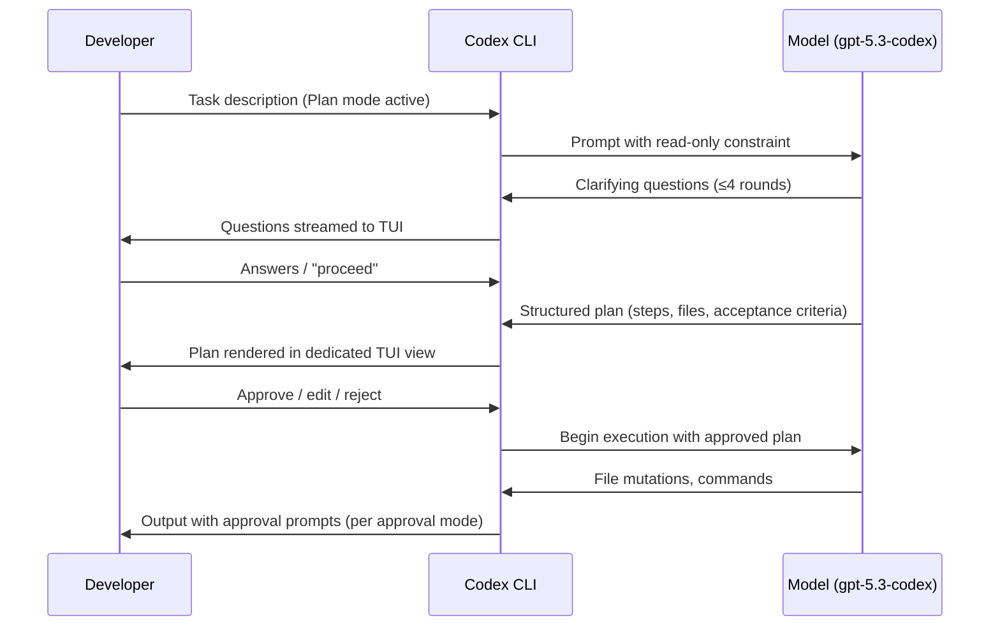
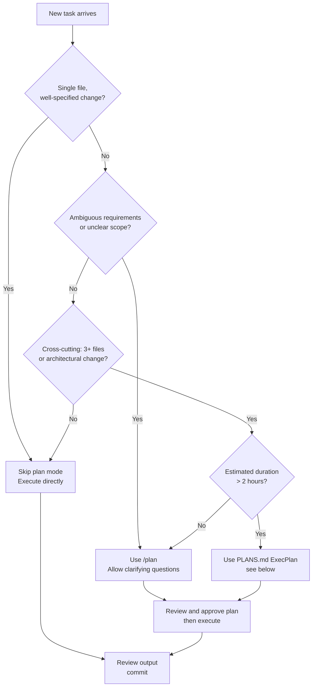

# Planning Mode in Practice: When to Use It and When to Skip It


Most developers activate planning mode once, see an agent propose a numbered list, and then leave it on permanently — or switch it off after a frustrating delay on a trivial task. Neither extreme is correct. Plan mode is a precision tool: invaluable when the problem is genuinely ambiguous, actively wasteful when the task is a single-file fix.

This article builds a concrete decision framework grounded in how Codex CLI's planning machinery actually works.

---

## How Plan Mode Works

Plan mode is one of three collaboration modes in Codex CLI — alongside **Pair** (interactive with per-action approval) and **Execute** (fully autonomous)[^1]. In plan mode the agent may read files, search the codebase, and pose clarifying questions, but it does **not** modify files or run mutating commands until you approve its proposed plan.[^2]

Activation is low-friction: press **Shift+Tab** in the TUI to cycle through Plan → Pair → Execute, or type `/plan` at the prompt[^3]. A mode indicator in the terminal header shows the current state; `/status` confirms it.



The internal sequence during a planning phase looks like this:



### The Prompt-Level Safety Caveat

Plan mode instructs the model not to write or modify files, but this constraint is **enforced at the prompt level only** — there is no runtime sandbox that physically blocks mutations[^4]. In practice the model almost always respects the instruction, but for high-stakes or regulated work, use a throwaway branch (`git checkout -b plan/explore`) before activating plan mode on an unfamiliar codebase.

---

## Configuration

Plan mode is on by default from **v0.96+**[^5]. For older releases (v0.93–v0.95) you needed to set:

```toml
# ~/.codex/config.toml  (v0.93–0.95 only)
[features]
collaboration_modes = true
```

Since v0.96 the `collaboration_modes` flag is a no-op; modes are always available.

### `plan_mode_reasoning_effort`

The most important plan-mode configuration key controls reasoning depth independently of the global default[^6]:

```toml
# ~/.codex/config.toml
model_reasoning_effort         = "medium"   # global default for execution
plan_mode_reasoning_effort     = "high"     # override for planning phase only
```

Valid values: `none | minimal | low | medium | high | xhigh`[^7].

`none` is a special case — it means "no reasoning effort at all in plan mode", not "inherit the global default". If `plan_mode_reasoning_effort` is unset, plan mode uses the built-in plan preset (currently `medium`)[^8].

A common production pattern is to set `plan_mode_reasoning_effort = "high"` for the thoroughness of a design pass while keeping `model_reasoning_effort = "low"` for the bulk of fast execution work. This gives you careful analysis upfront without paying `high` rates for every line of generated code.

Per-profile overrides work as expected:

```toml
[profiles.architecture]
plan_mode_reasoning_effort = "xhigh"

[profiles.hotfix]
plan_mode_reasoning_effort = "minimal"
```

Activate with `codex --profile hotfix`.

---

## The Decision Framework

The official guidance is deliberately brief: "If the task is complex, ambiguous, or hard to describe well, ask Codex to plan before it starts coding."[^9] That is correct but not actionable on its own. Here is a more granular decision tree:



### When Plan Mode Pays Off

**Complex, multi-file changes.** When a task touches three or more modules — say, adding a new authentication provider that requires changes to middleware, database schema, session handling, and documentation — planning upfront prevents the agent from making locally-correct decisions that break global consistency.

**Ambiguous requirements.** If you can describe the goal but not the steps ("make the checkout flow faster"), plan mode's clarifying questions surface the assumptions that would otherwise cause misaligned output. The model is instructed to challenge your assumptions and produce a concrete specification before writing any code[^10].

**Significant refactors.** Renaming a core abstraction, splitting a large service, or migrating a persistence layer all benefit from an explicit plan that documents decision rationale. This also serves as durable documentation: the approved plan becomes a commit message or `DECISIONS.md` entry.

**Unfamiliar codebases.** When onboarding to a repo you do not know, plan mode's read-only exploration phase maps the territory without the risk of premature mutations.

### When Plan Mode is Pure Friction

**Single-step changes.** Adding a missing null check, fixing a typo in a string constant, or bumping a dependency version needs no planning pass. The overhead — a full context-gathering phase plus a round of questions — will exceed the actual execution time by an order of magnitude.

**Well-specified, repeatable tasks.** If you have an AGENTS.md rule that already defines exactly how to add a new API endpoint, the agent has enough context to execute directly. Forcing a plan phase restates work already done in the instructions file.

**Tight iteration loops.** In an active debugging session where you are issuing ten small adjustments in rapid succession, plan mode's friction breaks flow without adding safety value. Switch to Pair mode instead: you get per-action approval without the full planning overhead.

As the official best-practices guide notes, plan mode is "not needed all the time — turn it off for simple tasks to save time and resources."[^11]

---

## Common Mistakes

### Forcing Plan on Every Task

Setting plan mode as a permanent default is the most common over-correction. The planning phase consumes tokens and wall-clock time before any code is written. Applied to simple tasks this doubles cost and halves throughput for no safety benefit.

### Skipping Plan on Complex Tasks and Blaming the Model

The inverse error: approving a vague prompt in Execute mode, receiving a technically valid but architecturally wrong implementation, and concluding the model "doesn't understand the codebase." In most cases the model understood exactly what you said — the problem was that you didn't say enough. Plan mode's clarifying questions would have surfaced the gap.

### Treating the Approved Plan as Immutable

An approved plan is a starting point, not a contract. If the agent discovers mid-execution that a dependency has an incompatible API or that a file is structured differently than expected, it should (and will) adapt. The plan mode constraint applies to the planning phase; execution proceeds with the model's full reasoning capability.

### Ignoring `plan_mode_reasoning_effort`

Leaving plan mode at `medium` reasoning effort while setting execution to `low` is usually the right default. But for large architectural decisions, bumping to `high` or `xhigh` produces materially more thorough plans — the model explores more of the codebase, raises more edge cases, and produces more precise acceptance criteria.

---

## PLANS.md: Extending Planning to Multi-Hour Tasks

For tasks that span hours or sessions, the interactive TUI plan mode is insufficient — the plan state disappears when the session ends. The solution is a **PLANS.md** file that functions as a persistent, living execution document[^12].

Reference it from `AGENTS.md`:

```markdown
<!-- AGENTS.md -->
## Complex feature development
When writing complex features or significant refactors, use an ExecPlan
(as described in `.agent/PLANS.md`) from design to implementation.
```

A well-formed ExecPlan includes these mandatory sections[^13]:

```markdown
# ExecPlan: <Feature Name>

## Purpose / Big Picture
What user-visible behaviour becomes possible after this is complete.

## Progress
- [ ] Step 1 — <description> (started: 2026-03-27T09:14Z)
- [x] Step 2 — <description> (completed: 2026-03-27T09:32Z)

## Surprises & Discoveries
Unexpected findings, bugs encountered, API quirks.

## Decision Log
| Date | Decision | Rationale |
|------|----------|-----------|
| 2026-03-27 | Use Redis for rate-limit state | Consistent with existing session store |

## Outcomes & Retrospective
What was delivered. What was deferred. Lessons.

## Plan of Work
Prose-format sequence of edits with file paths and specific locations.

## Concrete Steps
Exact commands, working directories, expected output.

## Validation and Acceptance
How to exercise the system and observe correct results.
```

The critical constraint is **self-containment**: the ExecPlan must enable a complete novice to implement the feature end-to-end without external context[^14]. This property is what allows the agent to resume after session interruption or handoff to a subagent.

This approach has been used to run single Codex sessions for **more than seven hours** from a single prompt[^15].

---

## Quick Reference

| Situation | Mode | `plan_mode_reasoning_effort` |
|---|---|---|
| Single-file fix, clear spec | Execute | N/A |
| Ambiguous goal, any size | Plan | `medium` (default) |
| 3+ file change, clear spec | Plan | `medium` |
| Architectural refactor | Plan | `high` |
| Multi-hour autonomous task | PLANS.md ExecPlan | `xhigh` |
| Active debugging loop | Pair | N/A |
| Repeated, scripted task | Execute (via `codex exec`) | N/A |

Toggle in-session: **Shift+Tab** or `/plan`. Set a permanent default in `~/.codex/config.toml`.

---

## Citations

[^1]: Codex CLI Collaboration Modes overview — SmartScope, "Codex Plan Mode: Stop Code Drift with Plan→Execute (2026)" <https://smartscope.blog/en/generative-ai/chatgpt/codex-plan-mode-complete-guide/>

[^2]: Read-only constraint during planning phase — ibid.; GitHub Discussion #7355 "Plan / Spec Mode" <https://github.com/openai/codex/discussions/7355>

[^3]: Shift+Tab and /plan activation — DeepakNess, "Plan Mode in Codex CLI is here" <https://deepakness.com/raw/plan-mode-in-codex-cli/>; SmartScope guide ibid.

[^4]: Prompt-level-only safety constraint — SmartScope guide ibid.; GitHub Issue #11115 cited in search results

[^5]: Plan mode on by default from v0.96+ — SmartScope guide ibid.

[^6]: `plan_mode_reasoning_effort` key — Codex CLI Configuration Reference <https://developers.openai.com/codex/config-reference>

[^7]: Valid values for `plan_mode_reasoning_effort` — Codex CLI Configuration Reference ibid.

[^8]: `none` semantics and unset behaviour — ibid.

[^9]: Official guidance: complex/ambiguous tasks — Codex CLI Best Practices <https://developers.openai.com/codex/learn/best-practices>

[^10]: Challenge assumptions, concrete specification — Codex CLI Best Practices ibid.

[^11]: "Not needed all the time" — Codex CLI Best Practices ibid.

[^12]: PLANS.md for persistent multi-session planning — OpenAI Cookbook, "Using PLANS.md for multi-hour problem solving" <https://developers.openai.com/cookbook/articles/codex_exec_plans>

[^13]: Mandatory ExecPlan sections — OpenAI Cookbook ibid.

[^14]: Self-containment requirement — OpenAI Cookbook ibid.

[^15]: Seven-hour single-session claim — OpenAI Cookbook ibid.
