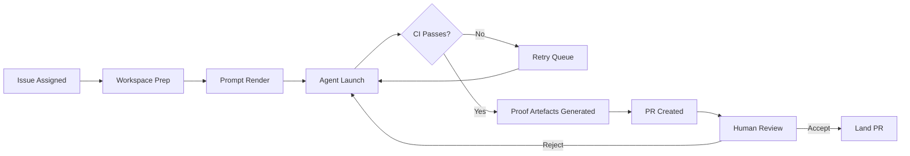

# The Proof of Work Principle: Why Agents Need to Show Their Working


There is a habit that developers have fallen into when working with autonomous coding agents: they read the diff, nod, and merge. The code arrived from somewhere — a Codex run, a background automation, an overnight agent session — and it looks plausible, the tests pass locally, and there is a deadline. So you ship it.

This is the accountability gap at the heart of agentic development in 2026, and OpenAI's Symphony framework puts a name to the solution: **proof of work**.[^1]

---

## The Problem Is Not the Code

To understand why proof of work matters, you need to separate two failure modes that most teams conflate.

The first is *correctness*: the agent wrote code that does the wrong thing. This is addressable with tests. If your test suite is solid and your CI pipeline is automated, the agent can verify its own work before a human ever sees it.

The second is *opacity*: the agent wrote code that appears to do the right thing, and you have no evidence trail explaining what it considered, what it rejected, how it handled edge cases, and what constraints it operated under. This is the one that will bite you in a post-mortem.

By 2026, AI agents write significantly more code than humans in many organisations.[^2] The correctness problem is increasingly tractable — the opacity problem is not, because most agentic tooling ships a diff and declares victory.

---

## What Symphony Actually Does

Symphony, OpenAI's open-source agentic orchestration framework (released in early 2026, Apache 2.0, built on Elixir/BEAM[^3]), takes an explicit position on this. An agent run is not done when the code compiles. It is done when the agent has provided all of the following:[^4]

- **CI status** — automated tests must pass; this is a gate, not a courtesy
- **PR review feedback** — a synthesised analysis of the change from the agent's own review pass
- **Complexity analysis** — a structured assessment of the change surface
- **Walkthrough artefact** — a video or recording demonstrating the feature working end-to-end

The human reviewer receives all four before they look at a single line of code. The agent does not get to claim the task is done; it has to *demonstrate* it.

This is not just a documentation nicety. It is a structural constraint on what counts as completion. Symphony's internal state machine only transitions a run to `Succeeded` when CI has passed — not when the agent says it has.[^5]



---

## Agents as Accountable Actors

The philosophical shift here is from *agents as magic boxes* to *agents as accountable actors*.

A magic box receives a prompt and emits a PR. The human downstream has no visibility into why particular decisions were made, which alternatives were considered, whether the agent struggled and retried, or what trade-offs were silently baked in. The accountability chain that normally runs from developer to reviewer to tech lead is broken — not because a human did something wrong, but because there was no human in the loop at that stage.

An accountable actor, by contrast, *shows its working*. This concept is familiar from mathematics education: the correct answer with no working shown gets no marks, because you cannot tell whether the student understood the problem or simply guessed. The same logic applies to autonomous agents operating on production codebases. If the agent cannot produce evidence of its process, you cannot distinguish a correct result from a lucky one.

Symphony enforces this at the framework level, but the principle generalises. When you configure a Codex CLI background automation, or build a subagent pipeline, or schedule an overnight refactoring run, the question you should be asking is: *what artefacts will this run produce so that I can verify it did what I think it did?*

---

## The Harness Engineering Prerequisite

Symphony is honest about its limitations: you cannot drop it into an untested legacy codebase and expect the proof-of-work model to save you.[^6] The framework explicitly requires what OpenAI calls **harness engineering** — designing the infrastructure, constraints, and feedback loops that make agents reliably productive.

This means, at minimum:

- **Hermetic test suites** — tests that are self-contained, deterministic, and fast enough to run on every agent-generated commit
- **Modular architecture** — components with clear boundaries so agents can verify their changes without needing to understand the entire system
- **CI pipelines that agents can invoke** — not pipelines that require human triggers or SSO-protected services

Without these, the proof-of-work model collapses. An agent that cannot verify its own output against an objective standard cannot generate meaningful proof that it has succeeded. It can only generate plausible-looking artefacts.

This is a significant investment. But it is also, arguably, the investment that good engineering teams should have made already. Proof of work makes the cost of *not* having these things visible in a way that it was not before.

---

## Applying the Principle to Codex CLI

Symphony is one implementation of the proof-of-work principle. But if you are running Codex CLI for background tasks, parallel subagents, or CI pipeline automation, you can apply the same discipline without adopting the full Symphony stack.

**In your AGENTS.md or WORKFLOW.md**, define explicit completion criteria for any automated task:

```markdown
## Completion Criteria

A task is not complete until:
1. All existing tests pass (`npm test`)
2. New tests exist for any new public API
3. The agent has written a `## Summary` section in the PR body explaining:
   - What changed and why
   - What alternatives were considered
   - Any known limitations
```

**In your hook configuration**, use `PostToolUse` hooks to log agent decisions at key decision points — not just what the agent did, but the context in which it chose to do it:

```toml
[[hooks]]
event = "PostToolUse"
tool = "write_file"
command = "echo 'Agent wrote file: $TOOL_ARG_PATH' >> /tmp/codex-audit-$(date +%Y%m%d).log"
```

**In your subagent definitions**, require each subagent to return a structured report alongside its primary output:

```toml
[[agents]]
name = "test-writer"
prompt = """
Write tests for the module at {{ input.path }}.

On completion, output a JSON report to stdout with the following structure:
{
  "tests_written": number,
  "coverage_delta": "+X%",
  "edge_cases_covered": ["list", "of", "cases"],
  "cases_deferred": ["anything not covered and why"]
}
"""
```

The report is not decorative. It is the evidence that the agent understood the task, not just the evidence that it produced output.

---

## The Governance Gap It Closes

By early 2026, 46% of firms use AI for writing or optimising code, but only 24% have governance and accountability frameworks in place.[^7] That gap matters enormously when something goes wrong. Autonomous agents accelerate the velocity at which code enters a codebase, which also accelerates the velocity at which mistakes propagate.

Proof of work does not eliminate mistakes. It does mean that when a mistake occurs, you have artefacts that allow you to reconstruct what the agent thought it was doing. That is the difference between a post-mortem that produces actionable learnings and one that ends with "the agent did it and we are not sure why."

The principle also matters for team culture. Developers who review agent-generated PRs with no supporting context develop a habit of rubber-stamping — because there is nothing to engage with. Developers who review PRs with CI results, a complexity analysis, and a walkthrough recording develop a habit of *actually reviewing*, because there is something concrete to interrogate.

---

## Proof of Work as First-Class Design

The broader point is this: proof of work should not be bolted on after the fact. It should be a first-class design concern when you are building any agentic workflow.

Before you write a Codex automation, ask: *what will success look like, and how will the agent prove it?* Before you schedule an overnight agent run, ask: *what artefacts will I wake up to, and how will I know whether to trust them?* Before you merge an agent-generated PR, ask: *has the agent shown its working, or is it just claiming it is done?*

Symphony answers these questions with CI gates, structured feedback, and walkthrough recordings. Your Codex CLI workflows should have their own answers. The exact form of the artefacts matters less than the discipline of requiring them.

Autonomous agents are not magic. They are actors — fast, tireless, occasionally brilliant, occasionally wrong. Holding them to the same standard of evidence we hold junior developers to is not scepticism. It is engineering.

---

## Citations

[^1]: OpenAI, *Symphony* (GitHub repository, released March 2026). [github.com/openai/symphony](https://github.com/openai/symphony)

[^2]: Codex CLI documentation and 2026 industry reporting. IntuitionLabs, "OpenAI Codex App: A Guide to Multi-Agent AI Coding." [intuitionlabs.ai/articles/openai-codex-app-ai-coding-agents](https://intuitionlabs.ai/articles/openai-codex-app-ai-coding-agents)

[^3]: MarkTechPost, "OpenAI Releases Symphony: An Open Source Agentic Framework for Orchestrating Autonomous AI Agents through Structured, Scalable Implementation Runs," March 2026. [marktechpost.com](https://www.marktechpost.com/2026/03/05/openai-releases-symphony-an-open-source-agentic-framework-for-orchestrating-autonomous-ai-agents-through-structured-scalable-implementation-runs/)

[^4]: Symphony README.md (main branch). [github.com/openai/symphony/blob/main/README.md](https://github.com/openai/symphony/blob/main/README.md)

[^5]: heyuan110, "OpenAI Symphony: From Issue Ticket to Pull Request Without a Developer," March 2026. [heyuan110.com](https://www.heyuan110.com/posts/ai/2026-03-05-openai-symphony-autonomous-coding/)

[^6]: Gems of AI, "Symphony decoded: How OpenAI wants us to stop supervising agents." [smallai.in](https://smallai.in/gems-of-ai/symphony-decoded-stop-supervising-agents)

[^7]: Spiceworks 2026 State of IT report, as cited in ICDEV, "Vibe Coding Is Breaking Production." [icdev.ai](https://icdev.ai/vibe-coding-is-breaking-production-how-to-build-safe-and-trusted-software-with-agentic-ai/)
