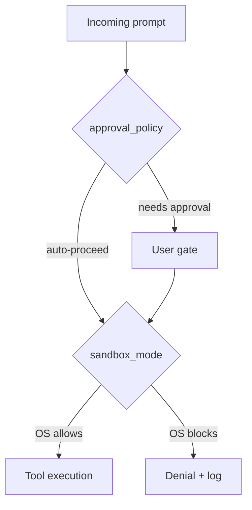
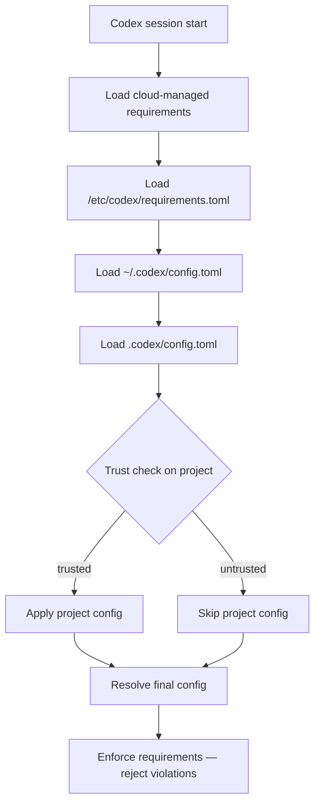
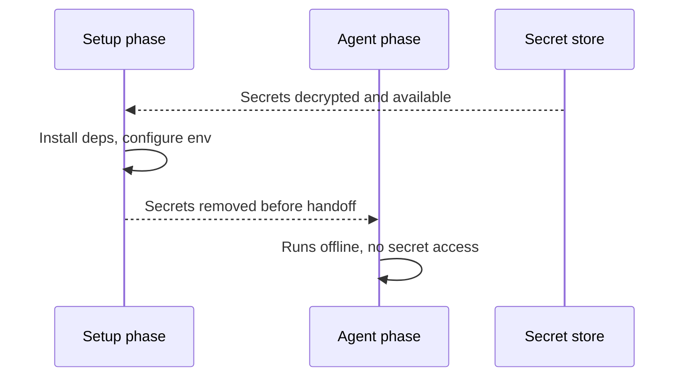

# Security Hardening Your Codex CLI Setup


Codex CLI gives agents broad reach into your filesystem, shell environment, and network. That power comes with real attack surface. This article covers the practical steps for hardening a Codex deployment: locking down what the agent can touch, preventing credential leakage, capturing a tamper-evident audit trail, and enforcing policy consistently across a team via `requirements.toml`. It assumes you are running Codex CLI v0.23.0 or later.[^1]

---

## Why Hardening Matters: CVE-2025-61260

Before discussing controls, understand the threat model with a concrete example. In August 2025, Check Point Research disclosed **CVE-2025-61260** (CVSS 9.8 — Critical) against Codex CLI.[^2] The vulnerability exploited the CLI's trust model: if a repository contained a `.env` file that redirected `CODEX_HOME` to a project-local `.codex/` directory, the CLI would automatically load and execute MCP server entries from that directory — without any approval prompt, regardless of content.

An attacker with repository write access could embed a malicious MCP command that harvested credentials, exfiltrated secrets, or installed a persistent backdoor. The attack propagated silently through supply-chain vectors: compromised starter templates, open-source repos, or CI pipelines that run `codex` over checked-out code.

OpenAI patched this in **v0.23.0** (released 20 August 2025) by blocking `.env` files from silently redirecting `CODEX_HOME` into project directories.[^3] The root lesson stands: Codex's trust is resolved at the *config location*, not at the *config contents*. Upgrade immediately, then layer the controls below.

---

## Layer 1: Sandbox Mode and Approval Policy

Every Codex session composes two independent security axes.[^4]



**`sandbox_mode`** is enforced at the OS level — not by the agent itself — so a compromised or jailbroken model cannot override it.[^5]

| Mode | What the OS allows |
|---|---|
| `read-only` | File reads only; all writes and shell execution blocked |
| `workspace-write` | Reads and writes inside the workspace; `.git/` and `.codex/` remain read-only; network off by default |
| `danger-full-access` | No restrictions — only use with an external container boundary |

**`approval_policy`** controls *when* the agent pauses for confirmation:

| Policy | Behaviour |
|---|---|
| `untrusted` | Most restrictive; only known-safe read operations proceed without a pause |
| `on-request` | Agent asks before any potentially mutating action |
| `never` | Fully automated — appropriate only for locked-down CI environments |
| `granular` | Per-category overrides for sandbox, rules, MCP, skills, and permissions |

Sensible defaults for a developer machine working on untrusted or third-party code:

```toml
# ~/.codex/config.toml
sandbox_mode = "workspace-write"
approval_policy = "untrusted"
allow_login_shell = false

[sandbox_workspace_write]
network_access = false
```

### Platform Sandboxing Implementation

The sandbox is not a conceptual boundary — it uses OS primitives:[^6]

- **macOS:** `sandbox-exec` with a Seatbelt policy.
- **Linux:** Bubblewrap + seccomp (or legacy Landlock on kernels that lack Bubblewrap).
- **Windows:** Native sandbox in unelevated mode by default; elevated mode available for workflows that require it.

Test your sandbox locally before relying on it in CI:

```bash
codex sandbox --log-denials -- <command>
```

This runs `<command>` under the active sandbox policy and prints any denials without executing them in production.

---

## Layer 2: Shell Environment Policy — Preventing Credential Leakage

By default, Codex inherits the full environment of the shell that launched it. In a typical developer shell that means `AWS_SECRET_ACCESS_KEY`, `GITHUB_TOKEN`, `DATABASE_URL`, and whatever else your dotfiles export are all visible to every subprocess the agent spawns.

The `shell_environment_policy` key gives you surgical control:[^7]

```toml
[shell_environment_policy]
# Start from a clean slate rather than inheriting everything
inherit = "none"

# Glob patterns are case-insensitive; order: inherit → include_only → exclude → set
include_only = [
  "PATH",
  "HOME",
  "TMPDIR",
  "TERM",
  "LANG",
  "NODE_ENV",
  "VIRTUAL_ENV",
]

# Explicit deny-list as a belt-and-suspenders measure
exclude = [
  "*KEY*",
  "*SECRET*",
  "*TOKEN*",
  "*PASSWORD*",
  "AWS_*",
  "AZURE_*",
  "GCP_*",
]

# Hard-set values that override anything else
[shell_environment_policy.set]
CI = "true"
```

`inherit = "core"` is a middle ground: the CLI drops most variables but preserves `PATH`, `HOME`, `TMPDIR`, `TERM`, and `LANG`. Use `inherit = "none"` in regulated environments or when the agent will be running over untrusted repositories.

> **Note:** The default automatic exclusion of variables matching `KEY`, `SECRET`, or `TOKEN` is still applied before your custom `include_only` / `exclude` rules unless you set `ignore_default_excludes = true`.

---

## Layer 3: Named Permissions Profiles

For finer-grained network control, define **permissions profiles** in `config.toml` and reference them as defaults or per-profile overrides:[^8]

```toml
# Allow only the domains the agent genuinely needs
[permissions.restricted]
network.allow_domains = [
  "api.openai.com",
  "registry.npmjs.org",
  "pypi.org",
]
network.allow_unix_sockets = ["/var/run/docker.sock"]

# Assign this profile as the default for all sandboxed tool calls
default_permissions = "restricted"
```

Codex supports SOCKS5 proxy configuration inside a permissions profile, enabling you to route all agent traffic through an egress proxy for logging and DLP inspection:

```toml
[permissions.corporate]
network.socks5_proxy = "socks5://proxy.corp.example.com:1080"
network.allow_domains = ["*"]   # proxy handles allowlisting
```

---

## Layer 4: Audit Hooks for Session Logging

Hooks execute external commands at defined points in the agent lifecycle, giving you a lightweight audit trail without requiring a full SIEM integration.[^9]

```toml
# ~/.codex/config.toml — audit logging via hooks
[[hooks]]
event = "SessionStart"
command = ["bash", "-lc", "echo \"$(date -u +%FT%TZ) SESSION_START user=$USER cwd=$PWD\" >> /var/log/codex-audit.log"]
timeout = 5000

[[hooks]]
event = "Stop"
command = ["bash", "-lc", "echo \"$(date -u +%FT%TZ) SESSION_STOP user=$USER\" >> /var/log/codex-audit.log"]
timeout = 5000

[[hooks]]
event = "AfterToolUse"
command = ["/usr/local/bin/codex-tool-auditor"]
timeout = 10000
```

`AfterToolUse` fires after each tool call resolves, with structured JSON piped to the hook's stdin including the tool name, arguments, and the approval decision (policy-auto vs. user-explicit).[^10] This gives you per-action visibility without the overhead of a full conversation transcript.

`userpromptsubmit` fires before a user prompt enters history, enabling you to block or sanitise inputs that match a sensitive-data pattern before the model ever sees them.[^11]

---

## Layer 5: OpenTelemetry for Structured Audit Logging

For regulated environments that require centralised, tamper-evident logs, Codex CLI's `[otel]` configuration sends structured traces to any OTLP-compatible endpoint:[^12]

```toml
[otel]
endpoint = "https://otel-collector.corp.example.com:4318"
# Redact prompt content from traces (recommended for PII-sensitive environments)
include_prompts = false
# Include tool approval decisions and denial events
include_tool_decisions = true
```

Traces include:

- Session start / stop spans with user identity and working directory.
- Per-tool spans with tool name, arguments (redacted if configured), latency, and outcome.
- Approval events: whether the decision came from policy or an explicit user confirmation.
- Sandbox denial events, annotated with the blocked syscall or network destination.

Route the collector output to your SIEM (Splunk, Elastic, Datadog) for correlation with other developer tooling events.

---

## Layer 6: Enterprise Policy Enforcement with `requirements.toml`

`requirements.toml` is the mechanism for enforcing security baselines that individual developers cannot override.[^13] Unlike `config.toml`, requirements are *constraints*, not defaults — if a user attempts to set `sandbox_mode = "danger-full-access"` and your requirements forbid it, Codex falls back to the nearest allowed value and notifies the user.

```toml
# /etc/codex/requirements.toml  (distribute via MDM or config management)

# Users may not drop below workspace-write
[requirements.sandbox_mode]
allowed = ["workspace-write", "read-only"]

# Fully automated mode forbidden; at minimum on-request
[requirements.approval_policy]
allowed = ["untrusted", "on-request", "granular"]

# Web search locked to cached results only (no live exfil)
[requirements.web_search]
allowed = ["cached", "disabled"]

# MCP server allowlist — empty list disables all MCP
[requirements.mcp_servers]
allowed = [
  { type = "stdio", command = "/usr/local/bin/codex-approved-mcp" },
  { type = "http", url = "https://mcp.internal.corp.example.com/" },
]

# Forbid destructive commands
[[requirements.rules]]
glob = "rm -rf *"
decision = "forbidden"

[[requirements.rules]]
glob = "git push --force*"
decision = "prompt"
```

Requirements can also be **cloud-managed** for ChatGPT Business and Enterprise customers: admins push policies from the Codex Policies page and they are fetched automatically at session start, eliminating the need to distribute files to developer machines via MDM.[^14]



> **Precedence rule:** Requirements win over all config layers. Cloud-managed requirements and local `requirements.toml` are merged, with the most restrictive constraint for each key winning.

---

## Regulated Environment Checklist

For teams in regulated sectors (finance, healthcare, defence), the following baseline covers the controls above:

```toml
# /etc/codex/requirements.toml — regulated baseline
[requirements.sandbox_mode]
allowed = ["workspace-write", "read-only"]

[requirements.approval_policy]
allowed = ["untrusted", "on-request"]

[requirements.web_search]
allowed = ["disabled"]

[requirements.mcp_servers]
allowed = []   # disable all MCP unless explicitly approved

[requirements.features]
hooks = true
otel = true

[[requirements.rules]]
glob = "curl *"
decision = "prompt"

[[requirements.rules]]
glob = "wget *"
decision = "prompt"
```

Pair this with the developer-side `config.toml`:

```toml
# ~/.codex/config.toml — regulated developer machine
sandbox_mode = "workspace-write"
approval_policy = "untrusted"
allow_login_shell = false

[shell_environment_policy]
inherit = "none"
include_only = ["PATH", "HOME", "TMPDIR", "LANG"]

[otel]
endpoint = "https://otel-collector.internal:4318"
include_prompts = false
include_tool_decisions = true

[[hooks]]
event = "SessionStart"
command = ["/opt/corp/codex-audit-hook", "start"]
timeout = 5000

[[hooks]]
event = "Stop"
command = ["/opt/corp/codex-audit-hook", "stop"]
timeout = 5000

[[hooks]]
event = "AfterToolUse"
command = ["/opt/corp/codex-audit-hook", "tool"]
timeout = 10000
```

---

## Cloud Environments: Secrets Isolation

When using **Codex cloud** (the web interface or API), secrets follow a two-phase model that differs from local CLI behaviour:[^15]



Secrets are available *only* during the setup script — they are removed before the agent phase starts. This prevents an agent from exfiltrating credentials even if it is manipulated via prompt injection. For the local CLI, environment variable filtering via `shell_environment_policy` provides the equivalent control.

---

## Summary

A secure Codex deployment combines multiple independent layers:

| Layer | Mechanism | Key config |
|---|---|---|
| OS sandbox | Seatbelt / Bubblewrap / Windows sandbox | `sandbox_mode = "workspace-write"` |
| Approval gate | Per-action human review | `approval_policy = "untrusted"` |
| Env isolation | Variable allowlist | `shell_environment_policy.inherit = "none"` |
| Network boundary | Domain allowlists / egress proxy | `permissions.*` profiles |
| Audit trail | Hook scripts + OTLP traces | `[[hooks]]` + `[otel]` |
| Policy enforcement | Admin-managed constraints | `requirements.toml` |
| Supply-chain | MCP allowlist + upgrade to ≥ v0.23.0 | `requirements.mcp_servers.allowed` |

No single layer is sufficient — defence in depth means an attacker who circumvents the approval gate still faces the OS sandbox, and an agent that escapes the sandbox still produces an audit trail.

---

## Citations

[^1]: OpenAI Codex CLI — <https://github.com/openai/codex>

[^2]: Check Point Research, "OpenAI Codex CLI Command Injection Vulnerability", December 2025 — <https://research.checkpoint.com/2025/openai-codex-cli-command-injection-vulnerability/>

[^3]: CyberPress, "OpenAI Codex CLI Vulnerability Lets Attackers Execute Arbitrary Commands" — <https://cyberpress.org/openai-codex-cli-command-injection-vulnerability/>

[^4]: OpenAI, "Agent approvals & security" — <https://developers.openai.com/codex/agent-approvals-security>

[^5]: SmartScope, "OpenAI Codex CLI Setup Guide" (Updated 2026-02) — <https://smartscope.blog/en/generative-ai/chatgpt/openai-codex-cli-comprehensive-guide/>

[^6]: OpenAI, "Agent approvals & security" — <https://developers.openai.com/codex/agent-approvals-security>

[^7]: OpenAI, "Configuration Reference" — <https://developers.openai.com/codex/config-reference>

[^8]: OpenAI, "Advanced Configuration" — <https://developers.openai.com/codex/config-advanced>

[^9]: OpenAI, "Codex CLI Features" — <https://developers.openai.com/codex/cli/features>

[^10]: Blake Crosley, "Codex CLI: The Definitive Technical Reference" — <https://blakecrosley.com/guides/codex>

[^11]: GitHub Discussion #14626, `userpromptsubmit` hook — <https://github.com/openai/codex/discussions/2150>

[^12]: OpenAI, "Advanced Configuration" — <https://developers.openai.com/codex/config-advanced>

[^13]: OpenAI, "Managed configuration" — <https://developers.openai.com/codex/enterprise/managed-configuration>

[^14]: OpenAI, "Admin Setup" — <https://developers.openai.com/codex/enterprise/admin-setup>

[^15]: OpenAI, "Cloud environments" — <https://developers.openai.com/codex/cloud/environments>
