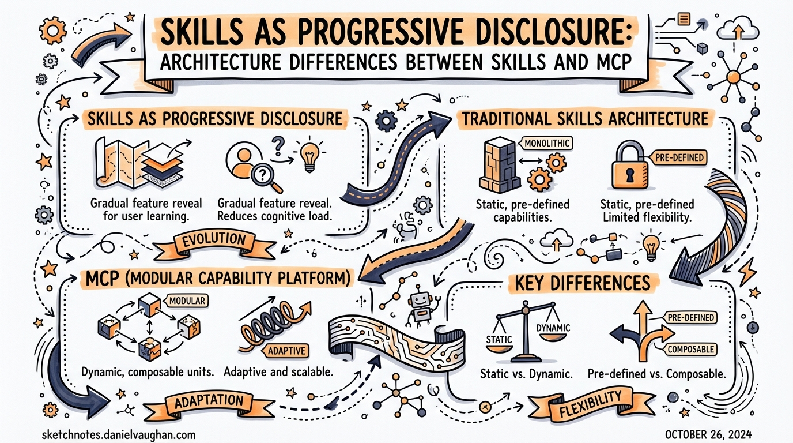
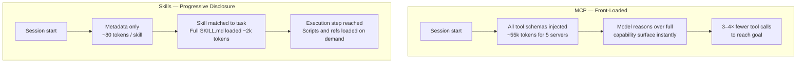
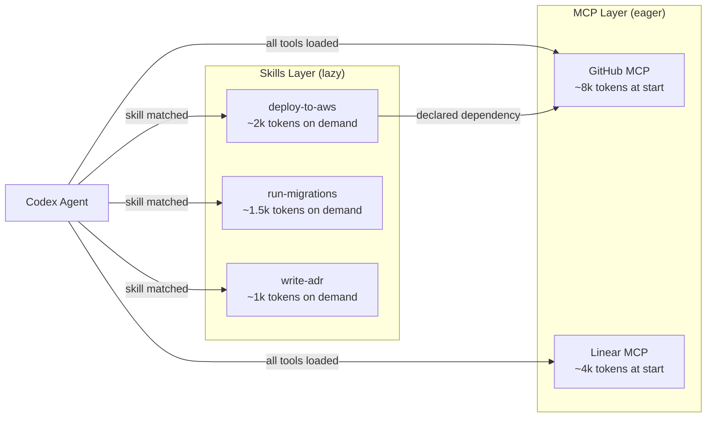

# Skills as Progressive Disclosure: Architecture Differences Between Skills and MCP

**Date:** 2026-03-27
**Tags:** codex-cli, skills, mcp, progressive-disclosure, context-management, architecture, performance

## Overview

Two mechanisms exist for giving Codex CLI access to external knowledge and tools: **Agent Skills** and the **Model Context Protocol (MCP)**. On the surface they appear to solve the same problem — extending what an agent can do. Architecturally, they are nearly opposites, and understanding the distinction is critical if you want to build workflows that don't collapse under their own context weight.

This article goes deep on both: how each loads (or defers loading) information into the model's context window, where each excels, and how to design with both together for genuinely scalable agentic workflows.

---

## The Context Window as Cognitive Space

Everything an LLM reasons over lives inside its context window. Stuff the window with unused tool schemas, stale references, and boilerplate instructions and you pay three compounding costs: token spend, latency, and — critically — degraded reasoning quality. The "lost-in-the-middle" phenomenon is well-documented: models miss relevant information when it is buried in lengthy, dense contexts.[^1]

Both Skills and MCP address the context problem. They just do so at opposite ends of the load-time spectrum.

---

## How MCP Loads Context

MCP is a protocol, not a file format. When Codex connects to an MCP server, the server's entire tool manifest — all JSON schemas for every exposed tool, plus any resource declarations — is injected into the context at session start.[^2]

A typical five-server enterprise MCP setup exposes approximately 58 tools and consumes around 55,000 tokens before a single user message is processed.[^3] That is not an edge case; it is representative of real production configurations, because most MCP server authors expose everything and leave filtering to the consumer.

The consequence is a hard practical limit: agents using MCP can realistically connect to two or three servers before tool-use accuracy degrades noticeably.[^4] Add a fourth server and the model starts confusing similar tool signatures and hallucinating parameter values.

### What MCP does well

Despite this front-loaded cost, MCP has a genuine runtime advantage: because all tool definitions are already in context, the model can immediately reason about the full capability surface and pick the right tool with fewer turns.[^5] MCP also has a distribution advantage — servers are remote, versioned, and instantly available without requiring any file download. OAuth-based authentication means MCP works well for multi-tenant, enterprise, and cloud-native scenarios.

---

## How Skills Load Context

Skills implement a fundamentally different strategy: **progressive disclosure**.[^6] Nothing substantial loads until it is needed.

### Three-tier loading

```
Session start  ──►  Discovery layer (metadata only)
                       name + description  ~80 tokens / skill

Skill matched  ──►  Activation layer (full SKILL.md body)
                       instructions + examples  ~2,000 tokens median

Execution step ──►  Resource layer (scripts, references, assets)
                       loaded individually as steps require them
```

At session start Codex scans all skills locations and loads only YAML frontmatter — name, description, and file path. The full `SKILL.md` markdown body loads only when the model decides a skill is relevant to the current task.[^7] Supporting materials (scripts in `scripts/`, reference documents in `references/`, templates in `assets/`) load only when the specific execution step that needs them runs.

This means you can install 50, 100, or more skills without meaningfully increasing per-session context overhead. The metadata for 100 skills costs roughly 8,000 tokens — comparable to one verbose MCP server.[^8]

### Skill directory structure

```
.agents/skills/
  deploy-to-aws/
    SKILL.md                  # required — frontmatter + instructions
    scripts/
      preflight.sh            # loaded only when deploy step runs
    references/
      aws-ecs-task-spec.md    # loaded only when task spec step runs
    assets/
      task-definition.json.j2 # loaded only when template step runs
    agents/
      openai.yaml             # optional — UI metadata + policy + MCP deps
```

### Skill discovery locations

Codex resolves skills from four locations with a clear precedence hierarchy:[^9]

| Scope | Path | Override priority |
|---|---|---|
| Repository | `.agents/skills/` (walks up to repo root) | Highest |
| User | `~/.agents/skills/` | Second |
| Admin | Set by enterprise policy | Third |
| System | Bundled by OpenAI | Lowest |

---

## The `agents/openai.yaml` File

The optional `agents/openai.yaml` inside a skill directory connects the progressive-disclosure model to MCP and provides policy controls. It is the primary mechanism for declaring that a skill *depends on* an MCP server, and it lets you enforce explicit invocation for high-impact skills.[^10]

```yaml
interface:
  display_name: "AWS ECS Deploy"
  short_description: "Deploy containerised services to ECS with preflight checks"
  icon_small: "./assets/icon-small.svg"
  icon_large: "./assets/icon-large.png"
  brand_color: "#FF9900"
  default_prompt: "Deploy the current service to staging"

policy:
  allow_implicit_invocation: false   # require explicit $deploy-to-aws mention

dependencies:
  tools:
    - type: "mcp"
      value: "awsInfrastructure"
      description: "AWS infrastructure MCP server"
      transport: "streamable_http"
      url: "https://mcp.internal.example.com/aws"
```

`allow_implicit_invocation` defaults to `true`. Setting it to `false` tells Codex not to auto-select this skill based on description matching — the user must explicitly invoke it with `$skill-name` or `/skills`. This is an important guard for destructive or sensitive workflows. Implicit matching works purely on description text, so high-impact skills should opt out of it.[^11]

The `dependencies.tools` array is how skills and MCP become complementary rather than competing: the skill defines *how to do* the deployment workflow; the MCP server provides *access to* the AWS infrastructure APIs.

---

## Side-by-Side Comparison



| Dimension | Skills | MCP |
|---|---|---|
| **Context at session start** | ~80 tokens / skill (metadata) | Full schema for every tool |
| **Practical scale** | 100+ skills before context pressure | 2–3 servers before accuracy drops |
| **Distribution** | Local download, file-based | Remote server, instant access |
| **Authentication** | N/A (local files) | OAuth, API keys (maturing) |
| **Update mechanism** | Manual reinstall | Server-side — consumers get updates transparently |
| **Runtime efficiency** | More turns to discover / act | Fewer turns (full capability in context) |
| **Barrier to author** | Low — markdown + YAML | Higher — server infrastructure |
| **MCP dependency** | Can declare via `agents/openai.yaml` | Native |

---

## When to Use Which

Use **MCP** when:

- You need live access to external systems (GitHub, Linear, Figma, databases)
- Tool schemas are stable and modest in number (≤15 tools per server is a good heuristic)
- You need multi-tenant or remote access without file distribution
- Runtime efficiency matters more than context economy (e.g., high-frequency tool calls in tight loops)

Use **Skills** when:

- You are packaging *procedural knowledge* — how to run a workflow, not what APIs exist
- You have many reusable patterns that rarely all apply to a single session
- The workflow needs supporting materials (reference docs, templates, scripts) that should load lazily
- You want explicit, human-readable, version-controlled instructions that survive a model change

Use **both** when:

- The workflow has a procedure (skill) *and* external system access (MCP)
- A skill's `agents/openai.yaml` declares the MCP dependency — Codex installs and wires it automatically[^12]

---

## Designing for Discoverability

Because implicit skill invocation depends entirely on the `description` field in `SKILL.md` frontmatter, that one line is load-bearing. Vague descriptions produce missed invocations; over-broad descriptions produce false positives.[^13]

```yaml
---
name: aws-ecs-deploy
description: >
  Deploy a containerised service to AWS ECS. Use when asked to deploy,
  release, push to staging or production, or update a running ECS service.
---
```

Compare with a bad description:

```yaml
# Too vague — will miss invocations
description: Helps with AWS stuff

# Too broad — will fire on unrelated tasks
description: Handles any infrastructure or deployment task
```

Write descriptions as if they are routing rules, because they are. The model pattern-matches your description against the current task; precision and completeness both matter.

---

## The Hybrid Architecture in Practice

The emergent best practice in 2026 is a two-layer architecture: MCP for connectivity, Skills for methodology.[^14]



Keep your MCP footprint deliberate: two to three focused servers with clean, minimal tool surfaces. Let Skills handle the encyclopaedic procedural knowledge — deployment runbooks, ADR templates, test scaffolding patterns, service creation workflows. The skills layer can grow indefinitely without degrading session performance.

---

## Citations

[^1]: Nelson, et al. "Lost in the Middle: How Language Models Use Long Contexts." *arXiv* 2307.03172 (2023). Demonstrates that models perform significantly worse on information located in the middle of long contexts compared to the beginning or end. <https://arxiv.org/abs/2307.03172>

[^2]: OpenAI, "Model Context Protocol (MCP) — Codex." Official documentation on MCP server connection and tool schema injection behaviour. <https://developers.openai.com/codex/concepts/customization>

[^3]: "Progressive Disclosure Might Replace MCP." MCPJam Blog, 2026. Empirical observation of 55,000+ token overhead for five-server MCP configurations. <https://www.mcpjam.com/blog/claude-agent-skills>

[^4]: Ibid. States agents can "realistically only connect to 2–3 MCP servers before we see a significant drop in tool use accuracy."

[^5]: Ibid. Reports MCP uses "probably 3 to 4 times fewer tools than progressive disclosure" due to pre-loaded capability surface.

[^6]: OpenAI, "Agent Skills." Official Codex documentation describing the progressive disclosure mechanism. <https://developers.openai.com/codex/skills>

[^7]: SwirlAI Newsletter, "Agent Skills: Progressive Disclosure as a System Design Pattern." Describes the three-tier loading model with median token counts. <https://www.newsletter.swirlai.com/p/agent-skills-progressive-disclosure>

[^8]: Ibid. Extrapolation from ~80 tokens/skill median for metadata-only discovery phase.

[^9]: OpenAI, "Customization." Documents skills discovery locations and precedence chain. <https://developers.openai.com/codex/concepts/customization>

[^10]: OpenAI, "Agent Skills." Documents `agents/openai.yaml` schema including `interface`, `policy`, and `dependencies` keys. <https://developers.openai.com/codex/skills>

[^11]: GetAIPerks, "Codex Skills Guide: Extend Your AI Coding Agent (2026)." Explains `allow_implicit_invocation: false` as a guardrail for high-impact skills. <https://www.getaiperks.com/en/articles/codex-skills>

[^12]: OpenAI, "Agent Skills." Changelog note: "Prompting and installing missing MCP dependencies for skills (stable; on by default)." <https://developers.openai.com/codex/skills>

[^13]: blog.fsck.com, "Skills in OpenAI Codex." Discusses how skill activation depends on description matching and the importance of description quality. <https://blog.fsck.com/2025/12/19/codex-skills/>

[^14]: MCPJam Blog, op. cit. Describes the complementary pattern: "Skills define repeatable workflows, and MCP connects them to external tools and systems."
