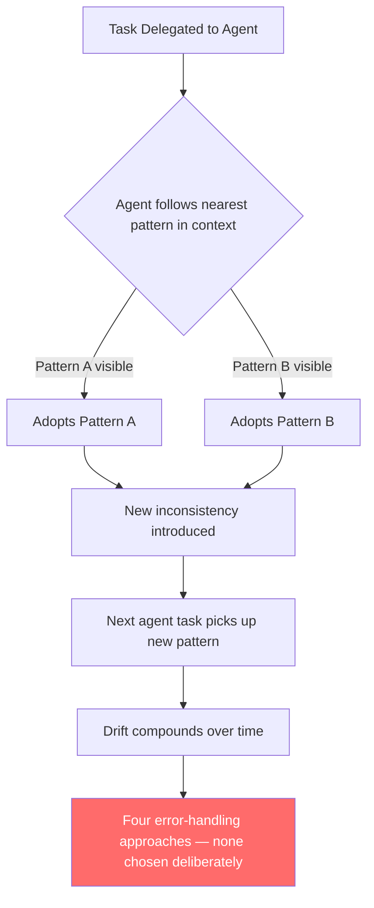
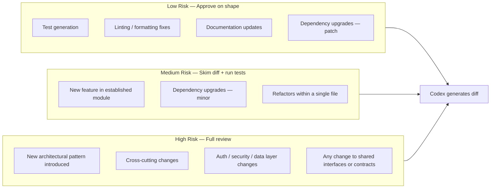

# Staying Engaged with Your Codebase in an Agentic World


---

There is a specific feeling that sets in about two weeks after you start delegating heavily to Codex: you open a file you own, in a repo you wrote most of, and you don't recognise it. Not because it's broken — the tests pass, CI is green. You don't recognise it because you didn't write it, and you didn't really review it either. You approved the diff, but you were approving the *shape* of the diff, not its intent.

That feeling is the beginning of architectural detachment. And it's worth addressing directly before it calcifies into something more damaging.

---

## Vibe Coding Is Not a Development Methodology

Andrej Karpathy coined "vibe coding" in February 2025 to describe a casual relationship with AI-generated code: you talk, the AI builds, you go with the flow.[^1] The term stuck because it captured something real. It's genuinely enjoyable to describe a problem in natural language and have something runnable appear in seconds.

The problem is that "going with the flow" is not a posture that scales to production systems. As Karpathy himself later noted with *agentic engineering*, the more productive model is one where AI agents handle execution and humans retain architectural judgment.[^2] The human is still driving. The agent is doing the heavy lifting.

When engineers stop reading code because an agent can summarise it, stop debugging because an agent can fix it, and stop designing because an agent can propose an architecture, they don't just lose domain-specific knowledge. They lose the intuition that tells a senior developer something feels wrong before they can articulate why.[^3] That intuition is built through years of direct engagement. Abstract it away entirely and you produce engineers who are highly productive in normal conditions and helpless when something genuinely novel goes wrong.

---

## The Drift Problem

Architectural drift is what happens when agents make locally sensible decisions that are globally inconsistent.[^4] An agent asked to add a new endpoint will follow the pattern nearest to it in context. If your codebase has three different approaches to error handling across different modules — a common situation in any codebase older than two years — the agent picks one without understanding why the inconsistency exists, whether it's deliberate, or whether unifying it would introduce a regression.

This compounds. The next agent task picks up the pattern the previous agent introduced. Within a few weeks you have a fourth error-handling approach with no human having consciously chosen it.



The fix isn't to stop delegating. It's to maintain a living architectural record that agents are explicitly constrained to follow.

---

## AGENTS.md as Your Architectural Stance

Your `AGENTS.md` file is the primary mechanism by which you encode architectural intent into agent context.[^5] Most teams treat it as a list of commands and constraints. That's underselling it. A well-maintained `AGENTS.md` is a declaration of architectural decisions: which patterns are canonical, which shortcuts are accepted debt, which areas require human review before any change is committed.

```markdown
## Architecture Constraints

- All new API endpoints must use the `BaseHandler` pattern in `src/handlers/base.ts`.
  Never introduce a bare Express route handler.
- Error handling: use `AppError` from `src/errors/index.ts`. Do not introduce new
  error classes without a corresponding ADR in `/docs/adr/`.
- Do not add direct database access outside `src/repositories/`. If a new query is
  needed that doesn't fit an existing repository, ask before proceeding.

## Areas Requiring Human Review

- Any change to `src/auth/` triggers mandatory human review before merge.
- Schema migrations must be reviewed by a human regardless of scope.
```

When Codex makes the same architectural mistake twice, treat it as signal: either the constraint isn't in `AGENTS.md`, or it's there but insufficiently specific. Update it. The AGENTS.md is a live document; letting it drift behind the codebase is exactly how architectural drift starts.[^6]

---

## Staying in the Loop Without Reviewing Everything

The wrong conclusion to draw from this is that you should review every line the agent writes. That defeats the purpose of delegation and introduces a bottleneck that makes agents economically unattractive.

The right model is *tiered engagement*:



Low-risk tasks — test generation, formatting, documentation — can be approved largely on shape. Medium-risk tasks warrant a skim of the diff and a local test run. High-risk tasks get the same scrutiny you'd give a colleague's PR.[^7]

The boundary between tiers isn't fixed. Calibrate it based on the blast radius if the change is wrong, not on the complexity of the diff itself. A one-line change to an authentication handler is high risk. A 200-line test file is low risk.

---

## The Review Habit

One of the more effective habits for staying engaged is treating Codex's code review feature as a dialogue, not a stamp.[^8] When Codex reviews its own output against your main branch, read what it flags — not to catch issues the agent missed, but to stay calibrated on what the codebase looks like now.

```bash
# Review uncommitted changes before pushing
codex "Review my uncommitted changes for architectural consistency with the existing codebase"

# Review against base branch
codex "Review the diff between this branch and main, focusing on any new patterns introduced"
```

The point is not to catch every bug — your CI pipeline handles that. The point is to maintain the mental model of what your codebase is and where it's going. That mental model is what architectural judgment runs on.

---

## Delegation Is Not Abdication

The senior engineers who are getting the most out of Codex in 2026 describe a consistent shift: less time writing implementation code, more time doing what only they can do.[^9] Designing the architecture. Choosing which shortcuts are acceptable and which will cause problems in six months. Knowing when a new dependency is warranted and when it's scope creep. Writing the kind of context in `AGENTS.md` that makes the next fifty agent tasks reliable.

That shift is healthy. The problem comes when delegation becomes abdication — when the engineer stops maintaining the architectural mental model because the agent is handling it. The agent isn't handling it. The agent is executing within the model you've defined, or guessing when you haven't defined it clearly enough.

Your job hasn't become smaller. It's changed shape. The implementation burden is lower. The judgment burden remains exactly what it was, and in some respects it's higher — because the cost of a poorly-specified constraint in `AGENTS.md` is now multiplied across every agent task that runs against your codebase.

---

## Practical Habits

- **Update `AGENTS.md` after every third agent task.** Review what the agent did, identify decisions it made that you'd want it to make differently next time, and encode them.
- **Run a weekly architecture review.** Not of every file — of the new patterns the agent introduced. Did they improve the codebase or degrade it?
- **Keep a short `CONSTRAINTS.md`** for things that must never change without a human decision: authentication logic, schema migration approach, public API contracts. Reference it from `AGENTS.md`.[^10]
- **Don't let the agent's plan substitute for your architectural reasoning.** Plan mode surfaces what work a task entails. It's not a substitute for knowing what the right architecture is before you issue the task.
- **Read the transcript occasionally.** Codex's transcript shows its reasoning. Reading one for architectural assumptions — not correctness — surfaces misunderstandings early.

The goal isn't to slow down. It's to ensure the codebase you have in six months is one you understand and can reason about — not a stranger you happen to own the keys to.

---

## Citations

[^1]: Karpathy, A. (2025). Original "vibe coding" tweet, February 2025. Discussed in: [Vibe coding — Wikipedia](https://en.wikipedia.org/wiki/Vibe_coding).
[^2]: Sau Sheong. (2026). [From vibe coding to agentic engineering](https://sausheong.com/from-vibe-coding-to-agentic-engineering-1ca3ca72b5ac). Medium, February 2026.
[^3]: Voitanos. (2026). [My Thoughts on Vibe Coding vs. Agentic Engineering](https://www.voitanos.io/blog/vibe-coding-vs-agentic-engineering/). The quote on losing intuition is discussed in detail in this post.
[^4]: Microsoft DevBlogs. (2026). [The Realities of Application Modernization with Agentic AI (Early 2026)](https://devblogs.microsoft.com/all-things-azure/the-realities-of-application-modernization-with-agentic-ai-early-2026/). "Architectural drift" is named explicitly as a scale risk.
[^5]: OpenAI. (2026). [Best practices — Codex](https://developers.openai.com/codex/learn/best-practices). Official guidance on using `AGENTS.md` for persistent instructions and project-level conventions.
[^6]: Kirill Markin. (2026). [Codex Rules: Global Instructions, AGENTS.md, and Mac App](https://kirill-markin.com/articles/codex-rules-for-ai/). Discusses keeping AGENTS.md up to date as codebase evolves.
[^7]: Mike Mason. (2026). [AI Coding Agents in 2026: Coherence Through Orchestration, Not Autonomy](https://mikemason.ca/writing/ai-coding-agents-jan-2026/). The tiered review model is consistent with this analysis.
[^8]: OpenAI. (2026). [Build Code Review with the Codex SDK](https://developers.openai.com/cookbook/examples/codex/build_code_review_with_codex_sdk). Codex CLI's `/review` command and branch diffing are documented here.
[^9]: TechTarget. (2026). [Software development in 2026: A hands-on look at AI agents](https://www.techtarget.com/searchapparchitecture/opinion/A-hands-on-look-at-AI-agents). Senior engineers describe the shift to orchestration over implementation.
[^10]: vFunction. (2025). [The rise of vibe coding: Why architecture still matters in the age of AI agents](https://vfunction.com/blog/vibe-coding-architecture-ai-agents/). Recommends explicit architectural constraints as a countermeasure to drift.
