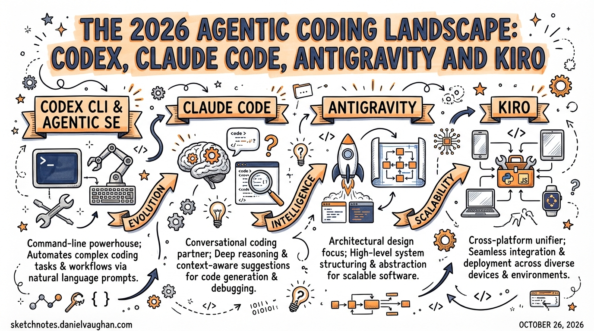

*Published 2026-03-28. Research compiled from Lushbinary, Vibecoding.app, Google Developers Blog, Augment Code, and community reviews.*

---

By March 2026, seven serious agentic coding tools compete for engineers' attention. This article maps the landscape, explains where each tool fits, and clarifies where **Codex CLI** holds its ground.

## The Seven Contenders

| Tool | Paradigm | Best For | Price |
|------|---------|---------|-------|
| **OpenAI Codex CLI** | Terminal agent | Throughput, CI/CD, precision tasks | Included with ChatGPT Plus+ |
| **Claude Code** | Terminal agent | Architectural reasoning, hard problems | $20/mo (Pro); $100–$200 (Max) |
| **Google Antigravity** | IDE + Manager + Browser | Multi-agent orchestration experiments | Free (public preview) |
| **Kiro** | Spec-driven IDE | Structure-first development, AWS teams | ~$20/month |
| **Cursor** | IDE agent | Daily IDE use, stability, SOC 2 | Various |
| **Windsurf** | IDE agent | Budget-conscious IDE-first teams | $15/month |
| **GitHub Copilot / Agent HQ** | Issue-to-PR agent | GitHub-native async workflows | Part of Copilot subscription |

---

## Google Antigravity: The New Challenger

**What it is:** Google's agentic IDE, announced November 20, 2025 alongside Gemini 3. Not just an editor with AI features — a full agentic development platform with three distinct surfaces.

**Three-surface architecture:**

1. **Editor Surface** — A standard VSCode-fork IDE with AI completions and inline commands
2. **Manager Surface** — "Mission control" for spawning and orchestrating multiple agents asynchronously, with auditable artifacts (screenshots, task lists, browser recordings)
3. **Browser Sub-Agent** — A built-in headless Chromium agent that can "see" web apps via Gemini 3's multimodal vision — write code, run it, see the UI, verify it, all in one loop

**AgentKit 2.0** (shipped March 2026): 16 specialized agents, 40+ domain-specific skills, 11 pre-configured command sets covering frontend, backend, testing, and more.

**Models:** Gemini 3.1 Pro (High/Low), Gemini 3 Flash, Claude Sonnet 4.6, Claude Opus 4.6, GPT-OSS-120B

**Benchmarks:** 76.2% on SWE-bench Verified (Gemini 3 Pro) vs Claude Sonnet 4.5 at ~77%. On Terminal-Bench 2.0: Gemini 3 Pro 54.2% vs GPT-5.1 at 47.6%.

**Free during public preview** — download at antigravity.google

### The Controversy

Rate limit controversy dominates community discussion. Credits reset weekly not every 5 hours as advertised. High-reasoning models (Gemini 3 Pro, Claude Opus) feel throttled. Community verdict: *"a tool for experimentation, not production reliance"* (Vibecoding.app, 3.5/5).

### How Antigravity Changes the Codex Calculus

Antigravity doesn't directly compete with Codex CLI — different paradigms entirely. But it raises the bar on what "free" multi-agent tooling looks like:

- **Antigravity's Manager Surface vs Codex's git-worktree approach:** Both enable parallel agents, but Antigravity's UI makes the orchestration *visible* in a way that the CLI (by design) doesn't. Engineers who want observability may prefer Antigravity for experimental workflows; engineers who want reproducibility and CI-native automation will stick with Codex.
- **Browser-native verification:** Antigravity's built-in browser agent (write → run → see → verify) is a genuine capability gap vs Codex, which requires external Playwright MCP or skills for browser interaction.
- **Free access to frontier models:** Antigravity offers Claude Opus 4.6 access in its free tier (when not throttled), which is cheaper than running Claude Code on the Max plan.

---

## Kiro: AWS's Spec-First IDE

**What it is:** Amazon's entry into agentic coding. Formerly **Amazon Q Developer CLI**, rebranded as **Kiro** on November 17, 2025.

**Core philosophy:** "Spec-driven development" — converts natural language prompts to structured requirements (EARS notation) before writing a single line of code. Then architecture, then implementation.

**Three-step workflow:**
1. Natural language prompt → structured EARS requirements
2. Requirements → architecture plan
3. Architecture → implementation with automated agent hooks

**Agent hooks:** Automate follow-up actions (e.g., run tests whenever files are saved). Similar in spirit to Codex hooks, but baked into the IDE workflow rather than configured in `config.toml`.

**Model:** Claude Sonnet 4.5 with an "Auto" mode that blends frontier models with intent detection and prompt caching.

**AWS native:** Integrates with IAM, Bedrock, CodeWhisperer. For AWS-heavy teams, it's a natural fit.

**Price:** ~$20/month flat. No credits system.

### When to Use Kiro vs Codex CLI

Use Kiro when:
- Your team struggles with AI-generated code that drifts from specifications
- You're building on AWS and want native IAM/Bedrock integration
- You want a structured, auditable requirements trail from prompt to PR
- A flat $20/month is preferable to usage-based pricing

Use Codex CLI when:
- You need throughput and speed over structured planning
- You're integrating agents into CI/CD pipelines (`codex exec`)
- You want terminal-native workflows, not an IDE
- You need multi-agent parallel execution via git worktrees

---

## How Daniel Should Think About This

For **Daniel's agentic pod** (Claude Code + Codex CLI + Gemini CLI triangle):

```
Architectural exploration  → Claude Code (deep reasoning, exploratory)
Backend precision tasks    → Codex CLI (exact, fast, CI-native)
Boilerplate / migration    → Gemini CLI (speed, cost)
```

Google Antigravity is worth experimenting with for its **Manager Surface** and **browser agent** capabilities — but not as a production replacement. The agentic orchestration concepts it implements (parallel agents, artifact-based progress tracking, multi-modal verification) inform patterns that can be reproduced in Codex CLI with the right TOML subagent setup + screenshot MCP + Playwright skill.

Kiro is relevant primarily as a **competitive benchmark** and as a pattern source for spec-driven development approaches that can be replicated in Codex with an AGENTS.md requirements-first workflow template.

---

## Key Benchmark Reference (March 2026)

| Tool | SWE-bench Verified | Notes |
|------|--------------------|-------|
| Codex CLI (gpt-5.4) | ~74% | Best in throughput per $ |
| Claude Code (Opus 4.6) | ~77% | Best absolute performance |
| Google Antigravity (Gemini 3 Pro) | 76.2% | Free (throttled) |
| Kiro (Claude Sonnet 4.5) | ~72% | Spec-driven, structured |
| Cursor | Not published | Best IDE UX |

*Benchmarks are directional — contamination concerns apply. SWE-bench Verified is the cleanest public benchmark but still imperfect.*

---

## Sources

- [AI Coding Agents 2026: Full Comparison — Lushbinary](https://lushbinary.com/blog/ai-coding-agents-comparison-cursor-windsurf-claude-copilot-kiro-2026/)
- [Google Antigravity — Google Developers Blog](https://developers.googleblog.com/build-with-google-antigravity-our-new-agentic-development-platform/)
- [Google AntiGravity Review — Vibecoding.app](https://vibecoding.app/blog/google-antigravity-review)
- [Google Antigravity vs Gemini CLI — Augment Code](https://www.augmentcode.com/tools/google-antigravity-vs-gemini-cli)
- [6 Best Devin Alternatives — Augment Code](https://www.augmentcode.com/tools/best-devin-alternatives)
