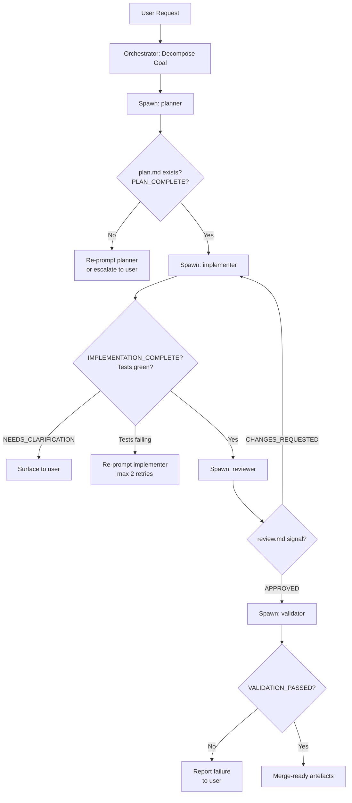

# The Agentic Pod in Practice: Running Multiple Agent Roles in Your Team


---

There is a tempting shortcut when you first discover Codex subagents: drop one very large prompt into the orchestrator and hope it handles planning, implementation, review, and validation itself. It rarely works well. A single agent context cannot simultaneously hold a complete architectural plan, the full implementation surface, a detached reviewer's perspective, and a validator's scepticism without collapsing into confused, low-quality output.[^1]

The industrial solution is role specialisation. The same principle that makes human engineering teams effective — distinct responsibilities, clear handoff points, no single person both writing and reviewing the same code — applies directly to agent teams. This article covers how to implement five well-defined agent roles in Codex CLI, how to assign models cost-effectively, and how to wire the handoffs between them.

---

## The Five Roles

The roles described here follow the pattern established by mature multi-agent codebases and the emerging practitioner consensus in 2026:[^2]

| Role | Responsibility | Consumes | Produces |
|------|----------------|----------|----------|
| **Orchestrator** | Decomposes the goal, sequences work, enforces gates | User intent | Task manifest, spawn instructions |
| **Planner** | Converts a task into a detailed technical plan | Task spec | `plan.md` or structured JSON plan |
| **Implementer** | Executes the plan — writes, edits, runs commands | `plan.md` | Changed files, test results |
| **Reviewer** | Reads diffs and plan; checks correctness, security, and style | Diffs + plan | Review report, approve/reject signal |
| **Validator** | Runs the full test suite and CI checks independently | Codebase | Pass/fail signal with evidence |

The Orchestrator is the only role that talks directly to the user. Every other role is internal to the pipeline. This separation prevents the common failure where an implementer starts second-guessing requirements mid-task or a reviewer inadvertently begins rewriting code it should only evaluate.

---

## Mapping Roles to Codex CLI Agent Types

Codex CLI ships three built-in agent types:[^3]

- **`default`** — general-purpose fallback
- **`worker`** — execution-focused, optimised for implementation and fixes
- **`explorer`** — read-heavy, designed for codebase exploration with a read-only posture

The mapping is straightforward:

| Role | Built-in base | Rationale |
|------|---------------|-----------|
| Orchestrator | `default` | Needs full tool access and spawning authority |
| Planner | `default` | Reasoning-heavy; no code writes needed at plan time |
| Implementer | `worker` | Optimised for edits, shell commands, test runs |
| Reviewer | `explorer` | Read-only; preventing code writes enforces reviewer discipline |
| Validator | `worker` | Needs shell access to run test suites and lint commands |

---

## Custom Agent TOML Definitions

Custom agents live in `~/.codex/agents/` (personal) or `.codex/agents/` (project-scoped).[^4] Each is a standalone `.toml` file.

### Planner

```toml
name = "planner"
description = "Converts a task specification into a detailed technical plan. Use before implementation starts."
developer_instructions = """
You are a technical planner. You receive a task specification and produce a structured plan saved to .codex/plan.md.

Your plan must include:
- Affected files (list each with the type of change)
- Dependency order (which changes must land before others)
- Test strategy (which tests prove correctness)
- Risk items (anything uncertain or requiring human review)

Do NOT write any source code. Do NOT modify files outside .codex/.
When done, output: PLAN_COMPLETE
"""
model = "o3"
model_reasoning_effort = "high"
sandbox_mode = "untrusted"
```

### Implementer

```toml
name = "implementer"
description = "Executes a technical plan produced by the planner. Reads plan.md and makes the described changes."
developer_instructions = """
You are an implementer. Read .codex/plan.md before starting. Follow it exactly.

Rules:
- Implement changes in dependency order as specified in the plan
- Run tests after each logical group of changes
- If a test fails, fix it before proceeding — do not skip
- If the plan is ambiguous, write your question to .codex/clarifications.md and output: NEEDS_CLARIFICATION
- When all changes are complete and tests pass, output: IMPLEMENTATION_COMPLETE
"""
model = "o4-mini"
model_reasoning_effort = "medium"
sandbox_mode = "untrusted"
```

### Reviewer

```toml
name = "reviewer"
description = "Reviews diffs against the plan for correctness, security, and style. Read-only — never modifies source files."
developer_instructions = """
You are a code reviewer. You will be given a git diff and the original plan at .codex/plan.md.

Evaluate:
1. Does the implementation match the plan's intent?
2. Are there security issues (injection, exposure, privilege escalation)?
3. Are there correctness issues (off-by-one, missing null checks, race conditions)?
4. Does the code follow project conventions in AGENTS.md?

Write your findings to .codex/review.md. Use this format:
- APPROVED — no blocking issues
- CHANGES_REQUESTED — list specific line-level issues

Do NOT modify any source file. Output your signal on the final line.
"""
model = "o3"
model_reasoning_effort = "high"
sandbox_mode = "untrusted"
```

### Validator

```toml
name = "validator"
description = "Runs the full test suite and CI checks independently to confirm the implementation is safe to merge."
developer_instructions = """
You are a validator. Run the project's full test suite and any lint or type-check commands specified in AGENTS.md.

Report results to .codex/validation.md:
- List every command run and its exit code
- Summarise failures with file and line references
- Output: VALIDATION_PASSED or VALIDATION_FAILED

You may fix test infrastructure issues (e.g., missing env vars in test config), but never modify source code or tests to make them pass artificially.
"""
model = "o4-mini"
model_reasoning_effort = "minimal"
sandbox_mode = "untrusted"
```

---

## The Orchestrator's Gate Logic

The orchestrator spawns and sequences these agents. A robust orchestrator enforces gates — it does not advance the pipeline unless the prior stage signals success:[^5]



Gate checks are simple file existence or exit code assertions the orchestrator can perform with a shell command before issuing the next spawn instruction.[^6]

---

## Model Assignment Strategy

Not all roles need the same reasoning power — and the cost difference is significant.[^7]

| Role | Recommended model | Reasoning effort | Why |
|------|-------------------|-----------------|-----|
| Orchestrator | o3 | medium | Decomposition quality matters; this is the architectural brain |
| Planner | o3 | high | Plans set the quality ceiling for everything downstream |
| Implementer | o4-mini | medium | Speed and throughput matter; reviews will catch errors |
| Reviewer | o3 | high | Detached, adversarial perspective requires deep reasoning |
| Validator | o4-mini | minimal | Mechanical — run commands, read exit codes |

This tiering roughly halves the per-pipeline token cost compared to running o3-high throughout, whilst preserving quality where it matters most: planning and review.[^8]

---

## AGENTS.md Patterns for Role-Scoped Behaviour

Project-level `AGENTS.md` files can constrain agent behaviour by role. A common pattern is to keep a short top-level `AGENTS.md` for all agents and role-specific sections that agents are instructed to read:

```markdown
# Project Conventions (all agents read this)

## Test runner
`npm test` — must pass before any merge.

## Code style
ESLint + Prettier. Run `npm run lint` before committing.

---

## For reviewer agents only

Check for:
- Unhandled Promise rejections
- `console.log` left in production paths
- Missing input validation on public API routes
```

In each agent's TOML, reference the section directly:

```toml
developer_instructions = """
...
Before reviewing, read the 'For reviewer agents only' section of AGENTS.md.
"""
```

This keeps role-specific instructions versioned in the repo alongside the code they govern.[^9]

---

## Sequential vs Parallel: The Decision

The five-role pipeline above is **sequential by default** — each gate must pass before the next role activates. This is the right choice when:

- **Correctness matters more than speed** — financial, medical, or security-sensitive code
- **Roles have hard data dependencies** — the reviewer cannot review code that doesn't exist yet
- **Retry loops are acceptable** — the pipeline may re-enter the implementer multiple times

Switch to **partial parallelism** when independent concerns can be evaluated simultaneously. For example, the Reviewer and Validator can run in parallel — the reviewer reads diffs whilst the validator runs the test suite. Neither modifies files, so there is no conflict:[^10]

```toml
# In orchestrator instructions:
# After IMPLEMENTATION_COMPLETE — spawn reviewer and validator in parallel
spawn_agents_on_csv = ".codex/parallel_phase.csv"
```

```csv
agent,instruction
reviewer,Review the diff in .codex/diff.patch against .codex/plan.md. Write findings to .codex/review.md.
validator,Run the full test suite and write results to .codex/validation.md.
```

Wait for both before advancing. The orchestrator reads both output files and gates the merge-ready signal on APPROVED + VALIDATION_PASSED.

---

## Anti-Patterns to Avoid

**One agent doing everything.** A single agent asked to plan, implement, review, and validate cannot maintain the detached perspective that makes review valuable. It will rationalise its own decisions.[^11]

**Skipping the planner.** Sending the implementer directly to a vague user request produces exploratory hacking, not deterministic delivery. The plan is the contract between human intent and agent execution.

**Letting the reviewer write code.** The moment the reviewer modifies source files, it becomes an implementer with broken context. Enforce `sandbox_mode = "untrusted"` and read-only tool restrictions on reviewer agents.

**Infinite retry loops.** Cap implementer retries at two or three. If the pipeline cannot pass review after three attempts, escalate to the user — autonomous cycling without convergence burns tokens and time.

**Homogeneous models.** Using o3-high for every role is expensive and unnecessary. The validator is running shell commands; it does not need deep reasoning.

---

## Citations

[^1]: Researchers and practitioners consistently find that single-agent, single-context approaches underperform on complex tasks requiring diverse cognitive modes. See [Multi-Agent AI Systems Are Transforming Enterprise Development](https://dev.to/synsun/multi-agent-ai-systems-are-transforming-enterprise-development-the-trend-reshaping-tech-in-2026-g33) (DEV.to, 2026).

[^2]: Role taxonomy derived from [kennedym-ds/copilot_orchestrator](https://github.com/kennedym-ds/copilot_orchestrator) (29-agent system with Conductor → Planner → Implementer → Reviewer pipeline) and [Agentic Coding 2026: Multi-Agent AI Teams Replace Solo Devs](https://aiautomationglobal.com/blog/agentic-coding-revolution-multi-agent-teams-2026) (AI Automation Global).

[^3]: Codex CLI built-in agent types: `default`, `worker`, `explorer`. See [Subagents – Codex | OpenAI Developers](https://developers.openai.com/codex/subagents).

[^4]: Custom agent TOML location and required/optional fields documented at [Subagents – Codex | OpenAI Developers](https://developers.openai.com/codex/subagents).

[^5]: Gate-based orchestration pattern described in [How to Apply GAN Architecture to Multi-Agent Code Generation](https://www.freecodecamp.org/news/how-to-apply-gan-architecture-to-multi-agent-code-generation/) (freeCodeCamp): structured signals (`PLAN_COMPLETE / REVISION_REQUIRED / PLAN_APPROVED`) routed by the orchestrator to determine the next agent invocation.

[^6]: File-existence gate checks align with Codex CLI's shell tool access. The orchestrator confirms artefact presence before spawning the next agent. See [Subagents – Codex | OpenAI Developers](https://developers.openai.com/codex/subagents).

[^7]: Model tiering strategy informed by [kennedym-ds/copilot_orchestrator](https://github.com/kennedym-ds/copilot_orchestrator) which offers three model-tier branches: full-capability (GPT-5.4 + Claude Opus), low-cost (~64% reduction), and free-cost.

[^8]: ⚠️ Precise cost reduction figures for tiered vs homogeneous model assignment in Codex CLI pipelines are not independently verified — treat the 50% estimate as directional rather than exact.

[^9]: AGENTS.md as versioned per-role configuration is consistent with patterns described in [Building Consistent Workflows with Codex CLI & Agents SDK](https://developers.openai.com/cookbook/examples/codex/codex_mcp_agents_sdk/building_consistent_workflows_codex_cli_agents_sdk) (OpenAI Developer Cookbook).

[^10]: Parallel reviewer + validator pattern using `spawn_agents_on_csv` follows the batch processing model documented at [Subagents – Codex | OpenAI Developers](https://developers.openai.com/codex/subagents).

[^11]: Same-model self-review perpetuates the same reasoning errors the writer made. Architectural separation (different agent, different context, different role constraint) is required. See [Cross-Model Adversarial Review](https://danielvaughan.github.io/codex-resources/articles/2026-03-28-cross-model-adversarial-review/) and [AddyOsmani: The Future of Agentic Coding — Conductors to Orchestrators](https://addyosmani.com/blog/future-agentic-coding/).
