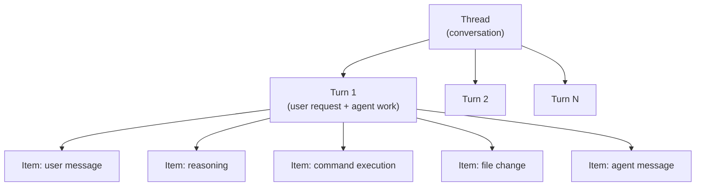
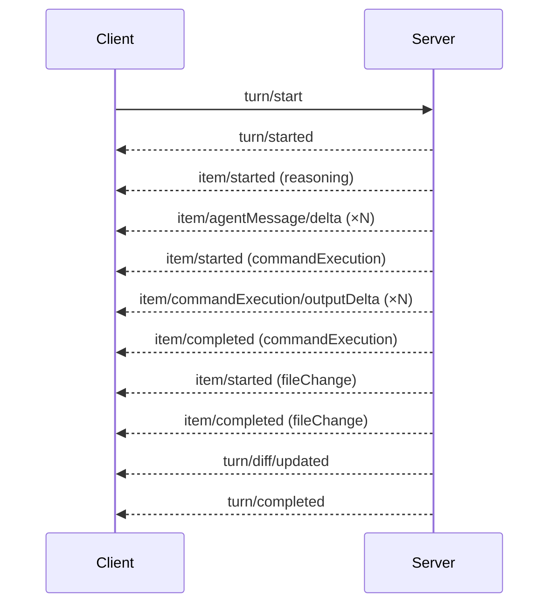

# The Codex App-Server: Building Custom Integrations with the JSON-RPC Protocol


Every surface where Codex runs — the web app, the macOS desktop app, the VS Code extension, the CLI itself — is powered by the same underlying harness.[^1] That harness is exposed as the **Codex App-Server**: a long-lived process running a bidirectional JSON-RPC 2.0 interface. If you want to embed Codex into your own tooling beyond the official surfaces, this is the protocol to understand.

The App-Server graduated from being a purely internal implementation detail when OpenAI published the `codex-rs/app-server` source and its developer documentation.[^2] It is still marked experimental in places, but it is stable enough that the VS Code extension — shipped to tens of thousands of developers — relies on it exclusively.[^3]

## The Thread/Turn/Item Model

The entire protocol is organised around three nested primitives:[^4]



- **Thread** — a persistent conversation. Threads survive process restarts and can be resumed by ID.
- **Turn** — one complete exchange: a user input followed by all the agent work that produces a response. Turns are the unit of interruption and rollback.
- **Item** — an atomic output unit within a turn: a message delta, a shell command, a file edit, a tool call, or a reasoning note.

This hierarchy maps directly onto what you see in the Codex UI. When Codex edits three files and runs `pytest`, you are watching a single turn emit multiple command and file-change items, all streamed incrementally.

## Transport Options

The App-Server supports two transports:[^5]

```bash
# Default: newline-delimited JSON over stdio
codex app-server --listen stdio://

# Experimental: WebSocket
codex app-server --listen ws://127.0.0.1:4500
```

**Stdio** is the production-grade choice. The client spawns the `codex app-server` subprocess and reads/writes JSONL on its stdout/stdin. This is how the VS Code extension operates.[^6]

**WebSocket** is currently experimental and unsupported for production workloads.[^7] It becomes useful when the agent process runs on a separate machine (e.g. a remote dev box) and you need to forward over SSH. The `--remote` flag on the Codex CLI accepts `ws://` or `wss://` addresses so you can attach a TUI to a remote App-Server instance:

```bash
# Attach TUI to a remote app-server
codex --remote wss://codex.example.com/socket --no-alt-screen
```

WebSocket authentication uses either a capability token or an HMAC-signed JWT. Non-loopback listeners should have auth configured explicitly — unauthenticated remote listeners are only suitable during controlled rollout.[^8]

Overloaded servers respond with JSON-RPC error code `-32001` ("Server overloaded; retry later"). Clients must implement exponential backoff with jitter rather than tight-loop retries.

## Initialisation Handshake

Every client must complete a two-step handshake before issuing any other request:[^9]

```javascript
// Step 1: initialize request
proc.stdin.write(JSON.stringify({
  method: "initialize",
  id: 0,
  params: {
    clientInfo: { name: "my-tool", version: "1.0.0" },
    capabilities: {
      experimentalApi: true,          // opt-in to gated methods
      optOutNotificationMethods: []   // suppress noisy events per-connection
    }
  }
}) + "\n");

// Step 2: initialized notification (no id = notification)
proc.stdin.write(JSON.stringify({
  method: "initialized",
  params: {}
}) + "\n");
```

The server responds to `initialize` with the user-agent string, the `codexHome` directory, and platform metadata. Requests arriving before the handshake completes receive a "Not initialized" error.

`capabilities.experimentalApi: true` is required to access gated methods such as dynamic tools and the extended filesystem RPC set. `optOutNotificationMethods` lets high-throughput clients drop event types they do not consume — useful for suppressing `item/commandExecution/outputDelta` spam in CI integrations that only care about turn completion.

## Core RPC Methods

### Thread Lifecycle

```javascript
// Start a fresh conversation
{ method: "thread/start", id: 1, params: { cwd: "/my/project" } }

// Resume from a previous session
{ method: "thread/resume", id: 2, params: { threadId: "thr_abc123" } }

// Branch a conversation without mutating the original
{ method: "thread/fork", id: 3, params: { threadId: "thr_abc123" } }

// Drop the last N turns (undo)
{ method: "thread/rollback", id: 4, params: { threadId: "thr_abc123", count: 1 } }
```

`thread/list` returns paginated thread history with filters for model provider, source (CLI vs app vs IDE), archived status, and working directory — enough to build a meaningful thread browser UI.

### Turn Control

```javascript
// Begin a turn
{ method: "turn/start", id: 5, params: {
    threadId: "thr_abc123",
    userInput: "Refactor the auth module to use JWT",
    sandboxPolicy: "workspaceWrite"
}}

// Append additional context while the turn is running
{ method: "turn/steer", id: 6, params: {
    threadId: "thr_abc123",
    turnId:   "turn_xyz",
    input:    "Actually, use RS256 not HS256"
}}

// Cancel an in-flight turn
{ method: "turn/interrupt", id: 7, params: {
    threadId: "thr_abc123",
    turnId:   "turn_xyz"
}}
```

`turn/steer` is particularly powerful for agentic UIs — it allows users to course-correct mid-execution without cancelling and restarting.

## Event Notification Stream

After `turn/start` the server streams notifications until the turn completes:[^10]



Every item follows the lifecycle: `item/started` → zero or more deltas → `item/completed`. The `turn/diff/updated` notification carries a consolidated diff of all file changes in the turn — useful for diff views without parsing individual file-change items.

## Approval Flow

Commands and file changes may require approval depending on the session's sandbox policy. The server initiates a JSON-RPC request *to the client* — this is the bidirectional aspect of the protocol:[^11]

```javascript
// Server → Client (server-initiated request)
{
  "method": "serverRequest/approval",
  "id": "sreq_001",
  "params": {
    "type": "commandExecution",
    "command": "rm -rf dist/",
    "threadId": "thr_abc123"
  }
}

// Client → Server (response)
{
  "id": "sreq_001",
  "result": { "decision": "acceptForSession" }
}
```

Valid decisions for command execution: `accept`, `acceptForSession`, `acceptWithExecpolicyAmendment`, `applyNetworkPolicyAmendment`, `decline`, `cancel`. After the client responds, the server emits a `serverRequest/resolved` notification confirming the outcome.

UIs should render approval requests inline with the active turn so the decision context is visible to the user.

## Filesystem RPCs

The v2 App-Server adds a filesystem RPC layer independent of the agent's tool execution:[^12]

```javascript
// Read a file
{ method: "fs/readFile",      params: { path: "/my/project/src/auth.ts" } }

// Write a file (respects sandbox policy)
{ method: "fs/writeFile",     params: { path: "/tmp/output.json", content: "..." } }

// Watch a directory for changes
{ method: "fs/watch",         params: { path: "/my/project/src" } }
// Server emits: fs/changed notifications when files are modified

// Enumerate directory contents
{ method: "fs/readDirectory", params: { path: "/my/project" } }
```

These methods are separate from the tool calls that the agent itself makes during a turn. They let the *client* perform filesystem operations — for example, reading the current file open in an editor to inject as context before starting a turn.

Filesystem watch enables reactive UIs that update their file tree as the agent works, without polling.

## Schema Generation and Tooling

For typed client development, the App-Server can generate its own schema:[^13]

```bash
# TypeScript definitions matching the running Codex version
codex app-server generate-ts

# Full JSON Schema bundle
codex app-server generate-json-schema

# Include gated/experimental fields
codex app-server generate-ts --experimental
```

The generated artefacts are version-pinned: they reflect the exact Codex binary that produced them. Always regenerate after a Codex upgrade to catch breaking changes in the protocol.

## Practical Integration Patterns

### Embedding Codex in a Custom IDE

Spawn `codex app-server` as a subprocess in your IDE plugin. Use `thread/resume` on startup to restore the user's last session. Stream `item/agentMessage/delta` into your output panel and `turn/diff/updated` into an inline diff view. Register approval handlers for `serverRequest/approval` requests so users can approve commands from within your UI.

### Headless CI Integration

In CI, spawn App-Server with `sandboxPolicy: "workspaceWrite"` and auto-approve decisions. Listen only for `turn/completed` and `error` — suppress the rest with `optOutNotificationMethods`. Use `thread/rollback` if a turn produces a failing diff before committing.

### Remote Development

Run `codex app-server --listen ws://0.0.0.0:4500` on a beefy remote box. Connect your local TUI with `codex --remote wss://your-box.example.com/socket`. This gives you the full Codex experience against remote compute without SSH session management.

## Caveats

The App-Server carries explicit stability warnings: the WebSocket transport is experimental, the filesystem RPC set is a v2 addition, and some methods require opting into `experimentalApi`.[^14] Pin your Codex version in production integrations, regenerate schemas after updates, and treat `-32001` overload errors as transient.

## Citations

[^1]: OpenAI, "App Server – Codex Developer Docs", https://developers.openai.com/codex/app-server
[^2]: GitHub, openai/codex – codex-rs/app-server/README.md, https://github.com/openai/codex/blob/main/codex-rs/app-server/README.md
[^3]: OpenAI, "Codex Changelog", https://developers.openai.com/codex/changelog
[^4]: GitHub, openai/codex – app-server README (Thread/Turn/Item model), https://github.com/openai/codex/blob/main/codex-rs/app-server/README.md
[^5]: OpenAI, "CLI Reference – Codex", https://developers.openai.com/codex/cli/reference
[^6]: Releasebot.io, "Codex by OpenAI - Release Notes - March 2026", https://releasebot.io/updates/openai/codex
[^7]: OpenAI, "CLI Reference – `--listen` flag", https://developers.openai.com/codex/cli/reference
[^8]: GitHub, openai/codex – app-server README (WebSocket Auth), https://github.com/openai/codex/blob/main/codex-rs/app-server/README.md
[^9]: OpenAI, "App Server – Codex Developer Docs (Initialisation)", https://developers.openai.com/codex/app-server
[^10]: OpenAI, "App Server – Codex Developer Docs (Event Notifications)", https://developers.openai.com/codex/app-server
[^11]: OpenAI, "App Server – Codex Developer Docs (Approval Flow)", https://developers.openai.com/codex/app-server
[^12]: Releasebot.io, "Codex by OpenAI – v2 filesystem RPCs", https://releasebot.io/updates/openai/codex
[^13]: OpenAI, "CLI Reference – app-server generate-ts", https://developers.openai.com/codex/cli/reference
[^14]: GitHub, openai/codex – app-server README (stability notes), https://github.com/openai/codex/blob/main/codex-rs/app-server/README.md
