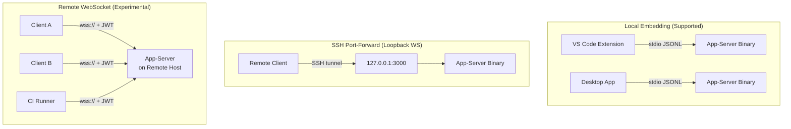

*Published: 2026-03-28 · Sources: Codex app-server README, OpenAI Developer Docs, InfoQ — all verified current as of v0.117.0 (March 2026)*

---


The Codex app-server is the JSON-RPC layer that powers every Codex surface — the desktop app, the VS Code extension, Xcode 26.3, and the web runtime all speak the same protocol.[^1] Most teams run it locally over stdio, but v0.117.0 introduced a WebSocket transport that enables a genuinely different deployment topology: a single long-lived Codex process running on a remote host, shared across multiple clients or embedded in a container.

This article covers what you need to know to deploy the app-server beyond your laptop — including transport flags, bearer-token authentication, health probe configuration, backpressure handling, and the security gotchas that will bite you if you skip the README.

---

## Why a Remote App-Server?

The canonical use case is **Dev Containers**.[^2] Teams working in per-branch containers (one container per worktree) want the VS Code Codex extension to connect to an app-server instance running *inside* the container rather than on the host. That means exposing the app-server on a port the extension can reach via the container's network.

Other scenarios include:

- **Team shared server** — a single, authenticated Codex instance on a beefy remote machine with faster I/O and local access to a large codebase.
- **CI/CD pipeline agent** — a containerised app-server that CI job runners connect to via WebSocket rather than spawning a fresh process per job.
- **Custom browser tooling** — a lightweight browser client (HTML + JavaScript) that drives Codex via the WebSocket JSON-RPC API without bundling the native binary.

---

## Transport Options

The app-server accepts a `--listen` flag that selects the transport layer.[^3]

```bash
# Default: JSONL over stdio (the only supported-for-production mode)
codex app-server --listen stdio://

# Experimental: WebSocket on a specific address
codex app-server --listen ws://127.0.0.1:3000

# Experimental: WebSocket on all interfaces (requires explicit auth — see below)
codex app-server --listen ws://0.0.0.0:3000
```

> **⚠️ WebSocket transport is currently experimental and unsupported.** OpenAI explicitly advises against relying on it for production workloads.[^4] That said, it is the only path to remote deployment, so teams evaluating it should be aware of the current limitations.

Remote clients connect with the `--remote` flag:

```bash
codex --remote ws://your-host:3000
```

This instructs the local TUI to act as a thin client, delegating all agent execution to the remote server. The remote app-server must already be running and accepting connections.

---

## Bearer Token Authentication

Non-loopback WebSocket listeners allow unauthenticated connections by default during the current rollout.[^5] If you are exposing the app-server on any address other than `127.0.0.1`, you **must** configure auth explicitly. There are two supported modes.

### Capability Token (simpler)

A pre-shared opaque token stored in a file. Clients include it as a standard `Authorization: Bearer <token>` header during the WebSocket handshake.

```bash
codex app-server \
  --listen ws://0.0.0.0:3000 \
  --ws-auth capability-token \
  --ws-token-file /etc/codex/ws-token
```

Generate a secure token with:

```bash
openssl rand -hex 32 > /etc/codex/ws-token
chmod 600 /etc/codex/ws-token
```

### HMAC-Signed JWT/JWS Bearer Token (recommended for multi-client)

For environments with multiple clients or where you need to scope tokens by issuer and audience, use signed bearer tokens. The server validates the JWT signature using a shared secret.

```bash
codex app-server \
  --listen ws://0.0.0.0:3000 \
  --ws-auth signed-bearer-token \
  --ws-shared-secret-file /etc/codex/jwt-secret \
  --ws-issuer https://ci.your-org.com \
  --ws-audience codex-remote \
  --ws-max-clock-skew-seconds 30
```

Authentication is enforced **before** the JSON-RPC `initialize` handshake. A client that connects without a valid credential will be rejected at the WebSocket upgrade stage, never reaching the RPC layer.[^6]

---

## Health Probes

WebSocket deployments expose two HTTP health probes on the same port as the WebSocket listener.[^7]

| Endpoint | Returns | Notes |
|---|---|---|
| `GET /readyz` | `200 OK` | Indicates the server is accepting connections |
| `GET /healthz` | `200 OK` | Returns 200 when **no** `Origin` header is present; returns `403 Forbidden` when an `Origin` header is present |

The `Origin` restriction on `/healthz` is a deliberate CSRF mitigation — it prevents browser-context requests from probing the health endpoint. Use your load balancer or container orchestrator's health check without an `Origin` header.

Kubernetes liveness/readiness probe example:

```yaml
livenessProbe:
  httpGet:
    path: /healthz
    port: 3000
  initialDelaySeconds: 5
  periodSeconds: 10
readinessProbe:
  httpGet:
    path: /readyz
    port: 3000
  initialDelaySeconds: 3
  periodSeconds: 5
```

---

## Deployment Patterns

The OpenAI architecture blog describes three deployment topologies.[^8] Understanding them clarifies where the remote WebSocket mode fits.



**Pattern 1 — Local embedding** is the default and only production-supported mode. The client binary bundles the app-server and spawns it as a child process over stdio.

**Pattern 2 — SSH port-forward** is the pragmatic middle ground. Run the app-server on the remote host listening on `ws://127.0.0.1:3000`, then use SSH to forward that loopback port to your local machine. Loopback listeners need no auth and avoid WebSocket security exposure entirely.

```bash
# On remote host
codex app-server --listen ws://127.0.0.1:3000

# On local machine — forward remote port 3000 to local 3000
ssh -L 3000:127.0.0.1:3000 user@remote-host

# Connect local TUI to the forwarded port
codex --remote ws://127.0.0.1:3000
```

**Pattern 3 — Remote WebSocket** allows multiple concurrent clients and removes the SSH dependency. This is the dev-container scenario and CI shared-agent pattern. Use capability-token auth for simple setups; signed-bearer-token for multi-tenant or multi-team environments.

---

## Structured Logging

The app-server emits logs to stderr. Two environment variables control output format:

```bash
# Verbosity: error | warn | info | debug | trace
RUST_LOG=info codex app-server --listen ws://0.0.0.0:3000

# Structured JSON logs for log aggregation pipelines
LOG_FORMAT=json RUST_LOG=info codex app-server --listen ws://0.0.0.0:3000
```

With `LOG_FORMAT=json`, every log line is a JSON object with `timestamp`, `level`, `target`, and `message` fields — ready to ship to Elasticsearch, Loki, or any structured log pipeline.[^9]

---

## Backpressure and Retry

The server uses bounded internal queues between transport ingress, request processing, and outbound writes. When the ingress queue is saturated, new requests are rejected immediately with a standard JSON-RPC error:

```json
{
  "jsonrpc": "2.0",
  "id": null,
  "error": {
    "code": -32001,
    "message": "Server overloaded; retry later."
  }
}
```

Clients **must** treat `-32001` as retryable with exponential backoff and jitter.[^10] A naive client that hammers the server on overload will worsen the situation. A reasonable retry strategy:

```typescript
async function sendWithRetry(rpc: JsonRpcClient, req: Request, maxAttempts = 5) {
  for (let attempt = 0; attempt < maxAttempts; attempt++) {
    try {
      return await rpc.send(req);
    } catch (err) {
      if (err.code === -32001 && attempt < maxAttempts - 1) {
        const delay = Math.min(100 * 2 ** attempt + Math.random() * 50, 10_000);
        await sleep(delay);
        continue;
      }
      throw err;
    }
  }
}
```

---

## The `experimentalApi` Capability Gate

Several app-server features — including filesystem RPCs (`fs/read`, `fs/write`, `fs/watch`) and some multi-agent operations — are gated behind an `experimentalApi` capability.[^11] Opt in during the `initialize` handshake:

```json
{
  "jsonrpc": "2.0",
  "method": "initialize",
  "id": 1,
  "params": {
    "clientInfo": {
      "name": "my-ci-runner",
      "title": "CI Integration",
      "version": "1.0.0"
    },
    "capabilities": {
      "experimentalApi": true
    }
  }
}
```

Without `experimentalApi: true`, calls to gated methods return an error explaining the capability requirement. The `clientInfo.name` field also matters for enterprise deployments: it appears in OpenAI's Compliance Logs Platform, so integrations should use a meaningful, stable identifier.[^12]

---

## Security Checklist

Before exposing the app-server on a non-loopback address:

- [ ] Set `--ws-auth capability-token` or `--ws-auth signed-bearer-token` — **no exceptions for non-loopback**
- [ ] Restrict network access to known client IP ranges at the firewall layer (defence in depth)
- [ ] Use `wss://` (TLS) in production; the `--listen` flag accepts `wss://` with a certificate and key
- [ ] Set `RUST_LOG` and `LOG_FORMAT=json` and ship logs to a SIEM
- [ ] Configure Kubernetes health probes without `Origin` headers
- [ ] Review `configRequirements/read` to confirm sandbox and approval policies are enforced at the server level

---

## Current Limitations

**WebSocket is experimental.** OpenAI has not committed to API stability for the WebSocket transport. Breaking changes may ship in minor versions. Treat it as a preview.

**No built-in rate limiting per client.** The bounded-queue backpressure is global, not per-connection. A single misbehaving client can saturate the server for all others.

**Single-process concurrency model.** One app-server process handles one active turn at a time. For parallel multi-client scenarios, consider running multiple app-server instances behind a simple load balancer or proxy.

**First-turn WebSocket prewarm stall (fixed in v0.117.0).** Earlier versions could stall on the first `turn/start` while WebSocket connections warmed up. The fix added a timeout with clean fallback.[^13]

---

## Citations

[^1]: OpenAI, "App Server — Codex," *OpenAI Developers*, https://developers.openai.com/codex/app-server
[^2]: GitHub Issue #13410, "Configurable App Server WebSocket port/endpoint to connect from VS Code to a Codex instance running inside a Dev Container," https://github.com/openai/codex/issues/13410
[^3]: OpenAI, "Command line options — Codex CLI," *OpenAI Developers*, https://developers.openai.com/codex/cli/reference
[^4]: OpenAI, `codex-rs/app-server/README.md`, *GitHub*, https://github.com/openai/codex/blob/main/codex-rs/app-server/README.md
[^5]: Ibid. — "Non-loopback WebSocket listeners currently allow unauthenticated connections by default during rollout."
[^6]: Ibid. — "Auth is enforced before JSON-RPC `initialize`."
[^7]: OpenAI, Codex v0.117.0 release notes — "WebSocket app-server deployments now expose `GET /readyz` and `GET /healthz` on the same listener," https://github.com/openai/codex/releases
[^8]: InfoQ, "OpenAI Publishes Codex App Server Architecture for Unifying AI Agent Surfaces," February 2026, https://www.infoq.com/news/2026/02/opanai-codex-app-server/
[^9]: OpenAI, `codex-rs/app-server/README.md` — "Set `LOG_FORMAT=json` to emit structured tracing logs to stderr."
[^10]: Ibid. — "Clients should retry with an exponentially increasing delay and jitter."
[^11]: OpenAI, "App Server — Codex," *OpenAI Developers* — "Features behind `experimentalApi` capability require explicit opt-in."
[^12]: Ibid. — "`clientInfo.name` identifies the integration for OpenAI's Compliance Logs Platform."
[^13]: OpenAI, Codex v0.117.0 release notes — "A first-turn stall where WebSocket prewarm could delay turn/start was fixed — startup now times out and falls back cleanly," https://github.com/openai/codex/releases
