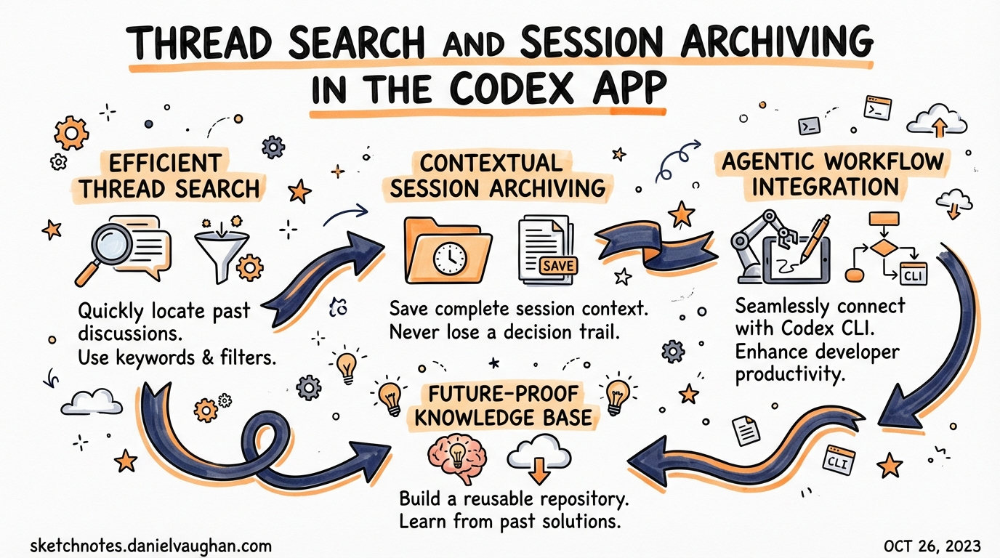

*Published: 2026-03-28 · Source: Codex App 26.323 (March 24, 2026) changelog + community usage patterns*

---

The Codex App 26.323 release (March 24, 2026) shipped three quality-of-life improvements that collectively solve the "thread sprawl" problem — what happens when you've been running Codex for weeks and have hundreds of past sessions you can no longer find or manage efficiently.

---

## The Thread Sprawl Problem

Every Codex session generates a thread. A developer running Codex seriously will accumulate dozens per day: feature branches, debugging sessions, exploratory refactors, automation runs. Within a week, the thread history becomes a cognitive burden rather than an asset.

Three specific pain points drove the 26.323 release:
1. **No way to find past threads by content** — you'd have to scroll through a chronological list
2. **No bulk management** — archiving threads was one-at-a-time
3. **Config drift between app and VS Code** — changing settings in one place didn't carry to the other

---

## What's New in Codex App 26.323

### 1. Thread Search with Keyboard Navigation

The sidebar now supports **full-text search across past threads**.

**How to use:**
- `Cmd/Ctrl+K` opens the search input in the sidebar
- Results filter in real time as you type — matching thread titles, first messages, and project names
- `↑↓` arrow keys navigate results; `Enter` opens the selected thread
- `Esc` returns focus to the main view

**Practical use cases:**
- "Find the session where I refactored the auth module" → search `auth refactor`
- "Find where I set up the Stripe webhooks" → search `stripe webhook`
- "Find a specific bug investigation" → search by error message or file name

**Tip:** Give threads meaningful names using the `/title` command (shipped in v0.117.0) during a session. Thread search relies on the title and opening message — a thread named `2026-03-24 session` is unsearchable; one named `Refactor payment module to use new Stripe SDK` is immediately findable.

---

### 2. One-Click Archive: All Local Project Threads

New option in the Project settings menu: **"Archive all local threads in this project"**.

This moves all thread history for a project into an archived state — threads remain accessible but are hidden from the default sidebar view.

**When to use:**
- **Start of a new sprint** — archive the previous sprint's threads so the sidebar shows only current work
- **Post-launch cleanup** — after shipping a feature, archive its build threads
- **Onboarding a repo to a new phase** — e.g., moving from "exploration" to "production hardening"

**Archive vs Delete:**

| | Archive | Delete |
|-|---------|--------|
| Thread history | Preserved | Permanently gone |
| Searchable | Yes, with filter | No |
| Token cost | None | None |
| Use when | You might need context later | You're certain you won't |

**The rule of thumb:** Archive liberally, delete never (unless you're certain). Archived threads are invisible in day-to-day use but available if you need to revisit a decision from two months ago.

---

### 3. Settings Sync Between App and VS Code Extension

Settings changed in the Codex App now **propagate to the VS Code Codex extension** automatically, and vice versa.

Specifically synced settings include:
- Default model and reasoning effort level
- Approval mode preferences
- MCP server configurations
- Skill preferences

**Why this matters for agentic pod workflows:** If you use both the desktop app (for focused, full-screen Codex sessions) and the VS Code extension (for in-editor work), previously you'd configure them independently. A preference change in one silently diverged from the other.

With settings sync, there's one source of truth: `~/.codex/config.toml`. Both surfaces read from and write to it atomically.

---

## Practical Workflow: The Weekly Thread Hygiene Routine

For developers running Codex as a core part of their workflow:

```
End of week (Friday):
1. Cmd+K → search threads from this week → open any "in progress" threads
2. For each in-progress thread: /fork to capture current state as a named checkpoint
3. Project menu → "Archive all local threads"
4. Start Monday with a clean sidebar
```

This keeps your thread history useful (preserved and searchable) without the cognitive overhead of a permanently growing list.

---

## Thread Search + The /title Habit

To get maximum value from thread search, adopt the `/title` habit:

```
# At the start of any session with a non-trivial goal:
/title Implement rate limiting for the API gateway - Redis-based, sliding window

# For debugging sessions:
/title Debug: Payment webhook failing silently in production (order #84291)

# For exploratory work:
/title Spike: Can we use Codex to automate our changelog generation?
```

Once titled, these threads are permanently findable. Combined with archiving, this gives you a searchable history of your Codex-assisted engineering work — a "decision log" you can reference when onboarding new team members or doing post-mortems.

---

## For Enterprise Teams

The settings sync feature has a specific implication for teams deploying Codex across both surfaces: **your enterprise `requirements.toml` and managed policies now apply consistently** regardless of which surface the developer uses.

If your security policy (via `requirements.toml`) restricts certain tool permissions, those restrictions take effect in both the desktop app and the VS Code extension via the synced config. No more "I thought I was running the restricted profile but I was in the VS Code extension with a different config."

---

## Summary

| Feature | Shortcut / Trigger | Primary benefit |
|---------|-------------------|-----------------|
| Thread search | `Cmd/Ctrl+K` in sidebar | Find past sessions instantly by content |
| Archive all threads | Project menu → "Archive all..." | Clean slate without losing history |
| Settings sync | Automatic | One config, consistent across app + VS Code |

These are the compound-engineering features: each individual improvement is small, but together they mean your past Codex work accumulates as searchable institutional memory rather than noise.

---

*See also: [Thread Management article](/codex-resources/articles/2026-03-28-codex-cli-thread-management-fork-resume/) · [Codex App vs CLI vs IDE Extension](/codex-resources/articles/2026-03-27-codex-interfaces-desktop-cli-ide/)*
