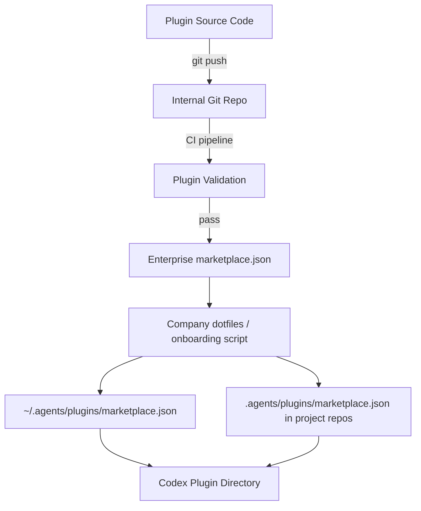

# Building and Distributing Codex CLI Plugins


---

Codex CLI v0.117.0 (March 26, 2026) elevated plugins to a first-class workflow primitive.[^1] The 20+ first-party integrations OpenAI shipped — Slack, Figma, Notion, Gmail, Google Drive, Cloudflare — are useful, but the more interesting story is the infrastructure underneath them, which is now available to any developer who wants to package and distribute their own agent workflows.

This article covers the full lifecycle: manifest format, directory structure, the `@plugin-creator` scaffolding skill, marketplace scoping, and enterprise installation policies.

---

## What a Plugin Actually Is

Before the plugin system, sharing a Codex workflow meant passing around a `SKILL.md` file, a config.toml snippet, and a note about which MCP server to install. A plugin collapses that into a single installable unit that bundles:[^2]

- **Skills** — SKILL.md files describing reusable agent workflows
- **MCP server configuration** — `.mcp.json` pointing at servers that provide additional tools
- **App integrations** — `.app.json` mapping authenticated connectors (e.g., Gmail OAuth)
- **Interface metadata** — display names, icons, screenshots, starter prompts for the plugin directory UI

A plugin is *not* a replacement for an MCP server — it is a packaging layer on top of one. The MCP server still runs as a separate process; the plugin describes how to configure and launch it alongside the skills that use it.[^3]

---

## Plugin Directory Structure

```
my-plugin/
├── .codex-plugin/
│   └── plugin.json          ← required manifest
├── skills/
│   └── my-workflow/
│       └── SKILL.md         ← packaged skills (optional)
├── .mcp.json                ← MCP server config (optional)
├── .app.json                ← app/connector mappings (optional)
└── assets/
    ├── logo.png             ← 512×512 icon (optional)
    └── screenshots/
```

The only required file is `.codex-plugin/plugin.json`. Everything else is optional and loaded on demand.[^4]

---

## The `plugin.json` Manifest

The manifest has three responsibilities: identify the plugin, point to bundled components, and provide install-surface metadata.

### Required fields

```json
{
  "name": "my-plugin",
  "version": "1.0.0",
  "description": "Reusable workflow for X"
}
```

Use **kebab-case** for `name` — it becomes the plugin's stable identifier across installations and cache paths. Version follows semantic versioning.[^5]

### Component pointers

```json
{
  "name": "my-plugin",
  "version": "1.0.0",
  "description": "Reusable workflow for X",
  "skills": "./skills/",
  "mcpServers": "./.mcp.json",
  "apps": "./.app.json"
}
```

Paths are relative to the plugin root. Omit any pointer whose component does not exist — Codex will not complain about missing optional keys.

### Publisher and discovery metadata

```json
{
  "author": {
    "name": "Acme Corp",
    "email": "codex@acme.com",
    "url": "https://acme.com"
  },
  "homepage": "https://acme.com/codex-plugin",
  "repository": "https://github.com/acme/codex-plugin",
  "license": "MIT",
  "keywords": ["acme", "data-pipeline", "bigquery"]
}
```

### Interface metadata

The `interface` object controls how the plugin appears in the directory UI and Codex composer:[^6]

```json
{
  "interface": {
    "displayName": "Acme Data Pipeline",
    "shortDescription": "Query and transform BigQuery datasets from Codex",
    "developerName": "Acme Corp",
    "category": "Data",
    "websiteURL": "https://acme.com",
    "privacyPolicyURL": "https://acme.com/privacy",
    "termsOfServiceURL": "https://acme.com/terms",
    "defaultPrompt": [
      "List all datasets in my BigQuery project",
      "Generate a dbt model for this table schema"
    ],
    "brandColor": "#1A73E8",
    "logo": "./assets/logo.png"
  }
}
```

`defaultPrompt` entries surface as starter suggestions after install — worth populating for discoverability.[^7]

---

## Scaffolding with `@plugin-creator`

Rather than writing the manifest by hand, invoke the built-in `@plugin-creator` skill from any Codex session:

```
@plugin-creator scaffold a plugin for my BigQuery MCP server
```

This generates `.codex-plugin/plugin.json` with sensible defaults, an optional `skills/` starter, and a local `marketplace.json` entry for immediate testing.[^8]

---

## Marketplace Distribution

A **marketplace** is a JSON catalog that lists plugins and their installation policies. Codex reads marketplace files from two locations:[^9]

| Scope | Path |
|-------|------|
| Repository | `$REPO_ROOT/.agents/plugins/marketplace.json` |
| Personal | `~/.agents/plugins/marketplace.json` |

Each marketplace appears as a selectable source in the Codex plugin directory. Committing a marketplace file to your repository is the simplest way to share plugins with your team.

### `marketplace.json` format

```json
{
  "name": "acme-internal",
  "interface": {
    "displayName": "Acme Internal Plugins"
  },
  "plugins": [
    {
      "name": "bigquery-helper",
      "source": {
        "source": "local",
        "path": "./plugins/bigquery-helper"
      },
      "policy": {
        "installation": "INSTALLED_BY_DEFAULT",
        "authentication": "ON_FIRST_USE"
      },
      "category": "Data"
    },
    {
      "name": "incident-responder",
      "source": {
        "source": "local",
        "path": "./plugins/incident-responder"
      },
      "policy": {
        "installation": "AVAILABLE",
        "authentication": "ON_INSTALL"
      },
      "category": "Operations"
    }
  ]
}
```

### Installation policies

The `policy.installation` field gives administrators control over how plugins are surfaced:[^10]

| Value | Behaviour |
|-------|-----------|
| `AVAILABLE` | Visible in the directory; user chooses to install |
| `INSTALLED_BY_DEFAULT` | Pre-enabled for every developer who loads this marketplace |
| `NOT_AVAILABLE` | Hidden from the directory; effectively blocked |

`INSTALLED_BY_DEFAULT` is the key enterprise primitive. Commit your repo-scoped `marketplace.json` with `INSTALLED_BY_DEFAULT` for your core platform plugins and every engineer who clones the repo gets them automatically, without needing to browse a directory or run a setup command.

### Authentication timing

The `policy.authentication` field controls when credential prompts appear:

| Value | Behaviour |
|-------|-----------|
| `ON_INSTALL` | Prompt for credentials immediately on install |
| `ON_FIRST_USE` | Defer the auth prompt until the plugin is first invoked |

`ON_FIRST_USE` produces a smoother onboarding experience for optional integrations; `ON_INSTALL` is preferable for plugins that are useless without credentials.

---

## Plugin Installation Mechanics

Codex caches installed plugins at `~/.codex/plugins/cache/$MARKETPLACE_NAME/$PLUGIN_NAME/$VERSION/`.[^11] For local plugins, `$VERSION` is `local`. Updates require reinstallation because Codex loads from the cache path, not directly from the marketplace entry.

Enabled/disabled state is stored in `~/.codex/config.toml`:[^12]

```toml
[plugins."bigquery-helper@acme-internal"]
enabled = true

[plugins."incident-responder@acme-internal"]
enabled = false
```

Disabling a plugin removes its skills and MCP server from the active context but preserves the cached bundle.

---

## Building a Private Enterprise Plugin Registry

For organisations managing dozens of plugins, the repo + personal marketplace approach extends into a proper internal registry:



The CI validation step should verify manifest schema (via `codex app-server generate-json-schema`)[^13], confirm no unexpected MCP endpoints, and require a version bump for every content change. Distribute the company-wide `marketplace.json` via onboarding dotfiles; teams add project-specific plugins at `$REPO_ROOT/.agents/plugins/marketplace.json`.

---

## Schema Generation and Versioning

Two commands generate version-locked type definitions for tooling:[^14]

```bash
codex app-server generate-ts           # TypeScript types
codex app-server generate-json-schema  # JSON Schema bundle
```

Use the JSON Schema output in CI to validate manifests before distribution:

```bash
ajv validate \
  -s <(codex app-server generate-json-schema) \
  -d .codex-plugin/plugin.json
```

Increment `version` in `plugin.json` for every change that affects skills or MCP configuration. Codex uses the version as part of the cache key, so a version bump forces a reinstall on next sync.

---

## Distribution Options

OpenAI's official plugin directory hosts the 20+ first-party integrations; self-serve third-party submission is "coming soon".[^15] In the meantime:

1. **Repo marketplace** — commit `.agents/plugins/marketplace.json`; anyone who clones the repo gets access
2. **Personal marketplace** — `~/.agents/plugins/marketplace.json` for individual tooling
3. **GitHub-hosted** — a `marketplace.json` in a public repo that others reference manually
4. **Enterprise registry** — internal CI/CD pipeline as described above

`@plugin-creator` can generate a marketplace entry for option 3 when given a GitHub repo URL as context.

---

## Practical Considerations

**Skill loading is lazy.** Skills inside a plugin follow the same progressive disclosure model as standalone SKILL.md files — they do not inflate your context window on startup.[^16]

**MCP servers start on demand.** The server defined in `.mcp.json` starts when a skill or prompt references it. Keep MCP startup time in mind for latency-sensitive workflows.

**Test before distributing.** Use the local marketplace entry generated by `@plugin-creator` to verify the full install-to-invoke cycle. The most common failure modes are incorrect relative paths in component pointers and missing authentication configuration.

**Namespace collisions.** Plugin names must be unique within a marketplace. Across marketplaces, Codex disambiguates by `$PLUGIN_NAME@$MARKETPLACE_NAME` — renaming a published plugin is a breaking change for any automation that references it.

---

## Citations

[^1]: [Codex CLI v0.117.0 Release Notes — GitHub](https://github.com/openai/codex/releases) — plugins first-class workflow, March 26, 2026.
[^2]: [Plugins — Codex Developer Documentation](https://developers.openai.com/codex/plugins) — plugin component overview.
[^3]: [Codex Plugins — Neowin](https://www.neowin.net/news/openai-launches-codex-plugins-to-streamline-developer-workflows/) — plugin vs MCP relationship.
[^4]: [Build Plugins — Codex Developer Documentation](https://developers.openai.com/codex/plugins/build) — directory structure.
[^5]: [Build Plugins — Codex Developer Documentation](https://developers.openai.com/codex/plugins/build) — manifest required fields, kebab-case naming.
[^6]: [Build Plugins — Codex Developer Documentation](https://developers.openai.com/codex/plugins/build) — `interface` object fields.
[^7]: [Build Plugins — Codex Developer Documentation](https://developers.openai.com/codex/plugins/build) — `defaultPrompt` as starter suggestions.
[^8]: [Build Plugins — Codex Developer Documentation](https://developers.openai.com/codex/plugins/build) — `@plugin-creator` scaffolding skill.
[^9]: [Build Plugins — Codex Developer Documentation](https://developers.openai.com/codex/plugins/build) — marketplace file locations.
[^10]: [Build Plugins — Codex Developer Documentation](https://developers.openai.com/codex/plugins/build) — installation policy values.
[^11]: [Build Plugins — Codex Developer Documentation](https://developers.openai.com/codex/plugins/build) — plugin cache path.
[^12]: [Plugins — Codex Developer Documentation](https://developers.openai.com/codex/plugins) — config.toml enable/disable.
[^13]: [Build Plugins — Codex Developer Documentation](https://developers.openai.com/codex/plugins/build) — `generate-json-schema` command.
[^14]: [Build Plugins — Codex Developer Documentation](https://developers.openai.com/codex/plugins/build) — `generate-ts` and `generate-json-schema`.
[^15]: [Plugins — Codex Developer Documentation](https://developers.openai.com/codex/plugins) — "Adding plugins to the official Plugin Directory is coming soon."
[^16]: [Skills as Progressive Disclosure — codex-resources](https://danielvaughan.github.io/codex-resources/articles/2026-03-27-skills-progressive-disclosure-vs-mcp/) — lazy loading architecture.
