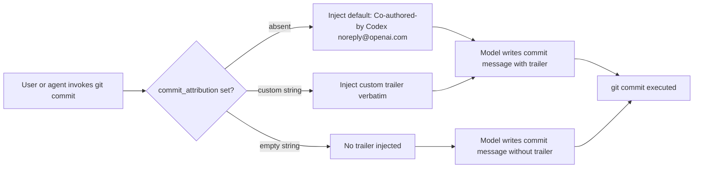
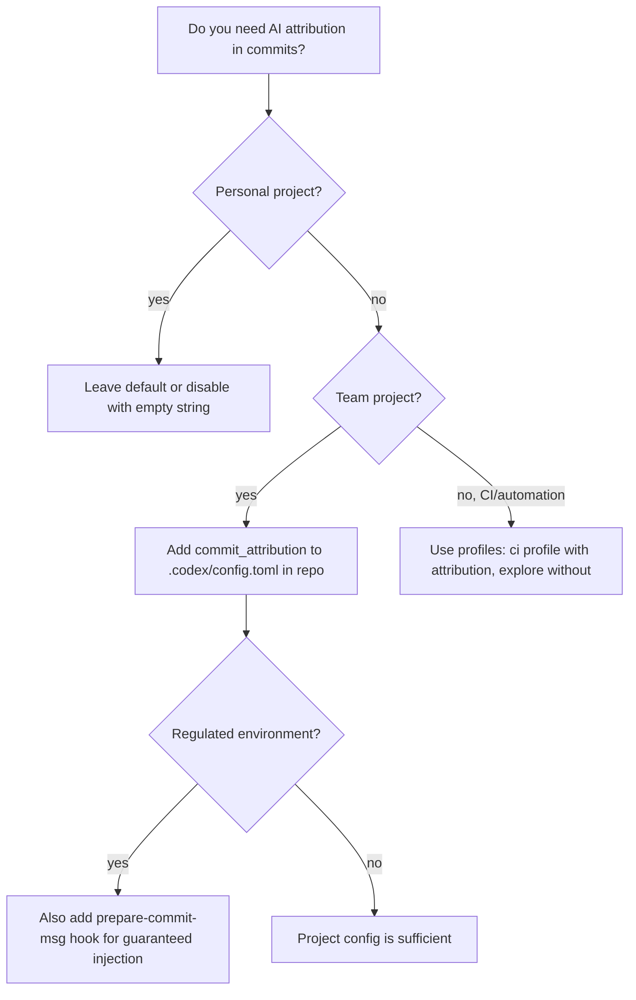

# Codex CLI Commit Attribution: Tagging Agent Work with commit_attribution


When Codex writes code and you commit it, who gets credited? Until early 2026, the answer was: nobody notable. Your commits looked exactly like human-authored work, with no signal in the repository history that an AI agent had any involvement. PR #11617 changed that.[^1]

---

## Why Attribution Matters

The `Co-authored-by:` trailer is a git convention — originally from GitHub's pair-programming workflows — that appends additional author credits to a commit message body.[^2] It's widely supported: GitHub, GitLab, and Bitbucket all surface these trailers in their UIs, showing co-author avatars alongside the primary committer.

For AI-assisted commits, this matters in at least three ways:

**Auditability.** Regulated teams (finance, healthcare, government contractors) increasingly face requirements to log where AI tooling was used in the delivery of software.[^3] A `Co-authored-by: Codex <noreply@openai.com>` trailer in every relevant commit gives you a machine-readable audit trail with zero additional tooling.

**Code review.** Reviewers behave differently when they know AI generated a diff. Whether that's appropriate is a separate debate, but giving reviewers the option to know is better than hiding it. Attribution lets teams establish review policies ("all Codex-authored PRs need two human approvals") that are verifiable from commit metadata.

**Model debugging.** When a Codex session introduces a regression, knowing which commits came from agent sessions — and ideally which session — gives you a starting point for diagnosis. Attribution + branch naming conventions (`codex/<session-id>`) creates a lightweight paper trail.

---

## The `commit_attribution` Config Key

Codex CLI exposes a single config key to control attribution behaviour.[^4]

```toml
# ~/.codex/config.toml

commit_attribution = "Co-authored-by: Codex <noreply@openai.com>"
```

The key accepts a plain string, which is inserted verbatim as a trailer in commit messages. Three behavioural modes follow from this:

| Value | Behaviour |
|-------|-----------|
| Key absent | Default trailer: `Co-authored-by: Codex <noreply@openai.com>` |
| Custom string | That string used verbatim as the trailer |
| Empty string `""` | Attribution disabled entirely — no trailer injected |

The default trailer (`Co-authored-by: Codex <noreply@openai.com>`) is GitHub-recognised: it will show the OpenAI/Codex avatar in the commit contributors list when pushed to GitHub.[^5]

---

## How It Works Under the Hood

The implementation — shipped in PR #11617 by `gabec-openai`, merged February 17, 2026 — uses **prompt-based injection** rather than Git hook interception.[^1]

Earlier prototypes for this feature attempted to install a managed `prepare-commit-msg` hook that would modify the commit message file on the fly. The final approach is simpler: when Codex prepares to run a git commit, the `codex_git_commit` feature injects trailer instructions directly into the model's prompt context. The model is instructed to include the correct `Co-authored-by:` trailer in the commit message it writes.



This approach has a meaningful trade-off: because the model is instructed to include the trailer rather than the hook forcing it, compliance is high but not absolute. In practice, modern reasoning models follow trailer instructions reliably; the key concern is that a manually crafted `git commit -m "..."` call bypassing Codex won't get the trailer.

If you need guaranteed injection regardless of how commits are made, the legacy hook approach (a `prepare-commit-msg` script in `.githooks/`) is still an option alongside the config key:

```bash
#!/bin/sh
# .githooks/prepare-commit-msg
# Append Codex co-author trailer if not already present
TRAILER="Co-authored-by: Codex <noreply@openai.com>"
if ! grep -q "$TRAILER" "$1"; then
  echo "" >> "$1"
  echo "$TRAILER" >> "$1"
fi
```

```bash
git config core.hooksPath .githooks
```

The hook approach is blunt — it applies to every commit regardless of origin — but useful when you want an immutable audit trail in a regulated environment.

---

## Configuration Patterns

### Disabling attribution for personal workspaces

If you're exploring or prototyping and don't want every exploratory commit flagged:

```toml
# ~/.codex/config.toml
commit_attribution = ""
```

This suppresses the default trailer. Because `config.toml` changes apply to the user-level configuration, this affects all projects unless overridden at the project level.

### Custom attribution with model name

Some teams prefer to record which model was responsible:

```toml
# ~/.codex/config.toml
commit_attribution = "Co-authored-by: Codex CLI (gpt-5-codex) <noreply@openai.com>"
```

Note that the trailer value is static — it won't dynamically insert the active model name. If you rotate models frequently, you'd need to update this string or accept a generic label.

### Project-level override

Codex loads project-scoped configuration from `.codex/config.toml` at the project root (loaded only when the project is trusted).[^6] This lets you enforce attribution for a specific repository regardless of the engineer's personal config:

```toml
# <repo-root>/.codex/config.toml
commit_attribution = "Co-authored-by: Codex <noreply@openai.com>"
```

Commit this file to the repository so all team members automatically get consistent attribution behaviour when working in that project. This is the recommended team-distribution approach — it's version-controlled, reviewable, and requires no per-engineer setup.

### Profile-scoped attribution

Profiles in `config.toml` can scope the attribution to particular working modes. For example, a `ci` profile used in automated pipelines might enforce attribution while an `explore` profile disables it:

```toml
[profiles.ci]
commit_attribution = "Co-authored-by: Codex CI <noreply@openai.com>"

[profiles.explore]
commit_attribution = ""
```

Switch profiles with `codex --profile ci` or set the default in `config.toml`:

```toml
profile = "ci"
```

---

## Enterprise Considerations

### requirements.toml and managed policies

`requirements.toml` — the admin-enforced policy layer[^7] — governs security-sensitive settings that users cannot override. As of March 2026, `commit_attribution` is not listed as an enforceable key in `requirements.toml`. This means that individual engineers can technically disable or override attribution regardless of team policy.

The reliable enforcement path for enterprise teams is therefore the project-level `.codex/config.toml` in version-controlled repositories. This approach:

- Is auditable via `git blame` and PR history
- Requires no per-engineer action
- Applies consistently across CI (when `codex exec` runs in a trusted project)
- Can be reviewed and approved in the same merge workflow as any other config change

For teams that require stronger guarantees — where even a project-level config could be overridden by a user's `~/.codex/config.toml` — the Git hook approach is the backstop.

### Audit trail pattern

For comprehensive AI-assisted development logging, combine `commit_attribution` with a `postTaskComplete` hook[^8] that records session metadata:

```toml
# ~/.codex/config.toml
commit_attribution = "Co-authored-by: Codex <noreply@openai.com>"

[hooks]
postTaskComplete = """
  echo "$(date -u +%Y-%m-%dT%H:%M:%SZ) CODEX_SESSION task_complete repo=$(git rev-parse --show-toplevel) commit=$(git rev-parse --short HEAD 2>/dev/null || echo 'no-commit')" >> ~/.codex/audit.log
"""
```

This logs a timestamped entry for every completed Codex task, giving you a separate audit trail that correlates with commit history.

---

## The Broader Ecosystem

### Claude Code comparison

Anthropic's Claude Code has offered commit co-author attribution for longer, under the setting "Include co-authored-by" in its VS Code extension settings.[^9] The community discussion (#2807) on the Codex repository explicitly called out this parity gap.[^5]

Codex's implementation differs in one notable respect: Claude Code's attribution setting is surfaced in a GUI, making it discoverable for less technical users. Codex's `commit_attribution` key lives in `config.toml` — consistent with its CLI-first philosophy, but requiring engineers to know it exists.

### GitHub's Codex bot account

When Codex joined GitHub as a bot account (`chatgpt-codex-connector[bot]`), it became possible to include its GitHub identity in co-author trailers in a way that GitHub's UI recognises — surfacing an avatar in commit views.[^5] The default trailer (`Co-authored-by: Codex <noreply@openai.com>`) leverages this; the email maps to the OpenAI/Codex bot identity on GitHub.

---

## Decision Guide



The decision tree keeps it simple: personal work can use defaults or silence; shared work should use project-scoped config; regulated environments add a Git hook as a hard backstop.

---

## Summary

`commit_attribution` is a single-key configuration option that belies its importance. Its three modes — default, custom, disabled — cover the realistic range of team policies. The prompt-based injection approach means it works with zero hook management for most teams, while the Git hook backstop remains available when hard guarantees are needed.

For enterprise teams, the path to consistent attribution is a project-level `.codex/config.toml` committed to the repository — version-controlled, reviewable, and automatically applied to everyone working in that project.

---

## Citations

[^1]: PR #11617 — "Use prompt-based co-author attribution with config override" by gabec-openai, merged February 17, 2026. [github.com/openai/codex/pull/11617](https://github.com/openai/codex/pull/11617)

[^2]: GitHub documentation on co-authors in commits. [docs.github.com/en/pull-requests/committing-changes-to-your-project/creating-and-editing-commits/creating-a-commit-with-multiple-authors](https://docs.github.com/en/pull-requests/committing-changes-to-your-project/creating-and-editing-commits/creating-a-commit-with-multiple-authors)

[^3]: EU AI Act Article 13 transparency obligations for high-risk AI; NIST AI RMF 1.0 Govern 1.7 on documentation of AI involvement in software delivery. ⚠️ Specific regulatory mapping to commit attribution is not yet codified in most frameworks — this reflects emerging practice.

[^4]: Codex CLI Configuration Reference — `commit_attribution` key. [developers.openai.com/codex/config-reference](https://developers.openai.com/codex/config-reference)

[^5]: GitHub Discussion #2807 — "`co-authored by Codex` support". [github.com/openai/codex/discussions/2807](https://github.com/openai/codex/discussions/2807)

[^6]: Codex CLI Config basics — project-scoped configuration. [developers.openai.com/codex/config-basic](https://developers.openai.com/codex/config-basic)

[^7]: Codex CLI Managed Configuration — `requirements.toml` enterprise policy layer. [developers.openai.com/codex/enterprise/managed-configuration](https://developers.openai.com/codex/enterprise/managed-configuration)

[^8]: Codex CLI Hooks Deep Dive — `postTaskComplete` hook pattern. [danielvaughan.github.io/codex-resources/articles/2026-03-26-codex-cli-hooks-deep-dive/](https://danielvaughan.github.io/codex-resources/articles/2026-03-26-codex-cli-hooks-deep-dive/)

[^9]: Feature request #938 — "Add (codex) to author in commit message and as 'codex ${model}' as Co-author # Aider feature parity / convention". [github.com/openai/codex/issues/938](https://github.com/openai/codex/issues/938)
