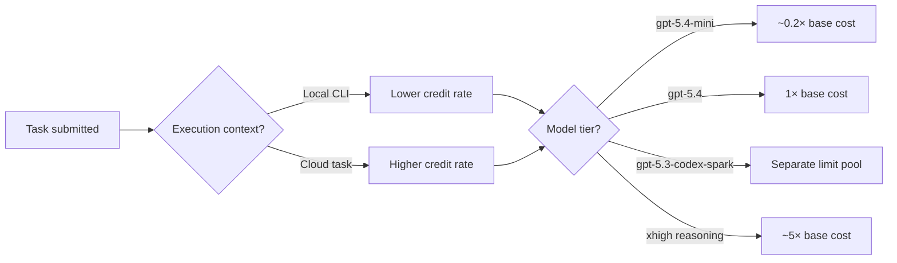
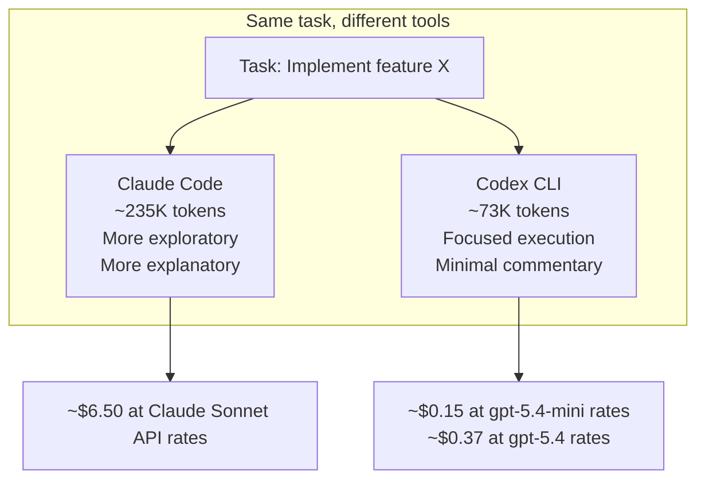
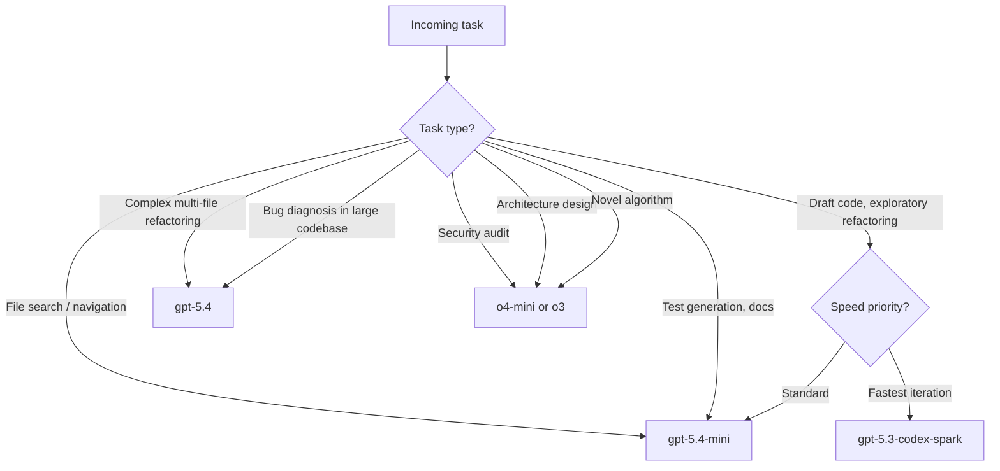
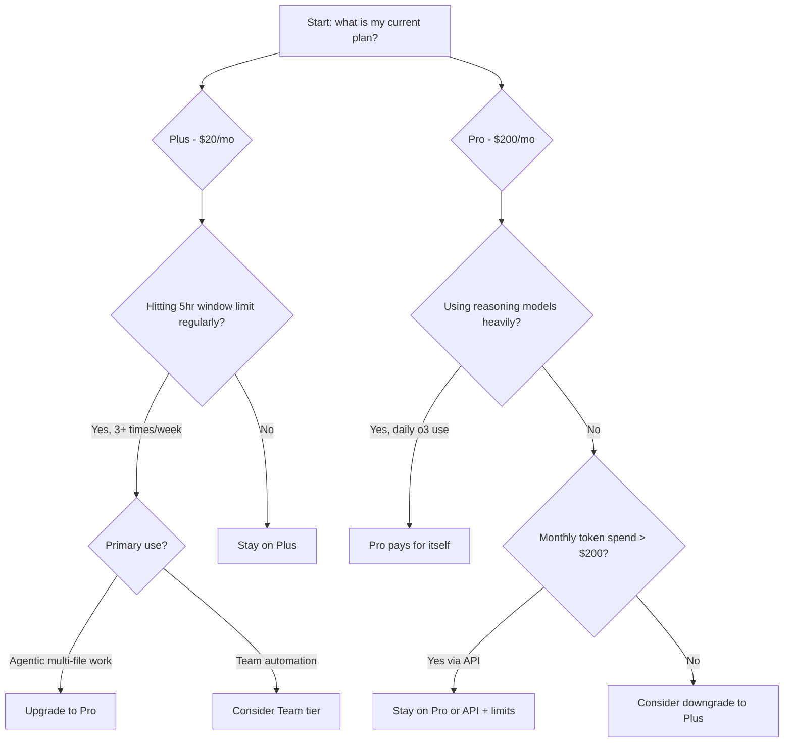

# The Codex CLI Credit Economy: Maximising Value Per Dollar

---

Cost conversations in the Codex community tend to cluster at two extremes: people who are surprised their credits ran out after two hours, and people who are running expensive models on tasks that would have been fine on the cheapest option. This article addresses both. It covers the subscription tiers, the model routing decision matrix including the Spark model, the 4× token efficiency advantage over Claude Code, and how to construct a break-even analysis for your team size.

> This article complements [Codex CLI Cost Management: Token Strategy, Model Routing and Quota Control](/codex-resources/articles/2026-03-28-codex-cli-cost-management-token-strategy/) which covers the mechanics of `max_tokens_per_session`, profile configuration, and `postTaskComplete` hook patterns in detail.

---

## The Credit Landscape in 2026

Codex credits are consumed at a rate that depends on three factors: model tier, task complexity, and execution context (local CLI vs cloud task)[^1].

**Local tasks** — running `codex` in your terminal against a local codebase — consume fewer credits than cloud tasks. Automated PR reviews triggered from GitHub, Slack, or Linear route through OpenAI's cloud infrastructure and cost more[^2].

The Mini tier (`gpt-5.4-mini`) is not available for cloud tasks at all. If you are budget-sensitive and running primarily local terminal work, Mini gives you significantly more output per credit than the flagship model.

---

## Subscription Tier Break-Even Analysis

Understanding whether a subscription pays for itself versus API-key billing requires an honest account of usage intensity:

| Tier | Monthly cost | Best for | API equivalent break-even |
|---|---|---|---|
| ChatGPT Plus | $20/user | Individuals, exploratory use | ~50–80 hours/month intensive coding[^3] |
| ChatGPT Team | $25–30/user | Small teams (3–15 devs) | ~60–90 hours/user/month |
| ChatGPT Pro | $200/user | Power users, agentic workflows | ~200+ hours/month or heavy reasoning model use |
| API key mode | Pay-per-token | CI/CD pipelines, automation | N/A — predictable cost at scale |
| Enterprise | Custom pricing | 50+ devs, compliance requirements | Custom |

The break-even calculation for **Pro vs API key** hinges on reasoning model usage. If you regularly reach for `o3`-class models — roughly 5× the token cost of standard models — a Pro subscription's flat-rate access can be significantly cheaper than equivalent API billing at that model tier[^3].

### When API Key Mode Wins

API key mode is the right choice when:

1. **CI/CD pipelines** where usage is predictable and you need billing separation per team/repo
2. **Subagent workers on `gpt-5.4-mini`** — the cheapest path when you can instrument cost exactly
3. **Enterprise multi-project billing** where chargeback per team is required

The trap to avoid: using API key mode without `max_tokens_per_session` configured. A single runaway session debugging a large legacy codebase can consume 500K+ tokens — roughly $8–15 in one sitting[^4].

---

## The 4× Token Efficiency Advantage

OpenAI-cited benchmarks and independent developer testing consistently show Codex CLI uses **approximately 4× fewer tokens** than Claude Code for equivalent coding tasks[^5].

The raw numbers from a Figma-to-code cloning benchmark:

- Claude Code: ~6.2 million tokens
- Codex CLI: ~1.5 million tokens

For a focused TypeScript task:

- Claude Code: 234,772 tokens
- Codex CLI: 72,579 tokens[^6]

This gap has concrete financial implications. At API rates, the effective cost of a task through Claude Code can be **four times higher** even before accounting for Claude's higher per-token price[^5].

### Why Claude Uses More Tokens

Claude Code's higher token consumption is not waste — it reflects a different philosophy: Claude reasons aloud, asks clarifying questions, and provides detailed explanations. This is valuable when exploring architecture or debugging complex issues. It is expensive when you already know what you want done[^6].

The practical implication: **use each tool where its communication style adds value**. Claude Code for initial design and complex reasoning; Codex CLI for execution, refactoring, and the bulk of implementation work.

---

## The Spark Model: Turbo Worker Economics

GPT-5.3-Codex-Spark runs on Cerebras WSE-3 hardware at 1,000+ tokens per second — a 15× speed improvement over GPT-5-Codex[^7]. During the current research preview period, Spark usage has **separate model-specific limits and does not count against your standard Codex quota**[^8].

This makes Spark an unusual opportunity: during the preview, it is effectively free from your normal credit budget.

### Credits-Per-Task Routing Matrix

Approximate relative credit cost by task type:

| Task type | Recommended model | Relative cost |
|---|---|---|
| File navigation, search | `gpt-5.4-mini` | 0.2× |
| Test scaffolding | `gpt-5.4-mini` | 0.2× |
| Documentation generation | `gpt-5.4-mini` | 0.2× |
| Draft implementation | `gpt-5.3-codex-spark`* | ~0× (separate pool) |
| Iterative refinement | `gpt-5.3-codex-spark`* | ~0× (separate pool) |
| Multi-file refactoring | `gpt-5.4` | 1× |
| Complex debugging | `gpt-5.4` | 1× |
| Security audit | `o4-mini` | ~3× |
| Novel algorithm design | `o3` | ~15× |

*\*Research preview, Pro tier only, separate limits*[^8]

---

## The 5-Hour Window: Managing Burst Consumption

ChatGPT subscription Codex limits reset on a **rolling 5-hour window**, not a monthly cycle[^1]. This has practical implications for agentic workflows:

A session that runs multiple parallel subagents will consume credits faster than sequential work. If you hit your 5-hour window limit mid-way through a large task, Codex pauses — and resumes when the window resets, not when the monthly cycle resets.

**Strategies for window management:**

1. **Profile-based model routing** — default profile uses `gpt-5.4-mini`, explicit invocation required for `gpt-5.4`[^9]
2. **Context compaction before subagent spawns** — running `/compact` before spawning workers reduces per-subagent context overhead
3. **Stagger spawning on long jobs** — rather than spawning 8 subagents simultaneously, stagger by 2–3 turns to avoid simultaneous large context initialisation
4. **Spark for draft-then-review cycles** — use Spark's separate pool for rapid first-draft generation, then one `gpt-5.4` call for review and correction

---

## Subscription Upgrade Decision Framework

The key insight: **Pro's value is front-loaded towards heavy reasoning model users and teams hitting the 5-hour window daily**. For developers using primarily `gpt-5.4` and `gpt-5.4-mini` on exploratory personal projects, Plus is typically sufficient[^3].

---

## Practical Tips for Maximising Credits

These recommendations come from the Codex community and official documentation[^10]:

**Reduce prompt overhead:**

- Trim your AGENTS.md to the essentials — every byte adds to context on every API call
- Disable unused MCP servers; each active server adds schema tokens to every session
- Use nested AGENTS.md files to scope context to the directory being worked on

**Model hygiene:**

- Set `default_profile = "explore"` where the explore profile uses `gpt-5.4-mini`; require explicit `--profile commit` for `gpt-5.4` invocations
- Use `max_tokens_per_session` as a per-task ceiling, not just a safety net — treat it like a budget per task type

**Session discipline:**

- Run `/compact` proactively at ~60% context fill; forced compaction wastes more context than manual
- Subagent delegation naturally limits main-session context growth — use it for file-heavy operations

**Monitor before you optimise:**

- Install `ccusage` and run it weekly to identify which sessions are your biggest cost drivers before making configuration changes[^11]

---

## Key Numbers

- Codex CLI uses **~4× fewer tokens** than Claude Code for equivalent tasks[^5]
- GPT-5.3-Codex-Spark: **separate credit pool** during research preview — currently free from standard quota[^8]
- Break-even for Plus ($20) vs API key: **~50–80 hours/month** of intensive coding[^3]
- Break-even for Pro ($200) vs API key: primarily justified by **daily reasoning model (o3/o4-mini) usage**
- Local tasks: consistently cheaper than cloud tasks (PR review, Slack/Linear triggers)[^2]
- A `gpt-5.4` session in API mode consuming 500K tokens: approximately **$8–15** without `max_tokens_per_session` guardrails[^4]

---

## Citations

[^1]: [OpenAI Codex Pricing — Developers](https://developers.openai.com/codex/pricing) — official pricing page with credit rate card and local vs cloud task distinction
[^2]: [OpenAI Codex Features — Developers](https://developers.openai.com/codex/cli/features) — local vs cloud task execution and credit consumption
[^3]: [OpenAI Codex Pricing 2026: API Costs, Token Limits](https://flowith.io/blog/openai-codex-pricing-2026-api-costs-token-limits/) — break-even analysis across subscription tiers
[^4]: [Token usage spikes too quickly in Codex CLI sessions — GitHub Issue #6113](https://github.com/openai/codex/issues/6113) — community-reported runaway session costs
[^5]: [Codex vs Claude Code (2026): Benchmarks, Agent Teams & Limits Compared — MorphLLM](https://www.morphllm.com/comparisons/codex-vs-claude-code) — 4× token efficiency benchmark comparison
[^6]: [Claude Code vs Codex CLI 2026 — NxCode](https://www.nxcode.io/resources/news/claude-code-vs-codex-cli-terminal-coding-comparison-2026) — token count comparison on identical TypeScript tasks
[^7]: [Introducing GPT-5.3-Codex-Spark — OpenAI](https://openai.com/index/introducing-gpt-5-3-codex-spark/) — Spark model announcement, Cerebras WSE-3, 1,000+ tokens/sec
[^8]: [Models — Codex Developers](https://developers.openai.com/codex/models) — Spark separate limit pool during research preview
[^9]: [Reasoning Effort Tuning: Minimal to xhigh](/codex-resources/articles/2026-03-27-reasoning-effort-tuning/) — profile-based model routing configuration
[^10]: [OpenAI Codex Pricing 2026 — UI Bakery Blog](https://uibakery.io/blog/openai-codex-pricing) — official tips for maximising usage limits
[^11]: [Codex CLI Overview — ccusage](https://ccusage.com/guide/codex/) — ccusage tool for per-session token cost analysis
