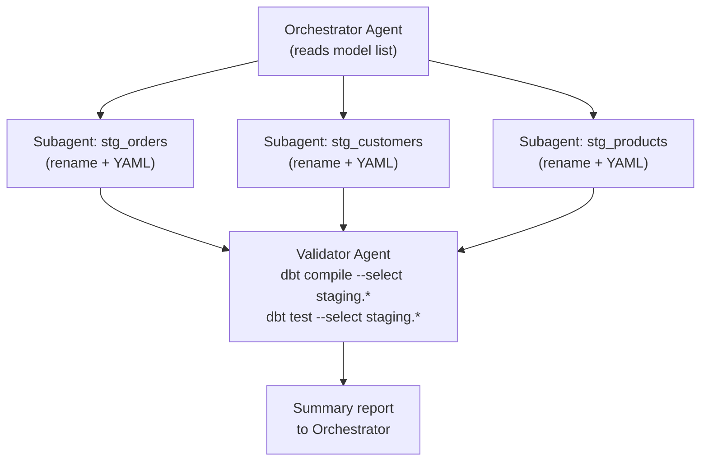

# Codex CLI for dbt and Data Engineering Workflows


---

Data engineering is one of the fastest-growing segments of software development, yet the Codex CLI ecosystem has produced almost no content targeted at data practitioners. This article closes that gap. It covers the concrete mechanics of wiring Codex CLI into a dbt project — AGENTS.md patterns, MCP server configuration, dbt Agent Skills installation, multi-model subagent strategies, and how to use altimate-code as an intelligence layer when you need something more data-native.

## Why Agentic Coding is Different for Data Teams

Generic coding agents edit source files. Data engineering adds a second dimension: the *warehouse*. A model is simultaneously a SQL file on disk and a live artefact in a warehouse with real data, lineage, tests, and downstream dependencies. An agent that rewrites a model in isolation can produce syntactically valid SQL that silently breaks a materialisation, missing `{{ ref() }}` dependency, or an assumed column contract.[^1]

The emerging 2026 consensus is to treat this as a context problem: give the agent structured awareness of the dbt graph, then let it act. Three mechanisms deliver that context to Codex CLI:

1. **AGENTS.md** — static instructions and conventions scoped to the repository
2. **dbt MCP server** — live project metadata, compiler, and Semantic Layer via MCP
3. **dbt Agent Skills** — curated dbt knowledge bundles the agent can invoke on demand

Used together, these transform Codex from a generic code editor into a data-aware collaborator that understands `{{ ref() }}`, knows your naming conventions, and can run `dbt compile` before committing a model.

## AGENTS.md Patterns for dbt Projects

Your project-root `AGENTS.md` should answer two questions the agent will ask constantly: *where does code live?* and *what are the rules?*

```markdown
# dbt Project: Analytics

## Layout
- `models/staging/`    — 1:1 with source tables, minimal transformation
- `models/intermediate/` — business-logic joins, not exposed in BI
- `models/marts/`      — dimensional models consumed downstream
- `macros/`            — project macros; prefer existing macros over inline SQL

## Naming conventions
- Staging models: `stg_<source>__<entity>` (double underscore separates source from entity)
- Intermediate models: `int_<description>`
- Marts models: `<subject_area>__<entity>` (e.g. `sales__orders`)
- All models use snake_case

## SQL style
- CTE-first style: use named CTEs over subqueries
- Always `{{ ref() }}` for model dependencies, never raw table names
- Always `{{ source() }}` for raw source references
- Max line length: 120 characters; use `sqlfluff fix` before committing

## Testing policy
- Every model must have `not_null` + `unique` tests on its grain
- Staging models: test at source level; do not retest pass-through columns
- Mart models: add `relationships` tests for FK columns

## Running locally
dbt is at: /home/dev/.venv/bin/dbt
Compile with: `dbt compile --select <model>`
Test with:    `dbt test --select <model>`
Run with:     `dbt run --select <model>`
```

This is deliberately concise.[^2] Resist the temptation to paste your full `dbt_project.yml` — context pollution degrades agent performance. The AGENTS.md should tell the agent *how to behave*, not reproduce configuration it can read directly from the project files.

### Scoped AGENTS.md for sub-directories

For large dbt projects, add scoped files to individual model directories:

```markdown
# models/marts/AGENTS.md
## Marts conventions
- All marts are materialised as `table` unless > 1B rows, in which case `incremental`
- Incremental strategy: `merge` with `unique_key` defined in model config
- Every mart model must have a corresponding `.yml` documentation file
- Do not create new mart models without a corresponding Jira ticket reference in the model description
```

This prevents the agent from applying staging conventions to mart models and vice versa.

## Configuring the dbt MCP Server

The official dbt MCP server[^3] exposes your live project graph, compiler, Semantic Layer, and Admin API to any MCP-compatible agent. Add it to `~/.codex/config.toml`:

```toml
[mcp_servers.dbt]
command = "uvx"
args = ["--env-file", "/home/dev/projects/analytics/.dbt-mcp.env", "dbt-mcp"]
startup_timeout_sec = 30
tool_timeout_sec    = 120
```

The `.dbt-mcp.env` file holds environment variables — keep it out of version control:

```bash
# .dbt-mcp.env — never commit this file

# Required for local dbt CLI toolset
DBT_PROJECT_DIR=/home/dev/projects/analytics
DBT_PATH=/home/dev/.venv/bin/dbt
DBT_PROFILES_DIR=/home/dev/.dbt

# Optional: dbt Cloud / Semantic Layer
DBT_HOST=abc123.us1.dbt.com
DBT_TOKEN=<service-token>
DBT_ENVIRONMENT_ID=12345
```

Toolsets auto-disable when their required variables are absent: if `DBT_HOST` is not set, the Semantic Layer, Discovery API, and Admin API are silently disabled and only the local dbt CLI toolset is active.[^4] This is safe by default.

The local MCP server exposes the following capabilities to Codex:

| Toolset | What Codex can do |
|---|---|
| **dbt CLI** | `dbt run`, `dbt compile`, `dbt test`, `dbt docs generate` |
| **Codegen** | Generate `schema.yml` source files and model documentation stubs |
| **Fusion** | Query the live project graph: lineage, compilation errors, column types |
| **Semantic Layer** | Execute MetricFlow queries against your defined metrics |
| **Discovery API** | Fetch model metadata, job run history, freshness |
| **Admin API** | Trigger dbt Cloud jobs, manage environments |

For project-scoped configuration (e.g. different warehouse credentials per project), place a `.codex/config.toml` at the project root instead of the global config. Codex requires explicit trust of the project directory before reading local config files.[^5]

## Installing dbt Agent Skills

dbt Labs publishes curated Agent Skills — markdown skill bundles containing hard-won dbt community knowledge — that work with any agent supporting the `agentskills.io` standard, including Codex CLI.[^6]

Install them globally via npm:

```bash
npx skills add dbt-labs/dbt-agent-skills --global
```

Then restart your terminal and start a new Codex session. The skills become available as on-demand context that Codex invokes when it recognises a relevant task, without consuming context upfront.

Four skill categories are available:[^7]

- **Analytics Engineering** — building models, writing tests, exploring sources
- **Semantic Layer** — MetricFlow metrics and dimensions
- **Platform Operations** — troubleshooting job failures, configuring MCP
- **Migration** — moving from dbt Core to the dbt Fusion engine

Skills are particularly valuable for warehouse-specific guidance (e.g. BigQuery partition strategies, Snowflake clustering) that would bloat an AGENTS.md if written inline.

## Workflow Patterns

### Model scaffolding

Once the MCP server is running and AGENTS.md is in place, model generation becomes a high-fidelity operation rather than a guessing game:

```
> Codex: create a staging model for the raw_orders table in the shopify source.
  Use the project naming conventions and generate schema.yml with not_null/unique
  tests on order_id and a relationships test linking to stg_shopify__customers.
```

Codex will:

1. Read the source definition from your `sources.yml` via the MCP Fusion toolset
2. Generate `models/staging/stg_shopify__orders.sql` with appropriate CTEs and `{{ source() }}` references
3. Generate or update `models/staging/stg_shopify__orders.yml` with the requested tests
4. Run `dbt compile --select stg_shopify__orders` via the MCP CLI toolset to verify compilation before presenting the result

The compile step is the key safety mechanism: it catches missing `{{ ref() }}` links and type mismatches before any code is committed.[^1]

### Documentation generation

```
> Codex: generate column-level documentation for all models in models/marts/sales/
  that are missing descriptions. Use existing documented columns in the same directory
  as style references.
```

Combined with `dbt docs generate` via MCP, this turns documentation debt into a solved problem.

### Test scaffolding

The consensus from production dbt teams is that agents are fastest at writing tests — often 5× faster than manual authoring.[^8] A focused prompt works well:

```
> Codex: review models/marts/sales__orders.yml and add tests following the project
  testing policy. Prioritise freshness, not_null on the grain, and relationships
  tests for every FK column. Do not add tests for pass-through columns from staging.
```

## Subagent Patterns for Multi-Model Projects

For larger refactoring tasks — migrating a 50-model staging layer to a new naming convention, adding incremental materialisation to all mart models — single-agent sequential execution is slow and fragile. Codex's parallel subagent capability is a natural fit.[^9]

The typical pattern is a **fan-out with a validation sweep**:



The orchestrator agent reads the list of models to process (from `dbt ls --select staging.*`) and spawns one subagent per model. Each subagent applies the transformation independently. The validator subagent runs `dbt compile` and `dbt test` on the full affected selector and reports back.

Configure `agents.max_depth = 2` in `config.toml` to allow the orchestrator → subagent → validator nesting.[^9] Set `agents.max_threads` to match your machine's available cores — typically 4–8 for data engineering work.

```toml
[agents]
max_depth   = 2
max_threads = 6
```

⚠️ Subagent token consumption scales linearly with the number of models. Profile the cost on a 5-model subset before running against a 200-model staging layer.

## altimate-code: A Data-Native Intelligence Layer

When you need capabilities beyond what the dbt MCP server provides — cross-warehouse SQL transpilation, PII detection, FinOps analysis, or column-level lineage — [altimate-code](https://github.com/AltimateAI/altimate-code) fills the gap.[^10]

It is a fork of OpenCode rebuilt specifically for data teams, offering 100+ deterministic tools across 10 warehouse dialects. It can run standalone or as an MCP server feeding into Codex CLI.

Install and configure the Codex integration:

```bash
npm install -g altimate-code

# Launch and auto-detect your data stack
altimate /discover

# Register as an MCP server for Codex
altimate /configure-codex
```

The `/configure-codex` command updates `~/.codex/config.toml` with the altimate MCP server entry automatically.[^10]

Three operating modes control SQL write-access:

| Mode | Access | When to use |
|---|---|---|
| **Analyst** | Read-only SELECT | Safe for production exploration |
| **Builder** | Read/write (SQL prompts require approval) | Model development |
| **Plan** | File-read only, no SQL | Architecture planning, impact analysis |

Start with Analyst mode when connecting to production warehouses. Escalate to Builder only for development environments where an inadvertent write is recoverable.

## Handling Large SQL Contexts

Long dbt models — large macros, complex CTEs, extensive documentation files — can consume disproportionate context. Three strategies mitigate this:

**1. Compile before editing.** Run `dbt compile --select <model>` via MCP and provide the compiled SQL (not the Jinja template) to the agent for analysis tasks. Compiled SQL is typically shorter and removes macro indirection.

**2. Use `/compact` aggressively.** Before starting a major dbt refactoring session, run `/compact` to flush completed reasoning from the context window. The dbt project structure is re-ingested from AGENTS.md and MCP on demand rather than held in memory throughout the session.

**3. Delegate per-model work to subagents.** The orchestrator holds only the task list; each subagent opens a fresh context window for its single model. This is the primary motivation for the fan-out pattern described above — not just performance, but context hygiene.

## Airflow and Orchestration Integration

For teams running dbt via Airflow or similar orchestrators, the same patterns apply one layer up. A useful AGENTS.md addition for orchestration work:

```markdown
## DAG conventions
- DAG file location: `dags/`
- dbt tasks use `DbtRunOperator` from `astronomer-cosmos` (not BashOperator)
- Task IDs match dbt model names: `run.<model_name>`
- Dependency order must reflect dbt lineage — do not define manually; use CosmosTaskGroup

## Testing Airflow DAGs
- `pytest dags/` runs DAG integrity tests
- Always run `airflow dags test <dag_id> <execution_date>` before committing a new DAG
```

With this in place, Codex can generate Cosmos-based DAG wrappers that correctly mirror the dbt dependency graph without needing to reinvent Airflow patterns from scratch.

## Production Guardrails

A few configuration patterns worth enforcing in any production dbt + Codex setup:

**Approval policy for DML.** Set `approval_policy = "on-failure"` for development work, but consider `"always"` for sessions touching mart models that feed production dashboards:

```toml
[approval]
policy = "always"
```

**Restrict shell to dbt commands.** Use `shell.allowed_commands` to prevent the agent from running arbitrary warehouse queries outside the MCP server's controlled toolset:

```toml
[shell]
allowed_commands = ["dbt", "sqlfluff", "git", "python"]
```

**Audit hook for schema changes.** Log any `dbt run` execution via the `PostToolUse` hook for compliance:

```toml
[[hooks]]
event = "PostToolUse"
tool  = "shell"
command = """
  echo "$(date -u +%Y-%m-%dT%H:%M:%SZ) SHELL: $CODEX_TOOL_COMMAND" \
    >> /var/log/codex-dbt-audit.log
"""
```

## Summary

The key insight is that dbt provides exactly what generic coding agents lack: structured metadata about your data graph. Connecting Codex CLI to that metadata — via the dbt MCP server, Agent Skills, and a well-crafted AGENTS.md — closes the gap between editing SQL files and genuinely understanding your data stack. The result is an agent that can scaffold models, write tests, generate documentation, and drive multi-model refactoring tasks without hallucinating table names or breaking downstream dependencies.

Start with the MCP server and AGENTS.md. Add Agent Skills for warehouse-specific guidance. Introduce subagent fan-out only when you have single-model workflows working reliably.

## Citations

[^1]: [Bring structured context to agentic data development with dbt — dbt Labs](https://www.getdbt.com/blog/bring-structured-context-to-agentic-data-development-with-dbt)
[^2]: [The AGENTS.md Bloat Problem: When More Context Makes Agents Worse](/codex-resources/articles/2026-03-27-agents-md-bloat-problem/)
[^3]: [About the dbt Model Context Protocol (MCP) Server — dbt Developer Hub](https://docs.getdbt.com/docs/dbt-ai/about-mcp)
[^4]: [Set up local MCP — dbt Developer Hub](https://docs.getdbt.com/docs/dbt-ai/setup-local-mcp)
[^5]: [Model Context Protocol — Codex | OpenAI Developers](https://developers.openai.com/codex/mcp)
[^6]: [Make your AI better at data work with dbt's agent skills — dbt Developer Blog](https://docs.getdbt.com/blog/dbt-agent-skills)
[^7]: [dbt Agents overview — dbt Developer Hub](https://docs.getdbt.com/docs/dbt-ai/dbt-agents)
[^8]: [Agentic coding in analytics engineering — dbt Labs](https://www.getdbt.com/blog/agentic-coding-in-analytics-engineering)
[^9]: [Subagents — Codex | OpenAI Developers](https://developers.openai.com/codex/subagents)
[^10]: [altimate-code — Open-Source Agentic Data Engineering Harness](https://github.com/AltimateAI/altimate-code)
