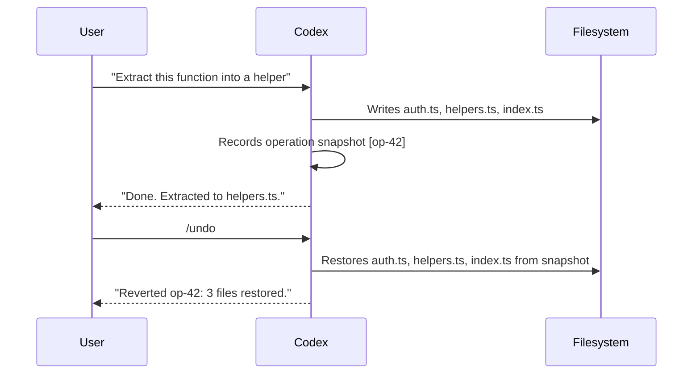

# Codex CLI Feature Flags and TUI Tuning: The Hidden Configuration Layer

*Published: 2026-03-28*

Most Codex CLI users configure the obvious knobs — model, approval policy, MCP servers — and leave the rest at defaults. But buried in `~/.codex/config.toml` are two sections that significantly affect runtime behaviour and ergonomics: the `[features]` table and the `[tui]` section. Neither is prominently documented, yet they expose controls over execution strategy, operation-level undo, terminal theming, and notification routing that are genuinely useful once you know they exist.

---

## The `[features]` Table

Codex maintains a small set of named feature flags that govern execution strategy and optional capabilities. You can inspect and modify them in three equivalent ways[^1]:

```bash
# Interactive: list all flags and their current state
codex features list

# Persistent: write directly to config
codex features enable unified_exec
codex features disable shell_snapshot

# Session-scoped: override for a single run
codex --enable-feature undo --disable-feature shell_snapshot "Refactor the auth module"
```

All three methods ultimately write to (or read from) the `[features]` section of `~/.codex/config.toml`. When combined with `--profile`, changes are scoped to that profile rather than the root config[^1]:

```toml
[features]
unified_exec    = true
shell_snapshot  = true
multi_agent     = true
undo            = false   # opt-in; off by default
personality     = true
apps            = false   # experimental
```

### `unified_exec`: PTY-backed Execution

The most consequential flag is `unified_exec`, which routes all shell commands through a PTY (pseudo-terminal) session rather than a plain subprocess.[^2] This is **on by default on macOS and Linux, off on Windows** because Windows lacks a POSIX PTY layer.

With `unified_exec` enabled, Codex behaves like a real interactive terminal:

- Background processes can be launched and tracked
- The `/ps` slash command shows running background terminals with their last three output lines[^3]
- Commands that stream output indefinitely (`npm run dev`, `docker compose logs --follow`, `tail -f`) work as expected — but Codex won't auto-kill them, so they remain "in progress" until explicitly interrupted[^4]

If you disable `unified_exec`, you lose background terminal support and the `/ps` command becomes empty. The trade-off is occasionally useful in constrained CI environments where PTY allocation fails.

### `shell_snapshot`: Environment Caching

`shell_snapshot` snapshots the shell environment (variables, PATH, aliases) once at startup and reuses that snapshot for every subsequent command.[^5] It is **stable and on by default**.

The benefit is measurable for large monorepos with slow `.bashrc`/`.zshrc` sourcing: avoiding a full shell init on every command cuts seconds off multi-step refactors.

Disable it when you need your agent to pick up environment changes made mid-session — for example, if a hook or init script modifies `PATH` and you want commands that run later to see the updated value.

### `multi_agent`: Subagent Capabilities

`multi_agent` gates the subagent spawning and coordination tools: `spawn_agent`, `wait_agent`, `send_input`, and the agent path-address scheme (`/root/agent_a` etc.).[^6] It is **on by default**. There is rarely a reason to disable this unless you are running Codex in a locked-down environment where subprocesses are explicitly restricted.

### `personality`: Communication Style Controls

The `personality` flag exposes the `/personality` slash command and its three modes: `friendly`, `pragmatic`, and `none`.[^7] It is **on by default**.

When disabled, Codex reverts to a neutral default tone with no in-session personality switching. Useful for CI robots or enterprise installs where the communication style should be driven entirely by `AGENTS.md` instructions rather than a runtime selector.

---

## The `/undo` Command (`features.undo`)

`undo` is the one flag that is **stable but off by default**.[^8] Enabling it activates the `/undo` slash command, which performs an operation-level rollback of file changes.

```toml
[features]
undo = true
```

Or per-session:

```bash
codex --enable-feature undo "Refactor the payment module"
```

### How Operation-Level Rollback Works

When Codex writes files, it records the set of changes for each operation (a single turn's tool calls) as a snapshot. `/undo` reverses the most recent snapshot — restoring all modified files at once.[^9] This is granular at the operation level, not at the individual file level, so a ten-file refactor reverts as a unit.



### Known Limitations

**1. Conversation context is not reverted.** `/undo` restores the working tree but not the chat history. Codex still remembers having done the work.[^10] The Responses API `forkedAt` mechanism (used by `/fork`) is the correct tool if you need both a code revert and a context revert.

**2. VSCode extension staging bug.** When undo is triggered from the IDE extension, the extension currently stages the restored files into the Git index as a side-effect.[^11] This is a known regression — do not rely on `/undo` via the IDE extension if you have staged changes you care about.

**3. Not a substitute for git.** The undo history is in-memory and does not survive a session restart. The recommended pattern is to commit a checkpoint before ambitious refactors, then use `/undo` only for quick iteration within a single session.

---

## The `[tui]` Section

The TUI (terminal user interface) has its own configuration namespace. All keys live under `[tui]` in `config.toml`.[^12]

```toml
[tui]
theme              = "gruvbox-dark"    # syntax-highlight theme; kebab-case
animations         = true              # welcome screen, spinner, shimmer
show_tooltips      = true              # onboarding tips on welcome screen
alternate_screen   = "auto"           # auto | always | never
notification_method = "auto"          # auto | osc9 | bel
notifications      = true             # bool, or list of event types
status_line        = ["model", "tokens", "cost", "git-branch"]
```

### Theming with `/theme`

Open the live theme picker with the `/theme` slash command.[^13] As you scroll through built-in themes, syntax-highlighted code previews update in real time. Selecting a theme writes the kebab-case name to `tui.theme` automatically.

For custom themes, drop a `.tmTheme` file into `$CODEX_HOME/themes/` (usually `~/.codex/themes/`):

```bash
mkdir -p ~/.codex/themes
cp ~/my-theme.tmTheme ~/.codex/themes/
# now /theme will show it in the picker
```

⚠️ There is a known rendering bug in v0.105.0+: custom `.tmTheme` `background` colour overrides for `markup.inserted`, `markup.deleted`, and `markup.changed` are ignored in diff views, which always render with hardcoded bright green/red backgrounds.[^14]

The community tool `codex-themes` (GitHub: `ychampion/codex-themes`) provides a theme manager that validates `.tmTheme` files, previews them in-terminal, and exports matching terminal palette configs for Alacritty/iTerm2/WezTerm.[^15]

### `alternate_screen`

By default, Codex occupies the terminal's alternate screen buffer, which means the TUI disappears cleanly on exit. Set to `never` if you want TUI output to remain in your scrollback, or if you are running inside Zellij where alternate screen interferes with pane scrollback.[^16]

### `status_line`

The status line is the configurable footer across the bottom of the TUI. You can reorder, remove, or add items by setting an ordered array:

```toml
[tui]
status_line = ["model", "tokens", "cost", "git-branch", "agent-count"]
```

Set to `null` to disable the status line entirely:

```toml
[tui]
status_line = null
```

The `/statusline` slash command provides an interactive picker for the same setting.[^17]

### `notifications`

By default, Codex emits a system notification when an agent turn completes — useful when running long background tasks. You can narrow this to specific event types:

```toml
[tui]
notifications = ["agent-turn-complete"]
```

Or disable entirely:

```toml
[tui]
notifications = false
```

The `notification_method` key controls the signalling mechanism: `osc9` (supported in WezTerm, Windows Terminal, ConEmu), `bel` (a terminal bell), or `auto` which probes for the best available method.[^18]

---

## Profile-Scoped Feature Flags

A powerful pattern is combining `--profile` with feature flags to get context-appropriate configurations without modifying your global defaults:

```toml
# ~/.codex/config.toml

[profiles.ci]
model = "gpt-5.4-mini"

[profiles.ci.features]
undo            = false   # no undo state in CI sessions
unified_exec    = true
multi_agent     = true
personality     = false

[profiles.ci.tui]
notifications   = false
animations      = false
status_line     = null

[profiles.deep-work]
model = "gpt-5.4"

[profiles.deep-work.features]
undo = true

[profiles.deep-work.tui]
theme = "tokyonight-storm"
notifications = ["agent-turn-complete"]
```

Then:

```bash
# Quiet, headless CI run
codex --profile ci exec "Run the full regression suite and fix failures"

# Long-running local session with undo safety net and preferred theme
codex --profile deep-work
```

Profile-scoped `[features]` and `[tui]` keys merge with (and override) the root config, so you only need to specify the keys that differ.[^19]

---

## Practical Recommendations

| Scenario | Recommended Flags |
|---|---|
| CI/CD pipelines | `unified_exec=true`, `personality=false`, `undo=false`, `animations=false` |
| Long local sessions | `undo=true`, `shell_snapshot=true`, preferred `theme` |
| Constrained environments | `unified_exec=false` (PTY unavailable), `multi_agent=false` |
| Windows native | `unified_exec` left at default `false`; `sandbox_type = "windows_restricted"` |
| Subagent workers | `undo=false` (workers shouldn't maintain undo state), `personality=false` |

The `/experimental` slash command provides a runtime toggle for `features.*` flags within a live session — changes persist to config unless you use `--profile` to scope them.[^20]

---

## Summary

The `[features]` and `[tui]` sections are where Codex's runtime behaviour becomes configurable rather than fixed. The three flags worth explicitly reviewing in any production setup are `unified_exec` (execution model), `undo` (opt-in safety net), and `personality` (tone control for CI bots). On the TUI side, `tui.theme`, `tui.status_line`, and `tui.notifications` are the highest-leverage knobs for daily ergonomics. Combine them with named profiles to get context-appropriate configurations without polluting your global defaults.

---

## Citations

[^1]: [Features – Codex CLI | OpenAI Developers](https://developers.openai.com/codex/cli/features)

[^2]: [Unified exec never detaches from long-running streaming commands · Issue #5948 · openai/codex](https://github.com/openai/codex/issues/5948)

[^3]: [Slash commands in Codex CLI | OpenAI Developers](https://developers.openai.com/codex/cli/slash-commands)

[^4]: [Unified exec never detaches from long-running streaming commands · Issue #5948 · openai/codex](https://github.com/openai/codex/issues/5948)

[^5]: [Sample Configuration – Codex | OpenAI Developers](https://developers.openai.com/codex/config-sample)

[^6]: [Configuration Reference – Codex | OpenAI Developers](https://developers.openai.com/codex/config-reference)

[^7]: [Configuration Reference – Codex | OpenAI Developers](https://developers.openai.com/codex/config-reference)

[^8]: [Configuration Reference – Codex | OpenAI Developers](https://developers.openai.com/codex/config-reference)

[^9]: [Undo code · Issue #4487 · openai/codex](https://github.com/openai/codex/issues/4487)

[^10]: [CLI: Add /rewind checkpoint restore that reverts both chat context and Codex-applied code edits · Issue #11626 · openai/codex](https://github.com/openai/codex/issues/11626)

[^11]: [Clicking "Undo" on file changes should absolutely not be staging changes into git · Issue #5082 · openai/codex](https://github.com/openai/codex/issues/5082)

[^12]: [Configuration Reference – Codex | OpenAI Developers](https://developers.openai.com/codex/config-reference)

[^13]: [Control over color theme in TUI · Issue #1618 · openai/codex](https://github.com/openai/codex/issues/1618)

[^14]: [Codex CLI themes are genuinely unusable · Issue #12912 · openai/codex](https://github.com/openai/codex/issues/12912)

[^15]: [GitHub – ychampion/codex-themes](https://github.com/ychampion/codex-themes)

[^16]: [Configuration Reference – Codex | OpenAI Developers](https://developers.openai.com/codex/config-reference)

[^17]: [Slash commands in Codex CLI | OpenAI Developers](https://developers.openai.com/codex/cli/slash-commands)

[^18]: [Configuration Reference – Codex | OpenAI Developers](https://developers.openai.com/codex/config-reference)

[^19]: [Advanced Configuration – Codex | OpenAI Developers](https://developers.openai.com/codex/config-advanced)

[^20]: [Slash commands in Codex CLI | OpenAI Developers](https://developers.openai.com/codex/cli/slash-commands)
