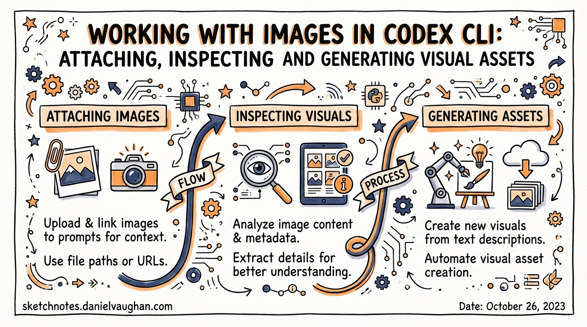
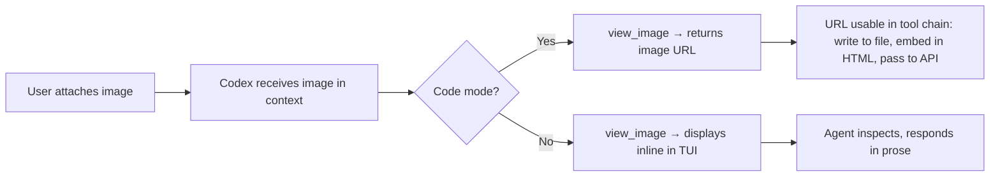
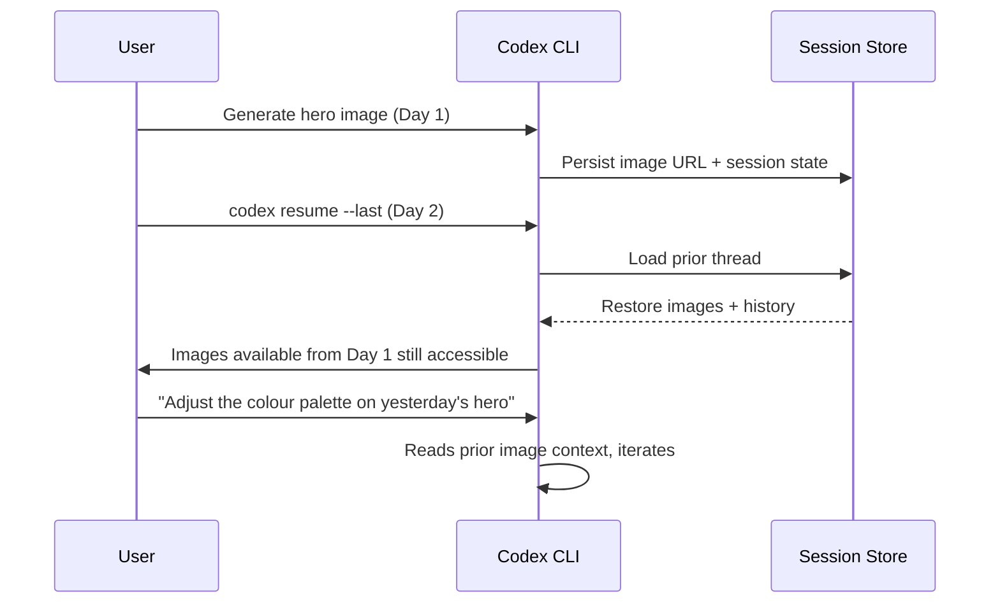

# Working with Images in Codex CLI: Attaching, Inspecting and Generating Visual Assets

**Date:** 2026-03-28
**Tags:** images, view-image, visual-workflows, code-mode, image-generation, multimodal

---

Codex CLI began life as a terminal coding agent focused entirely on text: source files, shell commands, test output. The releases shipped across March 2026 — notably v0.115.0 on March 16 and v0.117.0 on March 26 — changed that substantially.[^1] Full-resolution image inspection, a `view_image` tool integrated into code mode, and image-generation history that persists across session resume are now stable features of the CLI. This article covers how to use them and where they still fall short.

---

## How Images Enter a Codex Session

There are four supported entry points for attaching images to a Codex CLI session.[^2]

### Command-line flag: `--image` / `-i`

The most reliable entry point for non-interactive and `codex exec` workflows:

```bash
codex --image path/to/screenshot.png "Why does this button overflow its container?"
codex -i current.png,reference.png "Compare these layouts and explain the difference"
```

Multiple images are passed as a comma-separated list. PNG and JPEG are confirmed to work; other common formats are accepted.[^2]

### Interactive paste

Inside the interactive TUI, images can be pasted directly with **Ctrl+V** (Linux/Windows) or **Cmd+V** (macOS). The image appears inline in the composer before you submit your prompt. Drag-and-drop into the terminal window is also supported in terminal emulators that pass drag-and-drop events to the application.[^2]

### Codex exec (non-interactive)

```bash
codex exec --image path/to/design-mockup.png -- "Generate the HTML/CSS that matches this mockup"
```

The `codex exec` path is appropriate for CI/CD pipelines — for example, attaching a screenshot captured by Playwright and asking Codex to diagnose a visual regression.

### Session-level image attachment

Images attached to a session persist throughout that session. There is no need to re-attach an image with every follow-up prompt once it is in context.

---

## The `view_image` Tool in Code Mode

Code mode is Codex CLI's execution environment where the agent makes structured tool calls — running shell commands, reading files, writing patches — rather than streaming prose. In v0.117.0, the `view_image` tool was updated to return image URLs in code mode, enabling downstream tools to consume the image reference.[^3]

Before this change, `view_image` results were ephemeral within the agent loop. After PR #15072, the tool returns a resolvable URL which code mode can pass to other tools, write into a file, or embed in an HTML asset.[^3]



Practical implication: if you are building a design-to-code workflow and need Codex to both inspect a design mock-up and embed a reference URI into generated CSS or HTML, that round-trip now works without manual intervention.

---

## Full-Resolution Image Inspection

v0.115.0 (March 16) upgraded the image inspection pipeline from compressed thumbnail previews to full-resolution rendering.[^4] This matters for workflows where pixel-level detail is significant: reading dense data visualisations, inspecting screenshot diffs, or reviewing diagram output from tools like Mermaid or D3.

The upgrade was a source of reported friction beforehand — community discussions noted that the agent "cannot always autonomously read images from file paths when instructed to do so".[^5] The supported pattern remains explicit attachment via `--image` or paste rather than giving Codex a file path and expecting it to open the file autonomously. Path-based autonomous inspection has inconsistent results depending on the sandbox configuration.[^5]

---

## Image Generation: CLI vs App

Image *generation* is where the CLI and the Codex App diverge. The Codex **App** ships a "Generate Images" skill powered by GPT Image, surfaced as a natural-language interface for producing UI assets, product visuals, game sprites, and web graphics.[^6]

The Codex **CLI** does not yet wire the newest image generator into the core agent loop by default — community feature requests for this have been raised but are not yet addressed.[^7] The practical workaround for CLI users is to call the OpenAI Images API directly via a shell tool call within the agent session:

```bash
# Inside a Codex session, as a shell command the agent can issue:
curl https://api.openai.com/v1/images/generations \
  -H "Authorization: Bearer $OPENAI_API_KEY" \
  -H "Content-Type: application/json" \
  -d '{
    "model": "gpt-image-1",
    "prompt": "A minimal hero image for a SaaS dashboard, flat design, teal palette",
    "n": 1,
    "size": "1792x1024",
    "response_format": "b64_json"
  }' | jq -r '.data[0].b64_json' | base64 -d > assets/hero.png
```

An agent instructed to "generate a placeholder hero image and save it to `assets/hero.png`" can execute this pattern, provided the `OPENAI_API_KEY` environment variable is available in the session sandbox and network access is not restricted by the approval policy.

---

## Image-Generation History and Session Resume

v0.117.0 added two quality-of-life improvements for generated images:[^1]

- **Generated images are reopenable from the TUI.** After Codex produces an image during a session, it remains accessible from the conversation history pane — you can view it again without regenerating.
- **Image-generation history survives a session resume.** When you run `codex resume --last` (or resume via the session picker), images generated in the prior session are still available in the thread. This is significant for long-horizon workflows where visual assets are produced early and referenced later.



---

## Practical Use Cases

### Visual regression diagnosis

Capture a screenshot before and after a code change (Playwright, Puppeteer, or a simple `screenshot` CLI), attach both, and ask Codex what changed:

```bash
codex -i before.png,after.png "These are before/after screenshots of the checkout page. What changed visually and which CSS rule is likely responsible?"
```

### Design implementation review

Attach a Figma export or a Zeplin screenshot alongside the current DOM rendering to identify gaps between design and implementation. Combine with the Figma MCP for a tighter feedback loop.

### Diagram comprehension

Attach architecture diagrams, ERD exports, or whiteboard photos. Codex can reason about the structure and generate code that reflects it — useful when onboarding to a codebase that is better documented visually than in prose.

### Asset generation pipeline

Use a structured AGENTS.md hook to trigger image generation at specific phases of a build — for example, generating placeholder assets automatically when a new component is scaffolded.

---

## Current Limitations

- **Autonomous path-based image reading is unreliable.** ⚠️ Use explicit attachment (`--image`) rather than asking Codex to open an image file by path.[^5]
- **Image generation is not native to the CLI agent loop.** The `Generate Images` skill exists in the App only; CLI users must route through the API directly.[^7]
- **Sandbox network restrictions can block API calls.** If your approval policy disables outbound network access, the curl-based image generation workaround will fail silently unless you explicitly allowlist the OpenAI API endpoint.
- **Multi-image performance.** Attaching many large images increases context consumption. For workflows comparing many screenshots, consider downscaling before attaching, or batching into separate sessions.

---

## Summary

Codex CLI's image capabilities as of v0.117.0 cover three distinct workflows: image input via `--image`, paste, or drag-and-drop; full-resolution image inspection for visual debugging and design review; and a `view_image` tool that returns resolvable URLs in code mode. Image generation within the CLI is still indirect (via shell API calls), whereas the Codex App offers it natively. Image history now persists across session resume, which removes a material friction point in multi-day visual development workflows.

---

## Citations

[^1]: [Release rust-v0.117.0 · openai/codex · GitHub](https://github.com/openai/codex/releases/tag/rust-v0.117.0) — Full release notes for v0.117.0, March 26, 2026.
[^2]: [Features – Codex CLI | OpenAI Developers](https://developers.openai.com/codex/cli/features) — Official documentation covering `--image` / `-i` flag, paste, and drag-and-drop image attachment.
[^3]: [PR #15072: Return image URL from view_image tool · openai/codex](https://github.com/openai/codex/pull/15072) — Code mode integration enabling `view_image` to return resolvable image URLs (`@pakrym-oai`).
[^4]: [Releasebot – Codex by OpenAI, March 2026](https://releasebot.io/updates/openai/codex) — v0.115.0 (March 16, 2026): full-resolution image inspection upgrade.
[^5]: [Discussion #2085: Can Codex CLI see the images? · openai/codex](https://github.com/openai/codex/discussions/2085) — Community discussion on autonomous path-based image reading limitations; confirms `--image` flag as the reliable attachment method.
[^6]: [Introducing the Codex App | OpenAI](https://openai.com/index/introducing-the-codex-app/) — Codex App's "Generate Images" skill powered by GPT Image.
[^7]: [Discussion #592: Image Generation for Web Projects · openai/codex](https://github.com/openai/codex/discussions/592) — Community feature request noting that the CLI does not yet natively wire up the newest image generator.
