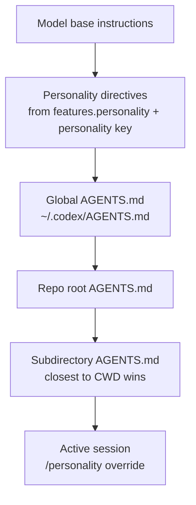

# Codex CLI Personality System: Customising Agent Communication Style


Codex CLI's personality system lets you choose how the agent communicates — from terse and execution-focused to conversational and partner-like — without touching its underlying capabilities. It is a stable, opt-in-to-none feature built on the `features.personality` flag and configurable at every level of the config hierarchy, from global defaults to per-profile overrides to runtime `/personality` commands.

This article covers the full configuration surface: what the three personality values actually do, where each sits in the precedence chain, and when you should reach for `none` to silence the chattiness in automated pipelines.

---

## The Three Personalities

Codex ships with three named styles[^1]:

| Value | Tone | When to use |
|---|---|---|
| `pragmatic` | Concise, direct, action-first. Minimal acknowledgement. | Default for most developers. |
| `friendly` | Warmer, narrative-oriented. More context-setting and reassurance. | Onboarding, ambiguous tasks, pair-programming sessions. |
| `none` | Personality instructions disabled entirely. Neutral tool behaviour. | CI bots, automated pipelines, strict output parsing. |

**`pragmatic`** is the default.[^2] It produces 10-line-or-fewer updates, uses active voice and present tense, skips preambles on trivial reads, and avoids verbose explanations unless you ask. Think of it as the baseline "concise teammate" mode.

**`friendly`** adds empathy and narrative orientation on top of that baseline. The agent acknowledges context before diving in, connects actions to prior conversation, and brings what the docs describe as "collaborative, partner-y pairing energy."[^3] It is intentionally better suited to situations where a human needs orientation — not as a default, since it generates more tokens per turn.

**`none`** strips out personality instructions entirely.[^4] This was a user-driven addition: early adopters valued Codex precisely because it did not exhibit the AI-assistant warmth they found elsewhere. After feedback (including a blunt GitHub issue whose author noted they needed an agent that would not "compliment logs"), OpenAI added `none` as a first-class option.[^5]

---

## Enabling and Disabling: `features.personality`

The personality feature is **stable and enabled by default**.[^6] You do not need to turn it on. To disable the feature entirely (hiding `/personality` from the slash popup and ignoring the `personality` key):

```toml
# ~/.codex/config.toml
[features]
personality = false
```

This is distinct from `personality = "none"`. With `features.personality = false`, the feature is absent from the TUI. With `personality = "none"`, the feature is present but personality instructions are not injected — the model still understands the setting, it just receives no style directives.

---

## Setting Personality in `config.toml`

### Global default

```toml
# ~/.codex/config.toml
personality = "pragmatic"   # "friendly" | "pragmatic" | "none"
```

This applies to all sessions that do not specify a profile or override at runtime.[^7]

### Per-profile override

Profiles let you maintain distinct presets for different contexts. A common pattern is a developer profile with `friendly` for exploratory work and a CI profile with `none` for pipeline runs:

```toml
# ~/.codex/config.toml

personality = "pragmatic"      # global default

[profiles.explore]
model = "gpt-5.4"
model_reasoning_effort = "high"
personality = "friendly"

[profiles.ci]
model = "gpt-5.4-mini"
model_reasoning_effort = "medium"
approval_policy = "never"
sandbox_mode = "workspace-write"
personality = "none"
```

Activate a profile per-session with `codex --profile ci <task>` or set `profile = "ci"` as the global default for fully automated environments.[^8]

### Single-run CLI override

For a one-off override without editing the config file:

```bash
codex --config 'personality="none"' exec "run linting suite"
```

The `-c` / `--config` flag accepts any `config.toml` key-value pair, letting you inject per-invocation overrides cleanly in shell scripts.[^9]

---

## The `/personality` Slash Command

In an interactive session, the `/personality` command opens an inline picker and lets you switch styles mid-thread.[^10]

```
> /personality
  ● pragmatic
  ○ friendly
  ○ none
```

Codex writes a brief transcript entry confirming the change, and all subsequent responses in that thread use the new style. The change is **ephemeral** — it does not persist to `config.toml`.

### Model support gating

The command is **hidden** when the current model does not support personality instructions.[^11] Internally, each model preset carries a `supports_personality` flag. When the Codex TUI fetches remote model metadata from the `/models` endpoint and the response omits `model_instructions_template` (or returns `null`), the client sets `supports_personality = false` for that preset and removes `/personality` from the slash popup.[^12]

This means if you switch to a model that lacks personality support, the command disappears silently — which can be confusing. The workaround is to ensure your model preset includes `model_instructions_template` on the backend, or to stay on models that are known to support it (the default gpt-5.4 family does).

---

## How Personality Interacts with AGENTS.md

Personality operates at the **system prompt level**, injecting style directives as part of the model's base instructions. AGENTS.md content is injected separately, as project-specific guidance.[^13]

The interaction follows this precedence:



Personality affects **tone and phrasing** — how the agent frames its updates. AGENTS.md controls **behaviour and rules** — what the agent does. They are complementary layers, not competing ones.

In practice:

- A global `AGENTS.md` with `"communicate in British English"` applies regardless of personality.
- A repo `AGENTS.md` with `"be brief and do not explain what you are doing"` effectively produces pragmatic-adjacent output even when `personality = "friendly"` — the AGENTS.md instruction is content-level, not style-level, but they reinforce each other.
- Setting `personality = "none"` does not prevent AGENTS.md from adding style instructions. If you want truly neutral output in CI, use `none` **and** omit style-influencing sentences from your AGENTS.md.

---

## CI and Automation Patterns

The most common production use case for `personality = "none"` is automated pipelines where log output is parsed or reviewed by tooling:

```toml
# .codex/config.toml (project-level, committed)
[profiles.ci]
model = "gpt-5.4-mini"
model_reasoning_effort = "low"
approval_policy = "never"
sandbox_mode = "workspace-write"
personality = "none"
```

```yaml
# .github/workflows/codex-review.yml
- name: Codex code review
  run: codex --profile ci exec "review the diff in $GITHUB_WORKSPACE and output JSON"
```

Using `none` here prevents the agent from prefixing structured output with conversational framing ("Sure! Here's the review you asked for…") that would break JSON parsing downstream.[^14]

### Disabling the feature entirely in requirements.toml

Enterprise teams using `requirements.toml` for managed policy can lock down personality by disabling the feature flag organisation-wide:

```toml
# requirements.toml (distributed to all machines)
[features]
personality = false
```

This removes the UI affordance and ignores any user-set `personality` key, ensuring consistent, policy-compliant output across all developer machines.[^15]

---

## Personality in the App Settings

The Codex Mac and Windows apps expose personality via **Settings → Personalization**. The dropdown offers Friendly, Pragmatic, and None, with a note that `None` disables personality instructions. Editing custom instructions here updates `~/.codex/AGENTS.md` — a separate control from personality, since AGENTS.md carries behavioural rules while personality controls communication style.[^16]

The setting persists between sessions in the app and maps directly to `personality` in `config.toml`. Changes made in the app are immediately reflected in the config file.

---

## Practical Recommendations

| Context | Recommended setting |
|---|---|
| Solo development, known codebase | `pragmatic` (default) — efficient, low noise |
| Onboarding a new codebase | `friendly` — extra context helps orientate |
| Pair-programming / live demos | `friendly` — more narrative is useful when sharing screens |
| CI/CD pipelines | `none` — prevents conversational framing from polluting structured output |
| Strict output parsing (JSON, YAML) | `none` + AGENTS.md instruction to only output the schema |
| Enterprise managed fleet | `features.personality = false` in `requirements.toml` |

The personality system is deliberately shallow — it does not affect tool call behaviour, planning logic, or the agent's error recovery strategies. If you find yourself fighting the communication style via AGENTS.md instructions, switching personality values first is the lower-friction path.

---

## Citations

[^1]: OpenAI Developer Documentation — Configuration Reference, `personality` key: https://developers.openai.com/codex/config-reference
[^2]: OpenAI Developer Documentation — Codex Prompting Guide, default tone description: https://developers.openai.com/cookbook/examples/gpt-5/codex_prompting_guide
[^3]: OpenAI Developer Documentation — Codex Core Prompt, `codex-rs/core/prompt.md`: https://github.com/openai/codex/blob/main/codex-rs/core/prompt.md
[^4]: OpenAI Developer Documentation — Slash Commands, `/personality` description: https://developers.openai.com/codex/cli/slash-commands
[^5]: GitHub Issue #10582 — personality should be an Option that you can set to None (RESOLVED): https://github.com/openai/codex/issues/10582
[^6]: OpenAI Developer Documentation — Configuration Reference, `features.personality` key (stable, on by default): https://developers.openai.com/codex/config-reference
[^7]: OpenAI Developer Documentation — Config Basics, `personality` in `config.toml`: https://developers.openai.com/codex/config-basic
[^8]: OpenAI Developer Documentation — Advanced Configuration, profile-scoped personality: https://developers.openai.com/codex/config-advanced
[^9]: OpenAI Developer Documentation — Config Basics, `--config` / `-c` CLI flag: https://developers.openai.com/codex/config-basic
[^10]: OpenAI Developer Documentation — Slash Commands, `/personality` inline picker: https://developers.openai.com/codex/cli/slash-commands
[^11]: OpenAI Developer Documentation — Slash Commands, model support gating: https://developers.openai.com/codex/cli/slash-commands
[^12]: GitHub Issue #10074 — Support /personality for remote models; `supports_personality` flag in `codex-rs/tui/src/chatwidget.rs`: https://github.com/openai/codex/issues/10074
[^13]: OpenAI Developer Documentation — Custom Instructions with AGENTS.md: https://developers.openai.com/codex/guides/agents-md
[^14]: OpenAI Developer Documentation — Sample Configuration, CI profile patterns: https://developers.openai.com/codex/config-sample
[^15]: OpenAI Developer Documentation — Configuration Reference, `requirements.toml` managed policy: https://developers.openai.com/codex/config-reference
[^16]: OpenAI Developer Documentation — Settings (Codex App), Personalization section: https://developers.openai.com/codex/app/settings
