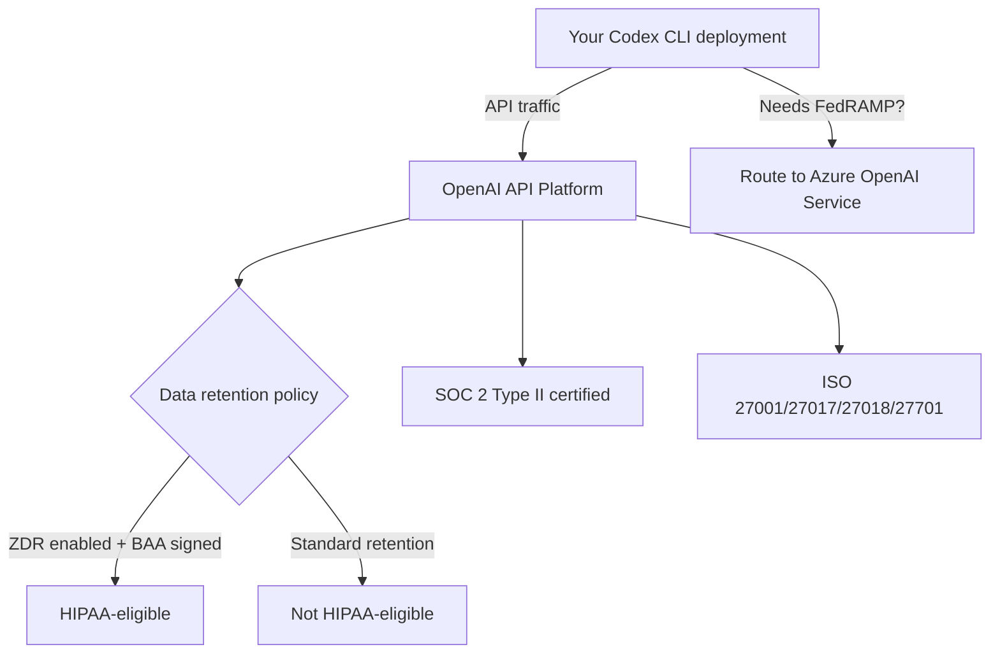
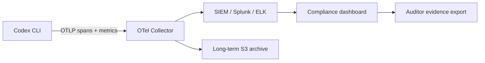
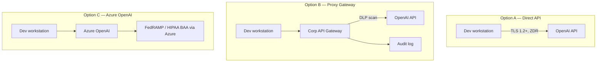

# Codex CLI in Regulated Environments: HIPAA, SOC 2, and Financial Services


Deploying AI coding agents in healthcare, financial services, or any SOC 2-audited environment introduces obligations that go well beyond performance or cost. Regulators expect evidence that your toolchain protects sensitive data, restricts access on a need-to-know basis, and produces a tamper-evident audit trail. This article maps Codex CLI's technical controls to the specific requirements imposed by HIPAA, SOC 2 Type II, and financial services frameworks — and identifies the gaps where additional controls or architectural choices are needed.

---

## The Compliance Baseline: What OpenAI Actually Certifies

Before configuring Codex, understand what your vendor certifies and what remains your responsibility.

OpenAI's API platform holds **SOC 2 Type II, ISO 27001, ISO 27017, ISO 27018, and ISO 27701** certifications.[^1] These cover the underlying infrastructure — compute, storage, API ingestion — not the behaviour of individual client applications. Your Codex CLI deployment is in scope for your organisation's own SOC 2 audit; the OpenAI platform SOC 2 report covers their side of the shared-responsibility boundary.

For **HIPAA**, OpenAI offers a Business Associate Agreement (BAA) for the API — email `baa@openai.com` with your company details.[^2] The BAA only covers API services with **zero data retention (ZDR)** enabled. Consumer ChatGPT tiers (Free, Plus) are explicitly out of scope and must not process Protected Health Information (PHI).[^3]

For **FedRAMP** workloads, the native OpenAI API does not currently hold a FedRAMP authorisation. The supported path for federal environments is **Azure OpenAI Service**, which holds a FedRAMP High P-ATO.[^4] If your compliance mandate requires FedRAMP, architect accordingly.



---

## Zero Data Retention: The Critical Configuration

The single most important compliance control is **zero data retention (ZDR)**. With ZDR active, OpenAI processes requests and immediately discards all request and response data — it is not logged, not used for model training, and not available for abuse monitoring.[^5]

Codex CLI and the IDE Extension default to ZDR for the local surfaces: *"Zero data retention for the App, CLI, and IDE — code stays in the developer environment."*[^6] This means your source code, which travels with every API call as conversation history (Codex uses a stateless architecture, shipping the entire session with each request), is not retained server-side.

**Cloud features behave differently.** Codex Cloud tasks — those triggered via the web interface, Slack, or Linear — follow your ChatGPT Enterprise retention policies, not automatic ZDR.[^7] If cloud tasks process regulated data, verify your workspace retention settings explicitly.

### Verifying ZDR Status

```bash
# Check your org's current data retention configuration
# Navigate to: platform.openai.com → Settings → Privacy & Data
# Or query via the platform API:
curl https://api.openai.com/v1/organization/settings \
  -H "Authorization: Bearer $OPENAI_ADMIN_KEY" | jq '.data_retention'
```

---

## HIPAA-Specific Deployment Checklist

The January 2025 HIPAA Security Rule NPRM explicitly requires that AI tools be included in your organisation's risk analysis and risk management activities.[^8] That means documenting Codex's data flows, access controls, and monitoring posture — not just configuring them.

### Step 1: Sign the BAA

Without a signed BAA, any Codex API usage that touches PHI is a violation. The BAA covers API services; if you are authenticating Codex CLI via a ChatGPT Business or Enterprise login rather than a direct API key, verify BAA coverage with your OpenAI account team.

### Step 2: Enable Zero Data Retention

Confirm ZDR is active for your API organisation. The GitHub issue tracker records a known failure mode: ZDR-enabled organisations occasionally see `400 Previous response cannot be used for this organization due to Zero Data Retention`.[^9] This surfaces when stateful API parameters conflict with ZDR. Codex CLI's stateless design should prevent this by default, but monitor for it in your error logs.

### Step 3: Restrict to Approved API Endpoints

Not all OpenAI API endpoints are eligible for ZDR. Confirm with your account team which model endpoints are covered before using newer or experimental models in PHI contexts.

### Step 4: Network Segmentation

PHI must never transit unsecured networks. Codex CLI supports network restriction via `permissions` profiles in `config.toml`:[^10]

```toml
[permissions.hipaa_mode]
network.enabled = true
network.mode = "limited"
network.allowed_domains = ["api.openai.com"]
network.denied_domains = ["*"]
allow_local_binding = false

[default_permissions]
profile = "hipaa_mode"
```

This allows only the OpenAI API endpoint and blocks all other outbound traffic from sandboxed tool calls. Pair this with your endpoint's network ACLs for defence-in-depth.

### Step 5: Lock Down Approval Policy and Sandbox Mode

No PHI-handling Codex session should run in `danger-full-access` sandbox mode. Enforce this organisationally via `requirements.toml`:[^11]

```toml
# /etc/codex/requirements.toml or cloud-managed policy
allowed_approval_policies = ["on-request", "untrusted"]
allowed_sandbox_modes = ["workspace-write", "read-only"]
```

The `requirements.toml` enforcer means users cannot override these constraints even with local `config.toml` edits or CLI flags.

---

## SOC 2 Type II: Mapping Controls to Trust Services Criteria

SOC 2 auditors evaluate five Trust Services Criteria: Security (CC), Availability (A), Confidentiality (C), Processing Integrity (PI), and Privacy (P). The Security criteria are almost always in scope; the rest depend on your service commitments.

### Security (CC): Logical Access Controls

**CC6.1 — Logical access security software**: Codex CLI's RBAC is managed through ChatGPT Enterprise workspace roles. The recommended group structure:[^12]

| Group | Role | Purpose |
|-------|------|---------|
| `codex-admins` | Codex Admin | Policy management, analytics, environment config |
| `codex-users` | Standard user | Development work |
| `codex-compliance` | Read-only | Compliance API access only |

Back both groups with your identity provider via SCIM. Membership changes are then auditable in your IdP, not just in OpenAI's workspace dashboard.

```bash
# Confirm SCIM sync is active
# ChatGPT Enterprise admin panel → Members → Directory sync
# Verify last sync time < 24h
```

**CC6.2 — Prior to issuing system credentials**: API keys used for Codex Analytics or Compliance API access should be scoped minimally. Request `codex.enterprise.analytics.read` scope by emailing `support@openai.com` with the last four digits of the key.[^13]

**CC6.3 — Internal access removed on termination**: SCIM-backed groups ensure that when an employee is deprovisioned in your IdP, Codex access is revoked automatically.

### Confidentiality (C1): Protection of Confidential Information

SOC 2 C1.1 requires that information designated as confidential is protected during collection, processing, and disposal. Codex's stateless ZDR architecture is your primary evidence here: no proprietary source code is retained on OpenAI's infrastructure beyond the API round-trip.

Document this in your System Description as: *"All API requests to OpenAI are processed under zero data retention. Source code and prompts are not stored, logged, or used for model training. Evidence: OpenAI ZDR confirmation letter / BAA addendum."*

### Processing Integrity (PI1): Complete and Accurate Processing

The OpenTelemetry (`[otel]`) section in `config.toml` exports Codex spans and metrics to your observability stack, creating an audit record of every tool call, file modification, and API interaction:[^14]

```toml
[otel]
exporter = "otlp-http"
trace_exporter = "otlp-http"
metrics_exporter = "otlp-http"
environment = "production-hipaa"
# Do NOT enable log_user_prompt in regulated environments
# log_user_prompt = false  (this is the default)
```

The `log_user_prompt = false` default is correct for regulated use. Enabling it would export raw prompt text to your OTel collector — potentially capturing PHI or proprietary code in your telemetry pipeline.

### Privacy (P): Personal Information Handling

The Privacy criteria align closely with HIPAA for healthcare companies. The NIST Special Publication 800-66r2 crosswalk maps HIPAA Security Rule requirements to NIST controls; your SOC 2 auditor will likely use a similar crosswalk for Codex.[^15] Key evidence to assemble:

- ZDR confirmation
- BAA (HIPAA only)
- Network restriction configuration
- OTel audit logs showing no PHI in telemetry
- `requirements.toml` showing sandbox and approval policy enforcement

---

## Financial Services: PCI-DSS and DORA Considerations

### PCI-DSS v4.0

Payment card data (CHD) must never appear in prompts sent to Codex. This is a people-and-process control as much as a technical one. Technical mitigations:

1. **Tokenisation before agent handoff** — strip CHD from any context before passing to Codex. Your AGENTS.md can reinforce this:

```markdown
## Data Classification
Never include raw payment card numbers, CVVs, or full PAN data in prompts or
context files. Use tokenised representations only (e.g., `tok_*`).
```

1. **Network segmentation** — cardholder data environments (CDEs) should be network-isolated. Codex's `permissions` profile (shown above) restricts outbound connections. Verify that developer workstations running Codex are not co-located in your CDE.

2. **Audit logging** — PCI DSS requirement 10 mandates logging of all access to system components. OTel exports from Codex provide tool-call level audit trails to feed into your SIEM.

### DORA (Digital Operational Resilience Act)

DORA's ICT risk management requirements apply to EU financial entities and their third-party ICT providers. As of 2025, OpenAI qualifies as an ICT third-party service provider under Article 28 of DORA for organisations that classify Codex API usage as a critical or important function.[^16]

Practical implications:

- **Register the dependency**: Document OpenAI as an ICT third-party provider in your ICT third-party risk register.
- **Contractual clauses**: Verify your OpenAI contract (or Enterprise Agreement) contains the DORA Article 30 mandatory clauses: sub-contracting transparency, audit rights, termination provisions.
- **Business continuity**: Model your DORA operational resilience testing to include scenarios where the OpenAI API is unavailable. Codex's `--model` flag makes switching to an alternative API straightforward if needed. ⚠️ *Alternative model availability for regulated workloads should be verified with legal counsel.*

---

## Audit Evidence Preservation

Regardless of framework, auditors will ask for evidence. Build evidence collection into your deployment from day one.

### OTel → SIEM Pipeline



Configure your OTel collector to archive raw spans to immutable S3 storage with a retention policy matching your regulatory requirement (typically 6 years for HIPAA, 7 years for most financial services).

### Compliance API Queries

The Codex Compliance API exposes cloud task logs for enterprise investigation workflows:[^17]

```bash
# Retrieve audit logs for a time window
curl "https://api.chatgpt.com/v1/compliance/workspaces/$WORKSPACE_ID/logs?event_type=CODEX_LOG&after=2026-03-01T00:00:00Z" \
  -H "Authorization: Bearer $COMPLIANCE_API_KEY"

# Retrieve specific Codex task records
curl "https://api.chatgpt.com/v1/compliance/workspaces/$WORKSPACE_ID/codex_tasks" \
  -H "Authorization: Bearer $COMPLIANCE_API_KEY"
```

Compliance API keys should be scoped read-only and stored in your secrets manager (HashiCorp Vault, AWS Secrets Manager) — never in `config.toml` or `.env` files.

### Git Commit Attribution

For code-level audit trails, enable `commit_attribution` in `config.toml` to mark every agent commit:[^18]

```toml
[commit_attribution]
label = "Codex Agent <codex-audit@yourorg.com>"
```

This produces `Co-authored-by` trailers in every commit Codex creates, making agent-generated changes traceable through your Git history — useful evidence for SOC 2 change management controls (CC8.1).

---

## Deployment Topology Options

Depending on your compliance posture, three deployment topologies are viable:



**Option A — Direct API**: Simplest. Relies on ZDR and the OpenAI BAA. Appropriate for most HIPAA and SOC 2 scenarios. Not suitable for FedRAMP.

**Option B — Corporate API Gateway**: Your team proxies all Codex API calls through an internal gateway that can scan for data loss prevention (DLP) violations (e.g., detecting PAN data or PHI keywords before they leave the network), centralise audit logging, and enforce rate limits per team. Configure Codex to use the proxy via the `HTTPS_PROXY` environment variable.

**Option C — Azure OpenAI**: Required for FedRAMP High. Swap the model endpoint in `config.toml` to your Azure deployment URL. ⚠️ *Model availability and feature parity with native OpenAI endpoints varies; validate with Microsoft before committing to this topology.*

---

## Key Risks and Known Gaps

| Risk | Mitigation |
|------|-----------|
| Developer accidentally pastes PHI into a prompt | DLP proxy (Option B) + AGENTS.md training guidance |
| ZDR not applied to cloud tasks | Verify workspace retention settings explicitly; default local ≠ default cloud |
| Compliance API key leaked | Store in secrets manager; rotate quarterly; SCIM-backed deprovisioning |
| `log_user_prompt = true` accidentally enabled | Pin to `false` via `requirements.toml` `[features]` table |
| Agent commits expose IP in public repo | `commit_attribution` + branch protection rules requiring PR review |
| DORA third-party register not updated | Document OpenAI as ICT provider in risk register at deployment time |

---

## Summary

Codex CLI can be deployed compliantly in regulated environments, but it requires deliberate configuration rather than accepting defaults. The essential controls are:

1. **ZDR active** — confirm per-surface, not just at the org level
2. **BAA signed** — mandatory for PHI; contact `baa@openai.com`
3. **`requirements.toml`** — enforce sandbox mode and approval policy centrally
4. **OTel pipeline** — capture tool-call spans in immutable archive storage
5. **Compliance API** — automate audit log retrieval; scope keys minimally
6. **SCIM-backed RBAC** — centralise access management in your IdP
7. **Commit attribution** — mark agent work in Git history

The compliance posture of your Codex deployment reflects the broader maturity of your engineering organisation. If your team already runs a robust SOC 2 programme, adding Codex is largely a matter of documenting the new component within existing controls. If you are building compliance from scratch around an AI coding agent, the controls above provide a workable starting point.

---

## Citations

[^1]: OpenAI Trust Portal — certifications list. [trust.openai.com](https://trust.openai.com/) (accessed March 2026).

[^2]: OpenAI Help Centre — "How can I get a Business Associate Agreement (BAA) with OpenAI for the API Services?" [help.openai.com/en/articles/8660679](https://help.openai.com/en/articles/8660679-how-can-i-get-a-business-associate-agreement-baa-with-openai) (accessed March 2026).

[^3]: AccountableHQ — "Is OpenAI HIPAA Compliant? Current Status, BAAs, and Secure Alternatives." [accountablehq.com](https://www.accountablehq.com/post/is-openai-hipaa-compliant-current-status-baas-and-secure-alternatives) (accessed March 2026).

[^4]: Azure OpenAI Service FedRAMP High P-ATO. Applied Information Sciences — "Azure OpenAI Security." [ais.com/azure-openai-security-key-questions-addressed](https://www.ais.com/azure-openai-security-key-questions-addressed/) (accessed March 2026).

[^5]: OpenAI Medium — "OpenAI's Zero Data Retention Policy" by J Kes. [medium.com/@jeffkessie50/openais-zero-data-retention-policy-916ff04a3599](https://medium.com/@jeffkessie50/openais-zero-data-retention-policy-916ff04a3599) (accessed March 2026).

[^6]: OpenAI Developers — Admin Setup for Codex Enterprise. [developers.openai.com/codex/enterprise/admin-setup](https://developers.openai.com/codex/enterprise/admin-setup) (accessed March 2026).

[^7]: OpenAI Help Centre — "Using Codex with your ChatGPT plan." [help.openai.com/en/articles/11369540](https://help.openai.com/en/articles/11369540-using-codex-with-your-chatgpt-plan) (accessed March 2026).

[^8]: HHS HIPAA Security Rule NPRM, January 2025 — AI tools must be included in risk analysis activities. CertPro HIPAA Updates 2026 summary. [certpro.com/hipaa-updates-2026-explained](https://certpro.com/hipaa-updates-2026-explained/) (accessed March 2026).

[^9]: GitHub openai/codex issue #106 — "Previous response cannot be used for this organisation due to Zero Data Retention." [github.com/openai/codex/issues/106](https://github.com/openai/codex/issues/106) (accessed March 2026).

[^10]: OpenAI Developers — Configuration Reference, `permissions` network keys. [developers.openai.com/codex/config-reference](https://developers.openai.com/codex/config-reference) (accessed March 2026).

[^11]: OpenAI Developers — Managed Configuration for Codex Enterprise. [developers.openai.com/codex/enterprise/managed-configuration](https://developers.openai.com/codex/enterprise/managed-configuration) (accessed March 2026).

[^12]: OpenAI Developers — Admin Setup, RBAC group structure recommendation. [developers.openai.com/codex/enterprise/admin-setup](https://developers.openai.com/codex/enterprise/admin-setup) (accessed March 2026).

[^13]: OpenAI Developers — Admin Setup, Analytics API key scoping. [developers.openai.com/codex/enterprise/admin-setup](https://developers.openai.com/codex/enterprise/admin-setup) (accessed March 2026).

[^14]: OpenAI Developers — Configuration Reference, `[otel]` section. [developers.openai.com/codex/config-reference](https://developers.openai.com/codex/config-reference) (accessed March 2026).

[^15]: NIST SP 800-66r2 — Implementing the HIPAA Security Rule: A Cybersecurity Resource Guide. [csrc.nist.gov/publications/detail/sp/800-66/rev-2/final](https://csrc.nist.gov/publications/detail/sp/800-66/rev-2/final) (accessed March 2026).

[^16]: DORA Article 28 — EU Digital Operational Resilience Act, third-party ICT provider requirements. [digital-strategy.ec.europa.eu/en/policies/dora](https://digital-strategy.ec.europa.eu/en/policies/dora) (accessed March 2026).

[^17]: OpenAI Developers — Admin Setup, Compliance API endpoints. [developers.openai.com/codex/enterprise/admin-setup](https://developers.openai.com/codex/enterprise/admin-setup) (accessed March 2026).

[^18]: OpenAI Developers — Config Reference, `commit_attribution` key. [developers.openai.com/codex/config-reference](https://developers.openai.com/codex/config-reference) (accessed March 2026).
