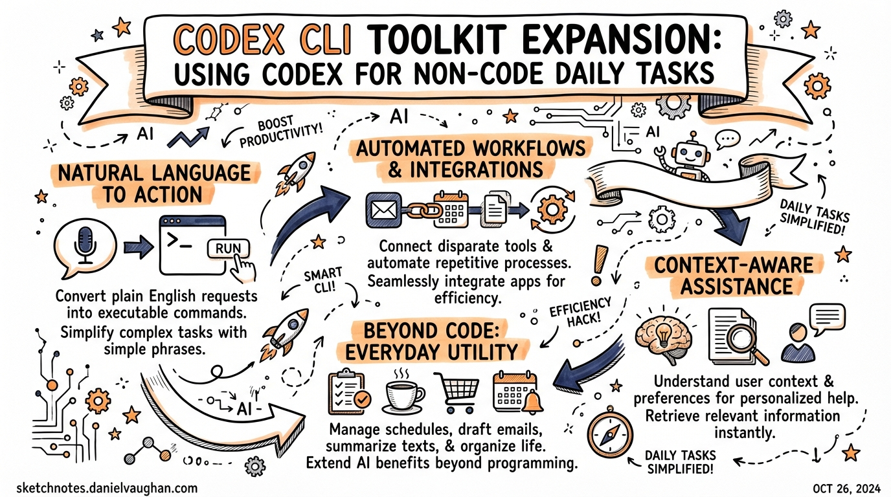
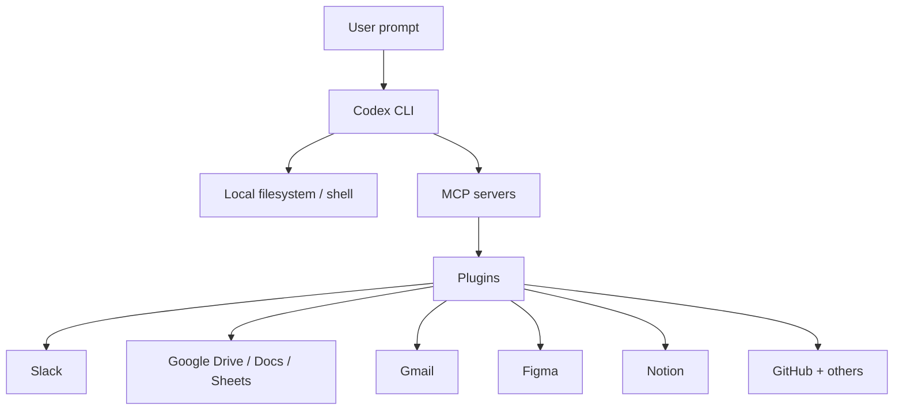
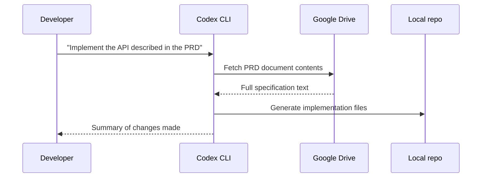

# Codex CLI Toolkit Expansion: Using Codex for Non-Code Daily Tasks

**Date:** 2026-03-28
**Tags:** codex-cli, plugins, productivity, non-coding, slack, figma, google-drive, gmail, notion, toolkit

On 26 March 2026, Tibo Sottiaux — a member of OpenAI's Codex team — posted a quiet but significant signal on X:

> "Codex deserves great tools. We are about to expand its toolkit a whole bunch and I can't think of using anything else anymore for all my daily tasks, way way outside of coding."[^1]

That same day, OpenAI shipped more than 20 plugins for Codex, connecting it to Slack, Figma, Google Drive, Gmail, Notion, and beyond.[^2] The message was clear: Codex CLI is no longer positioning itself solely as a coding tool. It is becoming a general-purpose agent for knowledge work.

This article examines what that expansion looks like in practice — what the new plugins enable, how they integrate with the existing skill and MCP system, and when it makes sense to lean on Codex for tasks that have nothing to do with writing code.

---

## Why "Beyond Coding" Makes Architectural Sense

The framing of "coding assistant" has always been slightly misleading for Codex CLI. The tool runs an agent loop that can execute arbitrary terminal commands inside a configurable sandbox. Everything the shell can do, Codex can orchestrate from a natural language prompt. Code generation is just the most obvious use case — not the ceiling.

The real expansion here is connectivity. Historically, Codex operated within the boundaries of your local filesystem and terminal. With MCP integration and the new plugin system, those boundaries extend into the cloud services your team already depends on: design platforms, communication tools, document stores, email.

The architecture is straightforward:



Each plugin bundles three kinds of resources: **skills** (prompt workflows defining how Codex should behave within that tool), **app integrations** (OAuth-authenticated connectors), and optionally **MCP server configurations** (for richer tool surfaces).[^3] When you install a plugin, you are not configuring an API key or writing a prompt template — the plugin arrives pre-wired and ready to use.

---

## The 20+ Plugin Launch: What Shipped

### Confirmed First-Party Integrations

At launch on 26 March 2026, OpenAI confirmed the following curated integrations:[^4]

| Plugin | What it unlocks |
|---|---|
| **Google Drive** | Read and write across Drive, Docs, Sheets, and Slides |
| **Gmail** | Read, summarise, and manage your inbox |
| **Slack** | Summarise channels, draft replies, send messages |
| **Figma** | Access design files directly for design-to-code workflows |
| **Notion** | Pull documentation context, update pages |
| **GitHub** | Referenced in official usage examples |
| **Cloudflare** | Infrastructure management from within Codex |

Beyond the headline five, OpenAI launched more than 20 plugins in total[^2], with additional integrations expected as the self-serve plugin directory opens up for community contributions.

---

## Installing and Configuring Plugins

### Via the CLI

In the terminal, use the `/plugins` command to browse and install from the directory. Once installed, plugins become immediately active — their bundled skills appear in the skill picker the next time you start a thread.[^5]

### Disabling Without Uninstalling

Plugin state is stored in `~/.codex/config.toml`. To disable a plugin while keeping it installed:

```toml
[plugins."gmail@openai-curated"]
enabled = false
```

Restart Codex for the change to take effect.[^5] This is useful for keeping a plugin available without it contributing to context on every session.

### Enterprise Policy

In managed deployments, administrators can mark plugins `INSTALLED_BY_DEFAULT` in `requirements.toml` to push them to every team member's environment automatically. This mirrors the same mechanism used for curated skills in enterprise setups.[^6]

---

## Practical Non-Coding Workflows

### 1. Inbox Triage and Email Summarisation

The Gmail plugin makes one-shot summarisation straightforward:

```
Summarise unread Gmail threads from today, grouped by sender
```

Codex reads the inbox, groups threads, and produces a structured summary without requiring any scripting. For daily triage this removes a class of context-switching entirely.

For more complex flows — "find all emails from legal with unresolved action items and create a Notion page" — Codex can chain the Gmail and Notion plugins within a single prompt, treating them as composable tools.

### 2. Slack Channel Synthesis

Development teams generate enormous amounts of signal in Slack that nobody has time to read. The Slack plugin makes retrieval and synthesis a prompt:

```
Summarise the #incidents channel from the last 48 hours.
Highlight anything still unresolved and create a Notion page with the findings.
```

This kind of cross-tool orchestration — Slack to Notion — was previously only possible with custom integration code. With both plugins active, it is a single-turn task.

### 3. Design Context in Code Workflows

The Figma plugin is arguably the highest-leverage integration for frontend teams. Rather than exporting assets, writing descriptions, or switching windows, Codex can query design files directly during implementation:

```
Check the Figma spec for the dashboard redesign and update the spacing tokens in design-tokens.ts to match
```

The plugin surfaces Figma's `get_design_context` and related tools so Codex can resolve design values at the point they are needed rather than relying on stale screenshots or manual transcription.[^7]

### 4. Document-Driven Development

The Google Drive plugin means specification documents written in Google Docs are directly accessible as Codex context. A common pattern:



This eliminates the copy-paste step between your planning documents and your terminal, and ensures Codex is working from the authoritative version of the specification rather than whatever excerpt you remembered to include in your prompt.

### 5. File Operations and Batch Processing

Before the plugin launch, Codex was already capable as a file automation tool — its shell access and sandbox model mean it can handle batch image conversion, log analysis, CSV consolidation, and similar tasks.[^8] The plugin expansion adds cloud storage to this picture, letting Codex retrieve from Google Drive, process locally, and write back.

```bash
# Non-interactive batch job via codex exec
codex exec --full-auto \
  "Download all CSV exports from the Q1 reports Drive folder, \
   merge them, calculate totals by category, \
   and upload the result as a new Google Sheet named 'Q1 Summary'"
```

---

## Skills vs Plugins: Choosing the Right Abstraction

The plugin launch is also a useful moment to clarify the distinction between skills and plugins, since they serve different purposes at different scopes:[^3]

| Dimension | Skill | Plugin |
|---|---|---|
| **Scope** | Personal or project-specific | Sharable across teams and orgs |
| **Distribution** | Lives in `~/.codex/skills/` or `agents/` | Installable from directory |
| **Contents** | `SKILL.md` instructions + optional scripts | Skills + apps + MCP config, bundled |
| **Publishing** | Not publishable externally | Publishable to official directory |
| **When to use** | Experimenting; single-repo workflows | When workflow is stable and team-wide |

The recommendation from OpenAI is to start with a skill during development, then package it as a plugin when it is ready to share.[^3] The skill format (a `SKILL.md` file with YAML frontmatter and markdown instructions) is the authoring surface; the plugin format is the distribution layer.

---

## Non-Code Tasks Where Codex Now Competes

With the toolkit expansion, Codex enters territory previously occupied by no-code automation platforms (Zapier, Make) and research assistants. Some categories where it is now genuinely competitive:

- **Morning briefings**: Combine Slack summaries + Gmail digest + open GitHub issues into a single structured brief
- **Meeting prep**: Pull Notion meeting notes + related Slack threads + any referenced Drive documents before a call
- **Issue triage**: For teams using GitHub + Slack + Linear, Codex can scan, classify, and route incoming issues without human intervention
- **Documentation maintenance**: Drive documents can be updated automatically when code changes — Codex reads the relevant files and drafts the update for review
- **Research compilation**: Multi-source synthesis from Notion, Drive, and web search into a structured deliverable

The key differentiator from purpose-built automation tools is that Codex reasons about the task rather than following a fixed trigger-action rule. It can handle ambiguity, ask clarifying questions, and adjust based on what it finds — which makes it more useful for tasks that vary in structure.

---

## Current Limitations

⚠️ **Plugin directory completeness**: The full list of 20+ plugins at launch was not comprehensively documented at the time of writing. Specific plugin names and their exact skill surfaces should be verified via `/plugins` in the CLI.

⚠️ **Self-serve publishing**: The ability to submit plugins to the public directory was listed as forthcoming at launch, not yet live.[^4]

⚠️ **Approval model applies**: Plugins that perform write operations (sending Slack messages, modifying Drive documents, sending email) require the same approval confirmation as any other tool call, unless running in `--full-auto` mode.

---

## Summary

The 26 March 2026 toolkit expansion marks a genuine shift in how Codex positions itself. The new first-party plugins for Gmail, Google Drive, Slack, Figma, and Notion remove the integration overhead that previously made non-coding tasks impractical, and the architectural consistency with the existing skill and MCP system means the learning curve for the new capabilities is minimal.

For teams already using Codex CLI for development, the immediate wins are cross-tool workflows: specification documents feeding directly into implementation, Slack threads converting to Notion pages, inbox triage running as a morning task. These are not hypothetical — they are standard prompts now that authentication and connectivity are handled by the plugin layer.

The deeper implication is that "coding assistant" is increasingly a poor description of what Codex is. It is an agent that can write code to solve problems. When the problem is an overflowing inbox, a stale spec document, or a Figma component that needs to match a CSS file, it turns out the tool works just as well.

---

## Citations

[^1]: Tibo Sottiaux, X post, 26 March 2026. https://x.com/thsottiaux/status/2037056057659580893

[^2]: "OpenAI Launches 20 Plugins for Codex to Connect Slack, Figma, and Google Drive", Technobezz, March 2026. https://www.technobezz.com/news/openai-launches-20-plugins-for-codex-to-connect-slack-figma-and-google-drive

[^3]: Codex Plugins official documentation, OpenAI Developers. https://developers.openai.com/codex/plugins

[^4]: "Codex Plugins Are Here: Slack, Figma, Google Drive, and More", Adam Holter, March 2026. https://adam.holter.com/codex-plugins-are-here-slack-figma-google-drive-and-more/

[^5]: Codex Plugin configuration reference. https://developers.openai.com/codex/plugins#use-plugins-locally

[^6]: Codex CLI Features documentation. https://developers.openai.com/codex/cli/features

[^7]: "Codex CLI + Figma MCP: Design-to-Code Workflows", Daniel Vaughan, 2026-03-27. https://danielvaughan.github.io/codex-resources/articles/2026-03-27-codex-cli-figma-mcp-design-to-code/

[^8]: "Beyond Code: Codex CLI for File Automation, Image Processing and Browser Tasks", Daniel Vaughan, 2026-03-27. https://danielvaughan.github.io/codex-resources/articles/2026-03-27-codex-cli-beyond-code-file-automation/
