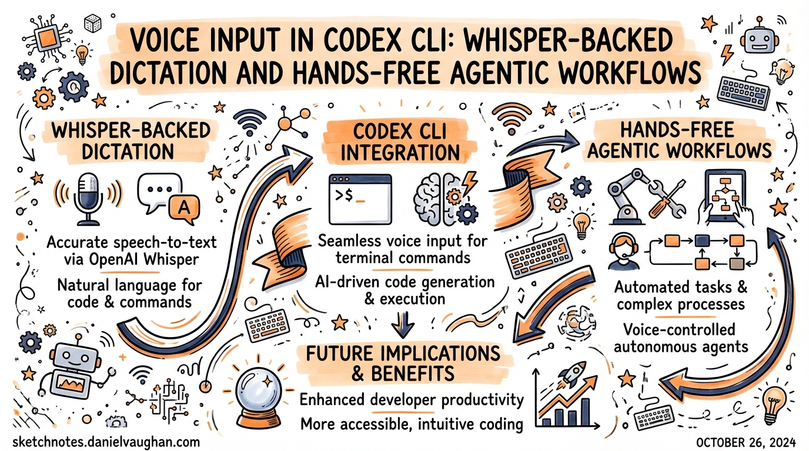
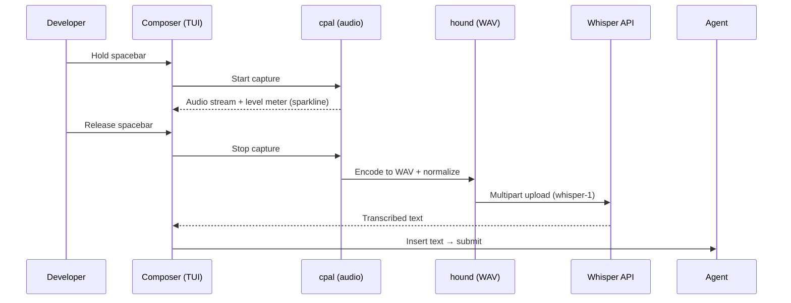
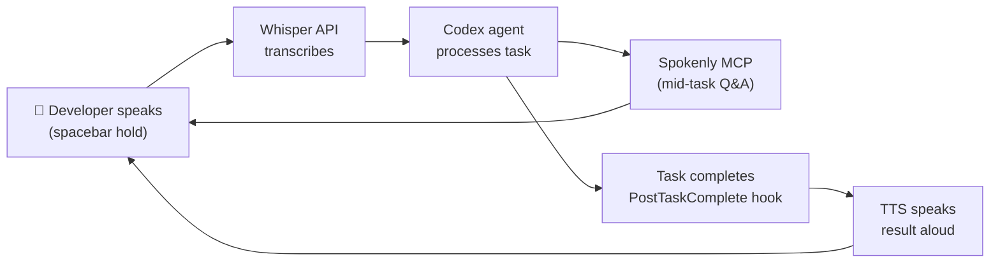

# Voice Input in Codex CLI: Whisper-Backed Dictation and Hands-Free Agentic Workflows

**Date:** 2026-03-28
**Tags:** voice-input, voice-transcription, whisper, spokenly-mcp, hands-free, features-table, dictation

Codex CLI gained native voice transcription in v0.105.0 (February 26, 2026)[^1]. The mechanic is deceptively simple — hold the spacebar, speak, release — but the implementation layers an OpenAI Whisper transcription pipeline[^2] on top of the existing composer, and the broader ecosystem of MCP-based voice integrations extends the capability well beyond initial prompt input.

This article covers everything from enabling the built-in feature through to full hands-free workflows where the agent asks questions by voice and you answer the same way.

---

## The Built-In Feature

### Enabling Voice Transcription

Voice transcription is **opt-in** and disabled by default. You can enable it two ways:

**Via `config.toml`:**

```toml
# ~/.codex/config.toml
[features]
voice_transcription = true
```

**Via the CLI subcommand:**

```bash
codex features enable voice_transcription
```

Either method persists the setting. The feature flag appears in `codex features list` with status `stable` from v0.105.0 onwards[^3].

### Using It

The trigger is **press-and-hold spacebar** in the composer:

- **Empty composer** — recording starts immediately on spacebar hold
- **Text already in composer** — a 500 ms hold delay prevents accidental activation; keep holding past the threshold to start recording[^4]

While recording, a 12-character sparkline audio level meter appears in the composer, giving real-time feedback that audio is being captured[^5]. A braille spinner replaces the cursor during the transcription round-trip.

Release the spacebar to stop recording. The audio is uploaded to OpenAI's Whisper API (`whisper-1` model) via multipart upload, resolved through your `codex login` credentials — no separate `OPENAI_API_KEY` setup needed[^6]. The transcribed text is inserted at the cursor position.

Maximum recording length is **60 seconds** per clip.

### What Happens Under the Hood

The feature uses two Rust crates[^7]:

- **`cpal`** for cross-platform audio capture
- **`hound`** for WAV encoding before upload

Audio is normalised with peak detection and headroom adjustment before sending. There is no voice-activity detection (VAD) — recording runs for the entire hold duration regardless of silence. This is intentional simplicity: no mis-triggers from ambient sound mid-session.



---

## Platform Support

Voice transcription works on **macOS** (confirmed stable) and is reportedly available on **Windows**[^8]. Linux is explicitly not supported in the current implementation[^9] — on Linux, holding the spacebar types spaces rather than activating recording, because the keyboard hook does not compile on that platform.

Two GitHub issues track Linux coverage:

- **#12827** — "Voice transcription no-op" — confirmed by developer Eric Traut as a known limitation[^10]
- **#12894** — "Enable voice transcription in Linux/WSL builds" — open feature request for Linux/WSL parity[^11]

Linux developers have two practical paths: the Spokenly MCP integration (covered below), or system-level dictation tools like **OpenWhispr**[^12], which pastes transcribed text at the cursor in any application and works cross-platform.

---

## The Spokenly MCP: Agent-Initiated Voice Q&A

The built-in spacebar feature covers one scenario: you dictating your initial prompt. It does nothing during an active agent run. If you want the agent to pause mid-workflow and ask you a spoken question — and receive a spoken answer — you need the **Spokenly MCP**[^13].

Spokenly runs a local HTTP MCP server at `localhost:51089`. The agent calls the `ask_user_dictation` tool when it needs clarification; a push-to-talk overlay appears, you answer by voice, and the transcription returns to the agent as structured context.

### Setup

Register the MCP server:

```bash
codex mcp add spokenly --url http://localhost:51089
```

Add a policy to your global `~/.codex/AGENTS.md`:

```markdown
## Voice Q&A
ALWAYS ask questions via the `ask_user_dictation` tool from the spokenly MCP server, never as plain text. This applies to any request for clarification or user input mid-task.
```

With that instruction in place, the agent routes all mid-task questions through the voice overlay automatically — you never need to switch context back to the terminal to type an answer[^14].

### Spokenly vs Built-In: Feature Comparison

| Capability | Built-in (`voice_transcription`) | Spokenly MCP |
|---|---|---|
| Initial prompt dictation | ✅ | ✅ (via any app focus) |
| Agent-initiated Q&A | ❌ | ✅ |
| Works during agent run | ❌ | ✅ |
| Local/offline models | ❌ (Whisper API only) | ✅ (Whisper, Parakeet on Apple Silicon) |
| Linux support | ❌ | ✅ |
| iOS remote input | ❌ | ✅ |
| Multi-app dictation | ❌ | ✅ |

Spokenly's `ask_user_dictation` tool[^15] is particularly useful when Codex is running a long autonomous task and surfaces an ambiguity. Without it, the agent either guesses (risky) or interrupts the flow with a text prompt you might not see immediately. With it, you get a spoken notification and can respond without touching the keyboard.

---

## Adding Voice Output: TTS via the Stop Hook

Voice input is only half the loop. You can close the loop with text-to-speech by wiring the `SessionStop` or `PostTaskComplete` hook to a TTS command[^16]:

```toml
# ~/.codex/config.toml
[hooks]
PostTaskComplete = "python3 ~/.codex/scripts/tts.py"
```

The hook receives the agent's final message as JSON on stdin. A minimal implementation using macOS `say`:

```bash
#!/usr/bin/env bash
# ~/.codex/scripts/tts.sh
response=$(cat | python3 -c "import sys, json; d=json.load(sys.stdin); print(d.get('message',''))")
say -v Samantha "$response"
```

On Windows, PowerShell's `Add-Type -AssemblyName System.Speech` provides the equivalent `SpeechSynthesizer` class[^17]. For cross-platform use, the `pyttsx3` Python library works on macOS, Windows, and Linux without an API key[^18].



---

## Practical Patterns

### Pattern 1: Voice-First Feature Development

Enable the loop for feature work where you want to stay focused on the design rather than typing:

1. Dictate a feature brief via spacebar
2. Let Codex plan and raise clarifications via Spokenly
3. Answer clarifications by voice
4. Review the PR diff visually, approve or comment by voice

The full cycle from brief to PR can run with zero keyboard input beyond approvals.

### Pattern 2: Accessibility-First Configuration

For developers who rely on voice for accessibility reasons, combine the full stack:

```toml
# ~/.codex/config.toml
[features]
voice_transcription = true

[hooks]
PostTaskComplete = "~/.codex/scripts/tts.sh"
SessionStart = "say -v Samantha 'Codex is ready'"
```

With Spokenly registered, every interaction is voice-addressable — initial prompt, mid-task questions, and task completion confirmation.

### Pattern 3: Headless Linux with Spokenly

On Linux servers where the built-in feature is unavailable, use Spokenly running on your macOS laptop to relay voice input to a remote Codex session:

```bash
# On the remote Linux server
codex mcp add spokenly --url http://YOUR_MAC_IP:51089
```

Spokenly proxies the voice call back to macOS. The agent runs on Linux, but the voice interface lives on the machine with a microphone[^19].

---

## Limitations and Gotchas

**Token consumption on echo loops.** If voice transcription echoes the result back into the prompt, a transcript/input loop can consume usage limits rapidly[^20]. If you notice runaway token usage, check that the transcribed text is not being double-inserted (check your hooks).

**Whisper API latency.** The round-trip to `whisper-1` adds 300–700 ms after releasing the spacebar. In a fast iteration cycle this is perceptible. Local alternatives (Spokenly's offline mode, OpenWhispr with Parakeet) eliminate this at the cost of a larger local model.

**60-second cap.** For long dictations — detailed feature briefs, architecture discussions — you will hit the limit. Break into multiple clips or dictate into a local tool first, then paste.

**No Ctrl+M shortcut in the TUI.** Despite some community discussion suggesting Ctrl+M as an alternative trigger, the merged PR (#3381) only implements the spacebar hold[^21]. ⚠️ Ctrl+M behaviour may vary by terminal emulator.

---

## Citations

[^1]: x-cmd blog, "Codex 0.105.0 Released: Voice Input Support" (Feb 26, 2026): https://www.x-cmd.com/blog/260226/
[^2]: GitHub PR #3381, "voice transcription by nornagon-openai" — merged into openai/codex: https://github.com/openai/codex/pull/3381
[^3]: Awesome Agents, "Codex 0.105.0 Ships Voice Input, Sleep Prevention, and a Complete Subagent Overhaul": https://awesomeagents.ai/news/codex-0-105-voice-subagents-overhaul/
[^4]: GitHub PR #3381 — 500 ms hold delay implementation detail for non-empty composer: https://github.com/openai/codex/pull/3381
[^5]: GitHub PR #3381 — sparkline audio meter (12-character): https://github.com/openai/codex/pull/3381
[^6]: GitHub PR #3381 — uses `codex_login` credentials, no separate env var required: https://github.com/openai/codex/pull/3381
[^7]: GitHub PR #3381 — Rust crates `cpal` and `hound`: https://github.com/openai/codex/pull/3381
[^8]: Awesome Agents, "macOS and Windows" platform coverage: https://awesomeagents.ai/news/codex-0-105-voice-subagents-overhaul/
[^9]: GitHub Issue #12827, "Voice transcription no-op" — developer Eric Traut: "This feature isn't currently supported on Linux": https://github.com/openai/codex/issues/12827
[^10]: GitHub Issue #12827: https://github.com/openai/codex/issues/12827
[^11]: GitHub Issue #12894, "Enable voice transcription in Linux/WSL builds": https://github.com/openai/codex/issues/12894
[^12]: OpenWhispr cross-platform voice dictation: https://github.com/OpenWhispr/openwhispr
[^13]: Spokenly, "Voice Input for OpenAI Codex CLI via MCP": https://spokenly.app/blog/voice-dictation-for-developers/codex
[^14]: Spokenly AGENTS.md configuration pattern: https://spokenly.app/blog/voice-dictation-for-developers/codex
[^15]: Spokenly `ask_user_dictation` tool specification: https://spokenly.app/blog/voice-dictation-for-developers/codex
[^16]: Codex CLI hooks documentation (PostTaskComplete, SessionStop): https://developers.openai.com/codex/cli/hooks
[^17]: WhisperTyping for Codex CLI on Windows: https://whispertyping.com/tech/voice-typing-for-codex-cli/
[^18]: Dev Genius, "Building A 'Voice' For My CLI Code Agent" (March 2026): https://blog.devgenius.io/building-a-voice-for-my-cli-code-agent-5f2d15b5b89e
[^19]: Spokenly MCP remote proxy pattern (localhost port forwarding): https://spokenly.app/blog/voice-dictation-for-developers/codex
[^20]: GitHub Issue #12902, "Voice transcription usage issue" — transcript echo loop risk: https://github.com/openai/codex/issues/12902
[^21]: GitHub PR #3381 — spacebar only, no Ctrl+M in merged implementation: https://github.com/openai/codex/pull/3381
