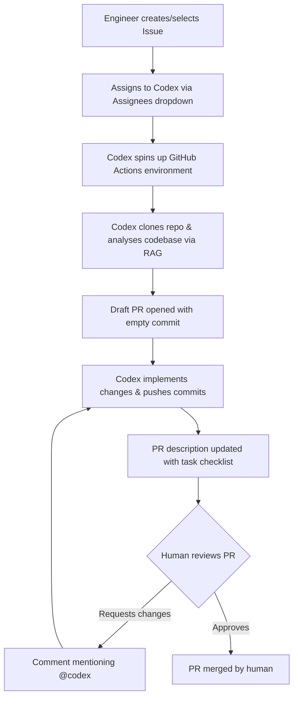
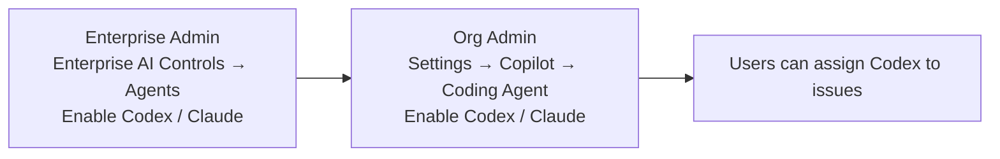
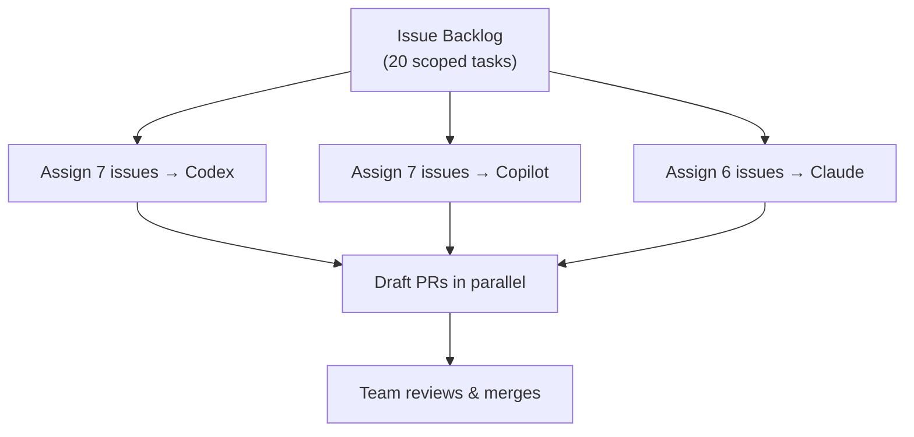

# Codex as a GitHub Copilot Coding Agent: Assigning Issues and PRs at Scale


---

OpenAI Codex is no longer just a CLI tool you run locally. As of early 2026, Codex — alongside Claude — is available as a first-class coding agent inside **GitHub Copilot's Agent HQ platform**, meaning you can assign a GitHub issue to Codex exactly as you'd assign it to a team member.[^1] The agent runs in the background, opens a draft PR, and iterates on review feedback without any local environment involved.

This article covers how that system works, what the admin controls look like at enterprise scale, and how to think about splitting work between Codex, Claude, and the default Copilot agent.

---

## How Agent HQ Works

GitHub's **Agent HQ** is the unified platform underpinning Copilot coding agent. It hosts three agents:[^2]

| Agent | Provider | Available in |
|---|---|---|
| **Copilot** | GitHub / OpenAI | All Copilot plans |
| **Codex** | OpenAI | Pro+, Enterprise (public preview Feb 2026) |
| **Claude** | Anthropic | Pro+, Enterprise (public preview Feb 2026) |

All three share the same infrastructure: a GitHub Actions-powered ephemeral environment, the same repository context (code, history, issues, PRs, Copilot Memory, repository policies), and the same Agent Control Plane for governance and audit.[^3]

The workflow is straightforward:



When you assign an issue, Codex immediately opens an empty draft PR to establish the working branch, then works asynchronously — analysing the codebase using retrieval-augmented generation (RAG) on top of GitHub's code search index.[^4] Commits land on the draft PR incrementally as work progresses.

---

## Plan Availability and Enablement

**For individual subscribers:**

- **Copilot Pro**: Coding agent enabled. Codex/Claude require toggling on in account settings under *Copilot coding agent* and selecting permitted repositories.[^5]
- **Copilot Pro+**: Enabled by default; Codex and Claude accessible from launch.

**For organisations:**

- **Copilot Business / Enterprise**: Disabled by default. An administrator must enable it at **both** the enterprise level and the organisation level before any team member can use it.[^5]



Each coding agent session consumes **one premium request** during public preview — the same unit used for Copilot Chat queries and completions.[^6]

---

## Assigning Issues to Codex

There are several entry points for starting a Codex session:

**Via the Assignees sidebar** (github.com or GitHub Mobile): open an issue and pick Codex from the Assignees dropdown — identical to assigning a human. The agent receives the issue title, description, all existing comments, and any additional instructions you include.[^7]

**Via PR comments**: mention `@codex` in a pull request comment to request changes on an existing PR. Codex, Copilot, and Claude each respond to their own handle.[^8]

**Via GitHub CLI**:

```bash
gh issue assign 142 --assignee @codex
```

**Via third-party integrations**: Linear, Jira, Azure Boards, and Slack can all trigger coding agent sessions, with the full issue context forwarded to the agent.[^9]

### Writing Issues That Agents Act On Well

The quality of Codex's output is directly proportional to issue quality. Include:

- **Background context** — why this change is needed, not just what to do
- **Expected outcome** — describe the end state, not implementation steps
- **Specific files or functions** — reduces the search space for the RAG phase
- **Formatting/linting rules** — or point to `AGENTS.md` / `.github/copilot-instructions.md`

Well-scoped, single-concern tasks consistently outperform broad, multi-concern issues.[^10] If a task is large, break it into a series of smaller issues and assign them in sequence or parallel.

---

## Multi-Agent Patterns at Scale

Agent HQ makes it trivially easy to run Codex, Copilot, and Claude against the same task simultaneously and compare approaches.[^11] This is genuinely useful when:

- **Exploring design trade-offs**: different agents may choose different abstractions
- **Pressure-testing edge cases**: Claude's extended reasoning tends to surface implicit constraints
- **Running parallel feature branches**: assign different issues to different agents concurrently

A batch-assignment workflow — creating 10–20 well-scoped issues (e.g., "increase test coverage for the `payments` module") and assigning them all to Codex in one session — maps cleanly to Codex's executor personality: systematic, rigorous, and comfortable with structured tasks.[^12]



GitHub's infrastructure handles the parallel sessions; you don't need to worry about environment conflicts because each agent session gets an isolated ephemeral VM.

---

## Monitoring Agent Sessions at Scale

As of 26 March 2026, agent activity surfaces directly inside GitHub Issues and Projects — no separate dashboard required.[^13]

**In issues**: each active agent session appears under the Assignees section in the sidebar with a live status badge:

| Status | Meaning |
|---|---|
| `queued` | Session provisioned, environment booting |
| `working` | Agent is actively making commits |
| `waiting for review` | PR ready, human action needed |
| `completed` | Session closed |

Click any session to jump straight to the full session log, which shows the agent's reasoning steps alongside each commit.

**In Projects**: enable the view via *View → Show agent sessions*. Both table and board views then display which items have active sessions and their current status — essential for teams running dozens of concurrent agent tasks.

---

## Enterprise Admin Controls

### Enabling Codex (Enterprise Path)

1. **Enterprise level**: *Enterprise Settings → AI Controls → Agents → Partner Agents* → enable Codex
2. **Organisation level**: *Org Settings → Copilot → Coding Agent → Partner Agents* → enable Codex

Both steps are required. If the enterprise policy is set, it overrides the organisation setting — you cannot re-enable at org level what the enterprise has disabled.[^14]

### Repository Access Policy

Under *Copilot → Coding Agent → Repository Access*, administrators choose one of:

- `No repositories` — agent cannot be used anywhere
- `All repositories` — default once enabled
- `Only selected repositories` — allowlist specific repos

Organisation owners can also opt individual repos out of coding agent usage without changing the global policy.

### Firewall and Network Controls

The coding agent's ephemeral environment can access the internet by default. Enterprise teams in regulated environments can configure **domain allowlists** to restrict which external URLs the agent can reach during a session.[^15] ⚠️ The precise configuration interface for firewall rules is currently documented in GitHub Enterprise Cloud docs and may vary between GitHub.com-hosted and GHES deployments.

### Audit Logging

All coding agent activity flows through the **Agent Control Plane** — GitHub's unified governance layer — which provides centralised audit logs across Copilot, Codex, and Claude sessions.[^3] The Copilot usage metrics API exposes PR lifecycle metrics including:

- Total PRs created and merged by coding agents
- PRs specifically created by Codex or Claude that were merged
- Median time-to-merge for agent-created PRs[^16]

---

## The Safety Model

Codex cannot merge its own PRs. Draft pull requests created by coding agents must be reviewed and merged by a human, and the agent cannot promote a PR from draft to ready-for-review status.[^17] This preserves existing branch protection rules and CI/CD gating — the agent's output hits the same quality gate as a human contribution.

Rulesets can be configured to grant Copilot coding agent bypass permissions for branch protection rules that would otherwise block automated commits (e.g., required linear history), but this is opt-in at the repository level.

---

## Codex vs Copilot Default Agent: Practical Differences

The default Copilot agent and Codex both run on GitHub's infrastructure, but they differ in practice:

| Dimension | Copilot (default) | Codex |
|---|---|---|
| **Model** | GitHub-managed | OpenAI Codex model |
| **Strengths** | Broad GitHub integration, rulesets | Systematic execution, structured tasks |
| **Mention handle** | `@copilot` | `@codex` |
| **Local session** | VS Code Background mode | Background / Cloud modes |
| **Plan requirement** | All Copilot plans | Pro+, Business, Enterprise |

For backend-heavy, test-driven tasks — refactoring, adding coverage, systematic bug fixes — Codex's executor disposition tends to produce tighter, more predictable PRs.[^18] Claude's extended reasoning makes it stronger on tasks requiring architectural inference or handling ambiguous requirements.

---

## Repository Instructions

Both `AGENTS.md` (Codex CLI convention) and `.github/copilot-instructions.md` (GitHub's native convention) are read by coding agents when they start a session. Keep these files focused and explicit about:[^19]

```markdown
# .github/copilot-instructions.md

## Code style
- Use TypeScript strict mode
- All exports must have JSDoc comments
- Test files: `*.test.ts` alongside source

## PR conventions
- Draft PR titles: `[WIP] <verb>: <short description>`
- All new functions need at least one unit test

## Out of scope for agents
- Do not modify `src/auth/` without explicit instruction
- Do not change package.json dependencies without asking
```

Well-scoped instructions reduce the likelihood of the agent touching sensitive paths or deviating from team conventions.

---

## When to Use Codex via GitHub vs Locally

| Scenario | Recommended interface |
|---|---|
| Backlog issues during sprint | GitHub issue assignment (async) |
| Interactive exploration / prototyping | Local Codex CLI or VS Code |
| Automated PR review on existing PR | `@codex` comment in PR |
| CI-triggered tasks | `codex exec` (non-interactive) |
| Cross-repo orchestration | Codex TypeScript SDK |

The GitHub-hosted path is best when the task can be fully described in an issue and you want zero local environment overhead. The CLI/SDK path wins when you need interactive iteration or programmatic control over the agent loop.

---

## Summary

Codex on Agent HQ turns a well-managed issue backlog into a parallel execution queue. The workflow is shallow to learn (assign an issue → review a PR → iterate via `@codex` comments), but the enterprise controls underneath — dual-level enablement, repository access policies, firewall allowlists, Agent Control Plane audit logging, and PR metrics — give organisations the governance surface needed to run it at scale. The March 2026 addition of live agent status in Issues and Projects makes the model genuinely operational for teams managing dozens of concurrent sessions.

---

## Citations

[^1]: GitHub Changelog — "Claude and Codex now available for Copilot Business & Pro users" (26 February 2026): <https://github.blog/changelog/2026-02-26-claude-and-codex-now-available-for-copilot-business-pro-users/>

[^2]: GitHub Blog — "Pick your agent: Use Claude and Codex on Agent HQ": <https://github.blog/news-insights/company-news/pick-your-agent-use-claude-and-codex-on-agent-hq/>

[^3]: GitHub Docs — "About GitHub Copilot coding agent": <https://docs.github.com/en/copilot/concepts/agents/coding-agent/about-coding-agent>

[^4]: GitHub Blog — "Assigning and completing issues with coding agent in GitHub Copilot": <https://github.blog/ai-and-ml/github-copilot/assigning-and-completing-issues-with-coding-agent-in-github-copilot/>

[^5]: GitHub Docs — "Managing access to GitHub Copilot coding agent": <https://docs.github.com/en/copilot/concepts/agents/coding-agent/access-management>

[^6]: GitHub Changelog (Feb 2026) — "Each coding agent session consumes one premium request during public preview": <https://github.blog/changelog/2026-02-26-claude-and-codex-now-available-for-copilot-business-pro-users/>

[^7]: GitHub Docs — "GitHub Copilot coding agent" (how-to): <https://docs.github.com/en/copilot/how-tos/use-copilot-agents/coding-agent>

[^8]: GitHub Changelog Feb 2026 — "@claude" and "@codex" mention support in PR comments: <https://github.blog/changelog/2026-02-26-claude-and-codex-now-available-for-copilot-business-pro-users/>

[^9]: GitHub Docs — third-party integrations (Jira, Slack, Linear, Azure Boards) for coding agent context: <https://docs.github.com/en/copilot/how-tos/use-copilot-agents/coding-agent>

[^10]: GitHub Blog — "GitHub Copilot: Meet the new coding agent" — well-scoped tasks perform best: <https://github.blog/news-insights/product-news/github-copilot-meet-the-new-coding-agent/>

[^11]: GitHub Blog — Agent HQ multi-agent comparison: assign same issue to Copilot, Claude, Codex simultaneously: <https://github.blog/news-insights/company-news/pick-your-agent-use-claude-and-codex-on-agent-hq/>

[^12]: Daniel Vaughan — "The Personality Difference: Claude Code as Explorer, Codex as Executor" (2026-03-27): /codex-resources/articles/2026-03-27-personality-difference-claude-code-vs-codex/

[^13]: GitHub Changelog — "Agent activity in GitHub Issues and Projects" (26 March 2026): <https://github.blog/changelog/2026-03-26-agent-activity-in-github-issues-and-projects/>

[^14]: GitHub Docs — "Managing policies and features for GitHub Copilot in your organization": <https://docs.github.com/en/copilot/how-tos/administer-copilot/manage-for-organization/manage-policies>

[^15]: GitHub Docs — firewall customisation for coding agent environment: <https://docs.github.com/en/copilot/how-tos/use-copilot-agents/coding-agent>

[^16]: GitHub Docs — Copilot usage metrics API including PR lifecycle metrics: <https://docs.github.com/en/copilot/concepts/agents/coding-agent/about-coding-agent>

[^17]: GitHub Blog (new coding agent announcement) — draft PRs require human review; agent cannot mark ready-for-review or merge: <https://github.blog/news-insights/product-news/github-copilot-meet-the-new-coding-agent/>

[^18]: SmartScope — "GitHub Copilot & Claude Code Multi-Agent Collaboration: Latest Features" (February 2026): <https://smartscope.blog/en/generative-ai/github-copilot/github-copilot-claude-code-multi-agent-2025/>

[^19]: GitHub Docs — repository instructions for coding agent (copilot-instructions.md): <https://docs.github.com/en/copilot/how-tos/use-copilot-agents/coding-agent>
