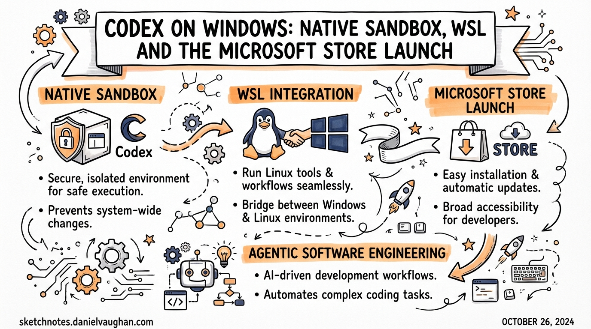
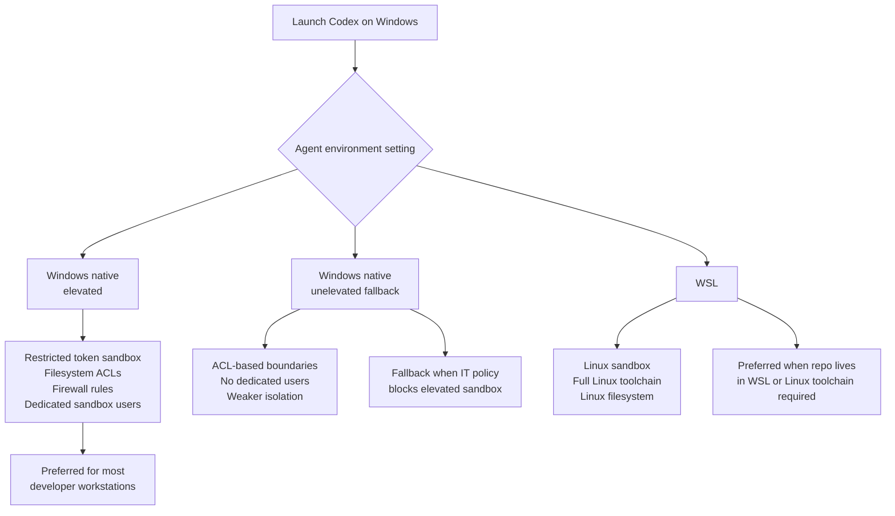

# Codex on Windows: Native Sandbox, WSL and the Microsoft Store Launch

**Date:** 2026-03-28
**Tags:** windows, sandbox, wsl, installation, configuration, platform

---

The Codex app became available on Windows on **4 March 2026**, distributed via the Microsoft Store.[^1] This was not a port of a web wrapper — it ships a native Windows sandbox built on restricted tokens, filesystem ACLs, and dedicated sandbox user accounts, with optional Windows Subsystem for Linux (WSL) as an alternative execution environment.[^2] If you are a Windows-based developer, or if your team has Windows users who have been running Codex via WSL alone, this article covers what changed, how to configure it correctly, and what still needs watching.

---

## Installation

### Microsoft Store (Recommended)

Download the Codex app from the Microsoft Store, then sign in with your ChatGPT account or an OpenAI API key.[^1] Signing in with a ChatGPT account unlocks cloud thread syncing; API key sign-in works but cloud-only features such as cloud task execution are not available.

Updates are handled automatically by the Store. To check for updates manually, open the Store, navigate to **Library → Downloads**, and choose **Check for updates**.

### winget

For scripted provisioning or environments where you want to avoid Store UI interaction:

```bash
winget install Codex -s msstore
```

The `-s msstore` flag routes the install through the Microsoft Store source rather than winget's community repository.[^3]

### Codex CLI (npm)

The CLI itself has been installable on Windows for longer than the app, via npm:

```bash
npm install -g @openai/codex
```

This gives you headless access and `codex exec` for CI pipelines, but not the app's parallel-thread UI or the managed Windows sandbox. The CLI reads the same `config.toml` file as the app.

---

## Three Execution Environments

The Windows implementation offers three distinct ways to run the agent. Understanding which one applies to your situation matters because they differ in sandbox strength, toolchain compatibility, and configuration:



### Elevated Windows Sandbox (Preferred)

The elevated sandbox is the recommended mode for developer workstations where you can approve UAC prompts.[^3] On first run, Codex requests administrator approval to:

- Create dedicated low-privilege sandbox user accounts
- Apply filesystem ACL boundaries restricting agent writes to the working directory
- Configure firewall rules to block outbound network access by default
- Set the local policy logon rights needed for sandboxed command execution

Once set up, subsequent sessions do not require administrator approval. The agent runs under the sandbox user identity, not your own account, so filesystem side-effects outside the project directory are blocked at the OS level rather than by software policy.

**Common failure mode:** Error 1385 ("logon type has not been granted") indicates that Windows local policy is blocking the sandbox user's logon right. This is typically set by Group Policy on managed machines. Contact your IT team or switch to unelevated mode.[^3]

### Unelevated Windows Sandbox (Fallback)

When elevated setup is not possible (e.g., locked-down corporate workstations where you cannot approve UAC prompts), Codex falls back to ACL-based sandboxing without dedicated users.[^3] The isolation boundary is weaker but still enforces that the agent cannot write outside the designated workspace directory.

Enable this explicitly in `config.toml` if you want to skip the UAC prompt on machines where elevated setup is blocked:

```toml
[windows]
sandbox = "unelevated"
```

### WSL

If you switch the agent environment to WSL in Settings and restart the app, Codex runs inside your Linux environment rather than native Windows.[^1] The Linux sandbox implementation applies — the same isolation logic used on macOS and Linux hosts. This is the right choice when:

- Your repositories live in the WSL filesystem
- Your toolchain (compilers, package managers, test runners) requires Linux
- Neither native sandbox mode works in your environment

**Filesystem placement note:** When using the Windows-native agent with repos that are accessible from both Windows and WSL, store them on the **Windows filesystem** and access them through `/mnt/<drive>/...` from WSL. Repositories stored inside WSL's `ext4` volume are not directly addressable by the native Windows sandbox.[^1]

---

## Windows-Specific Configuration

Codex resolves configuration from `~\\.codex\\config.toml` on Windows (equivalent to `~/.codex/config.toml` on Unix). The Windows-specific keys live under the `[windows]` table:

```toml
# ~/.codex/config.toml

# Core model — same as all platforms
model = "gpt-5.4"
model_reasoning_effort = "medium"

# Windows sandbox configuration
[windows]
# "elevated" (preferred) | "unelevated" (fallback) | unset (auto-detect)
sandbox = "elevated"

# Disable private desktop isolation if needed for compatibility
# Default: true (recommended to leave enabled)
sandbox_private_desktop = false
```

The `sandbox_private_desktop` flag controls whether the sandbox agent runs in a private desktop session isolated from your interactive desktop. The default is `true`. Only disable it if a specific tool or test runner needs to interact with the active desktop.[^3]

### Adding Read-Only Directories to the Sandbox

By default, the Windows sandbox restricts the agent to the project working directory. To grant read access to additional directories during a session:

```
/sandbox-add-read-dir C:\absolute\directory\path
```

This is a session-scoped command — the permission applies only to the current thread and is not persisted.[^3]

---

## Required Tooling

The official documentation recommends installing the following tools via `winget` before using Codex on Windows, as many project types require them:[^1]

```bash
# Core developer toolchain
winget install Git.Git
winget install OpenJS.NodeJS.LTS
winget install Python.Python.3
winget install Microsoft.DotNet.SDK.9
winget install GitHub.cli

# Recommended package managers
winget install Rustlang.Rustup           # if working with Rust
winget install Microsoft.VisualStudioCode
```

Without Git, the agent cannot commit changes or create worktrees. Without Node.js, it cannot run JavaScript/TypeScript toolchains or install npm-based development dependencies.

---

## Terminal Selection

The Codex app on Windows lets you choose your preferred terminal from **Settings → Terminal**:[^1]

| Terminal | When to use |
|---|---|
| PowerShell | Default for Windows-native projects; required for most Windows toolchains |
| Command Prompt | Legacy batch scripts or tools requiring `cmd.exe` |
| Git Bash | Unix-style shell on Windows; useful for shell scripts ported from Linux |
| WSL | When agent mode is set to WSL |

### PowerShell Execution Policy

If your account has never run scripts (for example, Node.js or npm scripts) in PowerShell, you may encounter execution policy errors when Codex generates PowerShell scripts for you. Check and, if needed, relax the policy:[^3]

```powershell
# Check current policy
Get-ExecutionPolicy

# Allow locally created scripts (minimum required)
Set-ExecutionPolicy -ExecutionPolicy RemoteSigned -Scope CurrentUser
```

`RemoteSigned` allows scripts created locally to run, but requires downloaded scripts to be signed. This is usually the right balance for developer workstations.

---

## Enterprise Deployment

For enterprises, the Codex app can be deployed via Microsoft Store for Business or through standard MDM tooling (e.g., Intune, SCCM) using the `winget` installer.[^1] The same `config.toml` hierarchy applies on Windows:

| Scope | Path |
|---|---|
| System (lowest priority above built-ins) | `C:\ProgramData\codex\config.toml` |
| User (personal defaults) | `%USERPROFILE%\.codex\config.toml` |
| Project | `.codex\config.toml` in the project directory |

Distribute a system-wide `config.toml` via your configuration management tooling to enforce approved models, sandbox modes, and approval policies across all developer machines without requiring per-user setup.

---

## Known Issues

**Non-ASCII usernames.** A significant bug affects users whose Windows username contains non-ASCII characters (e.g., accented letters).[^4] The app fails on first launch when creating its local storage directory due to improper file path handling. Three workarounds are available:

1. Run the app as Administrator during initial setup (resolves the path creation issue)
2. Set `CODEX_HOME` as a user environment variable pointing to an ASCII-compatible directory (e.g., `C:\CodexData`)
3. Use a Windows account with an ASCII-only username

**Error 1385 (policy blocking sandbox logon).** Occurs when Group Policy prevents the sandbox user account from logging in. Switch to `sandbox = "unelevated"` or request an IT policy exception.[^3]

**Graphics rendering on Windows Server 2022.** The Codex app targets Windows 10 (October 2018 Update minimum) and Windows 11. Running on Windows Server 2022 may produce rendering artefacts.[^4]

**v0.117.0 sandbox carve-out improvements.** The March 27, 2026 release improved support for split-policy sandbox carve-out layouts on Windows, resolving failures in some enterprise environments where filesystem ACLs were structured in non-standard ways.[^5] Update to v0.117.0 or later if you hit sandbox configuration errors that do not match the documented failure modes above.

---

## Summary

The Windows launch fills a meaningful gap: Windows developers can now use the Codex app's parallel-thread UI natively rather than running everything through WSL. The elevated sandbox provides a strong isolation model built on OS-level primitives rather than software policy. The key configuration choices — elevated vs unelevated vs WSL — map cleanly to three real operational scenarios, and the `[windows]` table in `config.toml` gives you precise control over which mode runs.

The practical checklist for getting started:

1. Install from Microsoft Store or via `winget install Codex -s msstore`
2. Install toolchain prerequisites (`git`, `node`, `python`, `gh` at minimum)
3. Open the app, sign in, and let it run the one-time elevated sandbox setup (approve the UAC prompt)
4. If on a locked-down machine, set `sandbox = "unelevated"` in config
5. For WSL-based projects, switch agent mode to WSL in Settings

---

## Citations

[^1]: [App – Codex | OpenAI Developers](https://developers.openai.com/codex/app) — official Codex app documentation including Windows installation, WSL mode, terminal selection, and filesystem placement guidance.

[^2]: [The Codex app is now on Windows – OpenAI Developer Community](https://community.openai.com/t/the-codex-app-is-now-on-windows/1375704) — launch announcement thread with community-reported issues including non-ASCII username bug and Windows Server rendering problems.

[^3]: [Windows – Codex | OpenAI Developers](https://developers.openai.com/codex/windows) — Windows-specific documentation covering sandbox modes, `config.toml` `[windows]` keys, Error 1385, PowerShell execution policy, and the `/sandbox-add-read-dir` command.

[^4]: [The Codex app is now on Windows – OpenAI Developer Community](https://community.openai.com/t/the-codex-app-is-now-on-windows/1375704) — community thread documenting non-ASCII username failures, Graphics rendering issues on Windows Server 2022, and `CODEX_HOME` workaround.

[^5]: [Codex Release Notes – Releasebot (March 2026)](https://releasebot.io/updates/openai/codex) — v0.117.0 release notes noting improved Windows sandbox split-policy carve-out layout support.
