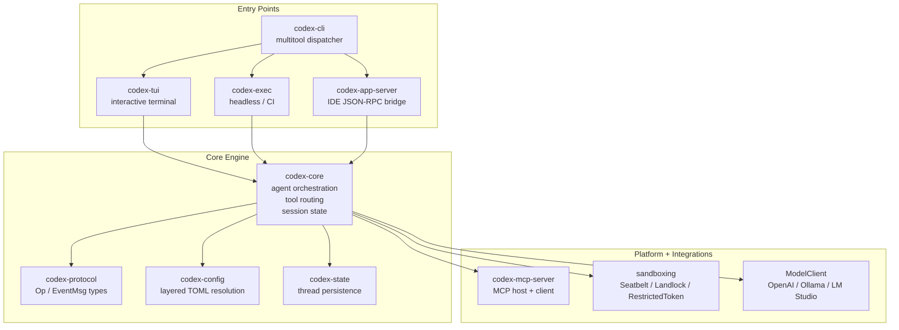
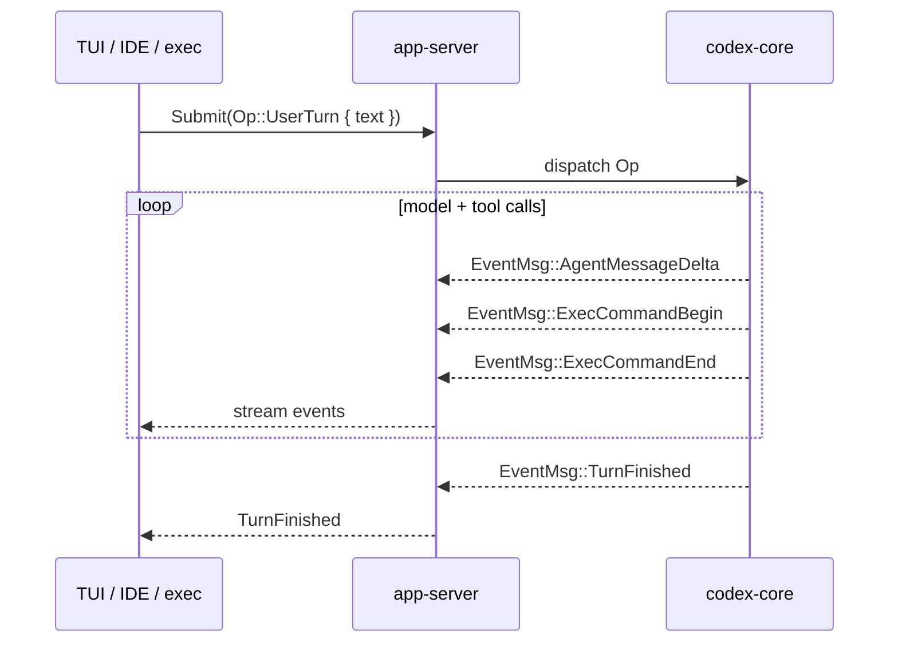
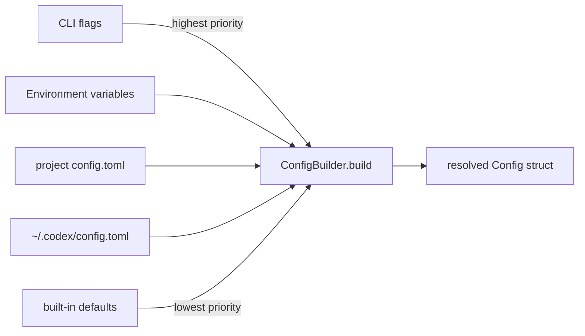

# The codex-rs Architecture: How OpenAI Rewrote Codex CLI in Rust


---

When OpenAI open-sourced Codex CLI in April 2025, the codebase was TypeScript on Node.js — a deliberate choice for velocity.[^1] Less than a year later, the project is 95.7% Rust.[^2] This article explains what changed, why, and what the new architecture looks like from the inside.

---

## Why Rust?

The TypeScript CLI shipped quickly and iterated well. But it carried structural constraints that compounded as the project matured.[^1]

**Node.js as a hard dependency.** Requiring Node v22+ created installation friction. Every user needed a separate runtime. Packaging for enterprise and air-gapped environments required bundling Node or using awkward shimming layers.

**Garbage collection overhead.** The GC pause model is incompatible with the latency and memory budgets of a long-running agentic process. A coding session that runs for hours accumulates history, tool call results, and rendered diffs — the TypeScript runtime's heap grew accordingly.

**Security bindings at arm's length.** Platform sandboxing (macOS Seatbelt, Linux Landlock) required native add-ons. In TypeScript these were FFI shims. In Rust, they're first-class dependencies with memory-safety guarantees.

**Extensibility ceiling.** As sub-agents, plugins, and the app-server protocol matured, the TypeScript architecture struggled to provide a stable embedding surface for IDE extensions without duplicating logic.

Fouad Matin (Codex co-lead) announced the Rust-native work in GitHub Discussion #1174, noting the goal was "zero-dependency installation, native security bindings, no GC pauses, and a wire protocol that lets TypeScript, Python, and other languages extend the agent."[^1]

The TypeScript CLI remains in place as a wrapper for `npm i -g @openai/codex` installation and for the TypeScript SDK — but the engine is Rust.

---

## The Workspace Structure

`codex-rs/` is a Cargo workspace containing approximately 70 crates.[^3] The organisation follows a layered principle: user-facing entry points sit on top of a shared core engine, which talks down to platform and protocol layers.



### Key crates

**`codex-core`** is the reusable library crate OpenAI intends to publish for embedding agents in other Rust applications.[^4] It owns the `ThreadManager`, `CodexThread`, and `Session` structs that manage turn-by-turn model interactions, context compaction, and tool dispatch.

**`codex-tui`** provides the interactive fullscreen terminal UI using the [Ratatui](https://ratatui.rs/) framework.[^3] Ratatui's immediate-mode rendering — every frame redraws all visible widgets from scratch using intermediate buffers — gives sub-millisecond response times with no retained state to go stale. The TUI uses a conventional colour scheme: cyan for user tips, green for success, red for errors, magenta for Codex-branded elements. UI changes require `insta` snapshot tests.[^3]

**`codex-exec`** is the headless non-interactive runner, equivalent to `codex exec PROMPT`. As of PR #14005, it routes through `InProcessAppServerClient` rather than wiring `ThreadManager` directly — unifying the internal plumbing with the IDE integration path.[^5]

**`codex-app-server`** exposes the core engine over JSON-RPC 2.0 for VS Code, Cursor, and other IDE extensions. The protocol is defined in `codex-protocol` and TypeScript schema exports live in `app-server-protocol/schema/typescript/`.[^3] This is how IDE extensions communicate with a running Codex session without bundling the full Rust binary themselves.

**`codex-mcp-server`** makes Codex function simultaneously as both an MCP client (connecting to external tool servers) and an MCP server (exposing Codex capabilities to orchestrating agents).[^4]

---

## The Wire Protocol

Internal communication follows an asynchronous **submit/event** model, not a request/response pattern.[^3]



Operations (`Op`) include `UserTurn`, `Interrupt`, and `Shutdown`. Events (`EventMsg`) cover the full session lifecycle: `TurnStarted`, `AgentMessageDelta`, `ExecCommandBegin/End`, `PatchApplied`, `TokensUsed`, and more.[^3]

This design decouples the rendering layer completely from the agent loop. The TUI subscribes to events; it does not call into the core engine synchronously. The same holds for the app-server — IDE extensions are pure event consumers.

---

## Platform-Specific Sandboxing

All tool execution passes through `ToolRouter`, which enforces approval policies and selects the appropriate sandbox before spawning any process.[^3] The `UnifiedExecProcessManager` manages the lifecycle of sandboxed processes.

Three sandbox modes are available, configurable in `~/.codex/config.toml`:[^4]

```toml
# One of: "read-only", "workspace-write", "danger-full-access"
sandbox_mode = "workspace-write"
```

Platform implementations:

| Platform | Mechanism | What it isolates |
|---|---|---|
| macOS | `/usr/bin/sandbox-exec` (Seatbelt) | File system access, network, process spawning |
| Linux | Landlock + seccomp | Filesystem paths, syscalls |
| Windows | Restricted token + ACLs | Object access, privilege scope |

The sandbox profile is applied to the entire process tree spawned by a tool call — not just the direct child process. This prevents tool calls from launching background workers that escape the policy.[^1]

---

## Context Management in Rust

The `ContextManager` in `codex-core` tracks token counts per turn and triggers compaction automatically.[^3] When the session approaches the model's context limit, it spawns a `CompactTask` that replaces older messages with a structured summary, preserving recent history intact.

A notable fix between v0.54.0 and v0.56.0 corrected "summaries of summaries" — repeated compactions were recursively summarising prior summaries, which degraded long-session quality. The Rust rewrite made this bug tractable: the compaction path in `codex-rs/core/src/codex/compact.rs` now uses a clean template approach that avoids recursive accumulation.[^2]

The `ContextManager` also manages **prompt caching** by tracking stable prefixes (system prompt + AGENTS.md content) that can be reused across turns without retransmission.

---

## Configuration Resolution

`codex-config` implements layered configuration merging via `ConfigBuilder`:[^3]



This layering is why `codex exec --model gpt-5-codex` overrides the profile default, which overrides the global config, which overrides the compiled-in default — without any of these layers needing to know about the others.

---

## What This Means for Users

**Installation.** The standalone Rust binary requires no Node.js. Download from GitHub releases, or use Homebrew (`brew install --cask codex`). The `npm i -g @openai/codex` path still works — the npm package is now a thin wrapper that downloads the Rust binary for your platform.[^4]

**Memory.** Long agentic sessions on large codebases no longer grow Node.js heap without bound. The Rust runtime's allocator is deterministic; GC pauses do not interrupt streaming output mid-turn.

**Startup.** The Rust binary starts in milliseconds. This matters for `codex exec` in CI pipelines where dozens of agents may be launched in parallel.

**Approval mode names.** The Rust rewrite renamed the approval modes. Legacy articles referencing `suggest`, `auto-edit`, or `full-auto` are using old TypeScript-era names. Current values are `untrusted` (approve every action), `permissive` (approve only destructive actions), and others defined in `config.toml`.[^2] ⚠️ Verify against your installed version's help output, as names may vary between minor releases.

---

## What This Means for Contributors

The AGENTS.md at the repo root contains Codex-specific contribution conventions:[^6]

- All changes to `codex-rs/tui` must have corresponding `insta` snapshot tests.
- Changes that affect both `codex-rs/tui` and `codex-rs/tui_app_server` must be reflected in both unless explicitly documented otherwise.
- The workspace is built from `codex-rs/` — run `cargo build` from there, not from the repo root.
- TypeScript schema exports in `app-server-protocol/schema/typescript/` are generated from Rust types; don't edit them manually.

The `codex-core` crate is designed as a reusable library. If you're building agentic tooling in Rust that needs a coding agent loop, this is OpenAI's intended embedding surface.

---

## Citations

[^1]: Fouad Matin, "Codex CLI is Going Native", GitHub Discussion #1174, openai/codex — https://github.com/openai/codex/discussions/1174
[^2]: "OpenAI Rewrites Codex CLI in Rust, Saying Goodbye to Node.js", AIBase, 2026 — https://www.aibase.com/news/18549
[^3]: "openai/codex Architecture Overview", DeepWiki — https://deepwiki.com/openai/codex
[^4]: `codex-rs/README.md`, openai/codex GitHub repository — https://github.com/openai/codex/blob/main/codex-rs/README.md
[^5]: "Add in-process app server and wire up exec to use it", PR #14005, openai/codex — https://github.com/openai/codex/pull/14005
[^6]: `AGENTS.md`, openai/codex GitHub repository — https://github.com/openai/codex/blob/main/AGENTS.md
