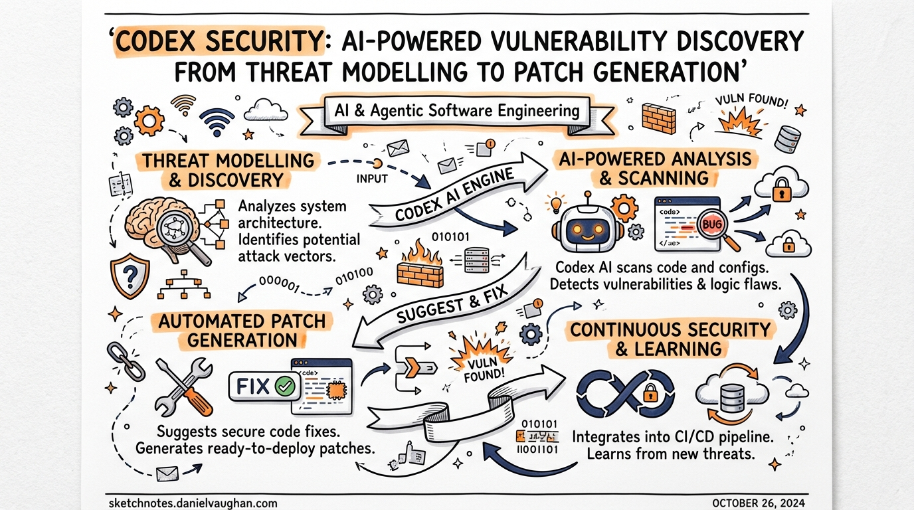
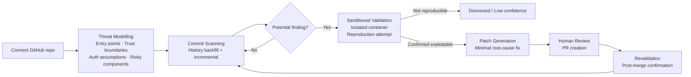
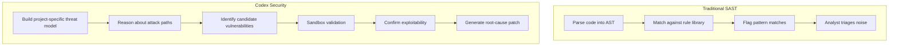

# Codex Security: AI-Powered Vulnerability Discovery from Threat Modelling to Patch Generation

**Date:** 2026-03-28
**Tags:** codex-security, aardvark, vulnerability-scanning, threat-modelling, patch-generation, appsec, cve, github-integration

---

Traditional static analysis tools match code against known-bad patterns. They are fast and deterministic, but they struggle to distinguish code that is theoretically risky from code that is actually exploitable in your specific system. The result is a familiar problem for security engineers: thousands of low-confidence findings that bury the handful of issues that genuinely matter.

Codex Security (launched as research preview on 6 March 2026) takes a different approach. Instead of pattern matching, it uses frontier LLM reasoning to understand your codebase as a human security researcher would — tracing attack paths, testing assumptions, and validating exploitability before surfacing a finding.[^1]

---

## From Aardvark to Codex Security

The product started as an internal OpenAI research effort named **Aardvark**, which entered a private beta with a small cohort of customers in late 2025.[^2] In that beta it demonstrated that LLM-powered vulnerability hunting could outperform traditional scanning on precision — not just breadth — by understanding code intent rather than shape.

On 6 March 2026, Aardvark was rebranded as **Codex Security** and integrated directly into the Codex product. It began rolling out to ChatGPT Pro, Enterprise, Business, and Edu customers via Codex Web, with free usage for the first month.[^1]

The Aardvark branding was retired but the underlying model is the same: an autonomous agent powered by GPT-5 frontier models that reasons about code rather than pattern-matching against it.[^2]

---

## The Four-Stage Pipeline

Codex Security follows a closed-loop pipeline from initial analysis to remediation pull request:

### Stage 1: Threat Modelling

Before scanning a single line of code for vulnerabilities, Codex Security builds a **project-specific threat model** from the repository.[^3] This is not a generic STRIDE template — it is an editable structured document generated by the agent after analysing the codebase, and it captures:

- **Attacker entry points** — public APIs, authenticated endpoints, file upload handlers, deserialisation paths
- **Trust boundaries** — where the system trusts external input, what it assumes about callers
- **Sensitive data flows** — credential storage, PII handling, cryptographic key usage
- **High-impact code paths** — privilege escalation, authentication bypass, arbitrary write

The threat model is the primary lever for improving scan quality. Teams are expected to review and edit it after the initial backfill — annotating known mitigations, adjusting risk priorities, and adding context the agent cannot infer from source alone. When a team adjusts a finding's criticality, the threat model is updated for subsequent scans, implementing adaptive learning over time.[^4]

### Stage 2: Commit Scanning

With the threat model in place, the agent scans commits in reverse chronological order — newest first — and inspects each change against both the current state of the repository and the threat model context.[^3] This incremental approach means new commits are evaluated continuously as code evolves, not just on a scheduled batch scan.

For large repositories, the initial history backfill can take several hours to multiple days. Subsequent incremental scans are significantly faster because only new commits are evaluated against an already-established context.[^5]

### Stage 3: Sandboxed Validation

This is where Codex Security separates itself from traditional SAST. When a potential vulnerability is identified, the agent attempts to **reproduce it in an isolated container environment** before surfacing it as a finding.[^5]

The validation stage:

- Executes the potential exploit steps in an ephemeral, sandboxed environment
- Captures execution logs, test results, and evidence of exploitability
- Confirms whether the issue is genuinely triggerable in the actual system

This validation step is responsible for the product's headline precision metrics: in beta, Codex Security delivered an **84% reduction in noise**, a **90% drop in over-reported severity findings**, and a **50% decrease in false positive rates**.[^1] For engineering teams, a finding backed by a sandbox-confirmed proof of concept is qualitatively different from a static warning — it provides the evidence needed for prioritisation without further investigation.

### Stage 4: Patch Generation and Human Review

For validated findings, Codex Security generates a **minimal patch addressing the root cause**.[^3] Critically, the patch is context-aware: it is designed to fix the specific issue without breaking surrounding logic or introducing regressions, using the same codebase understanding that powered the vulnerability discovery.

The patch is never auto-applied. It is surfaced for human review on the finding detail page, from which a pull request can be created with a single action. After the PR is merged, Codex Security can **revalidate the fix** to confirm the vulnerability is closed — completing the detection-to-remediation loop.[^5]

---

## Real CVEs: What Has It Found?

Codex Security was applied to open-source repositories during its beta phase, with vulnerabilities responsibly disclosed before the research preview launch. Fourteen CVEs have been assigned from these findings.[^1]

Notable confirmed vulnerabilities include:[^2]

| CVE | Project | Class |
|-----|---------|-------|
| CVE-2025-32990 | GnuTLS certtool | Heap buffer overflow (off-by-one) |
| CVE-2025-32989 | GnuTLS | Heap buffer overread in SCT extension parsing |
| CVE-2025-32988 | GnuTLS | Double-free in otherName SAN export |
| CVE-2025-64175 | GOGS | Two-factor authentication bypass |
| CVE-2026-25242 | GOGS | Unauthenticated access bypass |
| CVE-2025-35430 | Thorium browser | Path traversal (arbitrary write) |
| CVE-2025-35431 | Thorium browser | LDAP injection |
| CVE-2025-35432–36 | Thorium browser | Unauthenticated DoS and mail abuse, session not rotated on password change |

Additional vulnerabilities were reported to libssh, PHP, and Chromium. Over the 30 days leading up to launch, the system scanned more than **1.2 million commits**, identifying **792 critical findings** and **10,561 high-severity findings** — with critical issues appearing in under 0.1% of scanned commits.[^1]

---

## Setup and Integration

Access to Codex Security requires a Codex Cloud environment with a connected GitHub repository. The setup flow:

1. **Connect a GitHub repository** via Codex Cloud. Codex Security scans repos accessible through your Codex Web workspace.[^5]

2. **Create a security scan** by navigating to the scan creation interface. Choose:
   - GitHub organisation and repository
   - Target branch
   - Connected environment
   - History window length (longer windows provide more context but increase initial backfill time)

3. **Wait for the initial backfill.** Large repositories can take hours to days for the initial commit-level security pass. This is expected — the agent is building a full context model, not running a quick pattern match.

4. **Review and edit the generated threat model.** This step is non-optional if you want quality results. Update the threat model to reflect your actual architecture, trust boundaries, and risk priorities before acting on findings.

5. **Review findings** via the curated Top 10 view or the full filterable findings table. Each finding includes code context, impact reasoning, validation evidence, and a proposed patch.

6. **Create PRs** directly from the finding detail page. Merged fixes can be revalidated to confirm closure.

For enterprise and Edu workspaces, admins can enable or disable Codex Security at the workspace level, and access can be restricted to specific roles or SCIM-synced groups via RBAC.[^6]

---

## Language Support and Limitations

Codex Security is **language-agnostic** — it uses model reasoning rather than language-specific analysis rules, so performance tracks the underlying model's ability to understand a given language rather than a curated rule set.[^5]

Practical limitations to be aware of:

- **No build required.** The agent reads source and does not need the project to compile or run, which simplifies setup but means some dynamic vulnerabilities may be harder to surface.
- **Patches require human review.** Auto-apply is not supported; every patch surfaces as a proposed PR.
- **Initial scans take time.** Large monorepos may take multiple days for the first full backfill.
- **Research preview quality.** The product is explicitly a research preview; expect iteration on false positive rates and model behaviour as the system matures.
- **GitHub-only at launch.** Codex Security connects via Codex Web to GitHub repositories; GitLab and Bitbucket are not supported at time of writing. ⚠️

---

## Codex for OSS

OpenAI launched **Codex for OSS** alongside the research preview, offering eligible open-source maintainers:[^7]

- 6 months of ChatGPT Pro
- Conditional access to Codex Security
- API credits for programmatic use

Projects like **vLLM** have already used Codex Security to find and patch issues in their regular development workflows. OpenAI intends to expand the OSS programme in subsequent months.

This matters for the broader ecosystem: widely-used open-source dependencies are disproportionately impactful targets. A heap overflow in GnuTLS affects every application that links against it. Giving maintainers of critical infrastructure access to a tool that caught CVE-2025-32988 through CVE-2025-32990 in a single scan is a meaningful force multiplier.

---

## How It Differs from Traditional SAST

The critical difference is **validation before surfacing**. SAST tools report every pattern match; triage is the analyst's problem. Codex Security attempts exploitation in a sandbox first, so the findings that reach your queue have confirmed exploitability — not theoretical risk.

The tradeoff is speed and coverage: a traditional SAST scan completes in minutes and can achieve high recall on known pattern classes. Codex Security is slower, more compute-intensive, and is not a replacement for SAST on high-recall requirements. OpenAI's documentation explicitly acknowledges this — the tool is designed to complement existing SAST rather than replace it.[^5]

---

## Operational Considerations

A few things worth knowing before deploying Codex Security against production repositories:

**Prompt injection risk.** Any autonomous agent that reads code is potentially susceptible to adversarial content embedded in source files or commit messages. OpenAI has not published details of mitigations, but this is a non-trivial concern for repositories with external contributor access. ⚠️

**Data residency.** The agent sends source code to OpenAI's APIs for analysis. For teams with strict data residency requirements, confirm whether Codex Security is compatible with your data processing agreements before connecting production codebases. Enterprise Zero Data Retention (ZDR) policies apply where active.[^6]

**Threat model as a living document.** The threat model degrades in accuracy as architecture evolves. Assign ownership for keeping it current — particularly after significant infrastructure changes, new integrations, or auth model updates.

---

## Summary

Codex Security brings reasoning-based vulnerability analysis to a production workflow. Its distinguishing features are:

- **Threat-model-first scanning** that focuses on attack paths relevant to your specific system rather than generic patterns
- **Sandboxed validation** that confirms exploitability before surfacing a finding, drastically reducing triage burden
- **Root-cause patches** that respect code intent and plug into normal PR workflows
- **Adaptive learning** that improves precision as teams annotate and correct findings over time

The 14 CVEs assigned from beta findings — including heap overflows in GnuTLS and auth bypasses in GOGS — demonstrate that the system can find class-A vulnerabilities in real, widely-used code. For teams that currently spend significant engineering time triaging low-confidence SAST output, Codex Security's precision-first model is worth evaluating as a complement to existing tooling.

---

## Citations

[^1]: [Codex Security: now in research preview — OpenAI (March 2026)](https://openai.com/index/codex-security-now-in-research-preview/)
[^2]: [Introducing Aardvark: OpenAI's agentic security researcher — OpenAI](https://openai.com/index/introducing-aardvark/)
[^3]: [Security — Codex Developer Docs](https://developers.openai.com/codex/security)
[^4]: [Codex Security — OpenAI Help Centre](https://help.openai.com/en/articles/20001107-codex-security)
[^5]: [Setup — Codex Security Developer Docs](https://developers.openai.com/codex/security/setup)
[^6]: [FAQ — Codex Security Developer Docs](https://developers.openai.com/codex/security/faq)
[^7]: [Codex for Open Source — OpenAI Developers](https://developers.openai.com/community/codex-for-oss)
